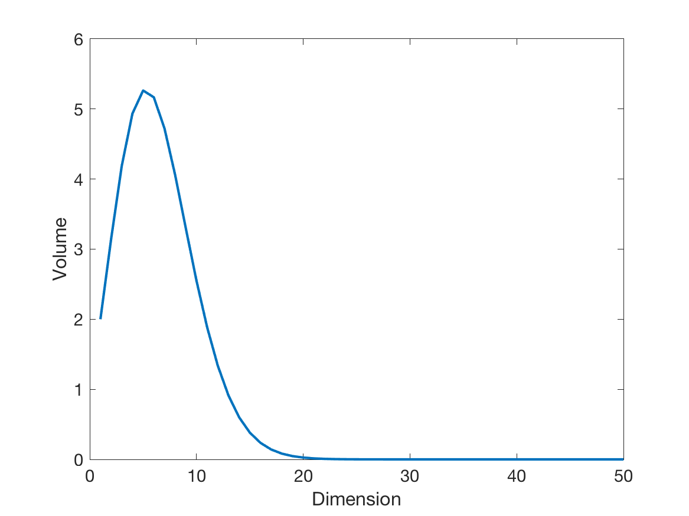

本书讨论的大多数对象，自然而然地生活在高维空间里。原因可能是我们要分析高维数据，也可能是我们把一个含有许多节点的网络对应到一个同等维数的空间，等等。本章的主角就是“高维”。

高维一方面带来著名的**维数灾难**：Euclidean 空间每增加一个维度，体积增长所造成的计算负担可能呈指数上升。另一方面，高维也带来许多意想不到的好处，它们往往是**测度集中**这一奇妙现象的表现。测度集中会导出大量违背低维直觉、却对数据科学至关重要的几何事实。

本章的一些结论需要基本概率工具，因此我们也会在途中回顾必要的概率论概念。

### 维数灾难

所谓**维数灾难**，是指许多在 $\mathbb R^d$ 上求解问题的算法，会随着维数 $d$ 增长而变得**指数级**困难。Richard Bellman 最早用这个说法描述 Euclidean 空间增加维度时，体积以指数速度膨胀所引发的问题 [@bellman1957]。

一个简单例子足以说明问题。在单位区间上，如果要求相邻采样点的距离不超过 $0.01$，那么 $100$ 个等距点就够了。若要用同样的 $0.01$ 网格间距覆盖五维单位超立方体，却需要 $10^{10}$ 个采样点。维数看似只增加了一点，要以同样密度覆盖空间所需的数据量却发生了惊人增长。

与维数灾难密切相连的是**过拟合**和**欠拟合**。过拟合是指算法在训练数据上表现很好，却无法推广到其他数据；欠拟合则连训练数据都不能很好地解释，因而通常也无法推广。这两种问题会出现在许多机器学习算法中。

考虑一个简化的图像分类例子。我们想把图片分成汽车和自行车两类，但在海量图片中，只得到五张汽车图片和五张自行车图片作为训练数据。目标是根据这十张带标签图片训练一个简单的线性分类器，再去判断其余未标注图片。

我们可以先选取一个很简单的特征，例如每张图片中红色像素所占的比例。这个特征大概不足以把十张训练图片线性分开，于是继续添加特征，直到训练样本终于线性可分。表面看来，只要不断增加特征，直至训练集实现完美分类，就是一条合理策略。问题在于：特征空间的维数每做一次**线性增长**，训练数据在该空间中的密度却会随维数**指数下降**。

换句话说，要维持相近的训练数据密度，数据集规模必须随维数指数增长。这正是维数灾难。否则，我们很可能得到一个在训练集上预测近乎完美、遇到新数据却一败涂地的模型。这样的模型没能从训练数据**泛化**到测试数据，因而具有很大的**泛化误差**。

泛化误差衡量算法面对从未见过的新数据时，能否仍然准确预测。它刻画了数据科学模型超越训练样本继续发挥作用的能力，因此也是理解过拟合的核心概念。

## 高维球与立方体的几何

剥开一个普通橙子的果皮，我们仍会留下绝大部分果肉。但如果有一个维数很高的“$d$ 维橙子”，即使只剥去薄薄一层，剩下的部分也几乎为零。这个在营养学上颇令人沮丧的事实，源于 $d$ 维单位球的绝大部分体积都集中在边界附近。

这只是高维空间众多反直觉现象中的一个。它们大多是某种测度集中的表现；理解下一节的集中现象之后，这些“惊喜”也就不再神秘。

讲解数据分析时，我们通常只画二维或三维图，因为这些维数便于可视化。然而，人类对空间的直觉本来就由二维和三维经验塑造，到了高维往往会误导我们。即使最基本的几何对象，在高维也会呈现违反直觉的性质。理解这些性质，对高维数据分析非常重要：它能帮助我们避开算法和统计方法设计中的陷阱。

下面从低维时十分熟悉的球与立方体出发，考察维数升高后它们发生了什么变化。半径为 $R$ 的 $d$ 维超球体定义为

$$
B^d(R)=\left\{x\in\mathbb R^d:x_1^2+\cdots+x_d^2\le R^2\right\}.
$$ {#eq-d-ball}

半径为 $R$ 的 $d$ 维超球面（也称 $d$ 维球面）为

$$
S^{d-1}(R)=\left\{x\in\mathbb R^d:x_1^2+\cdots+x_d^2=R^2\right\}.
$$ {#eq-d-sphere}

边长为 $2R$ 的 $d$ 维超立方体是 $d$ 个区间 $[-R,R]$ 的 Cartesian 乘积：

$$
C^d(R)=\underbrace{[-R,R]\times\cdots\times[-R,R]}_{d\text{ 次}}.
$$ {#eq-d-cube}

不会混淆时，我们用 $B^d$ 表示单位球 $B^d(1)$，用 $S^{d-1}$ 表示单位球面 $S^{d-1}(1)$，并用 $C^d$ 表示单位超立方体 $C^d(\tfrac12)$。

### 高维几何与高维概率

本节将逐一建立高维几何中若干初看令人意外的性质。为了展示几何与概率之间的联系，有些结论我们会先用解析工具证明，例如直接计算体积和积分；随后再用概率论中的集中不等式给出证明。后者往往更简洁优雅。

这里的目标不是追求最精细的常数或最强的界，而是看清这些现象本身，并体会几何与概率之间的对偶关系。

### 超球体的体积

::: {#prp-volume-ball .theorem title="超球体的体积"}
$B^d(R)$ 的体积为

$$
\operatorname{Vol}(B^d(R))
=\frac{\pi^{d/2}R^d}{(d/2)\Gamma(d/2)}.
$$ {#eq-volume-ball}
:::

::: {.proof}
$B^d(R)$ 的体积可以写成

$$
\operatorname{Vol}(B^d(R))
=\int_0^R s_d r^{d-1}\,dr
=\frac{s_dR^d}{d},
$$ {#eq-volume-dsphere}

其中 $s_d$ 表示单位 $d$ 维球面的超表面积。把 $d$ 重 Gaussian 积分改写为球坐标，可得

$$
s_d\int_0^\infty e^{-r^2}r^{d-1}\,dr
=\underbrace{\int_{-\infty}^{\infty}\cdots\int_{-\infty}^{\infty}}_{d\text{ 次}}
e^{-(x_1^2+\cdots+x_d^2)}\,dx_1\cdots dx_d
=\left(\int_{-\infty}^{\infty}e^{-x^2}\,dx\right)^d.
$$

回忆 Gamma 函数

$$
\Gamma(n)=\int_0^\infty r^{n-1}e^{-r}\,dr
=2\int_0^\infty e^{-r^2}r^{2n-1}\,dr.
$$

因此

$$
\frac12s_d\Gamma\!\left(\frac d2\right)
=\left[\Gamma\!\left(\frac12\right)\right]^d
=\left(\pi^{1/2}\right)^d,
$$

从而

$$
s_d=\frac{2\pi^{d/2}}{\Gamma(d/2)}.
$$

将它代入 @eq-volume-dsphere，即得 @eq-volume-ball。
:::

当 $d$ 为偶数时，$\Gamma(d/2)=(d/2-1)!$。为了理解 $\operatorname{Vol}(B^d(R))$ 的渐近行为，可以使用著名的 Stirling 公式

$$
\Gamma(n)\approx \sqrt{\frac{2\pi}{n}}\left(\frac ne\right)^n.
$$

于是，当 $d$ 很大时，$d$ 维单位球的体积近似为

$$
\operatorname{Vol}(B^d)
\approx \frac{1}{\sqrt{d\pi}}
\left(\frac{2\pi e}{d}\right)^{d/2}.
$$ {#eq-approx-volume}

这里 $\approx$ 的含义是：当相关参数（此处为 $d$）趋于无穷时，两边之比趋于 $1$。

@eq-approx-volume 括号内的分母随 $d$ 增大而趋于无穷，因此单位 $d$ 维球的体积会迅速趋于零，如 @fig-volume-sphere 所示。事实上，只要半径 $R$ 固定，结论仍然成立。

所以，高维单位球的体积几乎为零；与此形成鲜明对比的是，单位立方体无论多少维，体积始终为 $1$。若希望 $B^d(R)$ 的体积等于 $1$，其半径必须渐近地增长到

$$
R\approx\sqrt{\frac{d}{2\pi e}}.
$$

{#fig-volume-sphere width=80%}

### 球体体积向赤道集中

把橙子切成薄片时，靠近中心的切片更大，因为球体在那里最宽。维数升高后，这个效应会急剧增强，强度随维数呈指数增长。

想象我们围绕 $d$ 维单位球的“赤道”切出一个薄层，并要求它包含球体 $99\%$ 的体积。[^equator] 在二维中，这个薄层的宽度必须接近 $2$；但随着维数升高，所需宽度迅速缩小。到了高维，只需极薄的一层，因为单位球几乎全部体积都落在赤道附近。

[^equator]: 要定义 $d$ 维球的“赤道”，需先选定一个“北极”方向。不失一般性，可以取 $x_1$ 方向的单位向量为北极。

::: {#prp-equator-concentration .theorem title="球体体积的赤道集中"}
$B^d(R)$ 几乎全部体积都集中在赤道附近。
:::

::: {.proof}
只需证明单位球的情形。不失一般性，取 $x_1$ 方向为“北”。平面 $x_1=0$ 与球的交集就是赤道：

$$
\{x:\|x\|\le 1,\ x_1=0\}.
$$

这里 $\|x\|$ 是 Euclidean 范数。[^norm-convention] 该交集是一个 $d-1$ 维单位球，其体积由 @eq-volume-ball 在 $d-1$ 维时的公式给出。

[^norm-convention]: 本书中，若对象是向量，$\|\cdot\|$ 表示 Euclidean 范数；若对象是矩阵或算子，则表示算子范数。

令

$$
P=\{x:\|x\|\le1,\ x_1\ge p_0\}
$$

表示赤道宽度为 $2p_0$ 的薄层之外的一个极冠。沿 $x_1=p$ 切片，每个切片都是半径 $\sqrt{1-p^2}$ 的 $d-1$ 维球，因此

$$
\operatorname{Vol}(P)
=\operatorname{Vol}(B^{d-1})\int_{p_0}^1(1-p^2)^{(d-1)/2}\,dp.
$$

利用对所有 $x$ 成立的 $e^x\ge1+x$，可将积分上界估计为

$$
\begin{aligned}
\operatorname{Vol}(P)
&\le \operatorname{Vol}(B^{d-1})
\int_{p_0}^{\infty}e^{-(d-1)p^2/2}\,dp\\
&=\operatorname{Vol}(B^{d-1})
\sqrt{\frac{\pi}{2(d-1)}}
\operatorname{erfc}\!\left(p_0\sqrt{\frac{d-1}{2}}\right),
\end{aligned}
$$

其中

$$
\operatorname{erfc}(x)=\frac{2}{\sqrt\pi}\int_x^\infty e^{-u^2}\,du
$$

是互补误差函数。再用
$\operatorname{erfc}(x)\le e^{-x^2}/(\sqrt\pi x)$，得到

$$
\operatorname{Vol}(P)
\le\frac{\operatorname{Vol}(B^{d-1})}{d-1}
\frac{e^{-(d-1)p_0^2/2}}{p_0}.
$$ {#eq-polar-cap-one}

另一方面，由 @eq-volume-ball 以及
$\Gamma(d/2)/\Gamma((d-1)/2)\approx\sqrt{d/2}$，当 $d$ 足够大时，

$$
\operatorname{Vol}(B^{d-1})
\le\frac{d-1}{2}\operatorname{Vol}(B^d).
$$ {#eq-polar-cap-two}

结合 @eq-polar-cap-one 和 @eq-polar-cap-two，两个极冠的总体积占比满足

$$
\frac{2\operatorname{Vol}(P)}{\operatorname{Vol}(B^d)}
\le\frac1{p_0}\exp\!\left(-\frac{d-1}{2}p_0^2\right).
$$

该比例随 $d$ 和 $p_0$ 增大而指数下降，因而球体体积确实强烈集中在赤道附近。
:::

### 球体体积向薄壳集中

考虑两个同心球 $B^d(1)$ 与 $B^d(1-\varepsilon)$。由 @eq-volume-ball，二者体积之比为

$$
\frac{\operatorname{Vol}(B^d(1-\varepsilon))}
{\operatorname{Vol}(B^d(1))}
=(1-\varepsilon)^d.
$$

对任意固定的 $\varepsilon>0$，这个比例都在 $d\to\infty$ 时趋于零。因此，当维数足够高时，即使 $\varepsilon$ 很小，$B^d(1)$ 与 $B^d(1-\varepsilon)$ 之间的球壳也会包含单位球的绝大部分体积。

体积究竟以多快的速度集中到表面？令 $\varepsilon=t/d$，则

$$
\frac{\operatorname{Vol}(B^d(1-\varepsilon))}
{\operatorname{Vol}(B^d(1))}
=\left(1-\frac td\right)^d\longrightarrow e^{-t}.
$$

因此，$B^d(R)$ 几乎全部体积都包含在宽度约为 $R/d$ 的薄壳中。也就是说，剥一个 $d$ 维橙子时，即便极其小心、只去掉薄薄一层果皮，也已经去掉了几乎整个橙子。

### 超立方体的几何 {#sec-hypercube-geometry}

我们已经看到，超球体的大部分体积都集中在其表面附近。超立方体也有类似性质；事实上，这种现象在高维几何对象中相当普遍。但超立方体还表现出一种更有意思的体积集中行为。

::: {#prp-cube-volume-diameter .theorem title="单位超立方体的体积与直径"}
超立方体 $C^d$ 的体积为 $1$，直径为 $\sqrt d$。
:::

这个命题在数学上几乎不言自明，却已经暗示了高维立方体的反直觉性质：随着维数升高，立方体的角似乎被越拉越远；与此同时，为了维持总体积不变，其余部分仿佛不得不“缩回去”。把立方体与球放在一起比较时，这种现象尤其明显。

在二维中，以原点为中心的单位正方形完全包含在单位圆内。从中心到顶点的距离，也就是外接圆半径，为 $\sqrt2/2$；中心到边的距离，也就是内切圆半径，为 $1/2$。

到了四维，中心到超立方体顶点的距离变成 $1$，所以所有顶点恰好接触单位球面，而内切球半径仍然是 $1/2$。四维超立方体投影到二维后可能看起来不再凸，但它本身当然仍是凸集。这正是高维的奇特之处：超立方体可以同时既“凸”又“尖”。

当 $d>4$ 时，中心到顶点的距离为

$$
\frac{\sqrt d}{2}>1,
$$

于是超立方体的顶点会远远伸到单位球之外。一般而言，单位超立方体有 $2^d$ 个顶点，内切球半径固定为 $1/2$，外接球半径却以 $\sqrt d/2$ 增长。

::: {#fig-cube-sphere-comparison}
| 维数 | 内切球半径 | 中心到顶点 | 与单位球的关系 |
|---:|---:|---:|:---|
| $2$ | $1/2$ | $\sqrt2/2$ | 正方形完全位于单位圆内 |
| $4$ | $1/2$ | $1$ | 顶点恰好落在单位球面上 |
| $d>4$ | $1/2$ | $\sqrt d/2$ | 顶点伸出单位球，并随 $d$ 远离球面 |

单位球与单位超立方体随维数变化的几何关系。原稿用二维投影示意；表格保留了示意图所表达的全部尺度信息。
:::

上述比较引出下面的结论。

::: {#prp-cube-corners .theorem title="高维立方体的体积集中在角部"}
高维立方体的大部分体积都位于其角部。
:::

::: {.proof}
记 $C^d$ 为单位超立方体，并令

$$
Q_R=\{x\in C^d:\|x\|\le R\}
=C^d\cap B^d(R)
$$

表示其中到中心距离不超过 $R$ 的部分。因为 $\operatorname{Vol}(C^d)=1$，所以

$$
\begin{aligned}
\frac{\operatorname{Vol}(Q_R)}{\operatorname{Vol}(C^d)}
&=\operatorname{Vol}(Q_R)\\
&\le \operatorname{Vol}(B^d(R))\\
&\approx \frac1{\sqrt{d\pi}}
\left(\frac{2\pi eR^2}{d}\right)^{d/2}.
\end{aligned}
$$

只要

$$
R<\sqrt{\frac{d}{2\pi e}},
$$

右端就趋于零。这说明，距离中心小于上述尺度的区域，在整个立方体中所占体积可以忽略不计；换句话说，$C^d$ 的绝大部分体积落在距离中心为 $\sqrt d$ 量级的位置，也就是朝向各个角的区域。
:::

## 概率论基本概念

下面简要回顾理解“维数带来的优势”和高维惊奇现象所需的概率论基础。更深入的概率工具将在第 13 章介绍。我们假定读者已经修过初等概率课程；可参考 [@durrett2019probability; @ross2014introduction]。

与随机变量 $X$ 相联系的两个最基本量是**期望**（或均值）与**方差**：

$$
\mathbb E[X],\qquad
\operatorname{Var}(X)
:=\mathbb E\!\left[(X-\mathbb E[X])^2\right].
$$

一个十分有用的恒等式是**全方差公式**。它把随机变量的方差分成两部分：一部分可以由另一个变量解释，另一部分即使知道该变量后仍作为“噪声”存在。若 $X,Y$ 定义在同一概率空间上，且 $X$ 方差有限，则

$$
\operatorname{Var}(X)
=\mathbb E[\operatorname{Var}(X\mid Y)]
+\operatorname{Var}(\mathbb E[X\mid Y]).
$$ {#eq-total-variance}

这两项具有自然解释：

- $\mathbb E[\operatorname{Var}(X\mid Y)]$ 是未解释方差，即知道 $Y$ 后，$X$ 中仍然存在的变化；
- $\operatorname{Var}(\mathbb E[X\mid Y])$ 是条件均值的方差，即能够由 $Y$ 解释的那部分变化。

描述概率分布时，一个重要工具是 $X$ 的**矩母函数**（moment-generating function, MGF）：

$$
M_X(t)=\mathbb E[e^{tX}],\qquad t\in\mathbb R.
$$ {#eq-moment-generating-function}

把 $M_X(t)$ 展开成幂级数，就能看出“矩母函数”这个名称的由来。对 $p>0$，$X$ 的 $p$ 阶矩定义为 $\mathbb E[X^p]$，$p$ 阶绝对矩定义为 $\mathbb E[|X|^p]$。

对矩取 $p$ 次方根，可以定义随机变量的 $L^p$ 范数：

$$
\|X\|_{L^p}
:=\left(\mathbb E[|X|^p]\right)^{1/p},
\qquad p\in(0,\infty),
$$

并按通常方式将 $p=\infty$ 的情形定义为

$$
\|X\|_\infty:=\operatorname*{ess\,sup}|X|.
$$

设 $(\Omega,\Sigma,\mathbb P)$ 为概率空间，其中 $\Omega$ 是样本空间，$\Sigma$ 是其上的 $\sigma$-代数，$\mathbb P$ 是定义在 $(\Omega,\Sigma)$ 上的概率测度。对固定的 $p$，向量空间 $L^p(\Omega,\Sigma,\mathbb P)$ 由所有 $L^p$ 范数有限的随机变量构成：

$$
L^p(\Omega,\Sigma,\mathbb P)
=\{X:\|X\|_{L^p}<\infty\}.
$$

随机变量可以视为一个可测映射 $X:\Omega\to\mathbb R$（或 $\mathbb C$）。通常我们不会反复写出底层概率空间，而直接把 $L^p(\Omega,\Sigma,\mathbb P)$ 简写为 $L^p$。

$p=2$ 的情形尤其重要，因为 $L^2$ 是 Hilbert 空间，其内积与范数分别为

$$
\langle X,Y\rangle_{L^2}=\mathbb E[XY],
\qquad
\|X\|_{L^2}=\left(\mathbb E[X^2]\right)^{1/2}.
$$

随机变量 $X$ 的**标准差** $\sigma(X):=\sqrt{\operatorname{Var}(X)}$ 可以写成

$$
\sigma(X)=\|X-\mathbb E[X]\|_{L^2}.
$$

随机变量 $X$ 与 $Y$ 的**协方差**为

$$
\begin{aligned}
\operatorname{Cov}(X,Y)
&=\mathbb E[(X-\mathbb E[X])(Y-\mathbb E[Y])]\\
&=\langle X-\mathbb E[X],Y-\mathbb E[Y]\rangle_{L^2}.
\end{aligned}
$$ {#eq-covariance}

下面回顾几个经典不等式。

**Hölder 不等式。** 若 $X,Y$ 定义在同一概率空间上，$p,q\ge1$ 且 $1/p+1/q=1$，则

$$
|\mathbb E[XY]|
\le \|X\|_{L^p}\|Y\|_{L^q}.
$$ {#eq-holder}

取 $p=q=2$，便得到 **Cauchy–Schwarz 不等式**：

$$
|\mathbb E[XY]|
\le\sqrt{\mathbb E[|X|^2]\,\mathbb E[|Y|^2]}.
$$ {#eq-cauchy-schwarz}

**Jensen 不等式。** 对任意随机变量 $X$ 和凸函数 $\phi:\mathbb R\to\mathbb R$，有

$$
\phi(\mathbb E[X])\le\mathbb E[\phi(X)].
$$ {#eq-jensen}

当 $q\ge p>0$ 时，函数 $\phi(x)=x^{q/p}$ 是凸函数，因此由 Jensen 不等式立即得到

$$
\|X\|_{L^p}\le\|X\|_{L^q},
\qquad 0<p\le q<\infty.
$$

**Minkowski 不等式。** 对 $p\in[1,\infty]$ 及任意随机变量 $X,Y$，

$$
\|X+Y\|_{L^p}
\le\|X\|_{L^p}+\|Y\|_{L^p}.
$$ {#eq-minkowski}

它正是 $L^p$ 空间中的三角不等式。

随机变量 $X$ 的**累积分布函数**定义为

$$
F_X(t)=\mathbb P(X\le t),\qquad t\in\mathbb R.
$$

于是 $\mathbb P(X>t)=1-F_X(t)$。函数

$$
t\longmapsto\mathbb P(|X|\ge t)
$$

称为 $X$ 的**尾函数**。下面的积分恒等式揭示了期望与尾概率之间的紧密联系。

::: {#prp-tail-integral .theorem title="尾积分恒等式"}
若 $X$ 是非负随机变量，则

$$
\mathbb E[X]=\int_0^\infty\mathbb P(X>t)\,dt.
$$

等式两端要么同时有限，要么同时为无穷。
:::

对概率非零的事件 $E$，用 $\mathbb P(\,\cdot\mid E)$ 表示条件概率，用 $\mathbb E[X\mid E]$ 表示随机变量 $X$ 在事件 $E$ 下的条件期望。

### 尾概率界

**Markov 不等式**是用期望控制随机变量尾概率的最基本工具。

::: {#prp-markov .theorem title="Markov 不等式"}
对任意非负实随机变量 $X$，以及任意 $t>0$，有

$$
\mathbb P(X\ge t)\le\frac{\mathbb E[X]}{t}.
$$ {#eq-markov}
:::

::: {.proof}
记事件 $\mathcal I=\{X\ge t\}$。若先考虑离散随机变量，并用 $p(s)$ 表示结果 $s$ 的概率，则

$$
\mathbb E[X]
=\sum_{s\in\mathcal I}p(s)X(s)
+\sum_{s\in\mathcal I^c}p(s)X(s).
$$

连续情形只需把概率质量换成密度、把求和换成积分。因为 $X\ge0$，第二项非负；而在 $\mathcal I$ 上 $X(s)\ge t$，所以

$$
\mathbb E[X]
\ge\sum_{s\in\mathcal I}p(s)X(s)
\ge t\sum_{s\in\mathcal I}p(s)
=t\mathbb P(\mathcal I).
$$

两边除以 $t$ 即得结论。
:::

同一个证明也可以用条件期望写得更紧凑：

$$
\mathbb E[X]
=\mathbb P(X<t)\mathbb E[X\mid X<t]
+\mathbb P(X\ge t)\mathbb E[X\mid X\ge t].
$$

约定概率为零时相应乘积为零。第一项非负，第二个条件期望至少为 $t$，故

$$
\mathbb E[X]\ge t\mathbb P(X\ge t).
$$

Markov 不等式的一个重要推论是 Chebyshev 不等式。

::: {#cor-chebyshev .theorem title="Chebyshev 不等式"}
设随机变量 $X$ 的均值为 $\mu$、方差为 $\sigma^2$。则对任意 $t>0$，

$$
\mathbb P(|X-\mu|\ge t)
\le\frac{\sigma^2}{t^2}.
$$ {#eq-chebyshev}
:::

只需把 Markov 不等式用于非负随机变量
$Y=(X-\mathbb E[X])^2$，就能得到 Chebyshev 不等式。它是一种集中不等式：当 $X$ 的方差很小时，$X$ 必须以较高概率接近均值 $\mu$。在不增加分布假设的前提下，Markov 和 Chebyshev 不等式都是尖锐的，通常无法进一步改进。

Markov 不等式只要求一阶矩存在。如果 $X$ 的矩母函数在零点附近也存在，就能得到更强的结论。具体地，设存在 $b>0$，使得对所有 $\lambda\in[0,b]$，$\mathbb E[e^{\lambda(X-\mu)}]$ 都存在。把 Markov 不等式用于
$Y=e^{\lambda(X-\mu)}$，得到一般的 **Chernoff 界**：

$$
\begin{aligned}
\mathbb P(X-\mu\ge t)
&=\mathbb P\!\left(e^{\lambda(X-\mu)}\ge e^{\lambda t}\right)\\
&\le\frac{\mathbb E[e^{\lambda(X-\mu)}]}{e^{\lambda t}}.
\end{aligned}
$$ {#eq-basic-chernoff}

为了得到最紧的界，可以对 $\lambda$ 优化：

$$
\log\mathbb P(X-\mu\ge t)
\le-\sup_{\lambda\in[0,b]}
\left\{\lambda t-\log\mathbb E[e^{\lambda(X-\mu)}]\right\}.
$$

Gaussian 随机变量是概率论中最重要的一类随机变量。均值为 $\mu$、标准差为 $\sigma$ 的 Gaussian 随机变量，其概率密度为

$$
\psi(t)=\frac1{\sqrt{2\pi\sigma^2}}
\exp\!\left(-\frac{(t-\mu)^2}{2\sigma^2}\right).
$$ {#eq-gaussian-density}

记作 $X\sim\mathcal N(\mu,\sigma^2)$。若 $\mathbb E[X]=0$ 且 $\mathbb E[X^2]=1$，则称 $X$ 为**标准 Gaussian 随机变量**或**标准正态随机变量**。

::: {#prp-gaussian-tail .theorem title="Gaussian 尾界"}
若 $X\sim\mathcal N(\mu,\sigma^2)$，则对所有 $t>0$，

$$
\mathbb P(X\ge\mu+t)
\le e^{-t^2/(2\sigma^2)}.
$$ {#eq-gaussian-tail}
:::

::: {.proof}
通过变量代换即可从标准情形推出一般情形，因此不失一般性，设 $\mu=0,\sigma=1$。直接计算矩母函数：

$$
\begin{aligned}
\mathbb E[e^{\lambda X}]
&=\frac1{\sqrt{2\pi}}
\int_{-\infty}^{\infty}e^{\lambda x-x^2/2}\,dx\\
&=\frac1{\sqrt{2\pi}}e^{\lambda^2/2}
\int_{-\infty}^{\infty}e^{-(x-\lambda)^2/2}\,dx\\
&=e^{\lambda^2/2}.
\end{aligned}
$$

最后一个积分只是平移后的完整 Gaussian 积分，值仍为 $\sqrt{2\pi}$。由 @eq-basic-chernoff，

$$
\mathbb P(X\ge t)
\le e^{\lambda^2/2-\lambda t}.
$$

对 $\lambda$ 最小化，最优点为 $\lambda=t$，代入即得
$\mathbb P(X\ge t)\le e^{-t^2/2}$。
:::

### 次 Gaussian 随机变量

::: {#def-subgaussian .theorem title="次 Gaussian 随机变量"}
设随机变量 $X$ 的均值为 $\mu=\mathbb E[X]$。如果存在 $\sigma>0$，使得

$$
\mathbb E[e^{\lambda(X-\mu)}]
\le e^{\sigma^2\lambda^2/2},
\qquad \forall\lambda\in\mathbb R,
$$

则称 $X$ 为**次 Gaussian** 随机变量，参数为 $\sigma$；需要强调均值时，也称 $X$ 是 $(\mu,\sigma)$-次 Gaussian 的。
:::

这里的 $\sigma^2$ 不一定等于 $X$ 的方差。定义关于正负号对称，所以 $X$ 是次 Gaussian 的，当且仅当 $-X$ 也是。方差为 $\sigma^2$ 的 Gaussian 随机变量显然是参数为 $\sigma$ 的次 Gaussian 随机变量。其他等价定义可参见 [@vershynin2018]。

把定义中的矩条件与 Gaussian 尾界证明中的计算结合起来，立即得到如下集中不等式。

::: {#prp-subgaussian-tail .theorem title="次 Gaussian 尾界"}
若 $X$ 是参数为 $\sigma$、均值为 $\mu$ 的次 Gaussian 随机变量，则对所有 $t>0$，

$$
\mathbb P(|X-\mu|\ge t)
\le2e^{-t^2/(2\sigma^2)}.
$$ {#eq-subgaussian-tail}
:::

一个重要的非 Gaussian 例子是 **Rademacher 随机变量**。Rademacher 随机变量 $\varepsilon$ 以相同概率取 $+1$ 和 $-1$。它是次 Gaussian 的。事实上，任何有界随机变量都是次 Gaussian 的，后面讨论 Hoeffding 不等式时会再次看到这一点。

许多重要分布都是次 Gaussian 的，但有些常见分布具有更重的尾部，并不属于这一类。经典例子是 $\chi^2$ 分布，本章末尾会专门讨论。

### 次指数随机变量

稍微放松次 Gaussian 定义中对矩母函数的要求，就得到**次指数**随机变量。

::: {#def-subexponential .theorem title="次指数随机变量"}
设 $X$ 的均值为 $\mu=\mathbb E[X]$。如果存在参数 $\nu,b>0$，使得

$$
\mathbb E[e^{\lambda(X-\mu)}]
\le e^{\nu^2\lambda^2/2},
\qquad |\lambda|\le\frac1b,
$$

则称 $X$ 为参数 $(\nu,b)$ 的**次指数**随机变量。
:::

次 Gaussian 随机变量一定是次指数的：取 $\nu=\sigma,b=0$，并把 $1/b$ 理解为 $+\infty$ 即可；反过来却不成立。

例如，令 $X\sim\mathcal N(0,1)$，并取 $Z=X^2$。当 $\lambda<1/2$ 时，

$$
\begin{aligned}
\mathbb E[e^{\lambda(Z-1)}]
&=\frac1{\sqrt{2\pi}}
\int_{-\infty}^{\infty}
e^{\lambda(x^2-1)}e^{-x^2/2}\,dx\\
&=\frac{e^{-\lambda}}{\sqrt{1-2\lambda}}.
\end{aligned}
$$ {#eq-subexponential-square}

当 $\lambda\ge1/2$ 时，这个矩母函数不存在，因此 $X^2$ 不可能是次 Gaussian 的。但它是次指数的，因为简单计算可得

$$
\frac{e^{-\lambda}}{\sqrt{1-2\lambda}}
\le e^{2\lambda^2}
=e^{4\lambda^2/2},
\qquad |\lambda|\le\frac14.
$$

所以 $X^2$ 是参数 $(\nu,b)=(2,4)$ 的次指数随机变量。

与次 Gaussian 情形相同，利用 Chernoff 方法可以导出次指数随机变量的集中不等式。但这一次，尾部会根据偏差 $t$ 的大小表现出两种不同尺度：偏差较小时近似 Gaussian，偏差较大时则按指数衰减。

::: {#prp-subexponential-tail .theorem title="次指数尾界"}
若均值为 $\mu$ 的 $X$ 是参数 $(\nu,b)$ 的次指数随机变量，则

$$
\mathbb P(X\ge\mu+t)
\le
\begin{cases}
e^{-t^2/(2\nu^2)},&0\le t\le\nu^2/b,\\
e^{-t/(2b)},&t>\nu^2/b.
\end{cases}
$$ {#eq-subexponential-tail}
:::

对相互独立的随机变量求和时，次 Gaussian 性和次指数性都会保留下来，而且相应参数具有简单的组合规则，后文会进一步说明。

另一种常见定义使用所谓的 $\psi_p$ 范数。对中心化随机变量 $X$ 和 $p>0$，令

$$
\|X\|_{\psi_p}
:=\inf\left\{C>0:
\mathbb E\exp\!\left(\frac{|X|}{C}\right)^p\le2
\right\}.
$$

$\psi_2$ 范数有限的随机变量正是次 Gaussian 随机变量，而 $\psi_1$ 范数有限的随机变量正是次指数随机变量；详见 [@vershynin2018]。

## 测度集中：维数带来的优势

假设我们希望预测某个事件的结果。一个自然做法是先计算目标量的期望，但期望与一次真实结果究竟有多接近？如果不知道结果在期望周围集中的程度，期望本身几乎没有预测意义。我们真正需要的是：实际结果偏离期望一定幅度的概率有多大？概率论与统计学中的**集中不等式**正是用来回答这个问题的。

测度集中在 Banach 空间的渐近几何和高维概率中具有核心地位，可参见 Vitali Milman 的工作以及 Ledoux 的专著 [@milman1986asymptotic; @ledoux2001concentration]。

经典概率论的大数定律，是最著名的测度集中现象：在非常温和的条件下，独立随机变量之和会以高概率接近期望。本书将不断遇到这种集中现象的定量版本。有些控制标量随机变量之和，有些控制随机向量之和，还有些控制随机矩阵之和。

这类集中不等式体现了所谓“**维数带来的优势**” [@donoho2000high]：某些随机波动在高维中反而可以被非常精确地控制，而在中等维数下，要作出同样有力的预测可能十分困难。

### 大偏差不等式 {#sec-large-deviations}

集中不等式与大偏差不等式，是分析算法性能时最有用的一类工具。我们先回顾概率论中的两个基本结果；证明及更多变体可参见 [@durrett2019probability] 的第 1.7 和 2.4 节。

::: {#thm-strong-law .theorem title="强大数定律"}
设 $X_1,X_2,\ldots$ 是均值为 $\mu$ 的独立同分布随机变量，并记

$$
S_n:=X_1+\cdots+X_n.
$$

则当 $n\to\infty$ 时，

$$
\frac{S_n}{n}\longrightarrow\mu
\qquad\text{几乎处处成立}.
$$
:::

著名的中心极限定理告诉我们：独立同分布随机变量之和在适当标准化后，极限分布总是 Gaussian。最广为人知的版本通常归功于 Lindeberg 与 Lévy。

::: {#thm-central-limit .theorem title="Lindeberg–Lévy 中心极限定理"}
设 $X_1,X_2,\ldots$ 是均值为 $\mu$、方差为 $\sigma^2$ 的独立同分布随机变量，令

$$
S_n:=X_1+\cdots+X_n,
$$

并把它标准化为均值为零、方差为一的随机变量

$$
Z_n:=\frac{S_n-\mathbb E[S_n]}{\sqrt{\operatorname{Var}(S_n)}}
=\frac1{\sigma\sqrt n}\sum_{i=1}^n(X_i-\mu).
$$

则当 $n\to\infty$ 时，

$$
Z_n\xrightarrow{\mathrm d}\mathcal N(0,1).
$$
:::

强大数定律和中心极限定理给出了独立同分布随机变量之和的定性行为。但在许多应用中，我们还需要定量回答：这个和偏离均值多少？发生这种偏离的概率有多大？这正是集中不等式发挥作用的地方。

考虑独立、同分布且中心化的随机变量之和

$$
X=X_1+\cdots+X_n.
$$

$X$ 在最极端情况下可能达到 $O(n)$，但它通常只在 $O(\sqrt n)$ 的尺度波动，这也正是其标准差的量级。[^asymptotic-notation] 接下来的不等式会非常精确地控制 $X$ 超过这一尺度的概率。

[^asymptotic-notation]: 若存在 $C>0,n_0$，使得对所有 $n\ge n_0$ 有 $|f(n)|\le C|g(n)|$，则记 $f(n)=O(g(n))$；若 $f(n)/g(n)\to0$，则记 $f(n)=o(g(n))$。前者表示 $f$ 至多以 $g$ 的量级增长，后者表示 $f$ 严格慢于 $g$。

当然也可以使用 Chebyshev 不等式，但下面得到的是指数级小的概率，而不是只有平方级衰减；这种差别在后续应用中至关重要。与经典中心极限定理不同，下面的集中不等式还是**非渐近**的：它们对每个固定的 $n$ 都成立，而不必等到 $n\to\infty$，只是 $n$ 越大，结论通常越强。

::: {#thm-hoeffding .theorem title="Hoeffding 不等式"}
设 $X_1,\ldots,X_n$ 是相互独立的有界随机变量，满足
$|X_i|\le a_i$ 且 $\mathbb E[X_i]=0$。则

$$
\mathbb P\!\left(\left|\sum_{i=1}^nX_i\right|\ge t\right)
\le2\exp\!\left(-\frac{t^2}{2\sum_{i=1}^na_i^2}\right).
$$
:::

该不等式说明，超过 $O(\sqrt n)$ 的波动具有很小的概率。例如，若所有 $a_i=a$，取
$t=a\sqrt{2n\log n}$，则概率至多为 $2/n$。

::: {.proof}
先证明 $|X_i|\le a$ 的情形；推广到各自具有界 $a_i$ 完全类似。我们先控制事件 $\sum_iX_i\ge t$。为了得到指数级小的概率，对任意 $\lambda>0$ 指数化，再在最后选择最优 $\lambda$。由 Markov 不等式和独立性，

$$
\begin{aligned}
\mathbb P\!\left(\sum_{i=1}^nX_i\ge t\right)
&=\mathbb P\!\left(e^{\lambda\sum_iX_i}\ge e^{\lambda t}\right)\\
&\le e^{-\lambda t}\mathbb E\!\left[e^{\lambda\sum_iX_i}\right]\\
&=e^{-\lambda t}\prod_{i=1}^n\mathbb E[e^{\lambda X_i}].
\end{aligned}
$$ {#eq-hoeffding-mgf-step}

下面利用 $|X_i|\le a$ 控制每个矩母函数。函数 $x\mapsto e^{\lambda x}$ 是凸函数，因此对 $x\in[-a,a]$，其图像位于连接两个端点的弦下方：

$$
e^{\lambda x}
\le\frac{a+x}{2a}e^{\lambda a}
+\frac{a-x}{2a}e^{-\lambda a}.
$$

再利用 $\mathbb E[X_i]=0$，得到

$$
\mathbb E[e^{\lambda X_i}]
\le\frac12(e^{\lambda a}+e^{-\lambda a})
=\cosh(\lambda a).
$$

由 Taylor 展开可验证 $\cosh x\le e^{x^2/2}$，于是

$$
\mathbb E[e^{\lambda X_i}]
\le e^{(\lambda a)^2/2}.
$$ {#eq-bounded-subgaussian}

代入 @eq-hoeffding-mgf-step，

$$
\mathbb P\!\left(\sum_{i=1}^nX_i\ge t\right)
\le\exp\!\left(-t\lambda+\frac{n(\lambda a)^2}{2}\right).
$$

这个界对所有 $\lambda\ge0$ 都成立。使指数最小的选择为

$$
\lambda=\frac{t}{na^2},
$$

代入后得到

$$
\mathbb P\!\left(\sum_{i=1}^nX_i\ge t\right)
\le e^{-t^2/(2na^2)}.
$$

对 $-X_i$ 重复同样论证，再对正负两个尾事件使用并集界，即得

$$
\mathbb P\!\left(\left|\sum_{i=1}^nX_i\right|\ge t\right)
\le2e^{-t^2/(2na^2)}.
$$
:::

::: {.callout-note title="Hoeffding 不等式与次 Gaussian 性"}
剖开上述证明，可以看到它实际上完成了两件事。第一，独立次 Gaussian 随机变量之和仍是次 Gaussian 的，新参数的平方等于各参数平方之和，这正是 @eq-hoeffding-mgf-step 所体现的独立性。第二，有界且中心化的随机变量是次 Gaussian 的，这由 @eq-bounded-subgaussian 给出。
:::

Hoeffding 不等式有时并非最优。设 $r_1,\ldots,r_n$ 独立同分布，且

$$
r_i=
\begin{cases}
-1,&\text{概率 }p/2,\\
0,&\text{概率 }1-p,\\
1,&\text{概率 }p/2.
\end{cases}
$$

此时 $\mathbb E[r_i]=0$ 且 $|r_i|\le1$，Hoeffding 不等式给出

$$
\mathbb P\!\left(\left|\sum_{i=1}^nr_i\right|>t\right)
\le2e^{-t^2/(2n)}.
$$

直觉上，$p$ 越小，绝大多数 $r_i$ 越可能为零，和应当越集中；但上面的界完全没有体现 $p$。注意到 $\operatorname{Var}(r_i)=p$，自然会想到利用方差信息改进 Hoeffding 不等式。这正是接下来 Bernstein 不等式所做的事情。

改进发生在 @eq-hoeffding-mgf-step 对矩母函数的估计处。若 $X_i$ 中心化、$\mathbb E[X_i^2]=\sigma^2$ 且 $|X_i|\le a$，那么对 $k\ge2$，

$$
\mathbb E[X_i^k]
\le\mathbb E[|X_i|^k]
\le a^{k-2}\mathbb E[|X_i|^2]
\le a^{k-2}\sigma^2.
$$

::: {#thm-bernstein .theorem title="Bernstein 不等式"}
设 $X_1,\ldots,X_n$ 是相互独立、中心化且有界的随机变量，满足
$|X_i|\le a$ 和 $\mathbb E[X_i^2]=\sigma^2$。则

$$
\mathbb P\!\left(\left|\sum_{i=1}^nX_i\right|\ge t\right)
\le2\exp\!\left(-\frac{t^2}{2n\sigma^2+\frac23at}\right).
$$
:::

对前面的稀疏随机变量例子，因为 $\sigma^2=p$，Bernstein 不等式给出

$$
\mathbb P\!\left(\left|\sum_{i=1}^nr_i\right|\ge t\right)
\le2\exp\!\left(-\frac{t^2}{2np+\frac23t}\right).
$$

这个界显式依赖 $p$；当 $p$ 很小且 $t$ 处在合适范围时，它比 Hoeffding 界小得多。

::: {.proof}
与前面一样，只需证明单侧界

$$
\mathbb P\!\left(\sum_{i=1}^nX_i\ge t\right)
\le\exp\!\left(-\frac{t^2}{2n\sigma^2+\frac23at}\right),
$$

再对 $-\sum_iX_i$ 使用同样结论并取并集界。

对任意 $\lambda>0$，Markov 不等式和独立性给出

$$
\mathbb P\!\left(\sum_{i=1}^nX_i\ge t\right)
\le e^{-\lambda t}\prod_{i=1}^n\mathbb E[e^{\lambda X_i}].
$$

展开矩母函数，并利用中心化条件消去一次项：

$$
\begin{aligned}
\mathbb E[e^{\lambda X_i}]
&=\mathbb E\!\left[1+\lambda X_i+
\sum_{m=2}^\infty\frac{\lambda^mX_i^m}{m!}\right]\\
&\le1+\sum_{m=2}^\infty
\frac{\lambda^ma^{m-2}\sigma^2}{m!}\\
&=1+\frac{\sigma^2}{a^2}
\left(e^{\lambda a}-1-\lambda a\right).
\end{aligned}
$$

由 $1+x\le e^x$，

$$
1+\frac{\sigma^2}{a^2}(e^{\lambda a}-1-\lambda a)
\le\exp\!\left[
\frac{\sigma^2}{a^2}(e^{\lambda a}-1-\lambda a)
\right].
$$

因此

$$
\mathbb P\!\left(\sum_{i=1}^nX_i\ge t\right)
\le\exp\!\left[
-\lambda t+\frac{n\sigma^2}{a^2}
(e^{\lambda a}-1-\lambda a)
\right].
$$

对 $\lambda$ 最小化，最优值满足

$$
\lambda^*=\frac1a\log\!\left(1+\frac{at}{n\sigma^2}\right).
$$

令 $u=at/(n\sigma^2)$，则 $\lambda^*=a^{-1}\log(1+u)$，最小指数为

$$
-\frac{n\sigma^2}{a^2}
\big[(1+u)\log(1+u)-u\big].
$$

最后使用对所有 $u>0$ 成立的不等式

$$
(1+u)\log(1+u)-u
\ge\frac{u}{2/u+2/3},
$$

得到

$$
\mathbb P\!\left(\sum_{i=1}^nX_i\ge t\right)
\le\exp\!\left(-\frac{t^2}{2n\sigma^2+\frac23at}\right).
$$

对负尾重复论证即完成证明。
:::

Bernstein 不等式还有许多实用变体，可参见 [@vershynin2018]。

### 再访超立方体几何 {#sec-hypercube-revisited}

有了前面建立的概率工具，我们可以从另一个角度证明 @prp-cube-corners，并再次看到高维几何与概率之间富有成效的联系。

::: {#thm-random-cube-corners .theorem title="随机点远离超立方体中心"}
从 $C^d$ 中均匀随机抽取一点 $x$。则以高概率，也就是以 $1-o(1)$ 的概率，有

$$
\|x\|\ge\frac{\sqrt d}{4}.
$$
:::

::: {.proof}
从 $C^d=[-1/2,1/2]^d$ 中均匀抽取
$x=(x_1,\ldots,x_d)$，等价于独立地从 $[-1/2,1/2]$ 中均匀抽取每个坐标。点 $x$ 落在半径为 $R$ 的球内，当且仅当

$$
\|x\|_2^2=\sum_{i=1}^dx_i^2\le R^2.
$$

令 $z_i=x_i^2$。则

$$
\mathbb E[z_i]
=\int_{-1/2}^{1/2}t^2\,dt
=\frac1{12},
$$

所以 $\mathbb E[\|x\|_2^2]=d/12$。随机变量
$z_i-\mathbb E[z_i]$ 相互独立、中心化，且

$$
|z_i-\mathbb E[z_i]|
\le\max\left\{\frac1{12},\frac14-\frac1{12}\right\}
=\frac2{12}.
$$

由 Hoeffding 不等式，

$$
\begin{aligned}
\mathbb P(\|x\|_2^2\le R^2)
&=\mathbb P\!\left(
\sum_{i=1}^d(z_i-\mathbb E[z_i])
\le R^2-\frac d{12}\right)\\
&\le\exp\!\left[
-\frac{(R^2-d/12)^2}{2d(2/12)^2}
\right]\\
&=\exp\!\left[-\frac{(12R^2-d)^2}{8d}\right].
\end{aligned}
$$

取 $R=\sqrt d/4$，便有

$$
\mathbb P\!\left(\|x\|_2\le\frac{\sqrt d}{4}\right)
\le e^{-c_0d},
$$

其中可取普适常数 $c_0=1/128$。因此该概率随维数指数下降。
:::

理解超立方体的高维性质后，我们还可以反过来利用它。例如，$\ell_1$ 球的“尖角”结构在压缩感知和稀疏恢复中极其有用，第 15 章将详细讨论。

### $\chi^2$ 分布的尾界

若 $X_1,\ldots,X_n$ 是相互独立的标准正态随机变量，则平方和

$$
Z=\sum_{k=1}^nX_k^2
$$

服从自由度为 $n$ 的 $\chi^2$ 分布，记作 $Z\sim\chi^2(n)$。其概率密度为

$$
\phi(t)=
\begin{cases}
\dfrac{t^{n/2-1}e^{-t/2}}
{2^{n/2}\Gamma(n/2)},&t>0,\\
0,&t\le0.
\end{cases}
$$

每个 $X_k^2$ 都是参数 $(2,4)$ 的次指数随机变量，并且彼此独立，因此 $Z$ 是参数 $(2\sqrt n,4)$ 的次指数随机变量。由 @eq-subexponential-tail，

$$
\mathbb P\!\left(
\left|\frac1n\sum_{k=1}^nX_k^2-1\right|\ge t
\right)
\le
\begin{cases}
2e^{-nt^2/8},&0<t<1,\\
2e^{-nt/8},&t\ge1.
\end{cases}
$$ {#eq-chi-square-tail}

下面这个常用变体通常被称为 Laurent 与 Massart 的“引理 1” [@Laurent_Massart_TailChiSquare]。

::: {#thm-laurent-massart .theorem title="Laurent–Massart 不等式"}
设 $X_1,\ldots,X_n$ 是独立同分布的标准 Gaussian 随机变量，$a_1,\ldots,a_n$ 是不全为零的非负数，并令

$$
Z=\sum_{k=1}^na_k(X_k^2-1).
$$

则对任意 $x>0$，

$$
\mathbb P\!\left(
Z\ge2\|a\|_2\sqrt x+2\|a\|_\infty x
\right)\le e^{-x},
$$

以及

$$
\mathbb P\!\left(Z\le-2\|a\|_2\sqrt x\right)
\le e^{-x},
$$

其中
$\|a\|_2^2=\sum_{k=1}^na_k^2$，
$\|a\|_\infty=\max_k|a_k|$。
:::

特别地，若所有 $a_k=1$，则 $Z$ 是中心化的 $\chi^2(n)$ 随机变量，上述定理立即给出一个可与 @eq-chi-square-tail 比较的偏差界。

### 如何在球面上均匀生成随机点

怎样从 $S^{d-1}$ 上均匀采样？一个初看自然的方法，是先独立地从 $[-1,1]$ 均匀生成每个坐标，从而在包含单位球的立方体中均匀取点，再把所有点沿径向投影到球面。但结果并不均匀：从原点指向正方形顶点的射线比指向边中点的射线更长，因此前一种方向会收集到更多点。

可以先丢弃单位球外的点，只把球内点投影到球面，以修复这个偏差。然而高维时，单位球与外接立方体的体积比迅速趋于零，几乎所有生成的点都会被丢弃，这种拒绝采样法因而变得不可行。

更好的方法来自多元 Gaussian 分布的旋转不变性：先生成向量

$$
z=(z_1,\ldots,z_d),
\qquad z_i\overset{\mathrm{iid}}\sim\mathcal N(0,1),
$$

再归一化为

$$
x=\frac z{\|z\|_2}.
$$

这样得到的 $x$ 就在 $S^{d-1}$ 上均匀分布。

有了这一采样方法，我们可以用概率论重新证明球面上的点集中在赤道附近。

::: {#thm-sphere-equator-probabilistic .theorem title="随机球面点的赤道集中"}
设 $x$ 从 $S^{d-1}$ 上均匀抽取。对任意 $\rho>0$，当 $d$ 足够大时，

$$
\mathbb P\!\left(|x_1|\ge\sqrt{\frac\rho d}\right)
\le e^{-\rho/3}.
$$
:::

::: {.proof}
不失一般性，取第一标准基向量 $e_1$ 为“北极”，于是 $x_1=0$ 给出赤道。生成

$$
(z_1,\ldots,z_d)\sim\mathcal N(0,I_d),
\qquad
x=\frac{(z_1,\ldots,z_d)}{\sqrt{\sum_{k=1}^dz_k^2}}.
$$

所有坐标同分布，且 $\sum_kx_k^2=1$，所以
$\mathbb E[x_k^2]=1/d$。为了控制

$$
|x_1|=\frac{|z_1|}{\sqrt{\sum_kz_k^2}},
$$

把坏事件分解为分子过大或分母过小。对 $\rho>0$ 和 $0<\varepsilon<1$，

$$
\begin{aligned}
\mathbb P\!\left(|x_1|\ge\sqrt{\frac\rho d}\right)
&\le\mathbb P\!\left(|z_1|\ge\sqrt{(1-\varepsilon)\rho}\right)\\
&\quad+\mathbb P\!\left(
\frac1d\sum_{k=1}^dz_k^2\le1-\varepsilon
\right)\\
&\le2e^{-(1-\varepsilon)\rho/2}
+2e^{-d\varepsilon^2/2}.
\end{aligned}
$$

第一项使用 Gaussian 尾界，第二项使用 @eq-chi-square-tail。对足够大的 $d$ 取充分小的 $\varepsilon$，即可得到 $e^{-\rho/3}$ 的界。常数 $3$ 并不关键，可以替换成任意大于 $2$ 的数。
:::

::: {.callout-note title="原稿勘误"}
英文原稿的定理陈述把尾事件概率误写成“$\ge1-e^{-\rho/3}$”，但紧随其后的证明及“集中在赤道附近”的结论都给出上界。本译文采用与证明一致的正确不等式。
:::

更一般地，从 $S^{d-1}$ 均匀抽取向量后，任取 $k$ 个坐标，它们的 $\ell_2$ 范数平方都会很好地集中在 $k/d$ 附近。证明见 [@Dasgupta_Gupta_JLsimpleproof]，其思路与本章其他集中不等式相似。

::: {#lem-coordinate-projection .theorem title="随机球面向量的坐标投影"}
设 $x_1,\ldots,x_d$ 是独立标准 Gaussian 随机变量，$x=(x_1,\ldots,x_d)$，并令

$$
y=\frac1{\|x\|_2}(x_1,\ldots,x_k),
\qquad L=\|y\|_2^2.
$$

则 $\mathbb E[L]=k/d$，而且：

- 若 $0<\beta<1$，
  $$
  \mathbb P\!\left(L\le\beta\frac kd\right)
  \le\exp\!\left[\frac k2(1-\beta+\log\beta)\right];
  $$
- 若 $\beta>1$，
  $$
  \mathbb P\!\left(L\ge\beta\frac kd\right)
  \le\exp\!\left[\frac k2(1-\beta+\log\beta)\right].
  $$
:::

::: {.callout-note title="高维随机向量的几何图景"}
本章的结论提供了两个关键直觉。第一，球体的大部分体积靠近边界，而 Gaussian 向量的范数又高度集中，因此高维随机向量的长度往往十分稳定。第二，球面的大部分面积靠近任意给定“北极”的赤道，所以两个独立的高维随机向量几乎总是近似正交。把其中一个旋转到北极方向，前一定理说明它们的内积相对于范数乘积通常只有 $1/\sqrt d$ 量级，对应的夹角非常接近直角。
:::

第 13、14 章会进一步深入高维概率。关于该主题不同侧面的优秀资料，可参见 [@vanHandel_LectureNotesProb_14; @vershynin2018]。

## 习题 {.unnumbered}

::: {#exr-unit-ball-annulus .exercise title="习题 1：单位球中的随机点"}
设 $d\ge2$，从单位球 $B^d$ 中独立均匀抽取 $n\ge d$ 个点 $x_1,\ldots,x_n\in\mathbb R^d$。本题要证明：以高概率，所有点都落在宽度为 $2\log n/d$ 的球壳内，并且任意两点几乎正交。

对互异的 $i,j\in[n]$，定义

$$
A_i=\left\{\|x_i\|\ge1-\frac{2\log n}{d}\right\},
\qquad
O_{i,j}=\left\{
|\langle x_i,x_j\rangle|
\le\frac{\sqrt{7\log n}}{\sqrt{d-1}}
\right\}.
$$

证明存在与 $n,d$ 都无关的常数 $C>0$，使得

$$
\mathbb P\big(A_i\text{ 对所有 }i\text{ 成立，且 }
O_{i,j}\text{ 对所有 }i\ne j\text{ 成立}\big)
\ge1-\frac Cn.
$$
:::

::: {#exr-integral-identity .exercise title="习题 2：积分恒等式与 Chebyshev 不等式"}
设 $X$ 是非负可积随机变量。

1. 证明
   $$\mathbb E[X]=\int_0^\infty\mathbb P(X>t)\,dt.$$
2. 将其推广到任意可积随机变量 $Y$，不再假设 $Y\ge0$。
3. 若对某个 $p>0$ 有 $\mathbb E|Y|^p<\infty$，求 $\mathbb E|Y|^p$ 的尾积分表达式。
4. 设 $X$ 具有有限期望和有限的 $p$ 阶中心矩，其中 $p\ge1$。证明对任意 $t>0$，
   $$
   \mathbb P(|X-\mathbb E X|\ge t)
   \le\frac{\mathbb E|X-\mathbb E X|^p}{t^p}.
   $$
:::

::: {#exr-mgf .exercise title="习题 3：矩母函数"}
设 $X$ 是实随机变量，矩母函数为
$M_X(\lambda)=\mathbb E[e^{\lambda X}]$。

1. 若 $X'$ 与 $X$ 独立，证明
   $M_{X+X'}(\lambda)=M_X(\lambda)M_{X'}(\lambda)$。
2. 证明 $M_X(\lambda)\ge\exp(\lambda\mathbb E[X])$。
3. 设 $Z$ 为标准 Gaussian 随机变量，其密度为
   $$f_Z(z)=\frac1{\sqrt{2\pi}}e^{-z^2/2}.$$
   证明 $M_Z(\lambda)=e^{\lambda^2/2}$。
:::

::: {#exr-cantelli .exercise title="习题 4：Cantelli 不等式"}
设实随机变量 $X$ 的均值和方差有限。证明对任意 $t>0$，

$$
\mathbb P(X-\mathbb E X\ge t)
\le\frac{\operatorname{Var}(X)}{\operatorname{Var}(X)+t^2}.
$$

**提示：** 对任意平移量 $u$，考虑
$Y=X-\mathbb E X+u$。
:::

::: {#exr-paley-zygmund .exercise title="习题 5：Paley–Zygmund 不等式"}
设 $X$ 是方差有限的非负随机变量。证明对任意 $0\le\theta\le1$，

$$
\mathbb P(X>\theta\mathbb E[X])
\ge(1-\theta)^2\frac{(\mathbb E[X])^2}{\mathbb E[X^2]}.
$$

**提示：** 把 $\mathbb E[X]$ 按事件
$\{X\le\theta\mathbb E[X]\}$ 及其补集拆开，再思考如何用 Cauchy–Schwarz 不等式产生 $\mathbb E[X^2]$。
:::

::: {#exr-cramer-transform .exercise title="习题 6：对数矩母函数与 Cramér 变换"}
设 $X$ 中心化，并定义

$$
\psi_X(\lambda)=\log\mathbb E[e^{\lambda X}].
$$

假设它在零点的某个开邻域内存在。$X$ 的 Cramér 变换定义为

$$
\psi_X^*(t)=\sup_{\lambda\in\mathbb R}
\big(\lambda t-\psi_X(\lambda)\big).
$$

1. 证明对任意 $t\ge0$，
   $$\mathbb P(X\ge t)\le e^{-\psi_X^*(t)}.$$
2. 设 $X_1,\ldots,X_n$ 是 $X$ 的独立同分布副本，$S_n=X_1+\cdots+X_n$。证明
   $$\psi_{S_n}^*(t)=n\psi_X^*(t/n).$$
:::

::: {#exr-polynomial-exponential .exercise title="习题 7：多项式矩与指数矩的 Chernoff 界"}
设 $X$ 是非负实随机变量，其矩母函数在整个 $\mathbb R$ 上有限。固定 $t>0$，证明

$$
\inf_{p\in\mathbb N\cup\{0\}}
\frac{\mathbb E[X^p]}{t^p}
\le
\inf_{\lambda>0}
\frac{\mathbb E[e^{\lambda X}]}{e^{\lambda t}}.
$$
:::

::: {#exr-poisson-tail .exercise title="习题 8：Poisson 尾界"}
设 $X$ 是参数为 $\mu\in(0,\infty)$ 的 Poisson 随机变量。证明对任意 $t>0$，

$$
\mathbb P(X>\mu+t)
\le\exp[-\mu h(t/\mu)],
$$

其中 $h(x)=(1+x)\log(1+x)-x$。
:::

::: {#exr-komlos .exercise title="习题 9：Komlós 猜想的一个弱界"}
设 $A\in\mathbb R^{n\times n}$ 的列向量
$a_1,\ldots,a_n$ 都满足 $\|a_i\|_2=1$。证明存在绝对常数 $C>0$，使得

$$
\min_{\varepsilon\in\{-1,+1\}^n}
\|A\varepsilon\|_\infty
\le C\sqrt n.
$$

**提示：** 随机选择 $\varepsilon$，再取期望。
:::

::: {#exr-subgaussian-properties .exercise title="习题 10：次 Gaussian 随机变量的性质"}
1. 若 $X,X'$ 相互独立、均值为零，次 Gaussian 参数分别为 $\sigma,\sigma'$，证明 $X+X'$ 的次 Gaussian 参数可以取 $\sqrt{\sigma^2+\sigma'^2}$。
2. 去掉独立性后，结论是否仍然成立？
3. 证明对任意 $\lambda\in\mathbb R$，
   $$
   \operatorname{Var}(X)
   \le\frac2{\lambda^2}
   \left(e^{\lambda^2\sigma^2/2}-1\right).
   $$
4. 令 $\lambda\to0$，使用 L'Hôpital 法则或其他方法推出
   $\operatorname{Var}(X)\le\sigma^2$。

**提示：** 可以使用 $2+t^2\le e^t+e^{-t}$。
:::

::: {#exr-hoeffding-lemma .exercise title="习题 11：Hoeffding 引理"}
设 $X\in[a,b]$ 几乎处处成立。Hoeffding 不等式的证明表明 $X$ 是参数 $(b-a)/2$ 的次 Gaussian 随机变量。本题将说明这个常数是最优的，并用对称化证明一个稍弱版本。

1. 令 $X'$ 是 $X$ 的独立副本，$Y=X-X'$。证明
   $$
   \mathbb E[e^{\lambda(X-\mathbb E X)}]
   \le\mathbb E[e^{\lambda Y}].
   $$
2. 证明 $\mathbb E[e^{\lambda Y}]=\mathbb E[\cosh(\lambda Y)]$。
3. 使用 $\cosh x\le e^{x^2/2}$，推出 $X$ 是参数 $b-a$ 的次 Gaussian 随机变量。
4. 利用习题 10，证明对任意 $a\le b$，存在几乎处处取值于 $[a,b]$ 的随机变量 $X$，使得任何 $\sigma<(b-a)/2$ 都不能作为它的次 Gaussian 参数。

注意，次 Gaussian 定义中的矩条件作用于中心化后的 $X-\mu$。
:::

::: {#exr-hoeffding-subgaussian .exercise title="习题 12：次 Gaussian 变量的 Hoeffding 不等式"}
设 $X_1,\ldots,X_n$ 相互独立，$X_i$ 的次 Gaussian 参数为 $\sigma_i$，并令 $S_n=\sum_iX_i$。固定 $t>0$。

1. 证明
   $$
   \psi_{S_n-\mathbb E S_n}^*(t)
   \ge\frac{t^2}{2\sum_{i=1}^n\sigma_i^2}.
   $$
2. 利用习题 6 推出
   $$
   \mathbb P(|S_n-\mathbb E S_n|>t)
   \le2\exp\!\left(-\frac{t^2}{2\sum_i\sigma_i^2}\right).
   $$
:::

::: {#exr-bernstein-moments .exercise title="习题 13：有界矩条件下的 Bernstein 不等式"}
设 $X_1,\ldots,X_n$ 相互独立且中心化，并且对每个 $i\in[n]$ 和整数 $m\ge2$，

$$
\mathbb E|X_i|^m
\le\frac{\sigma_i^2R^{m-2}}2m!,
$$

其中 $R>0,\sigma_i>0$ 只依赖于相应分布。

1. 令 $\nu^2=\sum_i\sigma_i^2$，证明对所有 $t>0$，
   $$
   \mathbb P\!\left(\left|\sum_iX_i\right|>t\right)
   \le2\exp\!\left[-\frac{t^2}{2(\nu^2+Rt)}\right].
   $$
2. 由此推出有界变量的 Bernstein 不等式：若 $|X_i|\le a$ 且 $\mathbb E[X_i^2]\le\sigma^2$，则
   $$
   \mathbb P\!\left(\left|\sum_iX_i\right|>t\right)
   \le2\exp\!\left(-\frac{t^2}{2n\sigma^2+\frac23at}\right).
   $$

**提示：** 使用 Chernoff 界后，取
$\lambda=t/(\nu^2+Rt)$。
:::
