数据最常见的表示形式是矩阵。即使是网络和图，也往往自然地表示为邻接矩阵。因此，线性代数是数据分析最基本的工具之一。更值得注意的是，表示数据的矩阵，其谱性质在分析中常常起决定性作用。

本章以奇异值分解（singular value decomposition, SVD）和主成分分析（principal component analysis, PCA）为主线，说明谱方法为何适用于数据压缩、去噪与降维。随后，我们会借助随机矩阵理论，理解 SVD 和 PCA 在高维情形下的表现。

## 奇异值分解

SVD 像一把数学上的瑞士军刀，广泛应用于线性代数、算子理论、泛函分析、优化、数值分析、统计学和信息论，也是分析数据最有用的工具之一。关于线性代数与 SVD 的基础资料，可参考 [@HJ90; @Golub_MatrixComputations]。

给定矩阵 $A\in\mathbb R^{m\times n}$，其 SVD 定义为

$$
A=U\Sigma V^\top,
$$ {#eq-svd}

其中 $U\in O(m)$、$V\in O(n)$ 是正交矩阵，即

$$
U^\top U=UU^\top=I_m,
\qquad
V^\top V=VV^\top=I_n,
$$

而 $\Sigma\in\mathbb R^{m\times n}$ 除主对角线外均为零，对角元非负。

$U$ 和 $V$ 的列分别记为 $u_k$ 和 $v_k$，称为 $A$ 的左、右奇异向量；$\Sigma$ 的非零对角元称为奇异值，按

$$
\sigma_1\ge\sigma_2\ge\cdots\ge\sigma_r>0
$$

排列。非零奇异值的个数 $r$ 恰好等于 $\operatorname{rank}(A)$。因此，SVD 把任意矩阵写成秩一矩阵之和：

$$
A=\sum_{k=1}^r\sigma_ku_kv_k^\top.
$$ {#eq-svd-rank-one}

此外，左奇异向量 $u_1,\ldots,u_m$ 是 $AA^\top$ 的特征向量，右奇异向量 $v_1,\ldots,v_n$ 是 $A^\top A$ 的特征向量；$\sigma_k^2$ 则是这两个矩阵共同的非零特征值。

::: {.callout-note title="复数矩阵"}
复矩阵 $A\in\mathbb C^{m\times n}$ 的 SVD 为 $A=U\Sigma V^*$，其中 $U,V$ 是酉矩阵，$\Sigma$ 与实数情形相同。数据科学中实矩阵更常见，所以本书主要采用实数记号；所有结果都可直接推广到复数情形。
:::

若 $m\le n$，也可以采用其他等价尺寸约定。更重要的是，当 $\operatorname{rank}(A)=r$ 时，可以使用**薄 SVD**：

$$
A=U\Sigma V^\top,
$$

其中 $U\in\mathbb R^{m\times r}$、$\Sigma\in\mathbb R^{r\times r}$、$V\in\mathbb R^{n\times r}$。它只保留与非零奇异值有关的列，因而更紧凑。

### 矩阵范数

低秩矩阵是数据科学中极为有力的建模工具，第 16 章将专门讨论。@eq-svd-rank-one 已经暗示，SVD 会通过低秩近似在其中发挥关键作用。

要讨论矩阵之间的近似，首先需要衡量矩阵距离。与向量一样，可以用差的范数定义距离。常用的 **Frobenius 范数**（也称 Hilbert–Schmidt 范数）为

$$
\|A\|_F=\sqrt{\sum_{i,j}a_{ij}^2}.
$$

它就是把矩阵的 $mn$ 个元素排成向量后所得的 Euclidean 范数。Frobenius 范数也可以用奇异值表示。首先，

$$
\|A\|_F^2=\sum_{i,j}a_{ij}^2
=\operatorname{tr}(A^\top A),
$$ {#eq-frobenius-trace}

其中方阵的迹定义为 $\operatorname{tr}(A)=\sum_i a_{ii}$。若 $A$ 为 $m\times n$、$B$ 为 $n\times m$，则

$$
\operatorname{tr}(AB)=\operatorname{tr}(BA).
$$ {#eq-cyclic-trace}

所以 $\operatorname{tr}(ABC)=\operatorname{tr}(CAB)$，但一般不能任意交换相邻因子，例如 $\operatorname{tr}(ABC)$ 未必等于 $\operatorname{tr}(ACB)$。

将 @eq-svd 代入 @eq-frobenius-trace，并利用正交性与迹的循环性质，得到

$$
\begin{aligned}
\|A\|_F^2
&=\operatorname{tr}(V\Sigma^\top U^\top U\Sigma V^\top)\\
&=\operatorname{tr}(\Sigma^\top\Sigma)
=\sum_{k=1}^r\sigma_k^2.
\end{aligned}
$$ {#eq-frobenius-singular-values}

因此，矩阵的 Frobenius 范数就是其奇异值向量的 Euclidean 范数。

另一种衡量矩阵大小的方法，是把它视为线性算子，看它最多能把向量放大多少。算子 $2$-范数定义为

$$
\|A\|_2=\sup_{\|x\|_2=1}\|Ax\|_2.
$$

由 SVD，

$$
Ax=\sum_{k=1}^r\sigma_ku_k(v_k^\top x).
$$

利用左右奇异向量的正交性，

$$
\begin{aligned}
\|Ax\|_2^2
&=\sum_{k=1}^r\sigma_k^2\langle v_k,x\rangle^2\\
&\le\sigma_1^2\sum_{k=1}^n\langle v_k,x\rangle^2
=\sigma_1^2\|x\|_2^2.
\end{aligned}
$$

取 $x=v_1$ 时等号成立，所以

$$
\|A\|_2=\sigma_1.
$$

::: {#prp-holder-finite .theorem title="Hölder 不等式"}
若 $p,q\in(1,\infty)$ 且 $1/p+1/q=1$，则对 $x,y\in\mathbb R^n$，

$$
\sum_{k=1}^n|x_ky_k|
\le\left(\sum_{k=1}^n|x_k|^p\right)^{1/p}
\left(\sum_{k=1}^n|y_k|^q\right)^{1/q}.
$$

一个等价而实用的形式是：对 $r,s\ge0$，

$$
\left(\sum_k|c_k||a_k|^r|b_k|^s\right)^{r+s}
\le
\left(\sum_k|c_k||a_k|^{r+s}\right)^r
\left(\sum_k|c_k||b_k|^{r+s}\right)^s.
$$
:::

### SVD 的存在性

算子 $2$-范数在证明任意矩阵都存在 SVD 时起着关键作用。

::: {#thm-svd-existence .theorem title="SVD 存在定理"}
若 $A$ 是实 $m\times n$ 矩阵，则存在正交矩阵

$$
U=[u_1,\ldots,u_m]\in O(m),
\qquad
V=[v_1,\ldots,v_n]\in O(n),
$$

使得

$$
U^\top AV=\operatorname{diag}(\sigma_1,\ldots,\sigma_p)
\in\mathbb R^{m\times n},
\qquad p=\min\{m,n\},
$$

其中 $\sigma_1\ge\cdots\ge\sigma_p\ge0$。
:::

::: {.proof}
使用归纳法。取单位向量 $x\in\mathbb R^n$、$y\in\mathbb R^m$，使得

$$
Ax=\sigma y,
\qquad \sigma=\|A\|_2.
$$

把 $x,y$ 分别扩充为正交基：

$$
V=[x,V_2],\qquad U=[y,U_2].
$$

于是

$$
U^\top AV=
\begin{bmatrix}
\sigma&w^\top\\
0&B
\end{bmatrix}
=:A_1.
$$

左上角为 $y^\top Ax=\sigma$；左下块为
$U_2^\top Ax=\sigma U_2^\top y=0$。现在考虑向量 $(\sigma,w)^\top$：

$$
\left\|A_1
\begin{bmatrix}\sigma\\w\end{bmatrix}
\right\|_2^2
\ge(\sigma^2+\|w\|_2^2)^2.
$$

因此 $\|A_1\|_2^2\ge\sigma^2+\|w\|_2^2$。另一方面，正交变换不改变算子范数，所以

$$
\|A_1\|_2^2=\|A\|_2^2=\sigma^2.
$$

只能有 $w=0$，从而

$$
U^\top AV=
\begin{bmatrix}
\sigma&0\\0&B
\end{bmatrix}.
$$

对规模更小的 $B$ 重复同一论证，每一步抽取下一个最大的奇异值，最终得到所需的对角分解。
:::

### 低秩矩阵近似 {#sec-low-rank-svd}

SVD 的一个核心性质是：无论用算子范数还是 Frobenius 范数衡量误差，它都给出矩阵的最佳低秩近似。

对 $0\le s\le r$，定义秩至多为 $s$ 的截断 SVD

$$
A_s=\sum_{k=1}^s\sigma_ku_kv_k^\top.
$$

在所有秩至多为 $s$ 的矩阵中，$A_s$ 对 $A$ 的算子范数近似误差最小，且

$$
\|A-A_s\|_2
=\inf_{\operatorname{rank}(B)\le s}\|A-B\|_2
=\sigma_{s+1}.
$$

对 Frobenius 范数，同样有

$$
\|A-A_s\|_F
=\inf_{\operatorname{rank}(B)\le s}\|A-B\|_F
=\sqrt{\sum_{k=s+1}^r\sigma_k^2}.
$$

事实上，对任何满足正交不变性
$\|UAV\|=\|A\|$ 的酉不变矩阵范数，截断 SVD 都给出最佳低秩近似 [@mirsky1960symmetric]。

::: {#thm-eckart-young-operator .theorem title="算子范数下的 Eckart–Young–Mirsky 定理"}
设 $A\in\mathbb R^{m\times n}$ 的 SVD 为 $A=U\Sigma V^\top$，$s<r=\operatorname{rank}(A)$。则

$$
\min_{\operatorname{rank}(B)\le s}\|A-B\|_2
=\|A-A_s\|_2=\sigma_{s+1}.
$$
:::

::: {.proof}
$A_s$ 与 $A$ 具有相同的左右奇异向量和前 $s$ 个奇异值，因此

$$
U^\top(A-A_s)V
=\operatorname{diag}(0,\ldots,0,
\sigma_{s+1},\ldots,\sigma_p),
$$

所以 $\|A-A_s\|_2=\sigma_{s+1}$。

反过来，任取秩至多为 $s$ 的矩阵 $B$。其零空间维数至少为 $n-s$。维数公式保证

$$
\operatorname{null}(B)
\cap\operatorname{span}\{v_1,\ldots,v_{s+1}\}
\ne\{0\}.
$$

从交集中取单位向量 $z$。于是 $Bz=0$，并且

$$
Az=\sum_{k=1}^{s+1}\sigma_ku_k(v_k^\top z).
$$

从而

$$
\begin{aligned}
\|A-B\|_2^2
&\ge\|(A-B)z\|_2^2
=\|Az\|_2^2\\
&=\sum_{k=1}^{s+1}\sigma_k^2(v_k^\top z)^2\\
&\ge\sigma_{s+1}^2
\sum_{k=1}^{s+1}(v_k^\top z)^2
=\sigma_{s+1}^2.
\end{aligned}
$$

因此没有其他秩 $s$ 矩阵能取得更小误差。
:::

Frobenius 范数情形可以从 von Neumann 迹不等式推出 [@vonNeumann1937some]。

::: {#thm-von-neumann-trace .theorem title="von Neumann 迹不等式"}
若 $A,B$ 是复 $n\times n$ 矩阵，则

$$
|\operatorname{tr}(AB)|
\le\sum_{k=1}^n\sigma_k(A)\sigma_k(B).
$$
:::

证明见 [@mirsky1975trace]。

::: {#thm-eckart-young-frobenius .theorem title="Frobenius 范数下的 Eckart–Young–Mirsky 定理"}
在上述记号下，

$$
\min_{\operatorname{rank}(B)\le s}\|A-B\|_F
=\|A-A_s\|_F
=\sqrt{\sum_{k=s+1}^r\sigma_k^2}.
$$
:::

::: {.proof}
任取秩为 $s<r$ 的矩阵 $B$。由 Frobenius 范数与迹的关系，

$$
\begin{aligned}
\|A-B\|_F^2
&=\|A\|_F^2+\|B\|_F^2
-2\operatorname{tr}(A^\top B)\\
&=\sum_{k=1}^r\sigma_k^2(A)
+\sum_{k=1}^s\sigma_k^2(B)
-2\operatorname{tr}(A^\top B).
\end{aligned}
$$

von Neumann 迹不等式给出

$$
\operatorname{tr}(A^\top B)
\le\sum_{k=1}^s\sigma_k(A)\sigma_k(B).
$$

因此

$$
\begin{aligned}
\|A-B\|_F^2
&\ge\sum_{k=s+1}^r\sigma_k^2(A)
+\sum_{k=1}^s(\sigma_k(A)-\sigma_k(B))^2\\
&\ge\sum_{k=s+1}^r\sigma_k^2(A).
\end{aligned}
$$

取 $B=A_s$ 时达到下界。
:::

低秩近似对数据压缩影响深远。存储一个 $m\times n$ 矩阵需要 $mn$ 个数；若其秩为 $r$，只存储 $r$ 个左右奇异向量和奇异值，存储量降为 $(m+n+1)r$。当 $r\ll\min\{m,n\}$ 时，节省极其显著。例如 $r=10$、$m=n=10^6$ 时，存储量从 $10^{12}$ 降为约 $2\times10^7$。

即使矩阵并非严格低秩，只要 $\sigma_{r+1}\ll\sigma_1$，上述定理仍保证只保留前 $r$ 个奇异分量所产生的误差很小。大型数据矩阵的奇异值常常衰减很快；低秩近似因此不仅能压缩数据，有时还是使超大数据集可被存储和计算的唯一办法。

把图像的像素强度视为矩阵，再截断其 SVD，便能得到简单有效的压缩与去噪方法：被截去的小奇异值往往包含大量噪声。下面用 Amit Singer 于 2015 年 4 月 28 日在 Princeton University Prospect Garden 拍摄的一张 $1224\times1632$ 照片说明。

::: {#fig-prospect-compression layout-ncol="3"}

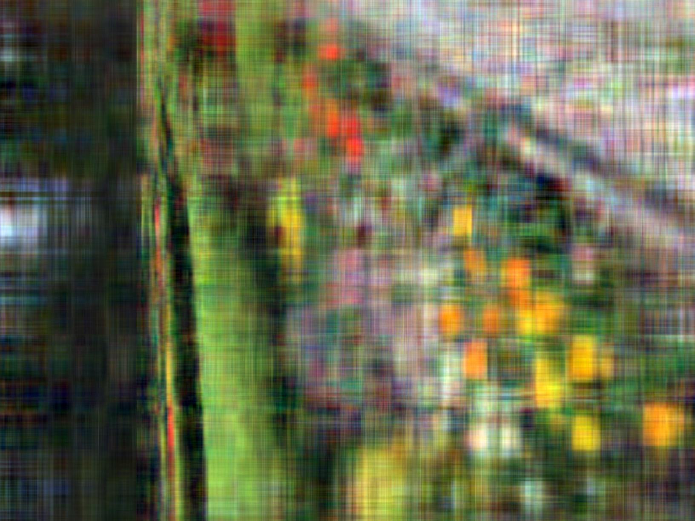

Prospect Garden 原图及其低秩近似。
:::

原图的 RGB 三个通道分别视为三个矩阵。秩 10 近似已经呈现主体结构，但细节明显缺失，也能看到条纹和涂抹等伪影。秩 100 近似与原图非常接近，虽然路缘石等局部仍有差异，但初看已不易察觉。两种近似所需存储量分别不足原图的 $1\%$ 和 $10\%$。

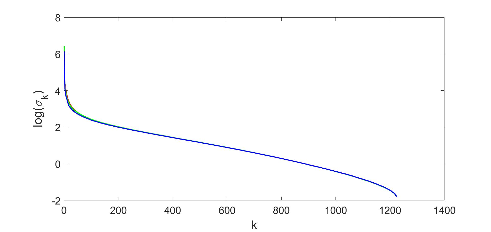{#fig-rgb-singular-decay width=70%}

计算一个 $m\times n$、$m\ge n$ 矩阵的完整 SVD，复杂度为 $O(mn^2)$。这种三次尺度对海量矩阵可能难以承受。第 7 章将介绍利用随机化更高效地计算大型矩阵低秩近似的算法。

SVD 也在线性系统 $Ax=b$ 的敏感性分析中扮演核心角色。误差可以用条件数
$\kappa(A)=\sigma_{\max}(A)/\sigma_{\min}(A)$ 控制。严格分析超出本书范围，可参见 [@Golub_MatrixComputations]。

### 谱分解

若 $M\in\mathbb R^{n\times n}$ 对称，则存在谱分解

$$
M=V\Lambda V^\top
=\sum_{k=1}^n\lambda_kv_kv_k^\top,
$$

其中 $V\in O(n)$ 的列 $v_k$ 是 $M$ 的特征向量，$\Lambda$ 的对角元 $\lambda_k$ 是相应特征值。

若所有特征值都非负，则称 $M$ **半正定**，记作 $M\succeq0$。此时

$$
M=(V\Lambda^{1/2})(V\Lambda^{1/2})^\top.
$$

形如 $M=UU^\top$ 的分解称为 Cholesky 分解；经典定义通常还要求 $U$ 为三角矩阵，这里不作该要求。

对称矩阵的算子 $2$-范数也称谱范数，并且

$$
\|M\|_2=\max_k|\lambda_k(M)|.
$$

### 二次型

本章及后续章节会反复遇到优化问题

$$
\max_{V\in\mathbb R^{n\times d},\,V^\top V=I_d}
\operatorname{tr}(V^\top MV),
$$ {#eq-trace-variational}

其中 $M$ 是对称 $n\times n$ 矩阵。若把 $V$ 的列写成 $v_1,\ldots,v_d$，则它等价于

$$
\max_{v_i^\top v_j=\delta_{ij}}
\sum_{k=1}^dv_k^\top Mv_k.
$$

$d=1$ 时退化为熟悉的 Rayleigh 商变分问题

$$
\max_{\|v\|_2=1}v^\top Mv=\lambda_{\max}(M),
$$

最优解是 $M$ 的首要特征向量。一般的 $d$ 维问题由前 $d$ 个特征向量达到最优，最优值为前 $d$ 大特征值之和；这也可由 Fan 的定理推出 [@Fan_variational_evalue_UAU]。

一个重要后果是，最优解可以顺序计算：先求 $d=1$ 的 $v_1$，再求 $v_2$ 便可扩展到 $d=2$，而无需改变已经得到的 $v_1$。复 Hermitian 矩阵也有完全对应的结论。

### SVD 与 Moore–Penrose 伪逆 {#sec-pseudoinverse}

SVD 与 Moore–Penrose 伪逆紧密相连 [@ben2003generalized]。伪逆把矩阵逆推广到非方阵和秩亏方阵。若 $A$ 可逆，则伪逆 $A^\dagger$ 就是通常的 $A^{-1}$；一般情况下，它由四个 Penrose 条件唯一确定：

$$
\begin{aligned}
AA^\dagger A&=A,\\
A^\dagger AA^\dagger&=A^\dagger,\\
(AA^\dagger)^\top&=AA^\dagger,\\
(A^\dagger A)^\top&=A^\dagger A.
\end{aligned}
$$ {#eq-penrose-conditions}

它们等价于：$AA^\dagger$ 是到 $\operatorname{range}(A)$ 的正交投影，$A^\dagger A$ 是到 $\operatorname{range}(A^\top)$ 的正交投影。换句话说，即使 $A$ 不可逆，$A^\dagger$ 仍尽可能表现得像一个逆。

伪逆的主要用途，是在 $Ax=b$ 没有唯一解时寻找“最佳”解。若有多个精确解，它选取 Euclidean 范数最小的那个；若没有精确解，例如超定系统，它给出使 $\|Ax-b\|_2$ 最小的最小二乘解。因此，伪逆广泛用于数值计算、统计、机器学习与信号处理，第 4 章会更深入讨论。

SVD 给出计算 $A^\dagger$ 的直接而稳定的方法。若 $\operatorname{rank}(A)=r$，把

$$
\Sigma=
\begin{bmatrix}
\Sigma_r&0\\0&0
\end{bmatrix},
\qquad
\Sigma_r=\operatorname{diag}(\sigma_1,\ldots,\sigma_r),
$$

则

$$
A^\dagger=V\Sigma^\dagger U^\top,
$$ {#eq-pseudoinverse-svd}

其中

$$
\Sigma^\dagger=
\begin{bmatrix}
\Sigma_r^{-1}&0\\0&0
\end{bmatrix},
\qquad
\Sigma_r^{-1}=\operatorname{diag}
\left(\frac1{\sigma_1},\ldots,\frac1{\sigma_r}\right).
$$

这个方法适用于方阵或长方阵、满秩或秩亏矩阵，并且数值上较稳健。实际计算时通常设定阈值 $\tau$，把小于 $\tau$ 的奇异值视为零，以免对极小奇异值取倒数而放大误差。

## 主成分分析与降维 {#sec-pca}

面对高维数据，自然的策略是降低维数：可以把数据投影到低维空间，也可以寻找少数具有解释力的新特征。降维不仅服务于压缩与可视化，还会让后续的聚类、回归等分析在低维中更有效。

PCA 是最经典的线性降维方法，至今仍是最简单、最有效的探索性数据分析工具之一。它可以追溯到 Karl Pearson 1901 年的论文 [@Pearson_PCA_1901]，此后被不同领域多次独立发现，也称为 proper orthogonal decomposition（POD）、Karhunen–Loève transform（KLT）等。

设有 $n$ 个数据点 $x_1,\ldots,x_n\in\mathbb R^p$，希望把它们线性投影到 $d<p$ 维，例如为了在二维或三维中可视化。至少有两种看似不同的选取标准：

1. 寻找一个 $d$ 维仿射子空间，使各点在其上的投影尽可能逼近原数据；
2. 寻找一个 $d$ 维投影，使投影后数据保留尽可能多的方差。

接下来会看到，这两种标准得到的是同一个投影。

先定义两个稍后会反复出现的统计量。样本均值与样本协方差分别为

$$
\mu_n=\frac1n\sum_{k=1}^nx_k,
\qquad
\Sigma_n=\frac1{n-1}\sum_{k=1}^n
(x_k-\mu_n)(x_k-\mu_n)^\top.
$$

若 $x_1,\ldots,x_n$ 从同一分布独立采样，则 $\mu_n$ 和 $\Sigma_n$ 分别是总体均值与协方差的无偏估计。

### PCA 作为最佳 $d$ 维仿射拟合

我们希望用

$$
x_k\approx\mu+\sum_{i=1}^d(\beta_k)_iv_i
=\mu+V\beta_k
$$ {#eq-pca-affine-model}

逼近每个数据点，其中 $v_1,\ldots,v_d$ 是 $d$ 维子空间的一组正交基，$V=[v_1\ \cdots\ v_d]$ 满足 $V^\top V=I_d$，$\mu$ 是平移量，$\beta_k$ 是坐标。可以不失一般性地要求

$$
\sum_{k=1}^n\beta_k=0,
$$ {#eq-pca-centered-coefficients}

因为所有 $\beta_k$ 的共同平移都能吸收到 $\mu$ 中。

用最小二乘衡量拟合质量，需要求解

$$
\min_{\mu,V,\beta_k;\,V^\top V=I_d}
\sum_{k=1}^n\|x_k-(\mu+V\beta_k)\|_2^2.
$$ {#eq-pca-least-squares}

先对 $\mu$ 优化。一阶条件为

$$
\sum_{k=1}^n[x_k-(\mu+V\beta_k)]=0.
$$

结合 @eq-pca-centered-coefficients，得到最优平移量

$$
\mu^*=\frac1n\sum_{k=1}^nx_k=\mu_n.
$$

固定 $V$ 后，再分别对每个 $\beta_k$ 优化。正交投影给出

$$
\beta_k^*=V^\top(x_k-\mu_n),
$$

并且这些最优系数自动满足和为零。于是原问题化为

$$
\min_{V^\top V=I_d}
\sum_{k=1}^n
\|(x_k-\mu_n)-VV^\top(x_k-\mu_n)\|_2^2.
$$ {#eq-pca-projection-error}

由于 $VV^\top$ 是正交投影，

$$
\|(I-VV^\top)(x_k-\mu_n)\|_2^2
=\|x_k-\mu_n\|_2^2
-(x_k-\mu_n)^\top VV^\top(x_k-\mu_n).
$$

第一项与 $V$ 无关，所以最小化投影误差等价于最大化

$$
\sum_{k=1}^n(x_k-\mu_n)^\top VV^\top(x_k-\mu_n).
$$

利用迹的循环性质，目标函数可写为

$$
\begin{aligned}
&\sum_{k=1}^n
\operatorname{tr}\!\left[
V^\top(x_k-\mu_n)(x_k-\mu_n)^\top V
\right]\\
&\qquad=(n-1)\operatorname{tr}(V^\top\Sigma_nV).
\end{aligned}
$$

因此最终问题是

$$
\max_{V^\top V=I_d}\operatorname{tr}(V^\top\Sigma_nV).
$$ {#eq-pca-trace-max}

根据前面的特征值变分原理，最优 $V=[v_1\ \cdots\ v_d]$ 由 $\Sigma_n$ 的前 $d$ 个特征向量组成。

### PCA 作为保留最大方差的 $d$ 维投影

现在从第二种解释出发：寻找一个 $d$ 维子空间，使数据投影后保留的方差最大。投影坐标为

$$
V^\top x_k=
\begin{bmatrix}
v_1^\top x_k\\ \vdots\\v_d^\top x_k
\end{bmatrix}.
$$

总样本方差最大化问题为

$$
\max_{V^\top V=I_d}
\sum_{k=1}^n
\left\|V^\top x_k-\frac1n\sum_{r=1}^nV^\top x_r\right\|_2^2.
$$

注意

$$
\sum_{k=1}^n\|V^\top(x_k-\mu_n)\|_2^2
=(n-1)\operatorname{tr}(V^\top\Sigma_nV).
$$

这恰好又得到 @eq-pca-trace-max。因此，“最佳仿射拟合”与“保留最多方差”并不是两种不同算法，而是 PCA 的两个等价视角。

### 如何计算主成分

直接做法是先构造

$$
\Sigma_n=\frac1{n-1}\sum_{k=1}^n
(x_k-\mu_n)(x_k-\mu_n)^\top,
$$

再求其前几个特征向量。构造协方差矩阵需要 $O(np^2)$ 次运算，完整谱分解需要 $O(p^3)$，总复杂度为
$O(\max\{np^2,p^3\})$ [@HJ90; @Golub_MatrixComputations]。

更好的做法是直接使用 SVD。令数据矩阵
$X=[x_1\ \cdots\ x_n]$，则

$$
\Sigma_n=\frac1{n-1}
(X-\mu_n\mathbf1^\top)(X-\mu_n\mathbf1^\top)^\top.
$$

若中心化数据的归一化 SVD 为

$$
\frac1{\sqrt{n-1}}(X-\mu_n\mathbf1^\top)
=U_LDU_R^\top,
$$

则

$$
\Sigma_n=U_LD^2U_L^\top.
$$

所以 $U_L$ 的列就是样本协方差的特征向量。完整 SVD 需要
$O(\min\{n^2p,p^2n\})$，若只求前 $d$ 个主成分，成本可降为 $O(dnp)$。随机化方法还能进一步降到
$O(pn\log d+(p+n)d^2)$；第 7 章将详细介绍，另见 [@HMT11; @Rokhlin_Szlam_Tygert_randPCA; @Musco_Musco_BlockLanczos]。

数值稳定性也是优先使用 SVD 的重要原因。$\Sigma_n$ 的特征值是中心化数据矩阵奇异值平方的比例倍数。若奇异值之比超过 $10^8$，对应特征值之比便超过 $10^{16}$，较小特征值可能因机器精度被舍入为零。直接对数据矩阵做 SVD 可以避免这种不必要的精度损失。

### 示例：手写数字的特征空间（MNIST）

MNIST 是数据科学学习者最常接触的基准数据集之一，由 Burges、Cortes 和 LeCun 基于美国国家标准与技术研究院的数据构建 [@lecun1998mnist]。常用版本包含 60,000 张训练图像和 10,000 张测试图像，每张图像为 $28\times28$ 灰度像素。关于 MNIST 及其他基准数据集的背景，可参见 [@hardt2022patterns]。

我们用 PCA 考察：能否把 $784$ 维像素空间压缩成低维**潜在空间**，同时仍保留手写数字的本质结构。先把每张图像展开为 $x\in\mathbb R^{784}$，数据矩阵共有 $60,000\times784$ 个元素；每一行是一张图像，每一列是某个固定像素位置的强度。

首先计算平均数字 $\bar x$，并从每一行减去它：

$$
X_{\text{centered}}=X-\bar x.
$$

这把坐标原点移到数据云中心，使第一主成分真正代表最大方差方向。对 $X_{\text{centered}}$ 做 SVD 后，右奇异向量就是主成分。把每个 $784$ 维向量重排为 $28\times28$ 图像，就得到所谓的“特征数字”。

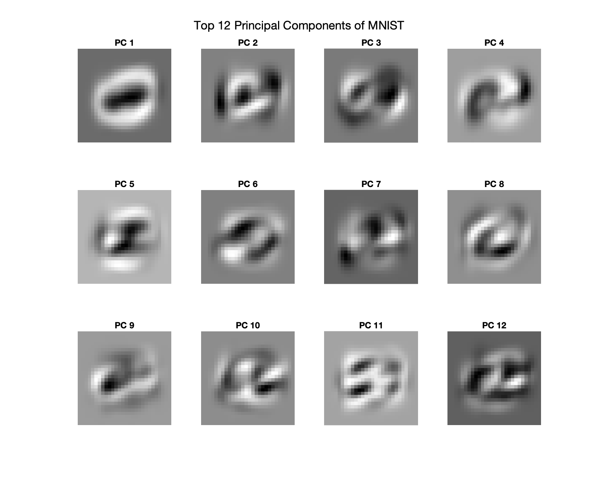{#fig-pca-mnist width=90%}

### 应当选择多少个主成分

若目标是可视化，$d=2$ 或 $d=3$ 通常最自然。但 PCA 还有很多其他用途：

1. **去噪。** 数据可能本质上属于低维空间，却受到高维噪声污染；PCA 能削弱噪声而保留信号。
2. **后续分析。** 聚类、回归等算法在高维中可能计算成本过高或统计意义不足；先用 PCA 降维往往能改善问题。

此时如何选择 $d$ 并不明显。一个常用启发式是寻找某个主成分，使它解释的方差显著大于紧随其后的成分。总方差为

$$
\operatorname{tr}(\Sigma_n)=\sum_{k=1}^p\lambda_k,
$$

第 $i$ 个主成分解释的方差比例为
$\lambda_i/\operatorname{tr}(\Sigma_n)$。把降序特征值画成**碎石图**（scree plot），再寻找曲线的“肘部”，可以选择合理的截断点。

::: {#fig-pca-elbow layout-ncol="2"}
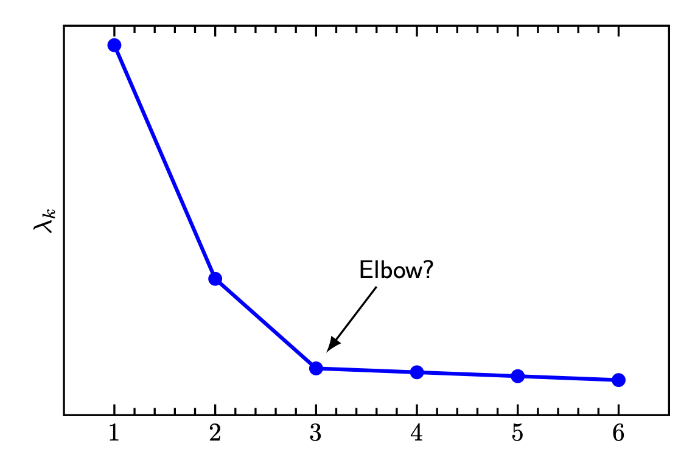

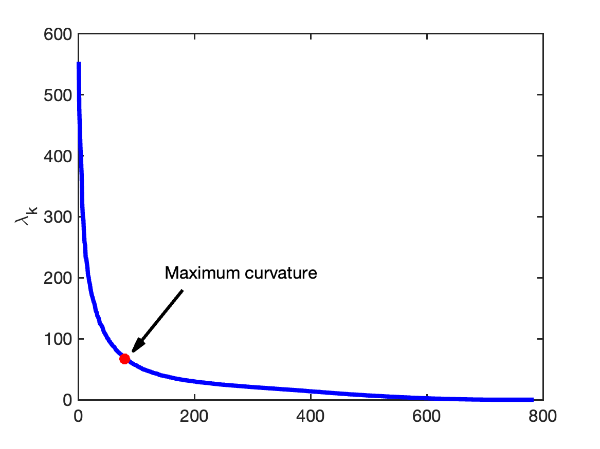

有序特征值曲线可以辅助选择主成分数量。实践中肘部常不清楚，此时可用曲率最大点作为替代。
:::

下面比较 MNIST 在不同截断维数 $d$ 下的 PCA 重建效果。

::: {#fig-mnist-pca-cutoffs}
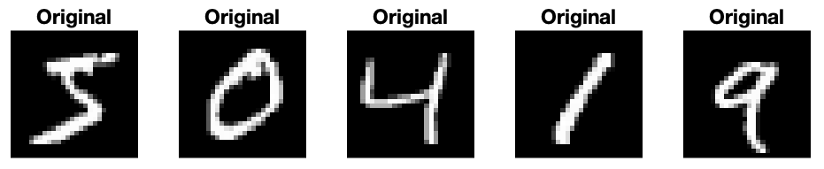

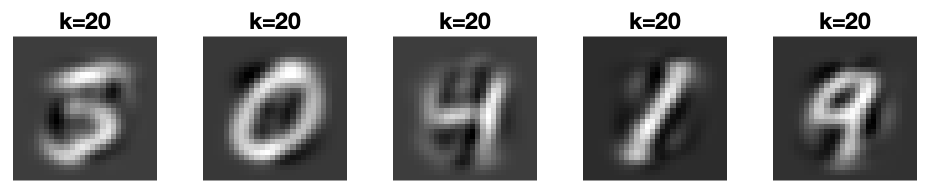

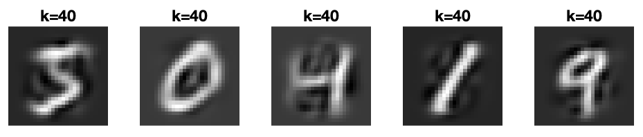

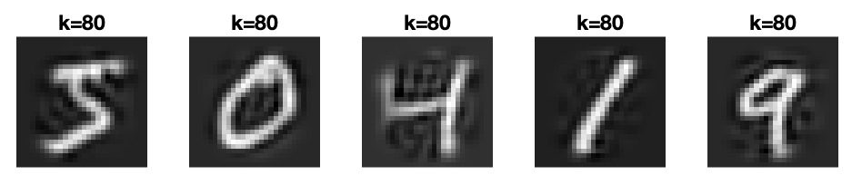

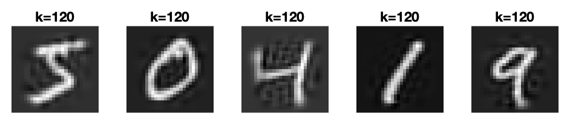

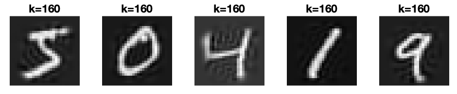

MNIST 在不同 PCA 截断维数下的近似。
:::

下一节将利用随机矩阵理论理解 $\Sigma_n$ 的特征值行为，从而更有原则地选择截断值。

## 高维 PCA 与 Marčenko–Pastur 定律

假设数据点 $x_1,\ldots,x_n\in\mathbb R^p$ 独立采自零均值 Gaussian 分布 $\mathcal N(0,\Sigma)$。使用 PCA 时，我们希望找到分布中的低维结构；它应当对应总体协方差 $\Sigma$ 的大特征值及其特征向量。由于 PCA 实际依赖样本协方差 $\Sigma_n$，关键问题是：$\Sigma_n$ 的谱是否接近 $\Sigma$ 的谱？

因为 $\mathbb E[\Sigma_n]=\Sigma$，若 $p$ 固定而 $n\to\infty$，大数定律保证 $\Sigma_n\to\Sigma$。但现代应用中，$p$ 常与 $n$ 同阶，甚至更大。例如图像数据里，$n$ 是图像数量，$p$ 是每张图像的像素数，两者完全可能相当。此时样本协方差未必接近总体协方差，这正是高维统计需要解决的困难之一。

为简化讨论，考虑

$$
S_n=\frac1nXX^\top,
$$

其中 $X$ 的列是 $x_1,\ldots,x_n$。因为样本均值趋于零且 $n/(n-1)\to1$，$S_n$ 与 $\Sigma_n$ 的谱渐近相同。此时 $S_n$ 也是 $\Sigma$ 的极大似然估计。

先看最简单的 $\Sigma=I$。总体分布旋转不变，根本没有低维结构。然而，当 $p=500,n=1000$ 时，$S_n$ 的许多特征值显著大于 $1$，也有许多显著小于 $1$。若不了解高维噪声的谱，仅凭这种碎石图，可能会错误地认为数据具有低维信号。

::: {#fig-marchenko-pastur-null layout-ncol="2"}
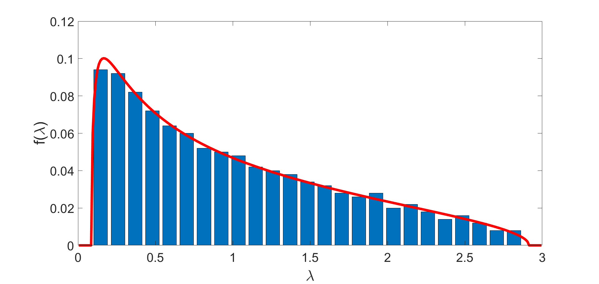

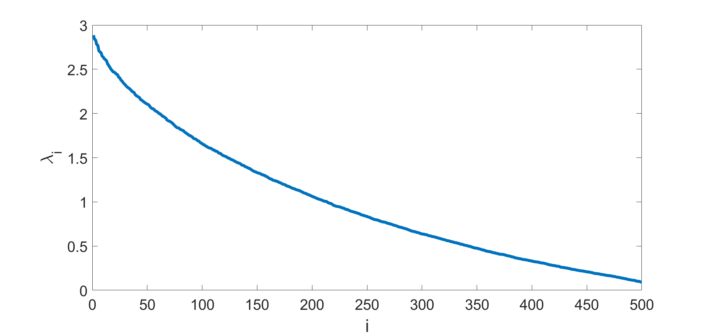

$\Sigma=I,p=500,n=1000$ 时一次 $S_n$ 实现的谱。红线为 Marčenko–Pastur 定律的预测。
:::

研究随机矩阵特征值分布，是随机矩阵理论的核心；可参考 [@bai2010spectral; @Tao_topicsRMT; @Anderson_Guionnet_Zeitouni_IntroRandomMatrices]。Marčenko 与 Pastur 于 1967 年首次建立这里的极限分布 [@Marchenko_Pastur_1967]。

当 $p,n\to\infty$ 且 $p/n=\gamma\le1$ 保持固定时，$S_n$ 的经验谱分布收敛到

$$
dF_\gamma(\lambda)
=\frac1{2\pi}
\frac{\sqrt{(\gamma_+-\lambda)(\lambda-\gamma_-)}}
{\gamma\lambda}
\mathbf1_{[\gamma_-,\gamma_+]}(\lambda)\,d\lambda,
$$ {#eq-marchenko-pastur}

其中

$$
\gamma_-=(1-\sqrt\gamma)^2,
\qquad
\gamma_+=(1+\sqrt\gamma)^2.
$$

本书不证明 Marčenko–Pastur 定律；不同证明见 [@Bai_MarchenkPastur_manyproofs]。一种思路是矩方法：对每个 $k$，一方面

$$
\frac1p\mathbb E\operatorname{tr}(S_n^k)
=\mathbb E\frac1p\sum_{i=1}^p\lambda_i^k(S_n),
$$

另一方面可用组合计数估计左侧极限，最终识别为
$\int\lambda^k\,dF_\gamma(\lambda)$，再由全部矩恢复分布。

### Spike 模型与 BBP 相变

若数据确实具有线性低维结构，PCA 在什么条件下能找到它？一个简单而重要的模型是

$$
\Sigma=I+\beta uu^\top,
$$

其中 $\|u\|_2=1,\beta>0$。这是秩一 spike 模型。每个数据点可以写成

$$
x=g+\sqrt\beta,g_0u
\sim\mathcal N(0,I+\beta uu^\top),
$$ {#eq-spike-model}

其中 $g\sim\mathcal N(0,I)$ 是各向同性高维噪声，$g_0\sim\mathcal N(0,1)$ 与之独立。信号沿直线 $\operatorname{span}(u)$ 分布，$\beta$ 正是该方向上信号方差与每个方向噪声方差之比，即信噪比（SNR）。

当 $p=500,n=1000,\beta=1.5$ 时，$S_n$ 有一个特征值明显脱离 Marčenko–Pastur bulk；但 $\beta=0.5$ 时，谱直方图几乎与纯噪声无法区分。

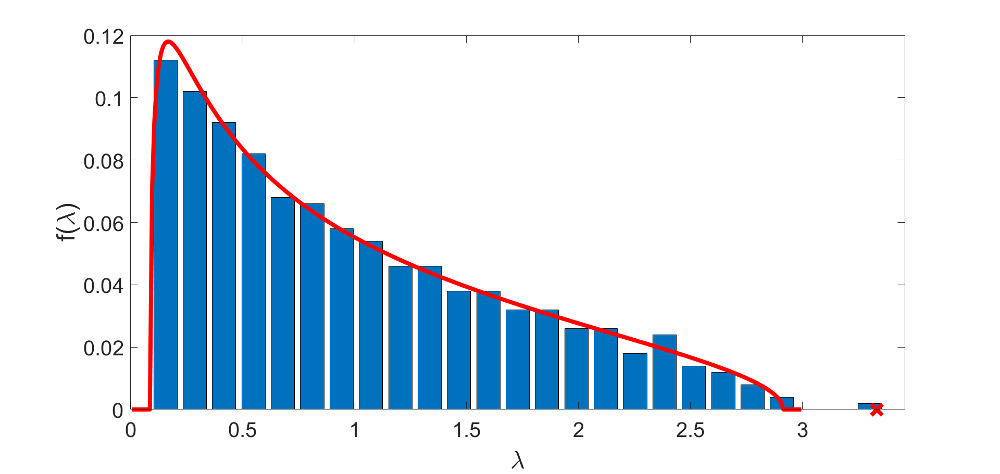{#fig-spike-high width=90%}

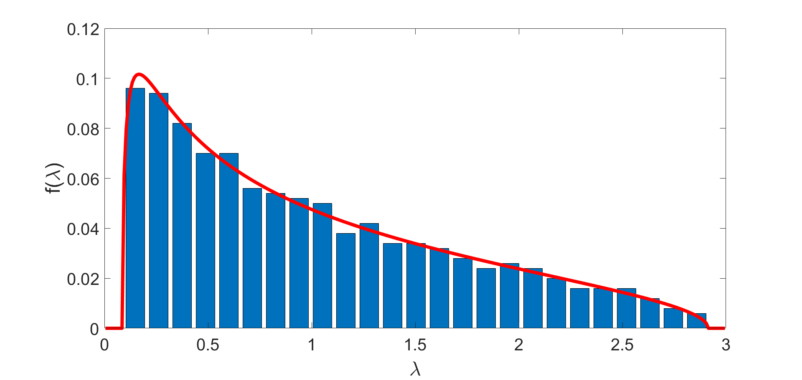{#fig-spike-low width=90%}

这引出一个核心问题：对哪些 $\gamma,\beta$，$S_n$ 的最大特征值会脱离 Marčenko–Pastur 支撑？其极限位置在哪里？

存在临界值 $\beta_c$：低于它时，spike 不改变极限谱的可见形态；高于它时，一个特征值从 bulk 中“冒出”。这称为 **BBP 相变**，以 Baik、Ben Arous 和 Péché 命名 [@BPP_MC_BPP_2005]；相关研究见 [@Paul_Marchenko_Pastur_BPP_TechReport; @Johnston_MC_BPP; @Paul_Marchenko_Pastur_BPP_ActualPaper; @Baik_Silverstein_BPP_05; @Karoui_BPP_05; @BenaychGeorges_Nadakuditi_PCA; @BenaychGeorges_Nadakuditi_SVD]。

下面给出一个略去部分技术细节、但可以严格化的推导。令

$$
S_n=(I+\beta uu^\top)^{1/2}Z_n(I+\beta uu^\top)^{1/2},
$$

其中 $Z_n=n^{-1}\sum_i z_iz_i^\top$ 是各向同性 Gaussian 的样本协方差。$S_n$ 与

$$
Z_n(I+\beta uu^\top)=Z_n+\beta Z_nuu^\top
$$

相似，所以具有相同特征值。设 $\lambda$ 是后者的首要特征值、$v$ 是相应特征向量，则

$$
Z_n(I+\beta uu^\top)v=\lambda v.
$$

若 $\lambda$ 不是 $Z_n$ 的特征值，整理并左乘 $u^\top$ 得

$$
u^\top(\lambda I-Z_n)^{-1}Z_nu=\frac1\beta.
$$ {#eq-spike-resolvent}

设 $Z_n$ 的特征对为 $(\lambda_i,w_i)$，并展开
$u=\sum_i\alpha_iw_i$，则

$$
\sum_{i=1}^p\frac{\lambda_i}{\lambda-\lambda_i}\alpha_i^2
=\frac1\beta.
$$

大维数下 $\alpha_i^2$ 集中在 $1/p$ 附近，经验谱又收敛到 @eq-marchenko-pastur，因此极限方程为

$$
\int_{\gamma_-}^{\gamma_+}
\frac{t}{\lambda-t}\,dF_\gamma(t)
=\frac1\beta.
$$

积分可算得

$$
\frac1\beta
=\frac1{4\gamma}
\left[2\lambda-(\gamma_-+\gamma_+)
-2\sqrt{(\lambda-\gamma_-)(\lambda-\gamma_+)}
\right].
$$ {#eq-spike-integral}

相变发生在 $\lambda$ 刚接触右端点 $\gamma_+$ 时。代入
$\gamma_\pm=(1\pm\sqrt\gamma)^2$，得到

$$
\boxed{\beta_c=\sqrt\gamma=\sqrt{p/n}}.
$$ {#eq-bbp-critical}

所以低信噪比、样本少和维数高都会妨碍从噪声中识别线性结构。反解 @eq-spike-integral，最大样本特征值的极限为

$$
\lambda\longrightarrow
\begin{cases}
(\beta+1)(1+\gamma/\beta),&\beta\ge\sqrt\gamma,\\
(1+\sqrt\gamma)^2,&\beta<\sqrt\gamma.
\end{cases}
$$ {#eq-bbp-eigenvalue}

有限样本时，最大特征值围绕该极限波动。值得注意的是，临界 SNR 深埋在 Marčenko–Pastur 支撑之内；信号不必强到超过噪声矩阵的算子范数才可被检测。噪声会把离群特征值向右推移。

样本首要特征向量 $v$ 与真实方向 $u$ 的平方相关极限为

$$
|\langle v,u\rangle|^2\longrightarrow
\begin{cases}
\dfrac{1-\gamma/\beta^2}{1+\gamma/\beta^2},
&\beta\ge\sqrt\gamma,\\
0,&\beta<\sqrt\gamma.
\end{cases}
$$ {#eq-bbp-correlation}

当 $\beta\to\infty$，相关趋于 $1$；但任何有限 SNR 下都严格小于 $1$。

### Wigner 矩阵 {#sec-wigner-matrices}

另一个重要模型是 Wigner 矩阵。标准 Gaussian Wigner 矩阵 $W\in\mathbb R^{n\times n}$ 对称；上三角非对角元独立服从 $\mathcal N(0,1)$，对角元独立服从 $\mathcal N(0,2)$。当 $n\to\infty$，$W/\sqrt n$ 的经验谱服从半圆律

$$
d\mathrm{SC}(x)
=\frac1{2\pi}\sqrt{4-x^2}\,
\mathbf1_{[-2,2]}(x)\,dx.
$$ {#eq-semicircle-law}

这个模型也有 BBP 型相变 [@Feral_Peche_BPPWigner]。若 $\|v\|_2=1,\xi\ge0$，则

$$
\lambda_{\max}\!\left(\frac W{\sqrt n}+\xi vv^\top\right)
\longrightarrow
\begin{cases}
2,&\xi\le1,\\
\xi+1/\xi,&\xi>1.
\end{cases}
$$

相应首要特征向量 $v_{\max}$ 满足

$$
|\langle v_{\max},v\rangle|^2
\longrightarrow
\begin{cases}
0,&\xi\le1,\\
1-1/\xi^2,&\xi>1.
\end{cases}
$$

从统计角度看，一个核心问题是：对不同随机矩阵分布，何时能检测并估计 spike [@AlexAmeliaAfonsoAnkur_PCA]？若随机矩阵是随机图的邻接矩阵，而 spike 对应边分布中的结构偏置，上述估计便能预测网络社群检测中的重要相变，第 12 章将看到这一应用。

### 秩与协方差估计

spike 模型提供了一种有原则的主成分数量估计：统计 Marčenko–Pastur 支撑右侧的离群特征值个数。但真实数据中，这种做法往往过于简单。首先，$n,p$ 有限，需要考虑非渐近修正和有限样本波动 [@kritchman2008determining; @kritchman2009non]。其次，噪声可能具有异方差，不同方向方差不同；噪声统计也可能未知或非 Gaussian [@liu2018pca]。有时可以从数据估计噪声并做白化 [@leeb2018optimal]，但一般问题仍有许多开放方向。

另一种常用秩估计方法是置换法：随机打乱数据矩阵每一列，破坏低秩线性结构而尽量保留噪声。重复多次后，用打乱矩阵的奇异值统计量作为噪声基线；只有原始矩阵中显著超过打乱样本最大奇异值的部分才计作信号。其数学分析也是活跃研究方向 [@dobriban2017permutation; @dobriban2018deterministic]。

在某些应用中，我们希望从含噪观测估计干净信号的低秩协方差 $\Sigma$。spike 模型表明，样本特征值会被噪声抬高，因此需对其进行收缩。若

$$
S_n=\sum_{i=1}^p\lambda_iv_iv_i^\top,
$$

可考虑估计量

$$
\widehat\Sigma
=\sum_{i=1}^p\eta(\lambda_i)v_iv_i^\top,
$$

其中 $\eta:\mathbb R_+\to\mathbb R_+$ 称为**收缩函数**。一种自然选择是反解 @eq-bbp-eigenvalue 得到 $\beta=\eta(\lambda)$，并对 $\lambda<\gamma_+$ 置零。这个收缩器在算子范数损失下最优；对 Frobenius 范数等其他损失，最优函数不同 [@donoho2018optimal]。

原因在于样本特征向量与总体特征向量并不完全对齐，而是存在 @eq-bbp-correlation 给出的非平凡夹角。特征向量本身也有噪声，因此某些损失下需要更强收缩来补偿方向误差。若没有关于真实方向的先验知识，如何改进特征向量估计并不明显。特征值收缩同样是去噪方法的重要组成部分。

## 习题 {.unnumbered}

::: {#exr-matrix-p-norm .exercise title="习题 1：矩阵诱导范数"}
定义
$$
\|A\|_p=\sup_{x\ne0}\frac{\|Ax\|_p}{\|x\|_p}
=\sup_{\|x\|_p=1}\|Ax\|_p.
$$
证明：

1. $\|AB\|_p\le\|A\|_p\|B\|_p$；
2. $\|A\|_1=\max_j\sum_i|a_{ij}|$；
3. $\|A\|_\infty=\max_i\sum_j|a_{ij}|$，并注意 $\|A\|_\infty=\|A^\top\|_1$；
4. $\|A\|_2^2\le\|A\|_1\|A\|_\infty$。
:::

::: {#exr-schatten-norm .exercise title="习题 2：Schatten 范数"}
矩阵 $A\in\mathbb R^{m\times n}$ 的 Schatten $p$-范数是其奇异值向量的 $\ell_p$ 范数：
$$
\|A\|_{S_p}=\left(\sum_{k=1}^{\min\{m,n\}}\sigma_k^p\right)^{1/p}.
$$
若矩阵范数满足 $\|QAZ\|=\|A\|$（$Q,Z$ 正交），则称其酉不变。

1. 证明 Schatten $p$-范数酉不变。
2. $p=1,2,\infty$ 分别对应核范数、Frobenius 范数和算子范数。验证
   $$\|A\|_*=\operatorname{tr}\sqrt{A^\top A}.$$
:::

::: {#exr-unitarily-invariant .exercise title="习题 3：酉不变范数"}
证明任何酉不变矩阵范数都只依赖矩阵的奇异值。
:::

::: {#exr-procrustes .exercise title="习题 4：正交 Procrustes 问题"}
设方阵 $A=U\Sigma V^\top$。证明与 $A$ 的 Frobenius 距离最近的正交矩阵是 $UV^\top$：
$$
\|A-UV^\top\|_F
=\min_{WW^\top=W^\top W=I}\|A-W\|_F.
$$
由此求出最小化 $\sum_i\|Wp_i-q_i\|_2^2$ 的最优旋转（允许反射）。这称为正交 Procrustes 问题；见 [@arun1987least; @fan1955some; @keller1975closest]。
:::

::: {#exr-low-rank-bound .exercise title="习题 5：低秩近似"}
设 $A\in\mathbb R^{m\times n}$，$1\le k\le\operatorname{rank}(A)$。

1. 证明存在秩为 $k$ 的 $B$，使
   $$\|A-B\|_2\le\frac{\|A\|_F}{\sqrt k}.$$
2. 若把左侧算子范数换成 $\|A-B\|_F$，结论是否仍成立？
:::

::: {#exr-spike-correlation .exercise title="习题 6：spike 模型的特征向量相关"}
证明 spike 模型中，样本首要特征向量 $v$ 与真实信号 $u$ 的渐近平方相关由 @eq-bbp-correlation 给出。

**提示：** 用积分表或计算机代数系统计算
$$
\int_{\gamma_-}^{\gamma_+}
\frac{t^2}{(\lambda-t)^2}\,dF_\gamma(t).
$$
:::

::: {#exr-simulate-semicircle .exercise title="习题 7：模拟 Wigner 半圆律"}
通过计算机模拟验证 Wigner 半圆律，例如取 $n=400$。
:::

::: {#exr-wigner-spike-eigenvalue .exercise title="习题 8：Wigner 秩一扰动"}
证明 Wigner 矩阵秩一扰动的最大特征值极限为
$2$（$\xi\le1$）或 $\xi+1/\xi$（$\xi>1$）。
:::

::: {#exr-semicircle-moments .exercise title="习题 9：半圆分布的矩"}
设 $X$ 服从
$$
d\mathrm{SC}(x)=\frac1{2\pi}\sqrt{4-x^2}
\mathbf1_{[-2,2]}(x)\,dx.
$$
证明
$$
\mathbb E[X^k]=
\begin{cases}
C_{k/2},&k\text{ 为偶数},\\
0,&k\text{ 为奇数},
\end{cases}
$$
其中 $C_n=\frac1{n+1}\binom{2n}{n}$ 是第 $n$ 个 Catalan 数。
:::

::: {#exr-operator-norm-equivalences .exercise title="习题 10：谱范数的等价定义"}
对 $M\in\mathbb R^{m\times n}$，证明下列量相等：

1. $\sup_{\|v\|_2=1}\|Mv\|_2$；
2. $\sup_{v\ne0}\|Mv\|_2/\|v\|_2$；
3. $\sup_{\|u\|_2=\|v\|_2=1}u^\top Mv$；
4. $\sigma_1(M)$；
5. $\sqrt{\lambda_1(MM^\top)}$；
6. $\sqrt{\lambda_1(M^\top M)}$。
:::

::: {#exr-max-entry .exercise title="习题 11：最大元素界"}
设 $X\in\mathbb R^{n\times m}$。证明对所有 $i,j$，
$$|X_{ij}|\le\|X\|_2.$$
:::

::: {#exr-matrix-symmetrization .exercise title="习题 12：矩阵的对称化"}
设 $M\in\mathbb R^{m\times n}$，$m\le n$。

1. 对 $A=MM^\top$，证明其 $m$ 个特征值为 $\sigma_1^2(M),\ldots,\sigma_m^2(M)$。
2. 证明 $MM^\top$ 与 $M^\top M$ 的非零特征值连同重数相同。
3. 对 Hermitian 膨胀
   $$
   C=\begin{bmatrix}0&M\\M^\top&0\end{bmatrix},
   $$
   证明其特征值为 $\pm\sigma_1(M),\ldots,\pm\sigma_m(M)$，外加 $n-m$ 个零。
:::

::: {#exr-gershgorin .exercise title="习题 13：Gershgorin 圆盘定理"}
设对称矩阵 $A=(a_{ij})$，并令
$R_i=\sum_{j\ne i}|a_{ij}|$。证明 $A$ 的每个特征值 $\lambda$ 都落在至少一个 Gershgorin 圆盘内，即存在 $i$ 使
$$|\lambda-a_{ii}|\le R_i.$$
:::

::: {#exr-quadratic-optimization .exercise title="习题 14：二次型优化"}
设对称矩阵 $A$ 的特征值为 $\lambda_1\ge\cdots\ge\lambda_n$。对 $r\in[n]$，考虑
$$
\max_{v_i^\top v_j=\delta_{ij}}
\sum_{i=1}^rv_i^\top Av_i.
$$

1. 当 $r=n$ 时，证明最优值为 $\operatorname{tr}(A)$。
2. 当 $r<n$ 时，用 $A$ 的特征值给出最优值。
:::

::: {#exr-courant-fischer .exercise title="习题 15：Courant–Fischer 极小极大公式"}
设 $A\in\mathbb R^{n\times n}$ 对称。证明对 $k\in[n]$，
$$
\lambda_k(A)
=\max_{\dim V=k}\min_{v\in V,\|v\|=1}v^\top Av
=\min_{\dim V=n-k+1}\max_{v\in V,\|v\|=1}v^\top Av.
$$

**提示：** 任意 $n-k+1$ 维子空间都与前 $k$ 个特征向量张成的空间有非零交集。
:::

::: {#exr-courant-fischer-consequences .exercise title="习题 16：Courant–Fischer 公式的推论"}
设 $X,Y\in\mathbb R^{m\times n}$，$m\le n$。

1. 利用习题 12 的 Hermitian 膨胀，把 Courant–Fischer 公式推广到奇异值：
   $$
   \sigma_k(X)=\max_{\dim V=k}\min_{v\in V,\|v\|=1}\|Xv\|
   =\min_{\dim V=n-k+1}\max_{v\in V,\|v\|=1}\|Xv\|.
   $$
2. 证明谱范数下的 Eckart–Young–Mirsky 定理：若 $\operatorname{rank}(B)=r<m$，则 $\|X-B\|_2\ge\sigma_{r+1}(X)$。
3. 证明奇异值的 Weyl 不等式：若 $i+j-1\le m$，则
   $$\sigma_{i+j-1}(X+Y)\le\sigma_i(X)+\sigma_j(Y).$$
:::

::: {#exr-matrix-inner-product .exercise title="习题 17：矩阵内积"}
对 $A,B\in\mathbb R^{n\times n}$，定义
$\langle A,B\rangle=\operatorname{tr}(AB^\top)$。

1. 证明它是矩阵空间上的内积。
2. 证明 $\|A\|_F^2=\langle A,A\rangle$。
3. 推出矩阵 Cauchy–Schwarz 不等式
   $|\langle A,B\rangle|\le\|A\|_F\|B\|_F$。
:::

::: {#exr-rotation-minimization .exercise title="习题 18：旋转最小化"}
对任意 $A,B\in\mathbb R^{m\times n}$，用 $A,B$ 或它们的 SVD 求解
$$
\operatorname*{argmin}_{\Omega\in O(m)}
\|\Omega A-B\|_F.
$$
:::

::: {#exr-polar-decomposition .exercise title="习题 19：极分解"}
设 $A\in\mathbb R^{n\times n}$。证明存在半正定矩阵 $P$ 与正交矩阵 $Q$，使 $A=PQ$。
:::

::: {#exr-power-method .exercise title="习题 20：幂法"}
设 $A\succeq0$，特征值 $\lambda_1\ge\cdots\ge\lambda_n\ge0$，特征向量为正交基 $v_i$。

1. 从满足 $Ay_0\ne0$ 的 $y_0$ 出发，令
   $$y_{k+1}=Ay_k/\|Ay_k\|.$$
   证明迭代始终有定义。
2. 定义 Rayleigh 商 $\xi_k=y_k^\top Ay_k$ 和相对误差
   $\operatorname{err}(\xi_k)=(\lambda_1-\xi_k)/\lambda_1$。若 $A=\operatorname{diag}(\lambda_1,\ldots,\lambda_n)$ 且 $\lambda_1=1$，证明
   $$
   \operatorname{err}(\xi_k)
   =\frac{\sum_{i=2}^nw_i^2\lambda_i^{2k}(1-\lambda_i)}
   {w_1^2+\sum_{i=2}^nw_i^2\lambda_i^{2k}},
   $$
   其中 $w_i=\langle y_0,v_i\rangle$。
3. 若 $1=\lambda_1>\lambda_2>\lambda_3$ 且 $w_1w_2\ne0$，证明
   $$
   \frac{\operatorname{err}(\xi_{k+1})}{\operatorname{err}(\xi_k)}
   \to(\lambda_2/\lambda_1)^2.
   $$
4. 将结论推广到一般非对角的 $A$。
:::

::: {#exr-unbiased-variance .exercise title="习题 21：方差的无偏估计"}
联系第 4 章的极大似然估计结果，证明
$$
\widehat\sigma^2=\frac1{n-p}
\|y-X\widehat\beta_{\mathrm{LS}}\|_2^2
$$
是 $\sigma^2$ 的无偏估计。
:::

::: {#exr-moore-penrose .exercise title="习题 22：Moore–Penrose 伪逆"}
1. 对非负矩形对角矩阵 $\Sigma\in\mathbb R^{n\times m}$，构造其伪逆 $\Sigma^+\in\mathbb R^{m\times n}$。
2. 若 $A=U\Sigma V^\top$，证明 $A^+=V\Sigma^+U^\top$ 满足 Penrose 条件。
3. 若 $A$ 可逆，证明 $A^{-1}$ 是其伪逆。
4. 若 $A$ 满列秩，证明
   $$A^+=(A^\top A)^{-1}A^\top.$$
5. 证明伪逆唯一。
:::

::: {#exr-spiked-wigner-mse .exercise title="习题 23：spiked Wigner 模型的 BBP 相变"}
设
$$
Y=\frac1{\sqrt n}W+\xi vv^\top,
$$
其中 $W$ 是 $n\times n$ Wigner 矩阵，$\|v\|=1,\xi\ge0$。已知
$$
\lambda_{\max}(Y)\to
\begin{cases}2,&\xi\le1,\\\xi+1/\xi,&\xi>1,
\end{cases}
$$
且首要特征向量满足
$$
|\langle v_{\max},v\rangle|^2\to
\begin{cases}0,&\xi\le1,\\1-1/\xi^2,&\xi>1.
\end{cases}
$$
定义
$$
\operatorname{mse}(w)
=\mathbb E\|ww^\top-vv^\top\|_F^2.
$$
求 PCA 估计量的极限
$\lim_{n\to\infty}\operatorname{mse}(v_{\max})$，表示为 $\xi$ 的函数。

这种矩阵形式的 MSE 自动消除了 $v$ 与 $-v$ 的符号不识别性，也更便于推广到非对称低秩矩阵估计。
:::

::: {#exr-iris-pca .exercise title="习题 24：Iris 数据集的 PCA"}
Iris 数据集包含 50 朵花，每朵有萼片长度、萼片宽度、花瓣长度和花瓣宽度四项测量。

1. 将数据载入 $4\times50$ 矩阵 $X$，绘制成对散点图。判断哪些变量相关，并把视觉结论与样本方差、协方差比较。
2. 对中心化协方差矩阵做特征分解并实施 PCA。各主成分分别解释多少数据变异？
:::

::: {#exr-mnist-pca .exercise title="习题 25：用 PCA 降维 MNIST"}
1. 标准化 MNIST 数据；
2. 应用 PCA，保留足以解释 $95\%$ 方差的主成分；
3. 对一批样本可视化前两个主成分。
:::

::: {#exr-image-compression .exercise title="习题 26：用截断 SVD 压缩图像"}
取一张至少 $256\times256$ 的灰度图像，表示为 $A\in\mathbb R^{m\times n}$。对
$k=1,\ldots,p$（$p=\min\{m,n\}$）计算秩 $k$ 的截断 SVD 近似，测量相对 Frobenius 误差并绘制误差关于 $k$ 的曲线。在哪个 $k$ 的范围内，压缩图像在视觉上已看不出失真？
:::
