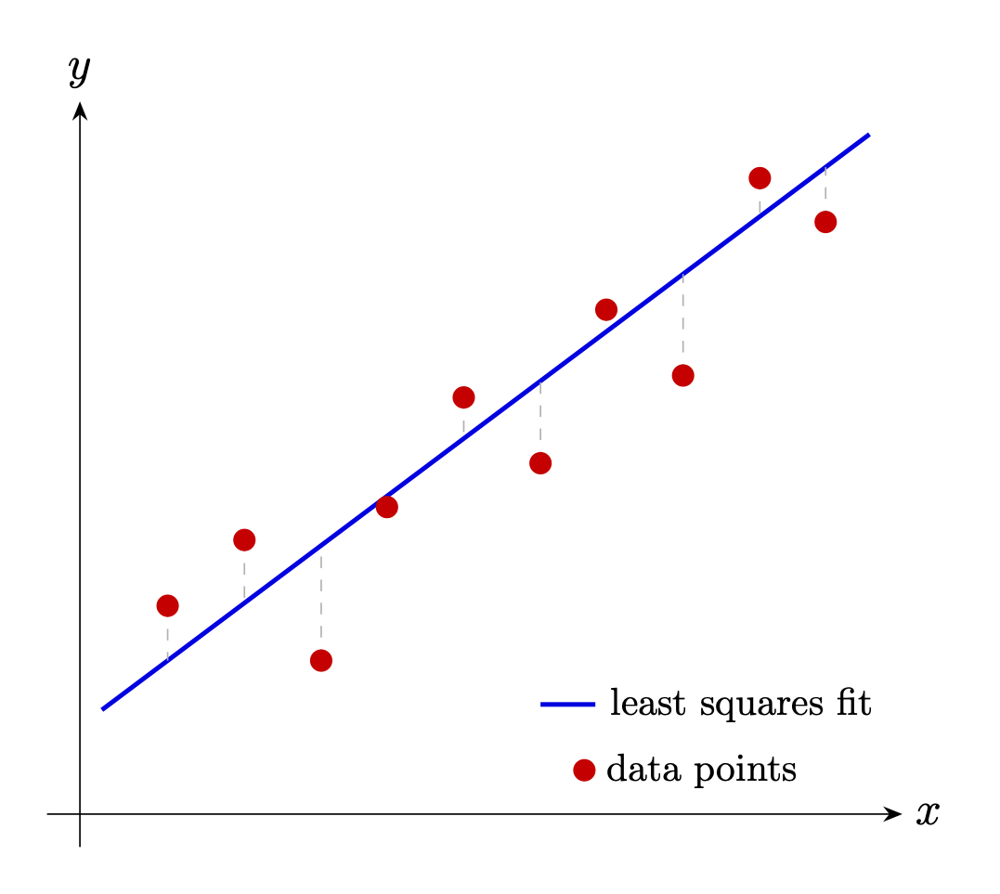
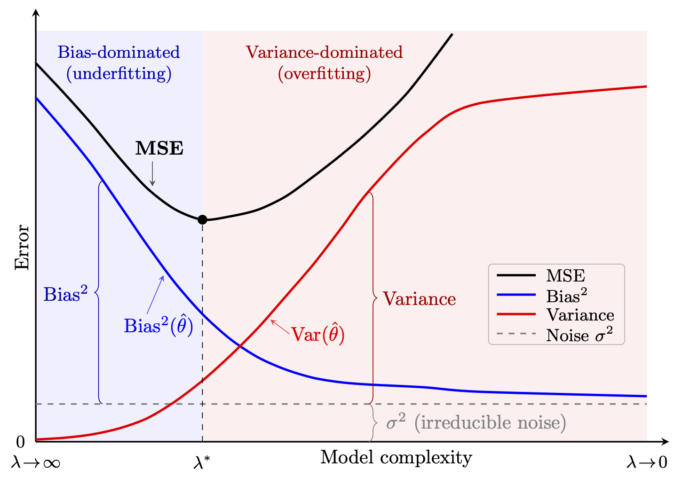
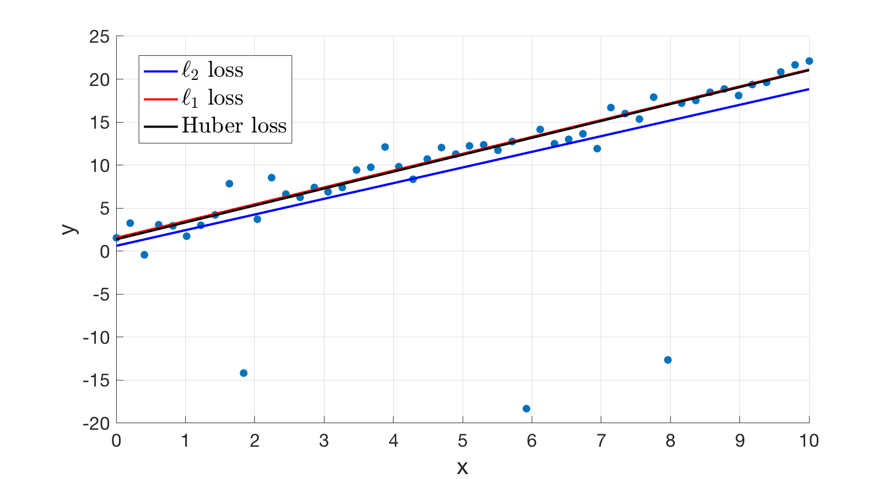
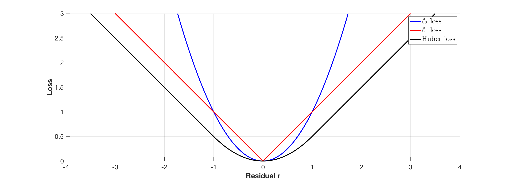

California Mavericks 的清晨，涌浪预报显示：浪高 10 米、周期 18 秒。一场巨型风暴把能量送过数千公里的 Pacific Ocean。对大浪冲浪者来说，这是令人兴奋的条件，也意味着失误后被巨浪吞没的巨大危险。

冲浪者落水后被压在水下的时间，称为 **hold-down**，是大浪事故中最关键的变量之一。职业冲浪者在受控环境中也许能闭气四五分钟，但划入 12 米巨浪已经消耗大量体力，再加上数千吨海水翻滚造成的失向，可能二三十秒后就会恐慌，六十到九十秒便可能失去意识。

于是产生一个实际而紧迫的问题：能否根据海况和波浪特征，预测冲浪者会被压在水下多久？

设我们用水下摄影机和 GPS 追踪器，收集了 Mavericks、Nazaré、Jaws、Teahupo'o 等地 50 次大浪活动的数据。每次落水记录水下时间 $y$、浪高 $x_1$、周期 $x_2$、冲击区水深 $x_3$ 和风速 $x_4$。明天预报浪高 15 米、周期 20 秒、水深 12 米、风速 18 节；预计 hold-down 多久？

真实物理涉及流体力学、浮力和湍流，显然是非线性的。但在已观测范围内，一阶线性近似也许足够有效：

$$
y=\theta_0+\theta_1x_1+\theta_2x_2
+\theta_3x_3+\theta_4x_4+\varepsilon.
$$

$\theta_0$ 是基准时间，其他系数分别描述浪高、周期、水深和风速的边际影响，$\varepsilon$ 则吸收浪形、冲浪者位置等随机变化。

把 50 次观测写成矩阵形式：

$$
y=X\theta+\varepsilon,
$$

其中 $y\in\mathbb R^{50}$，$X\in\mathbb R^{50\times5}$（含一列常数 1），$\theta\in\mathbb R^5$ 是待估计系数。找到 $\widehat\theta$ 后，就能预测明天的水下时间。

但怎样才算“最佳”估计？它在什么意义下最优？预测有多准确？是否应使用全部变量，还是简单模型更好？线性回归与最小二乘将回答这些问题。

本章从四个互补视角研究线性回归。首先把最小二乘解释为正交投影；其次说明它如何自然产生于 Gaussian 噪声和条件均值预测；随后分析偏差、方差与预测风险；最后说明岭回归如何收缩信息不足的方向来稳定估计，并把这种收缩重新解释为 Wiener 滤波。

## 线性回归

线性回归是数据科学、统计学和应用数学中最基础的**监督学习**模型 [@hastieelements; @LVanderberghe_SBoyd_book; @Golub_MatrixComputations]。它常从统计推断出发介绍，但数学核心其实是几何问题：把目标向量投影到预测变量张成的子空间。

一般地，设数据包含 $n$ 个观测和 $p$ 个特征，设计矩阵为 $X\in\mathbb R^{n\times p}$，响应向量为 $y\in\mathbb R^n$。我们作出一个很强的建模假设：

$$
y=X\theta+\varepsilon,
$$

其中 $\theta\in\mathbb R^p$ 是未知系数，$\varepsilon$ 是噪声。目标是估计 $\theta$。

线性回归主要服务于两个目的：

1. **预测。** 给定新预测变量 $x_{\rm new}$，用
   $\widehat y_{\rm new}=x_{\rm new}^\top\widehat\theta$ 预测响应。
2. **推断。** 理解预测变量与响应的关系：哪些变量重要？改变 $x_j$ 会怎样影响 $y$？估计具有多大不确定性？

由于噪声存在，有限数据下既不能指望精确恢复 $\theta$，也不能指望 $y$ 恰好位于 $X$ 的列空间。我们采用平方残差和作为损失：

$$
f(\theta)=\|y-X\theta\|_2^2.
$$ {#eq-least-squares-loss}

为什么选平方损失，而不是绝对误差和
$\sum_i|y_i-x_i^\top\theta|$ 或最大绝对误差？平方损失的选择并非任意：几何解释、计算可行性和统计最优性会从不同方向共同导向它。[^least-squares-history]

[^least-squares-history]: 最小二乘的主导地位与天文学和正态分布的历史密切相关。Legendre 于 1805 年首先发表该方法，用代数方式拟合行星数据；Gauss 于 1809 年发表自己的版本，并声称早在 1795 年就已使用 [@stigler1981gauss]。Gauss 首次给出概率解释，也由此奠定现代统计推断的重要基础 [@stigler1990history]。

{#fig-linear-regression width=55%}

线性回归和 PCA 都拟合线性结构，却有根本不同的目标与假设。回归是监督方法，研究 $X$ 与响应 $y$ 的关系，并通常假定 $X$ 精确、噪声只在 $y$ 中。[^total-least-squares] PCA 是无监督方法，不涉及响应，而是寻找最能保留 $X$ 变化的低维结构。简言之，回归问“$X$ 能多好地解释 $y$？”，PCA 问“怎样最有效地表示 $X$？”

[^total-least-squares]: 全最小二乘允许 $X$ 和 $y$ 都有误差 [@Golub_MatrixComputations]，其解等价于寻找合并矩阵 $[X\ y]$ 的第一主成分。

## 最小二乘的几何、存在性与唯一性

平方损失具有其他损失函数没有的优美几何结构。设 $S\subset\mathbb R^n$ 是线性子空间。每个 $y\in\mathbb R^n$ 都有唯一分解

$$
y=s+r,
\qquad s\in S,\quad r\in S^\perp,
$$ {#eq-orthogonal-decomposition}

而且 $s$ 是 $\min_{u\in S}\|y-u\|_2^2$ 的唯一解。

令 $\operatorname{Col}(X)$ 表示 $X$ 的列空间，$P_X$ 表示到该空间的正交投影。取 $S=\operatorname{Col}(X)$，可知对任意 $y$ 都存在 $\widehat\theta$ 使

$$
X\widehat\theta=P_Xy,
$$

并且

$$
\widehat\theta\in\operatorname*{argmin}_\theta
\|y-X\theta\|_2^2.
$$

冲浪例子里，拟合值 $X\widehat\theta$ 正是观测 hold-down 向量在波浪特征张成子空间上的投影。

$\widehat\theta$ 最小化平方损失，当且仅当残差与 $X$ 的所有列正交：

$$
X^\top(y-X\widehat\theta)=0.
$$

等价地，它满足**正规方程**

$$
X^\top X\widehat\theta=X^\top y.
$$ {#eq-normal-equations}

若 $X$ 满列秩，即 $\operatorname{rank}(X)=p$，则 $X^\top X$ 可逆，唯一最小二乘估计为

$$
\widehat\theta_{\rm LS}
=(X^\top X)^{-1}X^\top y.
$$ {#eq-ols-standard}

直接求正规方程有三类限制：形成 $X^\top X$ 会把条件数平方，放大舍入误差；若 $\operatorname{rank}(X)<p$，$X^\top X$ 奇异；若 $p>n$，系统欠定。SVD 无需显式形成 $X^\top X$，可以统一处理满秩、秩亏和欠定情形。大型问题中完整 SVD 可能过于昂贵，此时常用共轭梯度等迭代算法 [@Golub_MatrixComputations; @hanke2017conjugate]，或第 7 章的随机化 SVD。

::: {#thm-least-squares-svd .theorem title="SVD 形式的最小二乘解"}
设 $X=U\Sigma V^\top$，$\operatorname{rank}(X)=r$。方程 $X\theta=y$ 的最小 Euclidean 范数最小二乘解为

$$
\widehat\theta
=V\Sigma^+U^\top y
=\sum_{i=1}^r\frac{u_i^\top y}{\sigma_i}v_i,
$$ {#eq-ols-svd}

其中 $\Sigma^+$ 把每个非零奇异值 $\sigma_i$ 替换为 $1/\sigma_i$，其余位置为零。
:::

::: {.proof}
由正交不变性，

$$
\|y-X\theta\|_2^2
=\|U^\top y-\Sigma V^\top\theta\|_2^2.
$$

令 $\widetilde y=U^\top y$、$\alpha=V^\top\theta$，并按秩 $r$ 分块：

$$
\Sigma=\begin{bmatrix}\Sigma_r&0\\0&0\end{bmatrix},
\quad
\alpha=\begin{bmatrix}\alpha_r\\\alpha_\perp\end{bmatrix},
\quad
\widetilde y=\begin{bmatrix}\widetilde y_r\\\widetilde y_\perp\end{bmatrix}.
$$

于是

$$
\|\widetilde y-\Sigma\alpha\|_2^2
=\|\widetilde y_r-\Sigma_r\alpha_r\|_2^2
+\|\widetilde y_\perp\|_2^2.
$$

第二项与 $\alpha$ 无关，第一项由
$\alpha_r=\Sigma_r^{-1}\widetilde y_r$ 取到最小。$\alpha_\perp$ 不影响残差，但取零会使参数范数最小。变回原坐标即得
$\widehat\theta=V\Sigma^+U^\top y$。
:::

几何上，这个公式先把 $y$ 投影到每个左奇异向量，得到 $u_i^\top y$；再除以 $\sigma_i$；最后沿对应右奇异向量 $v_i$ 合成。

当 $\operatorname{rank}(X)=r<p$ 时，正规方程有无穷多个解。SVD 解在全部最小二乘解集合

$$
\mathcal S=\left\{\theta:
\|y-X\theta\|_2^2=\min_z\|y-Xz\|_2^2
\right\}
$$

中具有最小 Euclidean 范数：

$$
\|V\Sigma^+U^\top y\|_2
=\min_{\theta\in\mathcal S}\|\theta\|_2.
$$

最小范数并非仅是数学便利；许多物理系统也会在所有满足约束的状态中选择最低能量状态。伪逆可以看作这种平衡原则的线性代数表达。

对稠密满秩最小二乘，QR 分解通常比 SVD 便宜且足够稳定 [@Golub_MatrixComputations]。当矩阵病态或秩亏时，SVD 更稳健，因为它揭示数值秩并自然给出最小范数解。

## 最小二乘的统计性质

本节除非另有说明，都对模型 $y=X\theta+\varepsilon$ 作如下标准假设：

- **(A1) 外生性：** $\mathbb E[\varepsilon\mid X]=0$；
- **(A2) 同方差性：** $\operatorname{Var}(\varepsilon\mid X)=\sigma^2I$；
- **(A3) 满秩：** $\operatorname{rank}(X)=p$，因而 $n\ge p$。

外生性是最重要的统计假设，它要求误差不与预测变量系统相关。在冲浪例子中，这意味着没有被模型解释的 hold-down 部分，不会随浪高、周期、水深或风速系统变化；也意味着不存在遗漏变量偏差。外生性是无偏性、一致性以及系数因果解释的基础。所谓因果解释，是指在其他相关因素固定时，干预并改变 $x_j$ 会使 $y$ 的均值改变 $\theta_j$。

同方差性要求回归线周围的误差波动在不同预测变量取值下保持相同。这通常是理想化假设；现实中常有异方差。例如教育年限增加时，收入结果可能更分散。没有同方差性，最小二乘仍可能无偏，但不再有效，常规标准误也可能误导。

满秩保证 $X^\top X$ 可逆并使解唯一。秩亏并非无法处理，但需要伪逆或正则化等额外原则来选择唯一解。

### 极大似然视角

最小二乘最有力的统计解释来自极大似然。设独立同分布观测
$\mathcal D=\{x_1,\ldots,x_n\}$ 来自密度或质量函数 $f(x\mid\theta)$。数据的联合概率为

$$
\mathcal L(\theta;x_1,\ldots,x_n)
=\prod_{i=1}^nf(x_i\mid\theta),
$$

把数据固定、把 $\theta$ 视为变量时，这就是似然函数。极大似然估计（MLE）定义为

$$
\widehat\theta_{\rm MLE}
=\operatorname*{argmax}_{\theta\in\Theta}\mathcal L(\theta).
$$

在可识别、模型设定正确等正则条件下，可由一致大数定律和 argmax 定理证明 MLE 一致 [@wald1949note; @van2000asymptotic]：

$$
\widehat\theta_n\xrightarrow{P}\theta_0.
$$

数值计算通常最大化对数似然

$$
\ell(\theta)=\log\mathcal L(\theta)
=\sum_{i=1}^n\log f(x_i\mid\theta),
$$

它与似然具有同一最大点，却更稳定。对数似然关于参数的梯度称为**得分**，MLE 通常通过得分方程
$\nabla_\theta\ell(\theta)=0$ 求得。除少数模型外，MLE 没有闭式解；逻辑回归等模型因凸性仍可高效求解，更复杂模型则可能产生难以全局求解的非凸优化。

::: {#thm-ls-mle .theorem title="最小二乘即 Gaussian 模型的极大似然估计"}
若误差独立同分布且
$\varepsilon_i\sim\mathcal N(0,\sigma^2)$，并满足 (A1)–(A3)，则

$$
\widehat\theta_{\rm MLE}
=\widehat\theta_{\rm LS}
=(X^\top X)^{-1}X^\top y,
$$

且

$$
\widehat\sigma^2_{\rm MLE}
=\frac1n\|y-X\widehat\theta_{\rm LS}\|_2^2.
$$
:::

::: {.proof}
似然函数为

$$
L(\theta,\sigma^2\mid y,X)
=(2\pi\sigma^2)^{-n/2}
\exp\!\left[-\frac{\|y-X\theta\|_2^2}{2\sigma^2}\right].
$$

对数似然为

$$
\ell(\theta,\sigma^2)
=-\frac n2\log(2\pi)-\frac n2\log\sigma^2
-\frac1{2\sigma^2}\|y-X\theta\|_2^2.
$$

固定 $\sigma^2$ 后，最大化 $\ell$ 等价于最小化平方残差，因此得到 $\widehat\theta_{\rm LS}$。代回并对 $\sigma^2$ 求导：

$$
\frac{\partial\ell}{\partial\sigma^2}
=-\frac n{2\sigma^2}
+\frac{\|y-X\widehat\theta_{\rm LS}\|_2^2}{2(\sigma^2)^2}=0,
$$

解得上述方差估计。
:::

这个方差 MLE 有偏；无偏估计应把分母 $n$ 换成 $n-p$，见第 3 章相应习题。

Gaussian 假设适合由许多独立小扰动叠加产生的误差。若误差分布改变，MLE 会导向不同损失：Laplace 误差对应最小化绝对残差和，即 $\ell_1$ 回归；均匀误差对应最小化最大绝对残差，也称 Chebyshev 回归。

### 平方损失与条件均值

::: {#thm-squared-loss-optimal .theorem title="平方损失的最优预测"}
若用常数 $c$ 预测随机变量 $Y$，则

$$
\operatorname*{argmin}_{c\in\mathbb R}
\mathbb E[(Y-c)^2]=\mathbb E[Y].
$$

更一般地，给定 $x$ 时，使条件平方误差最小的函数是

$$
f^*(x)=\operatorname*{argmin}_f
\mathbb E[(Y-f(x))^2\mid x]
=\mathbb E[Y\mid x].
$$
:::

::: {.proof}
展开

$$
\begin{aligned}
\mathbb E[(Y-c)^2]
&=\mathbb E[(Y-\mathbb E Y+\mathbb E Y-c)^2]\\
&=\operatorname{Var}(Y)+(\mathbb E Y-c)^2,
\end{aligned}
$$

交叉项因中心化而为零，故 $c=\mathbb E Y$ 最优。条件情形只需在整个推导中条件于 $x$。
:::

因此，若相信 $\mathbb E[Y\mid x]=x^\top\theta$，平方损失就是估计 $\theta$ 的自然选择：它寻找对条件均值最好的线性逼近。类似地，绝对损失对应条件中位数。

### 无偏性与协方差

::: {#thm-ols-properties .theorem title="最小二乘估计的均值与协方差"}
在 (A1)–(A3) 下，

$$
\mathbb E[\widehat\theta_{\rm LS}\mid X]=\theta,
$$

且

$$
\operatorname{Var}(\widehat\theta_{\rm LS}\mid X)
=\sigma^2(X^\top X)^{-1}.
$$
:::

::: {.proof}
由外生性，$\mathbb E[y\mid X]=X\theta$，所以

$$
\mathbb E[\widehat\theta_{\rm LS}\mid X]
=(X^\top X)^{-1}X^\top X\theta=\theta.
$$

又由同方差性，

$$
\begin{aligned}
\operatorname{Var}(\widehat\theta_{\rm LS}\mid X)
&=(X^\top X)^{-1}X^\top(\sigma^2I)X(X^\top X)^{-1}\\
&=\sigma^2(X^\top X)^{-1}.
\end{aligned}
$$
:::

::: {#def-linear-estimator .theorem title="线性估计量"}
若估计量可写为 $\widetilde\theta=By$，其中 $B\in\mathbb R^{p\times n}$ 可以依赖 $X$、但不依赖 $y$，则称其为线性估计量。
:::

::: {#thm-gauss-markov .theorem title="Gauss–Markov 定理"}
在 (A1)–(A3) 下，$\widehat\theta_{\rm LS}$ 是最佳线性无偏估计（BLUE）。对任意线性无偏估计 $\widetilde\theta=By$，

$$
\operatorname{Var}(\widetilde\theta\mid X)
-\operatorname{Var}(\widehat\theta_{\rm LS}\mid X)
\succeq0.
$$

等价地，对任意线性组合 $a^\top\theta$，$a^\top\widehat\theta_{\rm LS}$ 在全部线性无偏估计中方差最小。
:::

::: {.proof}
无偏性要求对所有 $\theta$ 有
$BX\theta=\theta$，所以 $BX=I_p$。写成

$$
B=(X^\top X)^{-1}X^\top+C.
$$

约束 $BX=I_p$ 蕴含 $CX=0$。于是

$$
\begin{aligned}
\operatorname{Var}(\widetilde\theta\mid X)
&=\sigma^2BB^\top\\
&=\sigma^2[(X^\top X)^{-1}+CC^\top]\\
&=\operatorname{Var}(\widehat\theta_{\rm LS}\mid X)
+\sigma^2CC^\top.
\end{aligned}
$$

因为 $CC^\top\succeq0$，结论成立；等号仅当 $C=0$，即估计量就是最小二乘。
:::

## 偏差、方差与风险

统计估计中存在一组基本张力：降低方差往往会增加偏差，反之亦然。偏差–方差权衡并非线性模型特有，而是平方误差预测和随机估计的基本恒等式。

::: {#def-mse .theorem title="均方误差"}
估计量 $\widehat\theta$ 的均方误差（MSE）定义为
$$
\operatorname{MSE}(\widehat\theta)
=\mathbb E\|\widehat\theta-\theta\|_2^2.
$$
:::

同时，
$\operatorname{Bias}(\widehat\theta)=\mathbb E[\widehat\theta]-\theta$，协方差为

$$
\operatorname{Cov}(\widehat\theta)
=\mathbb E[(\widehat\theta-\mathbb E\widehat\theta)
(\widehat\theta-\mathbb E\widehat\theta)^\top].
$$

::: {#thm-bias-variance-parameter .theorem title="参数估计的偏差–方差分解"}
设 $\theta\in\mathbb R^p$ 固定但未知，$\widehat\theta$ 依赖训练数据且二阶矩有限。则

$$
\operatorname{MSE}(\widehat\theta)
=\|\operatorname{Bias}(\widehat\theta)\|_2^2
+\operatorname{tr}\operatorname{Cov}(\widehat\theta).
$$ {#eq-bias-variance-parameter}
:::

::: {.proof}
记 $\bar\theta=\mathbb E[\widehat\theta]$，写成

$$
\widehat\theta-\theta
=(\widehat\theta-\bar\theta)+(\bar\theta-\theta).
$$

平方后取期望。第一项为
$\operatorname{tr}\operatorname{Cov}(\widehat\theta)$，第二项为偏差平方；交叉项为

$$
2\mathbb E[\widehat\theta-\bar\theta]^\top
(\bar\theta-\theta)=0.
$$

三项相加即得结论。
:::

这个分解允许异方差与相关误差，也不需要特定分布，只要求相关矩存在，因而适用于几乎任何估计量。

参数估计之外，我们通常更关心新样本的预测。此时分解会多出无法消除的噪声项。

::: {#cor-bias-variance-prediction .theorem title="预测的偏差–方差分解"}
给定训练集 $\mathcal D=\{(x_i,y_i)\}_{i=1}^n$，其中
$y_i=f(x_i)+\varepsilon$，$f$ 是真实确定函数，噪声与训练数据独立，均值为零、方差为 $\sigma^2$。若 $\widehat f(x;\mathcal D)$ 是训练所得模型，则固定 $x$ 处

$$
\mathbb E_{\mathcal D}
[(y-\widehat f(x;\mathcal D))^2]
=\operatorname{Bias}[\widehat f(x)]^2
+\operatorname{Var}[\widehat f(x)]+\sigma^2.
$$ {#eq-prediction-mse}
:::

::: {.proof}
简记 $\widehat f=\widehat f(x;\mathcal D)$、
$\bar f=\mathbb E_{\mathcal D}[\widehat f]$。由噪声独立且中心化，

$$
\mathbb E[(f+\varepsilon-\widehat f)^2]
=\mathbb E[(f-\widehat f)^2]+\sigma^2.
$$

再插入并减去 $\bar f$：

$$
f-\widehat f=(f-\bar f)+(\bar f-\widehat f).
$$

交叉项期望为零，余下两项分别是偏差平方和方差。
:::

因此，预测误差有三个来源：

1. **偏差：** 来自有偏估计或模型设定错误的系统误差。最小二乘在标准假设下偏差为零；岭回归有偏，却可能用更大的方差下降抵消偏差。
2. **方差：** 来自训练样本偶然性的随机误差。外推点远离训练数据、$X$ 病态或 $n$ 相对 $p$ 太小时，方差会增大。
3. **不可约误差：** 响应本身无法由 $x$ 解释的内在随机性，任何估计器都不能消除。

偏差–方差权衡讨论前两项之间的取舍。接受少量偏差来换取显著的方差降低，完全可能减少总预测误差，这正是正则化的价值。

当 $X$ 病态时，最小二乘虽然仍无偏，却可能方差极大。传统统计中 $p\ll n$，病态较少；现代高维问题里 $p$ 常接近 $n$。例如 Gaussian 随机矩阵在 $\gamma=p/n$ 时大致满足

$$
\kappa(X)\approx
\frac{\sqrt n+\sqrt p}{\sqrt n-\sqrt p},
$$

所以 $p\to n$ 时条件数急剧增长。在这种情形，降低预测误差比坚持无偏更重要，岭回归等正则化会通过以偏差换方差改善性能。

在模型正确、估计无偏且误差 Gaussian 时，$y_{\rm new}$ 的 $(1-\alpha)$ 预测区间为

$$
\widehat y_{\rm new}
\pm t_{1-\alpha/2,n-p}
\sqrt{\widehat\sigma^2+
\widehat\sigma^2x_{\rm new}^\top
(X^\top X)^{-1}x_{\rm new}},
$$ {#eq-prediction-interval}

其中
$\widehat\sigma^2=\|y-X\widehat\theta\|_2^2/(n-p)$。根号内第一项是不可约误差，第二项是参数不确定性。覆盖概率属于重复执行的**程序**，不是某一个已经生成的区间：若反复采集训练集、拟合并构造区间，再观察新样本，长期约有 $(1-\alpha)100\%$ 的区间包含新观测。更完整讨论见 [@seber2003linear; @hastieelements]。有偏估计的区间构造更复杂 [@efron1994introduction; @hastieelements]。

### 泛化间隙

偏差–方差权衡描述模型复杂度变化时风险各部分如何变化。设输入、输出空间为 $\mathcal X,\mathcal Y$，联合分布为 $P$，决策函数为 $f:\mathcal X\to\mathcal Y$，非负损失为 $L$。

::: {#def-risk .theorem title="风险"}
模型 $f$ 的总体风险定义为
$$
R(f)=\mathbb E_{(X,Y)\sim P}[L(Y,f(X))]
=\int L(y,f(x))\,dP(x,y).
$$
:::

数据分布 $P$ 几乎总是未知，因此必须区分：

- **总体风险** $R(f)$：真正希望最小化，却无法直接计算；
- **经验风险**
  $$
  \widehat R_n(f)=\frac1n\sum_{i=1}^nL(y_i,f(x_i)),
  $$
  它是训练时实际最小化的量。

二者差值 $|R(f)-\widehat R_n(f)|$ 称为**泛化间隙**。学习理论的重要任务就是控制该间隙，保证训练集上表现良好的模型在真实环境中也有效。测试误差只是总体风险的一个估计；“测试误差减训练误差”虽是常用代理，却不等同于真正泛化间隙，否则会混淆测试集噪声、数据复用与分布漂移的影响。

### 模型失配、欠拟合与过拟合

现实中，真实生成机制几乎不会完美属于所选模型。冲浪例子的流体物理显然比线性模型复杂，这称为**模型失配**、设定误差或结构偏差。

模型失配与欠拟合、过拟合相关，却不相同：

- 模型失配是**设计阶段**的问题：模型类根本不包含真实关系，即使无限数据也无法恢复真实信号。
- 欠拟合是**拟合结果**的问题：模型没有捕捉数据结构。原因可能是模型类太受限，也可能是正则化过强或训练不足，通常表现为较大近似偏差。
- 过拟合是模型类过于灵活，在有限样本上把噪声也拟合进去，例如高次多项式，或 $p>n$ 时不加正则的线性回归，通常表现为较大方差。

## 正则化与岭回归 {#sec-ridge-regression}

假设要根据数千个基因的表达水平预测患者的最佳药物剂量。特征数 $p$ 可能远大于患者数 $n$，形成 $p\gg n$ 的高维回归。更一般地，只要 $p$ 与 $n$ 同阶或更大，包括 $p>n$、$p\gg n$ 或 $p/n\to\gamma>0$，都属于高维线性回归。

当 $p\ll n$ 且 $X$ 条件良好时，普通最小二乘工作得很好。但预测变量高度相关或 $p$ 接近 $n$ 时，微小数据变化可能造成系数剧烈波动；$p>n$ 时，$X^\top X$ 奇异，最小解也不唯一。

**岭回归**通过加入把系数向零收缩的惩罚来解决这些问题，以少量偏差换取显著方差下降 [@hoerl1970ridge; @hastieelements]。这个名称由 Hoerl 与 Kennard 于 1970 年提出，指多重共线性下最小二乘目标中平坦而狭长的“山脊”。在数值分析和优化中，它也称 Tikhonov 正则化 [@tikhonov1963solution]。

::: {#def-ridge .theorem title="岭回归"}
给定观测 $(x_i,y_i)$，正则参数 $\lambda\ge0$ 的岭回归估计为

$$
\widehat\theta_{\rm ridge}(\lambda)
=\operatorname*{argmin}_{\theta\in\mathbb R^p}
\left\{\|y-X\theta\|_2^2+\lambda\|\theta\|_2^2\right\}.
$$ {#eq-ridge-definition}
:::

第一项要求拟合数据，第二项要求系数较小；$\lambda$ 控制两者权衡。与许多正则方法不同，岭回归有闭式解。

::: {#thm-ridge-solution .theorem title="岭回归闭式解"}
$$
\widehat\theta_{\rm ridge}(\lambda)
=(X^\top X+\lambda I_p)^{-1}X^\top y.
$$ {#eq-ridge-normal}

对任意 $\lambda>0$，即使 $X^\top X$ 奇异，$X^\top X+\lambda I_p$ 仍可逆。
:::

::: {.proof}
目标函数展开为

$$
f(\theta)=y^\top y-2\theta^\top X^\top y
+\theta^\top X^\top X\theta+\lambda\theta^\top\theta.
$$

梯度为

$$
\nabla f(\theta)
=2(X^\top X+\lambda I_p)\theta-2X^\top y.
$$

令其为零即得闭式解。对 $\theta\ne0$，

$$
\theta^\top(X^\top X+\lambda I_p)\theta
=\|X\theta\|_2^2+\lambda\|\theta\|_2^2>0,
$$

所以矩阵正定，Hessian 也正定，驻点是唯一全局最小点。
:::

加入 $\lambda I_p$ 抬高了 $X^\top X$ 的小特征值，既稳定求逆，又保证秩亏时可逆。SVD 可以更清楚地展示这种机制。

::: {#thm-ridge-svd .theorem title="岭回归的 SVD 表示"}
设 $X=U\Sigma V^\top$，非零奇异值为
$\sigma_1\ge\cdots\ge\sigma_r>0$。则

$$
\widehat\theta_{\rm ridge}(\lambda)
=\sum_{i=1}^r
\frac{\sigma_i}{\sigma_i^2+\lambda}
(u_i^\top y)v_i
=VD_\lambda U^\top y,
$$ {#eq-ridge-svd}

其中
$D_\lambda=\operatorname{diag}(\sigma_i/(\sigma_i^2+\lambda))$。
:::

::: {.proof}
代入 SVD：

$$
\begin{aligned}
\widehat\theta_{\rm ridge}
&=(V\Sigma^\top\Sigma V^\top+\lambda I)^{-1}
V\Sigma^\top U^\top y\\
&=V(\Sigma^\top\Sigma+\lambda I)^{-1}
\Sigma^\top U^\top y.
\end{aligned}
$$

$\Sigma^\top\Sigma$ 的非零对角元为 $\sigma_i^2$，所以中间因子的相应对角元为
$\sigma_i/(\sigma_i^2+\lambda)$，其余为零。
:::

相比之下，满列秩最小二乘为

$$
\widehat\theta_{\rm LS}
=\sum_{i=1}^p\frac1{\sigma_i}(u_i^\top y)v_i.
$$

当 $\sigma_i$ 很小时，最小二乘的 $1/\sigma_i$ 会放大噪声，而岭回归的因子趋近于 $\sigma_i/\lambda$，把信息不足的方向压低。在冲浪数据中，若浪高与周期高度相关，岭回归会收缩难以分别识别的特征组合，防止系数失稳。

::: {#prp-ridge-bias-variance .theorem title="岭回归的偏差与方差"}
在 (A1)、(A2) 下，

$$
\operatorname{Bias}(\widehat\theta_{\rm ridge})
=\left[(X^\top X+\lambda I)^{-1}X^\top X-I\right]\theta,
$$

且

$$
\operatorname{Cov}(\widehat\theta_{\rm ridge})
=\sigma^2(X^\top X+\lambda I)^{-1}
X^\top X(X^\top X+\lambda I)^{-1}.
$$

若 $\widetilde\theta=V^\top\theta$，则

$$
\operatorname{MSE}(\widehat\theta_{\rm ridge})
=\underbrace{\lambda^2\sum_{i=1}^r
\frac{\widetilde\theta_i^2}{(\sigma_i^2+\lambda)^2}}
_{\text{偏差平方}}
+\underbrace{\sigma^2\sum_{i=1}^r
\frac{\sigma_i^2}{(\sigma_i^2+\lambda)^2}}
_{\text{方差}}.
$$
:::

这里不要求 $X$ 满秩，因为处理秩亏本就是岭回归的重要动机。适当选择 $\lambda$，可以在过拟合与欠拟合之间取得平衡。但理论 MSE 最小点依赖未知真参数 $\theta$，实际中不能直接计算，因此还需数据驱动的参数选择方法。

{#fig-bias-variance width=85%}

**交叉验证**是选择 $\lambda$ 的标准方法，也广泛适用于其他超参数。

::: {#def-ridge-cross-validation .theorem title="岭回归的 $K$ 折交叉验证"}
1. 随机打乱索引，把数据划分成 $K$ 个互不相交的折 $\mathcal F_1,\ldots,\mathcal F_K$，通常 $K=5$ 或 $10$。
2. 对每个候选 $\lambda$ 和每一折 $k$：用其余 $K-1$ 折训练，在第 $k$ 折计算
   $$
   \operatorname{MSE}_k(\lambda)
   =\frac1{|\mathcal F_k|}
   \sum_{i\in\mathcal F_k}(y_i-\widehat y_i(\lambda))^2.
   $$
3. 取平均
   $\operatorname{CV}(\lambda)=K^{-1}\sum_k\operatorname{MSE}_k(\lambda)$。
4. 选择 $\lambda^*=\operatorname*{argmin}_\lambda\operatorname{CV}(\lambda)$。
:::

若噪声 Gaussian 且 $\sigma^2$ 已有可靠估计，可以用 Stein 无偏风险估计（SURE）替代昂贵的交叉验证 [@stein1981estimation]。SURE 对预测风险给出解析估计，可通过最小化它选择岭或 lasso 参数。它使用完整数据且方差常低于交叉验证，但要求 Gaussian 噪声、已知噪声方差，并要求估计器弱可微；交叉验证计算更贵，却适用更广。Donoho 与 Johnstone 的工作使 SURE 成为信号和图像去噪的重要工具 [@donoho1995adapting; @blu2007sure]。

SURE 还源自 Stein 更早的惊人发现 [@stein1956inadmissibility; @james1961estimation]：尽管 Gauss–Markov 定理说明最小二乘是最佳线性无偏估计，但当 $p\ge3$ 时，它在 MSE 意义下是“不容许”的。存在有偏的 James–Stein 收缩估计，对所有真参数都能取得更小 MSE [@gruber2017improving]。这就是 Stein 悖论。

### 稀疏线性回归

金融计量、自然语言处理、推荐系统、神经影像和化学信息学等高维应用中，常相信只有少数变量真正起作用。让许多系数精确为零，既能降低方差，又使模型更易解释。

lasso（least absolute shrinkage and selection operator）把 $\ell_2$ 惩罚换成 $\ell_1$ 惩罚 [@Tib96; @hastieelements]：

$$
\min_\theta\ \|y-X\theta\|_2^2+\lambda\|\theta\|_1.
$$ {#eq-lasso}

与岭回归不同，$\ell_1$ 惩罚会促使系数精确变为零，从而在估计时同时完成变量选择。第 15 章讨论压缩感知时，会系统解释 $\ell_1$ 为何促进稀疏、相应理论保证与数值方法。

### 离群点与稳健损失

最小二乘对离群点敏感，因为一个很大的残差会以平方进入目标并支配拟合。最小绝对偏差回归

$$
\min_\theta\|y-X\theta\|_1
$$

只让离群点线性贡献，因此更稳健；缺点是 $|x|$ 在零点不可微，而且 Gaussian 噪声下统计效率通常不及平方损失。

Huber 损失在两者之间取得折中 [@huber1992robust]：

$$
L_\delta(r)=
\begin{cases}
\frac12r^2,&|r|\le\delta,\\
\delta|r|-\frac12\delta^2,&|r|>\delta.
\end{cases}
$$

小残差区域采用平方损失，大残差区域线性增长。它在 $\pm\delta$ 处导数连续，因此整体为 $C^1$，既保留稳健性，又适合梯度法。

::: {#fig-robust-regression layout-ncol="2"}

$\ell_2$ 解明显被离群点拉动；$\ell_1$ 与 Huber 解几乎重合。Huber 兼具 $\ell_1$ 的稳健性和 $\ell_2$ 的光滑性。
:::

## Wiener 滤波 {#sec-wiener-filtering}

经典线性回归把数据看成待拟合的固定点。在噪声存在时，更有力的视角是把观测看成被污染的信号。**Wiener 滤波器**在先验知识与实验数据之间权衡，是从噪声中线性提取信号的 MSE 最优方法 [@wiener1949extrapolation; @kailath2000linear]。

本节说明岭回归同时是 Gaussian 先验下的 MAP 估计、统计意义明确的归一化损失之解，以及设计矩阵 SVD 基底中的逐分量 Wiener 滤波。统一三种解释的量是信噪比。

先看标量观测 $y=s+n$。设信号与噪声独立、中心化，方差分别为 $\sigma_s^2,\sigma_n^2$。在线性估计 $\widehat s=Gy$ 中最小化

$$
\min_G\mathbb E[(s-Gy)^2]
$$

可得 Wiener 增益

$$
G=\frac{\sigma_s^2}{\sigma_s^2+\sigma_n^2}
=\frac1{1+1/\mathrm{SNR}},
\qquad
\mathrm{SNR}=\frac{\sigma_s^2}{\sigma_n^2}.
$$

高 SNR 时 $G\approx1$，应信任观测；低 SNR 时 $G\approx0$，应忽略高方差观测并回到零均值先验。实践中 SNR 常用分贝表示：
$\mathrm{SNR}_{\rm dB}=10\log_{10}(\mathrm{SNR})$。

现在考虑

$$
y=X\theta+\varepsilon,
\qquad \varepsilon\sim\mathcal N(0,\sigma^2I_n),
$$ {#eq-wiener-linear-model}

并给参数施加各向同性 Gaussian 先验

$$
\theta\sim\mathcal N(0,\tau^2I_p).
$$ {#eq-gaussian-prior}

似然为

$$
p(y\mid\theta)
=(2\pi\sigma^2)^{-n/2}
\exp\!\left[-\frac{\|y-X\theta\|_2^2}{2\sigma^2}\right].
$$

由 Bayes 公式，去掉与 $\theta$ 无关的常数后，MAP 估计最小化

$$
\mathcal L(\theta)
=\frac1{2\sigma^2}\|y-X\theta\|_2^2
+\frac1{2\tau^2}\|\theta\|_2^2.
$$ {#eq-normalized-ridge-loss}

第一项是按噪声逆方差加权的数据保真项，第二项是按先验逆方差加权的正则项；两者单位相同。乘以 $2\sigma^2$ 后就是标准岭目标，其中

$$
\lambda=\frac{\sigma^2}{\tau^2}.
$$ {#eq-ridge-lambda-snr}

一阶条件给出

$$
(X^\top X+\lambda I)\widehat\theta=X^\top y,
$$

所以 MAP 与岭估计完全相同。Gaussian 共轭性还给出后验

$$
\theta\mid y\sim\mathcal N\!\left(
\widehat\theta_{\rm MAP},
\sigma^2(X^\top X+\lambda I)^{-1}
\right).
$$

再取 $X=U\Sigma V^\top$，旋转坐标
$\widetilde\theta=V^\top\theta$、$\widetilde y=U^\top y$。每个分量独立满足

$$
\widetilde y_i=\sigma_i\widetilde\theta_i
+\widetilde\varepsilon_i,
$$

而岭估计为

$$
\widehat{\widetilde\theta}_i
=\frac1{\sigma_i}
\frac{\sigma_i^2}{\sigma_i^2+\lambda}
\widetilde y_i.
$$

先验下，信号 $\sigma_i\widetilde\theta_i$ 方差为
$\sigma_i^2\tau^2$，噪声方差为 $\sigma^2$，故逐分量信噪比是

$$
\mathrm{SNR}_i
=\frac{\sigma_i^2\tau^2}{\sigma^2}
=\frac{\sigma_i^2}{\lambda}.
$$

于是收缩因子恰为

$$
\frac{\sigma_i^2}{\sigma_i^2+\lambda}
=\frac{\mathrm{SNR}_i}{1+\mathrm{SNR}_i},
$$

从而

$$
\widehat{\widetilde\theta}_i
=\underbrace{\frac1{\sigma_i}}_{\text{最小二乘逆}}
\underbrace{\frac1{1+1/\mathrm{SNR}_i}}_{\text{Wiener 增益}}
\widetilde y_i.
$$ {#eq-ridge-wiener-form}

直接计算条件均值也得到

$$
\mathbb E[\widetilde\theta_i\mid\widetilde y_i]
=\frac{\sigma_i\tau^2}{\sigma_i^2\tau^2+\sigma^2}
\widetilde y_i,
$$

与 @eq-ridge-wiener-form 完全相同。联合 Gaussian 情形下，线性 MMSE、条件均值与 MAP 重合，因此岭回归同时在每个主方向达到最小 MSE。

综上，下列三个问题具有同一个解：

1. 最小化 $\|y-X\theta\|_2^2+\lambda\|\theta\|_2^2$ 的岭回归；
2. Gaussian 先验下最小化 @eq-normalized-ridge-loss 的 MAP 估计，其中 $\lambda=\sigma^2/\tau^2$；
3. 在 SVD 基底中，对每个分量乘以
   $\mathrm{SNR}_i/(1+\mathrm{SNR}_i)$ 的 Wiener 滤波。

## 习题 {.unnumbered}

::: {#exr-unbiased-covariance .exercise title="习题 1：样本协方差的无偏性"}
设 $x_1,\ldots,x_n$ 是 $p$ 维随机变量 $X$ 的独立观测，真实均值和协方差为 $\mu,\Sigma$。证明
$$
\Sigma_n=\frac1{n-1}\sum_i(x_i-\mu_n)(x_i-\mu_n)^\top
$$
满足 $\mathbb E[\Sigma_n]=\Sigma$。
:::

::: {#exr-ols-mse .exercise title="习题 2：最小二乘的 MSE"}
证明
$$
\operatorname{MSE}(\widehat\theta_{\rm LS})
=\sigma^2\operatorname{tr}((X^\top X)^{-1}).
$$
:::

::: {#exr-residual-variance .exercise title="习题 3：噪声方差的无偏估计"}
证明
$$
\widehat\sigma^2
=\frac1{n-p}\|y-X\widehat\theta_{\rm LS}\|_2^2
$$
是 $\sigma^2$ 的无偏估计。
:::

::: {#exr-ridge-bias .exercise title="习题 4：岭回归的偏差与方差"}
证明 @prp-ridge-bias-variance。
:::

::: {#exr-gaussian-design .exercise title="习题 5：Gaussian 设计下的最小二乘"}
设 $y=X\theta+\varepsilon$，$X_{ij}\sim\mathcal N(0,1/n)$，$\varepsilon\sim\mathcal N(0,\sigma^2I)$，且 $n>p$。

1. 写出对数似然并证明 MLE 等于最小二乘。
2. 证明条件于 $X$，
   $$\widehat\theta\mid X\sim\mathcal N(\theta,\sigma^2(X^\top X)^{-1}).$$
3. 当 $n,p\to\infty$、$p/n=\gamma\in(0,1)$ 时，分析 $\mathbb E\|\widehat\theta-\theta\|_2^2$ 的极限。
:::

::: {#exr-gaussian-design-simulation .exercise title="习题 6：模拟验证 MSE"}
沿用习题 5，固定 $p=50$，令 $n$ 从 $60$ 变化到 $500$。每个 $n$ 生成 100 组 $X,\varepsilon$，比较平均参数误差与理论量
$\sigma^2\operatorname{tr}((X^\top X)^{-1})$，并绘图。
:::

::: {#exr-ridge-synthetic .exercise title="习题 7：合成数据上的岭回归"}
生成 $n=100,p=10$ 的数据，只有前三个特征真正影响响应，并加入 $\mathcal N(0,0.5)$ 噪声。

1. 计算最小二乘解；
2. 对 $\lambda\in[10^{-3},10^3]$ 实现岭回归；
3. 绘制留出测试集 MSE 关于 $\lambda$ 的曲线，识别偏差–方差最优的“肘部”。
:::

::: {#exr-bernoulli-wiener .exercise title="习题 8：非 Gaussian 信号的 Wiener 滤波"}
设 $s$ 以相同概率取 $\pm1$，$n\sim\mathcal N(0,\sigma_n^2)$ 与之独立，观测 $y=s+n$。

1. 求最佳线性 Wiener 估计；
2. 证明真正的 MMSE 估计为
   $$\mathbb E[s\mid y]=\tanh(y/\sigma_n^2).$$

Wiener 滤波只是该条件均值的最佳线性逼近；低 SNR 时二者近似重合，高 SNR 时差距增大。
:::

::: {#exr-under-over-fitting .exercise title="习题 9：欠拟合、过拟合与泛化间隙"}
真实关系为 $y=x^2+\varepsilon$，$\varepsilon\sim\mathcal N(0,0.1^2)$，训练集只有从 $[-1,1]$ 均匀抽取的 5 点。

1. 用线性类 $w_1x+w_0$ 拟合。解释为何即使无限数据仍有较大误差，并判断它属于估计误差还是近似误差。
2. 用四次多项式插值 5 个点，使经验风险为零。描述其相对真实抛物线的形状，并解释新测试点误差为何可能大于正确的二次模型。
3. 哪个模型的泛化间隙更大？从系数对训练标签微扰的敏感性给出几何解释。
:::

::: {#exr-total-least-squares .exercise title="习题 10：全最小二乘"}
若 $X,y$ 都有测量误差，真实关系为
$(y+\delta y)=(X+\Delta X)\theta$。

1. 解释预测变量含误差时普通最小二乘为何有偏。
2. 令 $A=[X\mid y]$，证明全最小二乘可写为
   $$
   \min_{\Delta A}\|\Delta A\|_F,
   \quad
   (A+\Delta A)\begin{bmatrix}\theta\\-1\end{bmatrix}=0.
   $$
3. 若 $A=U\Sigma V^\top$，证明解来自最小奇异值对应的右奇异向量。
4. 若该向量为 $v=(v_1,\ldots,v_p,v_{p+1})$，证明
   $$\theta_{\rm TLS}=-\frac1{v_{p+1}}(v_1,\ldots,v_p)^\top.$$
:::

::: {#exr-dumb-estimator .exercise title="习题 11：何时常数估计更好"}
设 $\mathbb E[X]=\mu$、$\operatorname{Var}(X)=\sigma^2$，有 $n$ 个独立观测。比较样本均值
$\widehat\mu_A=n^{-1}\sum_ix_i$ 与固定常数估计
$\widehat\mu_B=c$。

1. 计算两者偏差和方差；
2. 计算两者 MSE；
3. 用 $n,\sigma^2,\mu,c$ 写出常数估计具有更小 MSE 的充要条件。
:::

::: {#exr-ridge-cv .exercise title="习题 12：高维岭回归与交叉验证"}
生成 $n=500,p=1000$ 的 Gaussian 设计，令真系数前 10 项为 1、其余为零，响应加入标准差 $0.5$ 的 Gaussian 噪声。

1. 实现 `myridge(X,y,lambda)`。证明当 $p>n$ 时可用
   $$
   (X^\top X+\lambda I)^{-1}X^\top
   =X^\top(XX^\top+\lambda I)^{-1}
   $$
   降低计算成本。
2. 对 `linspace(0.1,5,50)` 实施 5 折交叉验证，绘制 $\operatorname{CV}(\lambda)$ 关于 $\log\lambda$ 的曲线并标出最优值。
3. 找出误差落在最小值一个标准误以内的最大 $\lambda$。解释为何研究者可能偏好这个更简单的模型。
4. 计算 $X=U\Sigma V^\top$，说明 $\lambda$ 如何修改各奇异方向，特别是小 $\sigma_i$ 分量随 $\lambda$ 增大如何变化。
:::
