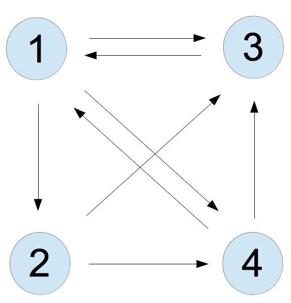
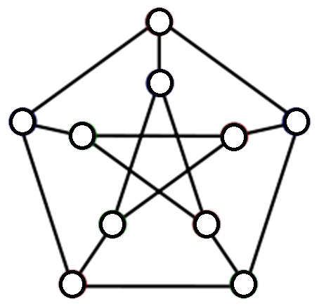

网络研究是数据科学不可或缺的一部分。网络科学（也就是图论）为形形色色的网络提供了统一的语言：社会关系网、蛋白质相互作用网络、基因调控网络乃至互联网，都可以放在同一套框架下研究。本章先介绍图论的基本概念，继而讨论聚类问题，也就是如何在数据或网络中识别彼此相似的数据点（顶点）。

## PageRank

在正式建立图论语言之前，我们先来看著名的 PageRank 算法。它是网络搜索算法，尤其是 Google 搜索背后的一个核心组成部分[^pagerank-pun]。PageRank 的目标，是为网页的重要性赋予一个定量分数，使搜索引擎能够据此排列网页，把更重要的结果优先呈现给用户。

[^pagerank-pun]: 原文在这里用了一个双关：PageRank 是搜索引擎的一个 *principal component*，既可理解为“主要组成部分”，也让人联想到主成分分析中的“主成分”。

Google 一类的搜索引擎大体需要完成三个步骤[^personalization]：

1. 抓取互联网，尽可能找出所有可访问的网页；
2. 为第一步得到的网页建立索引，以便高效检索相关关键词或短语；
3. 评估数据库中每个网页的重要性。这样，当搜索系统找出含有目标信息的网页集合后，便能把其中更重要的网页排在前面。

[^personalization]: 现代搜索引擎还有一个重要组成部分：个性化。本节不讨论这一问题。

这里我们专注于第三步，并主要沿用 @Bryan2006 的推导思路。我们希望为每个网页定义一个非负的“重要性分数”。赋分的关键思想是：一个网页的分数，应由其他网页指向它的链接来决定。套用一句通俗的话，“一个人的重要，不在于他认识多少人，而在于有多少人认识他。”

设我们关心的网络中共有 $n$ 个网页，以整数 $k$ 编号，其中 $1\le k\le n$。@fig-web 给出了一个简单例子：从网页 $k$ 指向网页 $j$ 的箭头，表示 $k$ 中含有通往 $j$ 的链接。这样的网络称为**有向图**。所有指向某个网页的链接，称为该网页的**反向链接**（backlink）。记 $x_k$ 为网页 $k$ 的重要性分数；$x_k\ge 0$，而 $x_j>x_k$ 表示网页 $j$ 比网页 $k$ 更重要。

{#fig-web width=40% fig-align="center"}

最简单的做法，是直接把网页 $k$ 的反向链接数作为 $x_k$。在 @fig-web 中，
$x_1=2,x_2=1,x_3=3,x_4=2$。于是网页 3 最重要，网页 1 和 4 并列第二，网页 2 最不重要。换句话说，每一条指向网页 $k$ 的链接，都算作对网页 $k$ 的一票。

但这种办法忽略了排名机制应有的一项关键性质：来自重要网页的一条链接，理应比来自无足轻重网页的一条链接更有分量。在 @fig-web 中，网页 1 和网页 4 都有两条反向链接，而且它们彼此相连；但网页 1 的另一条反向链接来自看起来颇重要的网页 3，网页 4 的另一条却来自相对不重要的网页 2。因此，一个更合理的算法或许应当把网页 1 排在网页 4 之前。

第一次尝试可以这样做：把所有链接到网页 $j$ 的网页分数相加，作为 $j$ 的分数。在这个玩具例子里，网页 1 应满足 $x_1=x_3+x_4$。然而，$x_3$ 和 $x_4$ 自身又依赖于 $x_1$，这似乎成了一个循环定义。恰恰是这种自指结构，把问题引向了特征向量。

此外，我们不希望一个网页仅仅因为大量添加出链，就凭空获得更大的影响力。合理的办法是：出链越多，每条链接分得的权重越小。若网页 $j$ 有 $n_j$ 条出链，其中一条指向网页 $k$，那么它对 $k$ 的贡献应为 $x_j/n_j$，而不是 $x_j$。这样，每个网页总共只有一票；这张票先由该网页自身的分数加权，再平均分给它的所有出链。

形式化地，令 $L_k\subset\{1,2,\ldots,n\}$ 表示所有链接到网页 $k$ 的网页集合，即 $k$ 的反向链接集合。我们要求每个 $k$ 都满足

$$
x_k=\sum_{j\in L_k}\frac{x_j}{n_j},
$$

其中 $n_j$ 是网页 $j$ 的出链数。

把这一规则用于 @fig-web：网页 3 和 4 都链接到网页 1，而网页 3 只有一条出链，网页 4 有两条，因此
$x_1=x_3/1+x_4/2$。同理，

$$
x_2=x_1/3,\qquad
x_3=x_1/3+x_2/2+x_4/2,\qquad
x_4=x_1/3+x_2/2.
$$

这些条件可写成线性方程组 $Ax=x$，其中 $x=[x_1,x_2,x_3,x_4]^T$，且

$$
A=
\begin{bmatrix}
0 & 0 & 1 & \frac12\\
\frac13 & 0 & 0 & 0\\
\frac13 & \frac12 & 0 & \frac12\\
\frac13 & \frac12 & 0 & 0
\end{bmatrix}.
$$

于是，排名问题变成了一个特征值问题：寻找矩阵 $A$ 对应于特征值 $1$ 的特征向量 $x$。注意，$A$ 是一个**列随机矩阵**：它是方阵，所有元素非负，并且每一列之和均为 $1$。

若把互联网浏览过程看作随机游走，并假设每条链接被点击的概率相同，那么 $A_{ij}$ 就是随机游走者从网页 $j$ 转移到网页 $i$ 的概率。在后面的扩散映射一章中，我们将利用无向图上的随机游走，把图的顶点嵌入欧氏空间。那里主要使用 $M=A^T$，使 $M_{ij}$ 表示从 $i$ 走到 $j$ 的概率。随机矩阵广泛出现于 Markov 链、经济学模型和运筹学之中；更多细节可参见 @HJ90。这里 $1$ 是 $A$ 的特征值绝非偶然，而是所有随机矩阵共有的性质。

::: {.proposition #prop-columnstochastichaseig1}
**命题。** 列随机矩阵 $A$ 必有特征值 $1$，而且 $1$ 也是其模最大的特征值。
:::

::: {.proof}
**证明。** 设 $A$ 是 $n\times n$ 的列随机矩阵。首先，$A$ 与 $A^T$ 的特征值相同，尽管二者的特征向量通常不同。令
$\mathbf 1=[1,1,\ldots,1]^T$。因为 $A$ 的每一列之和都是 $1$，所以

$$
A^T\mathbf 1=\mathbf 1.
$$

因此，$\mathbf 1$ 是 $A^T$ 对应于特征值 $1$ 的特征向量（但它未必是 $A$ 的特征向量），从而 $1$ 也是 $A$ 的特征值。

下面证明不存在模大于 $1$ 的特征值。对 $A^T$ 应用 Gershgorin 圆盘定理 [@HJ90]。考察 $A^T$ 的第 $k$ 行，记其对角元为 $a_{kk}$。由于 $a_{ki}\ge0$，对应圆盘的半径为

$$
\sum_{i\ne k}|a_{ki}|=\sum_{i\ne k}a_{ki}=1-a_{kk}.
$$

圆心 $a_{kk}\in[0,1]$，半径为 $1-a_{kk}$，所以该圆盘的边界经过 $1$，并且整个圆盘都包含在单位圆盘内。每一个 Gershgorin 圆盘都如此。全部特征值都落在这些圆盘的并集中，故任一特征值 $\lambda_i$ 都满足 $|\lambda_i|\le1$。证毕。
:::

回到示例，$A$ 对应于特征值 $1$ 的特征向量可归一化为

$$
x=[x_1,x_2,x_3,x_4]^T,qquad
x_1=\frac{12}{31},\quad x_2=\frac4{31},\quad
x_3=\frac9{31},\quad x_4=\frac6{31}.
$$

结果多少有些出人意料：最重要的不再是网页 3，而是网页 1。原因在于，网页 3 虽有三个网页指向它，本身看起来相当重要，但它只有一条出链，因而全部“投票权”都集中到了网页 1 上。

真实世界里，矩阵 $A$ 的规模很容易达到十亿乘十亿。幸运的是，我们无需计算 $A$ 的所有特征向量，只需要与特征值 $1$ 对应的那个；而我们已经知道，$1$ 又是模最大的特征值。因此可以用标准的**幂迭代**高效求出 $x$，并且还能利用 $A$ 的稀疏性，也就是其中绝大多数元素为零这一事实。

实际的 PageRank 还会作一些修正[^teleportation]，但核心思想正如上面的推导。

[^teleportation]: 一项修正，是在每一对网页之间加入权重极小的边，对应随机游走者（或网络爬虫）以极低概率发生一次“随机传送”。这样做的一个好处，是让网络成为不可约的。若有向图中存在顶点 $u,v$，使得从 $u$ 到 $v$ 不存在有向路径，则称该图可约；不可约就是不存在这种阻隔。

用特征向量做排名的思想，可追溯到 19 世纪末 Edmund Landau 对国际象棋赛事排名的研究。那是 Landau 十八岁时发表的第一篇数学论文 [@Landau1895Turnierresultate]，后来他又作了进一步研究 [@Landau1914Preisverteilung]。这段颇有趣的历史可参见 @sinn2022landau。

## 图与聚类

现在建立无向图的形式化语言[^undirected]；它将是后文的主要研究对象之一。一个图 $G=(V,E)$ 由顶点集
$V=\{v_1,\ldots,v_n\}$ 和边集 $E\subseteq {V\choose 2}$ 构成。若顶点 $v_i$ 与 $v_j$ 相连，就有 $(i,j)\in E$。@fig-petersen 展示了图论中最受偏爱的例子之一：Petersen 图[^petersen-counterexample]。

[^undirected]: 上一节使用的是有向图，其中边（链接）的方向具有实际意义。下面则专注于无向图：一条边只表示连接关系，不再区分方向。
[^petersen-counterexample]: Petersen 图经常被图论学者用来构造反例。

{#fig-petersen width=40% fig-align="center"}

先回顾几个后面会反复用到的概念。

- 若任意一对顶点之间都存在一条路径，则称图是**连通的**。图的连通分量数，等于把顶点划分成若干连通子图时所需的最少子图数。Petersen 图是连通的，所以它只有一个连通分量。

- 图 $G$ 的一个**团**（clique），是顶点的一个子集 $S$，使其诱导子图为完全图。换言之，$S$ 中任意两个顶点之间都有边。$G$ 的**团数** $c(G)$ 是其最大团的大小。Petersen 图的团数为 $2$。

- 图 $G$ 的一个**独立集**，是顶点的一个子集 $S$，其中任意两个顶点之间都没有边。等价地说，它是补图 $G^c\defeq(V,E^c)$ 中的一个团。$G$ 的独立数就是补图 $G^c$ 的团数。Petersen 图的独立数为 $4$。

邻接矩阵为图提供了一种特别实用的表示。设图 $G=(V,E)$ 有 $n$ 个顶点，即 $|V|=n$。定义其邻接矩阵 $A\in\mathbb R^{n\times n}$ 为对称矩阵

$$
A_{ij}=
\begin{cases}
1,&(i,j)\in E,\\
0,&\text{其他情形}.
\end{cases}
\label{adjacencymatrix}
$$

有时我们还会考虑加权图 $G=(V,E,W)$：每条边 $(i,j)$ 带有权重 $w_{ij}$，并满足非负性 $w_{ij}\ge0$ 与对称性 $w_{ij}=w_{ji}$。

后续许多内容都围绕图展开。下一章将讨论网络数据的可视化与降维，以及如何把图嵌入欧氏空间；社群检测一章则会介绍并研究重要的随机图模型。本章余下部分聚焦于谱图论、聚类与图上的度量。

聚类是机器学习的核心任务之一。给定一组数据点，或图中的一组顶点，我们希望把它们划分成若干簇，使同一簇内的数据彼此相似。“相似”的具体含义取决于场景：在欧氏空间中，它可能意味着点与点之间距离很小；在图上，则可能意味着顶点之间连接紧密。我们先看欧氏空间中的点如何聚类，随后再回到图。

{#fig-clustering-00 width=80% fig-align="center"}

## $k$-均值聚类

$k$-均值是最常用的聚类方法之一。给定数据点 $x_1,\ldots,x_n\in\mathbb R^p$，它把这些点划分为
$S_1\cup\cdots\cup S_k$，并为每一簇选择中心
$\mu_1,\ldots,\mu_k\in\mathbb R^p$，使下式取得最小值：

$$
\min_{\substack{S_1,\ldots,S_k\text{ 构成划分}\\
\mu_1,\ldots,\mu_k}}
\sum_{l=1}^k\sum_{i\in S_l}\|x_i-\mu_l\|^2.
$$ {#eq-3-kmeans-obj}

一旦划分固定，第 $l$ 簇的最优中心就是该簇中所有点的均值：

$$
\mu_l=\frac1{|S_l|}\sum_{i\in S_l}x_i.
$$

Lloyd 算法 [@Lloyd:kmeans] 有时也直接被称为 $k$-均值算法。它交替执行以下两个步骤：

1. 固定中心 $\mu_1,\ldots,\mu_k$，把每个点 $x_i$ 分给中心离它最近的簇 $S_l$，即
   $$
   l=\arg\min_{l=1,\ldots,k}\|x_i-\mu_l\|.
   $$
2. 固定划分，用
   $$
   \mu_l=\frac1{|S_l|}\sum_{i\in S_l}x_i
   $$
   更新各簇中心。

遗憾的是，Lloyd 算法并不保证收敛到 @eq-3-kmeans-obj 的全局最优解；它常常停在该目标函数的局部最优点。后面我们会讨论聚类问题的凸松弛，它提供了另一条算法路径。不过，优化 @eq-3-kmeans-obj 本身是 $NP$-困难的。因此，在通常认为成立的 $P\ne NP$ 假设下，不存在一个能在所有最坏情形中奏效的多项式时间算法；相关讨论还可参见最大割近似一章。

尽管 $k$-均值十分流行，它仍有几项固有局限：

- 必须事先指定簇的个数。常见的补救办法，是对若干不同的 $k$ 分别运行算法，再比较结果。
- @eq-3-kmeans-obj 的写法要求数据点位于欧氏空间。但在许多问题中，我们只有数据点之间的相似度或距离，并没有它们在 $\mathbb R^p$ 中的坐标。把目标函数完全改写成距离的形式，可以绕开这一限制。
- 这一优化问题在计算上很困难，实际算法可能只能得到次优解。
- $k$-均值产生的簇总是凸的。因此，面对 @fig-bad-kmeans 那样的非凸簇结构时，它很可能无法得到符合直觉的划分。

{#fig-bad-kmeans width=70% fig-align="center"}

## 谱聚类

要克服 @fig-bad-kmeans 所展示的问题，一条自然思路是：先把数据变成图，再对图做聚类。给定数据点，可以用相似性核 $K_\epsilon$ 构造加权图 $G=(V,E,W)$。例如取

$$
K_\epsilon(u)=\exp\!\left(-\frac{u^2}{2\epsilon}\right),
$$

把每个数据点对应为一个顶点，并令任意一对顶点之间的边权为

$$
w_{ij}=K_\epsilon\!\left(\|x_i-x_j\|\right).
$$

另一种常用办法是构造近邻图：当两个数据点互为近邻时，就在对应顶点之间连边。值得强调的是，这一过程只需要数据点之间的距离或相似度，并不要求数据已经嵌入某个欧氏空间。基于这一动机，也考虑到网络数据无处不在，下面转向图的顶点聚类问题。

### 归一化割 {.unnumbered}

给定图 $G=(V,E,W)$，我们的目标是把它划分成若干簇，使尽可能多的边留在簇内，同时让跨越不同簇的边尽可能少。本节主要研究两个簇的情形，并在本章末尾简要讨论多簇推广。衡量顶点划分 $(S,S^c)$ 的一个自然指标是割：

$$
\cut(S)=\sum_{i\in S}\sum_{j\in S^c}w_{ij}.
$$

用 $y\in\{\pm1\}^n$ 表示这一划分：若 $i\in S$，令 $y_i=1$；否则令 $y_i=-1$。这样，割可以写成图拉普拉斯算子的二次型。

::: {.definition #def-graph-laplacian}
**定义（图拉普拉斯算子与度矩阵）。** 设 $G=(V,E,W)$ 是一张图，$W$ 是其权重矩阵；若图不带权，$W$ 就是邻接矩阵。**度矩阵** $D$ 是对角矩阵，其对角元为

$$
D_{ii}=\deg(i)=\sum_jw_{ij}.
\label{degreematrix}
$$

$G$ 的**图拉普拉斯算子**定义为

$$
L_G=D-W.
\label{graphlalpacian}
$$

等价地，

$$
L_G\defeq\sum_{i<j}w_{ij}(e_i-e_j)(e_i-e_j)^T,
$$

其中 $e_i$ 是第 $i$ 个标准基向量，即 $(e_i)_j=\delta_{ij}$。
:::

因此，$L_G$ 的元素可写成

$$
(L_G)_{ij}=
\begin{cases}
-w_{ij},&i\ne j,\\
\deg(i),&i=j.
\end{cases}
$$

若 $S\subset V$，并按上面的规则用 $y\in\{\pm1\}^n$ 表示 $S$，则不难看出

$$
\cut(S)=\frac14\sum_{i<j}w_{ij}(y_i-y_j)^2.
$$

下面的命题说明

$$
\cut(S)=\frac14y^TL_Gy.
$$ {#eq-cut-laplacian}

::: {.proposition #prop-cut-laplacian}
**命题。** 设 $G=(V,E,W)$，$L_G$ 是其图拉普拉斯算子。对任意 $x\in\mathbb R^n$，

$$
x^TL_Gx=\sum_{i<j}w_{ij}(x_i-x_j)^2.
$$
:::

::: {.proof}
**证明。**

$$
\begin{aligned}
\sum_{i<j}w_{ij}(x_i-x_j)^2
&=\sum_{i<j}w_{ij}\bigl[x^T(e_i-e_j)\bigr]
\bigl[(e_i-e_j)^Tx\bigr]\\
&=\sum_{i<j}w_{ij}x^T(e_i-e_j)(e_i-e_j)^Tx\\
&=x^T\left[\sum_{i<j}w_{ij}(e_i-e_j)(e_i-e_j)^T\right]x.
\end{aligned}
$$

证毕。
:::

这个命题立即说明，图拉普拉斯算子 $L_G$ 是半正定矩阵：在边权非负 $w_{ij}\ge0$ 时，任意 $x$ 都满足 $x^TL_Gx\ge0$。从 @def-graph-laplacian 也可以直接看出这一点，因为 $L_G$ 是若干秩一半正定矩阵的非负加权和。

虽然 $\cut(S)$ 能衡量一个划分切断了多少连接，但它有一个致命缺陷：取 $S=\varnothing$ 时，$\cut(\varnothing)=0$，因而空集总能达到最小值；这样的“划分”当然毫无意义。即使要求划分非平凡，问题依旧存在，因为目标函数仍会偏爱极不平衡的划分，例如只含一个顶点的 $S$。所以还需要一种机制，促使划分的两侧都具有足够规模。

::: {.remark #rem-balanced-lg}
**评注。** 最直接的办法，是强制划分完全平衡，即 $|S|=|S^c|$；这里假设顶点数 $n=|V|$ 为偶数。仍以 $y\in\{\pm1\}^n$ 表示划分，则平衡条件等价于 $\sum_{i=1}^ny_i=0$。于是最小平衡割可以写成

$$
\min_{\substack{S\subset V\\|S|=|S^c|}}\cut(S)
=\frac14\min_{\substack{y\in\{-1,1\}^n\\\mathbf1^Ty=0}}
y^TL_Gy.
$$ {#eq-minbis-andspectrum}

这个表达式已经显露出聚类与 $L_G$ 谱性质之间的联系，下面会把这种联系说得更精确。[^minbis-spectrum]
:::

[^minbis-spectrum]: 细心的读者可能注意到，超立方体中的每个点都有 $\ell_2$ 范数 $\sqrt n$，因此 @eq-minbis-andspectrum 直接推出
$\mathrm{minbis}(G)\ge\frac n4\lambda_2(L_G)$，其中 $\mathrm{minbis}(G)$ 表示 $G$ 的最小二分割，也称最小平衡割。后面将建立更有用的谱不等式。

要求两侧大小完全相同，在许多问题中又过于苛刻。我们真正需要的，只是 $S$ 和 $S^c$ 都不要太小，而不必都恰好包含 $|V|/2$ 个顶点。围绕 $\cut(S)$ 可以构造多种满足这一要求的指标，一个重要例子就是 Cheeger 割。

::: {.definition}
**定义（Cheeger 割）。** 给定图及其顶点划分 $(S,S^c)$，$S$ 的 **Cheeger 割**（也称电导率或扩张率）定义为

$$
h(S)=\frac{\cut(S)}{\min\{\vol(S),\vol(S^c)\}},
$$

其中 $\vol(S)=\sum_{i\in S}\deg(i)$。图 $G$ 的 **Cheeger 常数**为

$$
h_G=\min_{S\subset V}h(S).
$$
:::

与之相近的指标是**归一化割**：

$$
\Ncut(S)=\frac{\cut(S)}{\vol(S)}+
\frac{\cut(S^c)}{\vol(S^c)}.
$$

$\Ncut(S)$ 与 $h(S)$ 紧密相关，事实上不难验证

$$
h(S)\le\Ncut(S)\le2h(S).
$$

### 作为谱松弛的归一化割

下面说明，正如 @rem-balanced-lg 中的平衡割一样，$\Ncut$ 也能写成涉及图拉普拉斯算子 $L_G$ 的二次型最小化问题。

回忆平衡割的取值可写为

$$
\frac14\min_{\substack{y\in\{-1,1\}^n\\\mathbf1^Ty=0}}y^TL_Gy.
$$

放松“完全平衡”条件的一种直观办法，是让标签向量 $y$ 取两个实数值 $a,b$，不再局限于 $\pm1$：例如 $i\in S$ 时令 $y_i=a$，$i\notin S$ 时令 $y_i=b$。然后利用集合的体积来表达一种较弱的平衡要求：

$$
a\vol(S)+b\vol(S^c)=0,
$$ {#eq-1TDy0}

其中

$$
\vol(S)=\sum_{i\in S}\deg(i).
$$ {#eq-vol}

换成矩阵记号，@eq-1TDy0 就是 $\mathbf1^TDy=0$。此外还要固定 $a,b$ 的尺度：

$$
a^2\vol(S)+b^2\vol(S^c)=1,
$$

也就是 $y^TDy=1$。这提示我们考虑

$$
\min_{\substack{y\in\{a,b\}^n\\
\mathbf1^TDy=0,\ y^TDy=1}}y^TL_Gy.
$$

下面将看到，这恰好对应于 $\Ncut$。

::: {.proposition}
**命题。** 若 $a,b$ 满足

$$
a\vol(S)+b\vol(S^c)=0,
\qquad
a^2\vol(S)+b^2\vol(S^c)=1,
$$

则必有

$$
a=\left(\frac{\vol(S^c)}{\vol(S)\vol(G)}\right)^{1/2},
\qquad
b=-\left(\frac{\vol(S)}{\vol(S^c)\vol(G)}\right)^{1/2}.
$$

相应地，

$$
y_i=
\begin{cases}
\left(\dfrac{\vol(S^c)}{\vol(S)\vol(G)}\right)^{1/2},&i\in S,\\[6pt]
-\left(\dfrac{\vol(S)}{\vol(S^c)\vol(G)}\right)^{1/2},&i\in S^c.
\end{cases}
$$

这里的 $\vol$ 定义见 @eq-vol。
:::

::: {.proof}
**证明。** 只需注意 $\vol(S)+\vol(S^c)=\vol(G)$，再作直接的代数化简即可。证毕。
:::

::: {.proposition}
**命题。** 对上面给出的 $y$，有

$$
\Ncut(S)=y^TL_Gy.
$$
:::

::: {.proof}
**证明。**

$$
\begin{aligned}
y^TL_Gy
&=\frac12\sum_{i,j}w_{ij}(y_i-y_j)^2\\
&=\sum_{i\in S}\sum_{j\in S^c}w_{ij}(y_i-y_j)^2\\
&=\sum_{i\in S}\sum_{j\in S^c}w_{ij}
\left[
\left(\frac{\vol(S^c)}{\vol(S)\vol(G)}\right)^{1/2}
+\left(\frac{\vol(S)}{\vol(S^c)\vol(G)}\right)^{1/2}
\right]^2\\
&=\sum_{i\in S}\sum_{j\in S^c}w_{ij}\frac1{\vol(G)}
\left[
\frac{\vol(S^c)}{\vol(S)}+
\frac{\vol(S)}{\vol(S^c)}+2
\right]\\
&=\sum_{i\in S}\sum_{j\in S^c}w_{ij}\frac1{\vol(G)}
\left[
\frac{\vol(S^c)}{\vol(S)}+
\frac{\vol(S)}{\vol(S^c)}+
\frac{\vol(S)}{\vol(S)}+
\frac{\vol(S^c)}{\vol(S^c)}
\right]\\
&=\sum_{i\in S}\sum_{j\in S^c}w_{ij}
\left[\frac1{\vol(S)}+\frac1{\vol(S^c)}\right]\\
&=\cut(S)\left[\frac1{\vol(S)}+\frac1{\vol(S^c)}\right]\\
&=\Ncut(S).
\end{aligned}
$$

证毕。
:::

因此，寻找最小归一化割等价于求解

$$
\begin{array}{rl}
\min & y^TL_Gy\\
\text{约束为} & y\in\{a,b\}^n\text{，其中 }a,b\text{ 为某两个实数},\\
&y^TDy=1,\\
&y^TD\mathbf1=0.
\end{array}
$$ {#eq-3-Ncut-norelax}

一般而言，求解 @eq-3-Ncut-norelax 是 $NP$-困难的。于是我们删去“$y$ 只能取两个值”这一约束，得到相近但可解的问题：

$$
\begin{array}{rl}
\min & y^TL_Gy\\
\text{约束为} & y\in\mathbb R^n,\\
&y^TDy=1,\\
&y^TD\mathbf1=0.
\end{array}
$$ {#eq-3-Ncut-relaxed}

得到 @eq-3-Ncut-relaxed 的解后，可以把它**舍入**为一个离散划分：选定阈值 $\tau$，令

$$
S=\{i\in V:y_i\le\tau\}.
$$

下面说明 @eq-3-Ncut-relaxed 实际上是一个特征向量问题；也正因为如此，我们称它为**谱松弛**。

令 $z=D^{1/2}y$，并定义**归一化图拉普拉斯算子**

$$
\mathcal L_G=D^{-1/2}L_GD^{-1/2}.
$$ {#eq-LLL-G}

那么 @eq-3-Ncut-relaxed 等价于

$$
\begin{array}{rl}
\min & z^T\mathcal L_Gz\\
\text{约束为} & z\in\mathbb R^n,\\
&\|z\|^2=1,\\
&(D^{1/2}\mathbf1)^Tz=0.
\end{array}
$$ {#eq-3-Ncut-relaxed-LLL}

注意 $\mathcal L_G=I-D^{-1/2}WD^{-1/2}$。把它的特征值按升序排列：

$$
0=\lambda_1(\mathcal L_G)\le\lambda_2(\mathcal L_G)
\le\cdots\le\lambda_n(\mathcal L_G).
$$

最小特征值对应的特征向量是 $D^{1/2}\mathbf1$。根据特征值的变分刻画，@eq-3-Ncut-relaxed-LLL 的最优值就是 $\lambda_2(\mathcal L_G)$，极小点则是 $\mathcal L_G$ 的第二小特征向量，记为 $v_2$。等价地，$v_2$ 也是 $D^{-1/2}WD^{-1/2}$ 的第二大特征向量。因而 @eq-3-Ncut-relaxed 中的最优 $y$ 为

$$
\varphi_2=D^{-1/2}v_2.
$$

这便导出通常所说的谱聚类算法。

::: {.algorithm #alg-spectral-clustering}
**算法：谱聚类（两个簇）**

给定图 $G=(V,E,W)$：

1. 计算归一化图拉普拉斯算子 $\mathcal L_G$ 的第二小特征值所对应的特征向量 $v_2$，其中 $\mathcal L_G$ 定义见 @eq-LLL-G。
2. 令 $\varphi_2=D^{-1/2}v_2$。
3. 选择阈值 $\tau$。可以尝试所有不同的候选阈值，也可以对 $\varphi_2$ 的分量运行 $k=2$ 的 $k$-均值。
4. 输出
   $$
   S=\{i\in V:\varphi_2(i)\le\tau\}.
   $$
:::

## Cheeger 不等式

松弛问题 @eq-3-Ncut-relaxed 是从 @eq-3-Ncut-norelax 中删去一项约束得到的，因此立即有

$$
\lambda_2(\mathcal L_G)\le\min_{S\subset V}\Ncut(S),
$$

从而

$$
\frac12\lambda_2(\mathcal L_G)\le h_G.
$$

下面给出 @alg-spectral-clustering 的性能保证。

::: {.lemma #lem-needed-for-cheeger}
**引理。** 存在一个阈值 $\tau$，使算法产生的划分 $S$ 满足

$$
h(S)\le\sqrt{2\lambda_2(\mathcal L_G)}.
$$
:::

特别地，结合上面的下界可得

$$
h(S)\le\sqrt{4h_G}.
$$

这说明谱聚类算法与最优解相比，至多损失一个平方根因子。该引理也直接推出著名的 Cheeger 不等式。

::: {.theorem #thm-cheeger-inequality}
**定理（Cheeger 不等式）。** 沿用上面的定义，有

$$
\frac12\lambda_2(\mathcal L_G)
\le h_G\le
\sqrt{2\lambda_2(\mathcal L_G)}.
$$
:::

Cheeger 最早在 1970 年为流形建立了这一不等式 [@JCheeger_1970]；图上的版本则由 Noga Alon 和 Vitaly Milman 在 20 世纪 80 年代中期得到 [@NAlon_1986; @NAlon_VMilman_1986]。对闭流形 $M$，Cheeger 不等式控制的是将 $M$ 分成两部分的超曲面的面积。

::: {.theorem}
**定理（Cheeger 不等式，Cheeger 1970）。** 设 $M$ 的 Cheeger 等周常数为

$$
h_M=\inf_E\frac{\operatorname{area}(E)}
{\min\{\operatorname{vol}(A),\operatorname{vol}(B)\}},
$$

其中 $E$ 是 $M$ 中一个光滑的 $(n-1)$ 维子流形，并将 $M$ 分成互不相交的两个子流形 $A,B$。再设 $\lambda_M$ 是 $M$ 上 Laplace 算子（即 Laplace--Beltrami 算子）的最小正特征值，则

$$
\lambda_M\ge\frac{h_M^2}{4}.
$$
:::

### 用 $\lambda_2(\mathcal L_G)$ 控制图的直径

在证明图上的 Cheeger 不等式之前，先讨论另一个特征值不等式。它能直观展现归一化图拉普拉斯算子的第二特征值与图的几何之间有何联系；另见 @FanChung_SpectralGraphTheory。

给每对顶点赋予一个与边权成反比的代价：

$$
c(u,v)=
\begin{cases}
\dfrac1{w_{uv}},&(u,v)\in E,\\[4pt]
+\infty,&(u,v)\notin E.
\end{cases}
$$

连接 $u,v$ 的一条长度为 $k$ 的**路径**写成

$$
P=(u=v_1,v_2,\ldots,v_k=v),
$$

其代价为

$$
c(P)=\sum_{i=1}^{k-1}c(v_i,v_{i+1}).
$$

$u,v$ 之间的**测地距离**或**最短路径距离**，是所有连接二者的路径代价的最小值：

$$
d_g(u,v)=\min\{c(P):P(1)=u,\ P(k)=v,\ |P|=k\}.
$$

图 $G$ 的**直径**则是最大的测地距离：

$$
\operatorname{diam}(G)=\max_{u,v}d_g(u,v).
$$

对归一化图拉普拉斯算子 $\mathcal L_G=D^{-1/2}L_GD^{-1/2}$ 的第二小特征值，有

$$
\operatorname{diam}(G)\ge
\frac1{\operatorname{vol}(G)\lambda_2(\mathcal L_G)}.
$$ {#eq-diam-lambda}

也就是说，第二特征值很小，便迫使图的直径很大。我们已经知道，$\lambda_2(\mathcal L_G)=0$ 意味着图不连通，因而直径为无穷；@eq-diam-lambda 给出了这一现象的定量版本。

::: {.proof}
**证明 @eq-diam-lambda。** 取达到 Rayleigh 商刻画的特征函数 $f$：

$$
\lambda_2=inf_{f^TD\mathbf1=0}
\frac{\frac12\sum_{u,v}w_{uv}(f(v)-f(u))^2}
{\sum_vf(v)^2\deg(v)}.
$$

选择 $v_0,u_0$，使

$$
f(v_0)=\max_v|f(v)|,\qquad f(u_0)<0.
$$

由于 $\sum_vf(v)\deg(v)=0$，这样的顶点必然存在。设
$P=(u_0=v_1,v_2,\ldots,v_k=v_0)$ 是从 $u_0$ 到 $v_0$ 的最短路径，则

$$
\begin{aligned}
\lambda_2
&=\frac{\frac12\sum_{u,v}w_{uv}(f(v)-f(u))^2}
{\sum_vf(v)^2\deg(v)}\\
&\ge
\frac{\sum_{i=1}^{k-1}w_{v_i,v_{i+1}}
(f(v_i)-f(v_{i+1}))^2}
{f(v_0)^2\sum_vd_v}\\
&\ge
\frac{\sum_{i=1}^{k-1}w_{v_i,v_{i+1}}
(f(v_i)-f(v_{i+1}))^2}
{f(v_0)^2\operatorname{vol}(G)}
\frac{d_g(u_0,v_0)}{\operatorname{diam}(G)}\\
&=
\frac{\sum_{i=1}^{k-1}w_{v_i,v_{i+1}}
(f(v_i)-f(v_{i+1}))^2}
{f(v_0)^2\operatorname{vol}(G)}
\frac{\sum_{i=1}^{k-1}w_{v_i,v_{i+1}}^{-1}}
{\operatorname{diam}(G)}\\
&\ge
\frac{\left(\sum_{i=1}^{k-1}[f(v_i)-f(v_{i+1})]\right)^2}
{f(v_0)^2\operatorname{vol}(G)\operatorname{diam}(G)}\\
&=\frac{(f(v_0)-f(u_0))^2}
{f(v_0)^2\operatorname{vol}(G)\operatorname{diam}(G)}\\
&\ge\frac1{\operatorname{vol}(G)\operatorname{diam}(G)}.
\end{aligned}
$$

倒数第二步是在 $k-1$ 维空间中应用 Cauchy--Schwarz 不等式，并用到了路径上各边权为正。整理即得结论。证毕。
:::

### Cheeger 不等式的证明

Cheeger 不等式的上界，也就是 @lem-needed-for-cheeger，要比下界更有内容，证明也更困难，常被称作 Cheeger 不等式的“困难部分”。这一不等式有多种证明；@Chung_CheegersIneq 一文就给出了四种。下面的证明把 @trevisan:blog:cheegerproof 中的思路推广到加权图。

::: {.proof}
**证明 @lem-needed-for-cheeger。** 给定满足

$$
\mathcal R(y)\defeq\frac{y^TL_Gy}{y^TDy}\le\delta,
\qquad y^TD\mathbf1=0
$$

的 $y\in\mathbb R^n$，我们将证明：存在一种对 $y$ 的舍入，也就是存在阈值 $\tau$，使相应划分

$$
S=\{i\in V:y_i\le\tau\}
$$

满足 $h(S)\le\sqrt{2\delta}$。由于 $y=\varphi_2$ 满足这些条件，且 $\delta=\lambda_2(\mathcal L_G)$，引理随即成立。

我们随机选择阈值，再用概率方法证明至少有一个阈值可行。不妨重新编号顶点，使 $y_1\le\cdots\le y_n$。缩放 $y$ 不改变 $\mathcal R(y)$；而在 $y^TD\mathbf1=0$ 时，给 $y$ 加上 $c\mathbf1$ 只会减小 Rayleigh 商：分子不变，分母则变为

$$
(y+c\mathbf1)^TD(y+c\mathbf1)
=y^TDy+c^2\mathbf1^TD\mathbf1\ge y^TDy.
$$

因此，经平移和缩放可以从 $y$ 构造向量 $x$，使

$$
x_1\le\cdots\le x_n,qquad x_m=0,qquad x_1^2+x_n^2=1,
$$

并且

$$
\frac{x^TL_Gx}{x^TDx}\le\delta.
$$

这里 $m$ 取为满足

$$
\vol(\{1,\ldots,m-1\})\le\vol(\{m,\ldots,n\}),
$$

但

$$
\vol(\{1,\ldots,m\})>\vol(\{m+1,\ldots,n\})
$$

的指标。

现在随机构造 $S=\{i\in V:x_i\le\tau\}$。阈值 $\tau\in[x_1,x_n]$ 按密度 $2|\tau|$ 抽取，即对
$x_1\le a\le b\le x_n$，

$$
\mathbb P\{\tau\in[a,b]\}=\int_a^b2|\tau|\,d\tau.
$$

由 $x_1^2+x_n^2=1$ 可知这确实是概率分布，并且

$$
\mathbb P\{\tau\in[a,b]\}=
\begin{cases}
|b^2-a^2|,&a,b\text{ 同号},\\
a^2+b^2,&a,b\text{ 异号}.
\end{cases}
$$

先估计 $\mathbb E\cut(S)$：

$$
\begin{aligned}
\mathbb E\cut(S)
&=\mathbb E\frac12\sum_{i,j\in V}w_{ij}
\mathbf1_{\{(S,S^c)\text{ 切断边 }(i,j)\}}\\
&=\frac12\sum_{i,j\in V}w_{ij}
\mathbb P\{(S,S^c)\text{ 切断边 }(i,j)\}.
\end{aligned}
$$

若 $x_i,x_j$ 同号，边 $(i,j)$ 被切断的概率是 $|x_i^2-x_j^2|$；若异号，则是 $x_i^2+x_j^2$。两种情形都不超过
$|x_i-x_j|(|x_i|+|x_j|)$。因此，由 Cauchy--Schwarz 不等式，

$$
\begin{aligned}
\mathbb E\cut(S)
&\le\frac12\sum_{i,j}w_{ij}|x_i-x_j|(|x_i|+|x_j|)\\
&\le\frac12
\sqrt{\sum_{i,j}w_{ij}(x_i-x_j)^2}
\sqrt{\sum_{i,j}w_{ij}(|x_i|+|x_j|)^2}.
\end{aligned}
$$

由 $x$ 的构造，

$$
\sum_{i,j}w_{ij}(x_i-x_j)^2
=2x^TL_Gx\le2\delta x^TDx.
$$

另一方面，

$$
\begin{aligned}
\sum_{i,j}w_{ij}(|x_i|+|x_j|)^2
&\le\sum_{i,j}w_{ij}(2x_i^2+2x_j^2)\\
&=4x^TDx.
\end{aligned}
$$

故

$$
\mathbb E\cut(S)
\le\frac12\sqrt{2\delta x^TDx}\sqrt{4x^TDx}
=\sqrt{2\delta}\,x^TDx.
$$

再看分母：

$$
\mathbb E\min\{\vol(S),\vol(S^c)\}
=\sum_{i=1}^n\deg(i)
\mathbb P\{x_i\text{ 落在体积较小的一侧}\}.
$$

若两侧体积相等，就约定含较小编号顶点的一侧为“较小”一侧。按 $m$ 的定义，顶点 $m$ 总在体积较大的一侧。对 $j<m$，顶点 $j$ 在较小一侧当且仅当 $x_j\le\tau\le x_m=0$；对 $j>m$，则当且仅当 $0=x_m\le\tau\le x_j$。所以

$$
\mathbb P\{x_j\text{ 落在体积较小的一侧}\}=x_j^2,
$$

进而

$$
\mathbb E\min\{\vol(S),\vol(S^c)\}
=\sum_i\deg(i)x_i^2=x^TDx.
$$

于是

$$
\frac{\mathbb E\cut(S)}
{\mathbb E\min\{\vol(S),\vol(S^c)\}}
\le\sqrt{2\delta}.
$$

要留意的是，“期望之比”一般不等于“比值的期望”，所以不能直接断言 $\mathbb Eh(S)\le\sqrt{2\delta}$。不过两个随机变量均非负，因而上述不等式等价于

$$
\mathbb E\left[
\cut(S)-\min\{\vol(S),\vol(S^c)\}\sqrt{2\delta}
\right]\le0.
$$

由概率方法，至少存在一个 $S$ 使括号内的量不大于零，即

$$
\cut(S)\le\min\{\vol(S),\vol(S^c)\}\sqrt{2\delta}.
$$

也就是

$$
h(S)=\frac{\cut(S)}{\min\{\vol(S),\vol(S^c)\}}
\le\sqrt{2\delta}.
$$

引理得证。
:::

::: {.remark}
谱聚类也可以从随机游走的角度理解。下一章的相关命题表明，谱聚类所寻找的簇，正是在尽量降低随机游走者从一个簇跳到另一个簇的概率。
:::

### 多个簇 {.unnumbered}

上面的许多思想都能自然推广到多个簇。下面给出谱聚类的多簇版本。[^spectral-visualization]

[^spectral-visualization]: 下一章会看到，算法中的映射 $\phi:V\to\mathbb R^{k-1}$ 不仅可用于聚类，也能用于数据可视化。

::: {.algorithm #alg-spectral-clustering-multiple}
**算法：谱聚类（多个簇）**

给定图 $G=(V,E,W)$：

1. 取归一化图拉普拉斯算子 $\mathcal L_G$ 对应于第 $2$ 至第 $k$ 小特征值的特征向量 $v_2,\ldots,v_k$。
2. 令 $\varphi_m=D^{-1/2}v_m$，并定义映射 $\phi:V\to\mathbb R^{k-1}$：
   $$
   \phi(v_i)=
   \begin{bmatrix}
   \varphi_2(i)\\
   \vdots\\
   \varphi_k(i)
   \end{bmatrix}.
   $$
3. 对 $\mathbb R^{k-1}$ 中的这 $n$ 个点运行 $k$-均值，把它们划分成 $k$ 个簇。
:::

多簇情形也有 Cheeger 不等式的对应版本。衡量 $k$ 路聚类的一种自然指标，是 **$k$ 路扩张常数** [@JRLee_SOGharan_LTrevisan_2011]：

$$
\rho_G(k)=\min_{S_1,\ldots,S_k}
\max_{l=1,\ldots,k}
\left\{\frac{\cut(S_l)}{\vol(S_l)}\right\},
$$

其中最小值遍历 $V$ 中任意 $k$ 个两两不交的子集；它们不必构成 $V$ 的划分。另一个自然定义是

$$
\varphi_G(k)=
\min_{S:\,\vol(S)\le\frac1k\vol(G)}
\frac{\cut(S)}{\vol(S)}.
$$

显然，$\varphi_G(k)\le\rho_G(k)$。下面的定理就是多簇版 Cheeger 不等式。

::: {.theorem}
**定理** [@JRLee_SOGharan_LTrevisan_2011]。设 $G=(V,E,W)$ 是图，$k$ 是正整数，则

$$
\rho_G(k)\le\mathcal O(k^2)\sqrt{\lambda_k},
$$ {#eq-multiway-cheeger-k2}

并且

$$
\rho_G(k)\le
\mathcal O\!\left(\sqrt{\lambda_{2k}\log k}\right).
$$
:::

## 习题 {.unnumbered}

::: {.definition}
**定义（不可约矩阵）。** 若不存在置换矩阵 $P$，使

$$
P^TAP=
\begin{pmatrix}
A_{11}&A_{12}\\
0&A_{22}
\end{pmatrix},
$$

其中 $A_{11},A_{22}$ 是方阵但阶数未必相同，则称 $A\in\mathbb R^{n\times n}$ **不可约**。换言之，无法通过同时置换行和列，把不可约矩阵化成分块上三角矩阵。
:::

::: {.exercise #exr-irreducible-matrix}
**不可约性与图。** 设 $A\in\mathbb R^{n\times n}$ 的元素非负。按如下方式定义与 $A$ 关联的有向图 $G(A)$：当且仅当 $A_{ij}>0$ 时，存在从 $i$ 到 $j$ 的边。

1. 证明：若 $A$ 不可约，且 $x$ 是 $A$ 的一个元素非负的特征向量，则 $x$ 的所有元素实际上都严格为正。
2. 说明删去“$A$ 不可约”这一假设后，上述结论不再成立。
3. 证明：$A$ 不可约，当且仅当 $G(A)$ 强连通；也就是说，对任意有序顶点对 $(i,j)$，都存在一条从 $i$ 到 $j$ 的路径，路径长度不限。
:::

::: {.exercise #exr-pagerank-teleports}
**PageRank 与随机传送。** 本章的 PageRank 根据网页的入链和出链评估其重要性。不过，对某些图，它无法给出有意义的分数。下面研究一种称为“随机传送”的简单修正。

设 $n>k>1$。考虑顶点为 $0,1,\ldots,n$ 的有向图。顶点 $0$ 只链接到自身；其余每个顶点 $j\in[n]$ 都有 $k+1$ 条出边：$k$ 条分别指向循环意义下紧随其后的 $j+1,\ldots,j+k\pmod n$，另有一条指向顶点 $0$。@fig-pagerank-digraph 展示了 $n=8,k=2$ 的情形。

1. 按本章介绍的 PageRank 方案计算各顶点的排名。
2. 定义带随机传送的 PageRank：随机游走者以概率 $\beta$ 从当前顶点的出链中均匀选择一条，以概率 $1-\beta$ 均匀跳到任意顶点。令 $M\in\mathbb R^{(n+1)\times(n+1)}$ 为新的转移矩阵，其中 $m_{ij}$ 是从顶点 $j$ 到顶点 $i$ 的概率，并以 $M$ 的主特征向量定义排名。对 $k=1$ 和固定的 $0<\beta<1$，计算传送概率为 $1-\beta$ 时各顶点的 PageRank 分数。
:::

::: {.remark}
这个问题与不可约性有何联系？
:::

```{mermaid}
%%| label: fig-pagerank-digraph
%%| fig-cap: "PageRank 习题中的有向图示例：n=8，k=2。每个外圈顶点还都有一条指向 0 的边。"
flowchart LR
  n0((0)) --> n0
  n1((1)) --> n2((2)) --> n3((3)) --> n4((4)) --> n5((5)) --> n6((6)) --> n7((7)) --> n8((8)) --> n1
  n1 --> n3
  n2 --> n4
  n3 --> n5
  n4 --> n6
  n5 --> n7
  n6 --> n8
  n7 --> n1
  n8 --> n2
  n1 --> n0
  n2 --> n0
  n3 --> n0
  n4 --> n0
  n5 --> n0
  n6 --> n0
  n7 --> n0
  n8 --> n0
```

::: {.exercise #exr-lloyd-monotonicity}
**Lloyd 算法：单调性。** 回忆 $k$-均值聚类。给定 $k\in\mathbb N$，希望把 $n$ 个点 $x_1,\ldots,x_n\in\mathbb R^p$（$n\ge k$）分成 $k$ 个簇，目标函数为

$$
\operatorname{cost}_2(S_1,\ldots,S_k;\mu_1,\ldots,\mu_k)
\coloneqq\sum_{l=1}^k\sum_{i\in S_l}\|x_i-\mu_l\|_2^2.
$$ {#eq-kmeans-objective-exercise}

其中 $S_1,\ldots,S_k$ 构成 $[n]$ 的划分，$\mu_1,\ldots,\mu_k\in\mathbb R^p$ 为各簇中心。记最优值为

$$
\operatorname{opt}_2\coloneqq
\min_{\substack{S_1,\ldots,S_k\text{ 构成划分}\\
\mu_1,\ldots,\mu_k\text{ 为中心}}}
\operatorname{cost}_2(S_1,\ldots,S_k;\mu_1,\ldots,\mu_k).
$$

证明以下性质：

1. 给定由非空集合构成的划分 $S_1,\ldots,S_k$，使 @eq-kmeans-objective-exercise 最小的中心为
   $$
   \mu_l=\frac1{|S_l|}\sum_{i\in S_l}x_i.
   $$
2. 给定中心 $\mu_1,\ldots,\mu_k$，使目标函数最小的划分会把每个 $x_i$ 分到
   $$
   l=\arg\min_{l=1,\ldots,k}\|x_i-\mu_l\|_2
   $$
   所对应的簇。
3. 证明该优化问题可以仅用点对距离改写为（内层双重求和只遍历无序点对）
   $$
   \operatorname{opt}_2=
   \min_{S_1,\ldots,S_k\text{ 构成划分}}
   \sum_{l=1}^k\frac1{|S_l|}
   \sum_{i,j\in S_l}\|x_i-x_j\|_2^2.
   $$ {#eq-kmeans-alternative}

**提示。** 对最优中心 $\mu_l=|S_l|^{-1}\sum_{i\in S_l}x_i$ 展开 @eq-kmeans-alternative 中的平方项。
:::

::: {.exercise #exr-lloyd-convergence}
**Lloyd 算法：收敛性。** 对 $\mathbb R^p$ 中任意 $n$ 个点，证明 Lloyd 算法会在有限次迭代后停止；换言之，目标函数最终不再下降。

**提示。** $n$ 个点只有有限种划分。
:::

::: {.exercise #exr-lloyd-l1}
**Lloyd 算法：另一种目标函数。** 设 $n\ge k\ge2$，$x_1,\ldots,x_n\in\mathbb R^p$。不再最小化 @eq-kmeans-objective-exercise 中 $\ell_2$ 范数平方之和，而考虑 $\ell_1$ 目标

$$
\operatorname{cost}_1(S_1,\ldots,S_k;\mu_1,\ldots,\mu_k)
\coloneqq\sum_{l=1}^k\sum_{i\in S_l}\|x_i-\mu_l\|_1,
$$ {#eq-kmeans-objective-l1}

并记

$$
\operatorname{opt}_1\coloneqq
\min_{\substack{S_1,\ldots,S_k\text{ 构成划分}\\
\mu_1,\ldots,\mu_k\text{ 为中心}}}
\operatorname{cost}_1(S_1,\ldots,S_k;\mu_1,\ldots,\mu_k).
$$

1. 给定由非空集合构成的划分 $S_1,\ldots,S_k$，哪些中心能使 @eq-kmeans-objective-l1 最小？请证明其最优性。
2. 针对这一目标函数设计一个类似 Lloyd 算法的迭代算法。
3. 证明恒有 $\operatorname{opt}_2\le\operatorname{opt}_1^2$。
:::

::: {.exercise #exr-adjacency-properties}
**邻接矩阵的性质。** 设 $G=(V,E)$，$A$ 是其邻接矩阵。

1. 证明 $\|A\|\ge d_{\mathrm{ave}}\coloneqq n^{-1}\sum_{i\in[n]}\deg(i)$。
2. 证明 $\|A\|\le d_{\mathrm{max}}\coloneqq\max_{i\in[n]}\deg(i)$。
3. 推出：若 $G$ 是 $d$-正则图，则 $\|A\|=d$。
:::

::: {.exercise #exr-laplacian-properties}
**图拉普拉斯矩阵的性质。** 设 $G=(V,E)$，$L$ 是其图拉普拉斯矩阵。约定特征值按非降序排列：
$\lambda_1(L)\le\lambda_2(L)\le\cdots\le\lambda_n(L)$。

1. 证明
   $$
   L=\sum_{(i,j)\in E}(e_i-e_j)(e_i-e_j)^T.
   $$
2. 推出 $L$ 为半正定矩阵。
3. 设 $S$ 是 $G$ 的一个连通分量，即极大连通子图，并定义
   $$
   (\mathbf1_S)_i=
   \begin{cases}1,&i\in S,\\0,&\text{其他情形}.
   \end{cases}
   $$
   证明 $\mathbf1_S\in\ker(L)$。
4. 推出：$\lambda_1(L)$ 总为零；$\lambda_2(L)=0$ 当且仅当 $G$ 不连通；$L$ 的零度，即 $\dim\ker(L)$，等于 $G$ 的连通分量数。
:::

::: {.exercise #exr-normalized-laplacian}
**归一化图拉普拉斯矩阵。** 给定无向加权图 $G=(V,E,W)$，定义
$\mathcal L_G=D^{-1/2}L_GD^{-1/2}$，其中 $D$ 是度矩阵，$L_G$ 是图拉普拉斯矩阵。

1. 证明 $\mathcal L_G$ 对称且半正定。
2. 证明 $\mathcal L_G$ 的所有特征值均为 $[0,2]$ 中的实数。
:::

::: {.exercise #exr-graph-contraction}
图 $G$ 的一次**收缩**，是把两个不同顶点 $u,v$ 合并成一个顶点 $v^*$。与 $v^*$ 相接的边权定义为

$$
w(x,v^*)=w(x,u)+w(x,v),
\qquad
w(v^*,v^*)=w(u,u)+w(v,v)+2w(u,v).
$$

证明：若图 $H$ 由图 $G$ 经过若干次收缩得到，则二者归一化图拉普拉斯算子的第二特征值满足

$$
\lambda_2(\mathcal L_G)\le\lambda_2(\mathcal L_H).
$$
:::

::: {.exercise #exr-cheeger-upper-tight}
**Cheeger 不等式上界的紧性。** 设 $n\ge4$ 为偶数，$C_n$ 是顶点编号为 $1$ 至 $n$ 的环图。取一致边权 $w_{ij}=\mathbf1_{\{\{i,j\}\in E\}}$，于是 $W=A$。

1. 证明对任意非平凡割 $\varnothing\subsetneq S\subsetneq[n]$，都有 $h(S)\ge2/n$。
2. 记 $\lambda_2(C_n)$ 为 $C_n$ 的图拉普拉斯矩阵的第二小特征值。证明存在绝对常数 $c>0$，使 $\lambda_2(C_n)\le c/n^2$。
3. 推出 Cheeger 不等式的上界在相差一个绝对常数的意义下是紧的。

**提示。** 第 2 问可考虑向量 $x\in\mathbb R^n$ 的二次型 $x^TL_{C_n}x$，其中
$x_i=|i-n/2|-n/4$。
:::

::: {.exercise #exr-cheeger-lower-tight}
**Cheeger 不等式下界的紧性。** 设 $d\ge2$，$G=(V,E)$ 是 $d$ 维超立方体，$\mathcal L_G$ 是其归一化图拉普拉斯算子。用 $d$ 维 $\{0,1\}$ 向量标记 $n=2^d$ 个顶点，即 $V=\{0,1\}^d$；两个顶点 $x,y$ 相邻，当且仅当它们恰有一个坐标不同。@fig-hypercube 给出 $d=3$ 的情形。

```{mermaid}
%%| label: fig-hypercube
%%| fig-cap: "三维超立方体；每个顶点以其二进制坐标标记。"
flowchart LR
  a000((000)) --- a100((100))
  a100 --- a110((110))
  a110 --- a010((010))
  a010 --- a000
  a001((001)) --- a101((101))
  a101 --- a111((111))
  a111 --- a011((011))
  a011 --- a001
  a000 --- a001
  a100 --- a101
  a110 --- a111
  a010 --- a011
```

对任意子集 $T\subseteq[d]$（可以为空），定义 $v_T\in\mathbb R^n$，其坐标由超立方体的顶点索引，并令

$$
v_T(x)=(-1)^{\sum_{i\in T}x_i},
$$

其中 $x_i$ 是顶点 $x\in\{0,1\}^d$ 的第 $i$ 个坐标。另令

$$
S_T=\{x\in V:v_T(x)=1\}.
$$

当 $T=\varnothing$ 时，约定空和为零。

1. 计算 $S_{\{1\}}$ 的 Cheeger 割 $h(S_{\{1\}})$。
2. 证明 $S_T$ 中每个顶点在 $S_T$ 内恰有 $d-|T|$ 个邻居。
3. 证明对任意 $T\subseteq[d]$，$v_T$ 是 $\mathcal L_G$ 的特征向量，对应特征值 $2|T|/d$。
4. 若 $T'\ne T$，证明 $v_T\perp v_{T'}$。
5. 推出：对任意 $0\le k\le d$，特征值 $2k/d$ 对应的特征空间维数为 ${d\choose k}$。
6. 计算图 $G$ 的 Cheeger 常数 $h_G$。
:::

::: {.exercise #exr-bipartite-characterization}
**二部图的刻画。** 设 $G=(V,E)$，邻接矩阵为 $A$。

1. 证明 $G$ 是二部图，当且仅当它不含奇数长度的环。
2. 证明对任意 $k\ge1$，$(A^k)_{ij}$ 等于从 $i$ 到 $j$ 的长度为 $k$ 的路径数。
3. 证明 $G$ 是二部图，当且仅当 $A$ 的谱关于原点对称，即对所有 $i\in[n]$，
   $\lambda_i(A)=-\lambda_{n+1-i}(A)$。
4. 若进一步假设 $G$ 连通且 $d$-正则，证明 $G$ 是二部图，当且仅当
   $\lambda_1(A)=-\lambda_n(A)$。

**提示。** 第 4 问可仿照 Gershgorin 圆盘定理证明中的思路，并使用 $\lambda_n(A)=-d$。
:::

::: {.exercise #exr-mnist-clustering}
**在 MNIST 上比较聚类方法。**

1. 自行实现 Lloyd 的 $k$-均值算法。不要调用现成的 $k$-均值函数；亲手实现会帮助你意识到算法中的潜在陷阱和需要留意的细节。在 MNIST 上测试它：聚类效果如何？你需要自行设计一个性能指标，把“效果如何”定量化；MNIST 的真实标签在这里可以作为参照。还要注意，不同的随机初始化可能产生不同结果，你准备怎样处理这种波动？
2. 实现谱聚类并应用于 MNIST。需要自行选择参数，例如合适的 $\sigma$ 以及保留多少个特征向量。别忘了谱聚类还有第二步，也就是“舍入”：使用第 1 问实现的 $k$-均值，对谱嵌入后的数据聚类。与第 1 问一样，请评估算法性能。
:::
