在主成分分析一章中，我们讨论了如何用 PCA 降维。然而，许多数据集虽然具有低维结构，这种结构却不是线性的。本章将介绍非线性降维。与上一章的谱聚类一样，我们主要从图数据出发；但要记住，大多数数据都能借助相似性核转化成加权图。我们的目标，是把图的顶点嵌入欧氏空间，同时尽可能保持图本身，也就是生成这张图的数据的内在几何。

## 扩散映射

扩散映射 [@RRCoifman_SLafon_2006] 把加权图 $G=(V,E,W)$ 表示在 $\mathbb R^d$ 中，也就是为每个顶点指定一个 $d$ 维向量。在给出构造之前，先引入几个概念。它们与 PageRank 中的对象颇为相似；主要区别在于，这里的图是无向的，所以权重矩阵 $W$ 对称[^directed-versus-undirected]。这一对称性对下面的推导至关重要；从 Markov 链的角度看，它对应于链的可逆性。

[^directed-versus-undirected]: PageRank 旨在排名，因而有向网络通常更合适；本章要理解数据点之间的相似性，所以更常使用无向图。

给定 $G=(V,E,W)$，在 $V$ 上考虑步与步相互独立的随机游走，其转移概率为

$$
\mathbb P\{X(t+1)=j\mid X(t)=i\}=\frac{w_{ij}}{\deg(i)},
$$

其中 $\deg(i)=\sum_jw_{ij}$。令 $M$ 为转移概率矩阵：

$$
M_{ij}=\frac{w_{ij}}{\deg(i)}.
$$ {#eq-def-M}

显然 $M_{ij}\ge0$ 且 $M\mathbf1=\mathbf1$。若 $D$ 是满足 $D_{ii}=\deg(i)$ 的度矩阵，则

$$
M=D^{-1}W.
$$

若随机游走者从顶点 $i$ 出发，则走过 $t$ 步后位于 $j$ 的概率为

$$
\mathbb P\{X(t)=j\mid X(0)=i\}=(M^t)_{ij}.
$$

换言之，从 $i$ 出发的游走者在时刻 $t$ 的概率云，就是行向量

$$
\mathbb P\{X(t)\mid X(0)=i\}=e_i^TM^t=M^t[i,:].
$$

::: {.remark #rem-dm-without-phi}
**评注。** 一种自然的图表示，是把每个顶点映射到上述概率云：

$$
i\longmapsto M^t[i,:].
$$

若分别从 $i_1,i_2$ 出发的随机游走在 $t$ 步后位置分布十分相近，这个表示也会把 $i_1,i_2$ 放得很近。问题在于它需要 $d=n$。下面将构造性质相似、维数却低得多的映射。
:::

$M$ 不对称，但与它相似的矩阵

$$
S=D^{1/2}MD^{-1/2}=D^{-1/2}WD^{-1/2}
$$

是对称矩阵。对 $S$ 作谱分解：

$$
S=V\Lambda V^T,
$$ {#eq-S-V-lambda-VT}

其中 $V=[v_1,\ldots,v_n]$，$V^TV=I$；$\Lambda$ 为对角矩阵，对角元按
$\lambda_1\ge\lambda_2\ge\cdots\ge\lambda_n$ 排列，且 $Sv_k=\lambda_kv_k$。于是

$$
M=D^{-1/2}SD^{1/2}
=(D^{-1/2}V)\Lambda(D^{1/2}V)^T.
$$

定义
$\Phi=D^{-1/2}V=[\varphi_1,\ldots,\varphi_n]$ 与
$\Psi=D^{1/2}V=[\psi_1,\ldots,\psi_n]$，则

$$
M=\Phi\Lambda\Psi^T.
$$ {#eq-M-Phi-Lambda-PsiT}

$\Phi,\Psi$ 构成双正交系统：$\Phi^T\Psi=I$，即
$\varphi_j^T\psi_k=\delta_{jk}$。$\varphi_k,\psi_k$ 分别是 $M$ 的右、左特征向量：

$$
M\varphi_k=\lambda_k\varphi_k,
\qquad
\psi_k^TM=\lambda_k\psi_k^T.
$$

因此

$$
M=\sum_{k=1}^n\lambda_k\varphi_k\psi_k^T,
\qquad
M^t=\sum_{k=1}^n\lambda_k^t\varphi_k\psi_k^T.
$$ {#eq-Mt-rank-one}

重新考察 @rem-dm-without-phi 中的嵌入：

$$
i\longmapsto M^t[i,:]
=\sum_{k=1}^n\lambda_k^t\varphi_k(i)\psi_k^T.
$$

它在基 $\{\psi_k\}$ 下的坐标为

$$
i\longmapsto
\begin{bmatrix}
\lambda_1^t\varphi_1(i)\\
\lambda_2^t\varphi_2(i)\\
\vdots\\
\lambda_n^t\varphi_n(i)
\end{bmatrix}.
$$ {#eq-DM-full-coordinates}

这正是扩散映射的基本构造。由于 $M\mathbf1=\mathbf1$，某个右特征向量是 $\mathbf1$ 的倍数，无法区分不同顶点。下面先说明它对应第一特征值。

::: {.proposition}
**命题。** $M$ 的所有特征值 $\lambda_k$ 都满足 $|\lambda_k|\le1$。
:::

::: {.proof}
**证明。** 设 $\varphi_k$ 是 $\lambda_k$ 对应的右特征向量，取 $i_{\max}$ 使 $|\varphi_k(i_{\max})|$ 最大，并通过变号令该分量为正。于是

$$
\lambda_k\varphi_k(i_{\max})
=\sum_{j=1}^nM_{i_{\max},j}\varphi_k(j).
$$

由三角不等式及 $M$ 每行之和为 $1$，

$$
|\lambda_k|
\le\sum_{j=1}^n|M_{i_{\max},j}|
\frac{|\varphi_k(j)|}{|\varphi_k(i_{\max})|}
\le\sum_{j=1}^nM_{i_{\max},j}=1.
$$

证毕。
:::

::: {.remark #rem-lazy-diffusion}
除第一特征值外，其他特征值也可能具有模 $1$，但这只会在 $G$ 不连通或为二部图时发生。若 $G$ 连通，消除二部图一类周期性问题的自然办法是让游走“懒惰”一些，即允许游走者以一定概率停在原顶点。例如可取

$$
M'=\frac12M+\frac12I.
$$
:::

由命题可取 $\varphi_1=\mathbf1$。@eq-DM-full-coordinates 的第一坐标对所有顶点相同，没有区分能力，因而删去它。

::: {.definition}
**定义（扩散映射）。** 给定图 $G=(V,E,W)$，按上述方式构造 $M=\Phi\Lambda\Psi^T$。时刻 $t$ 的扩散映射 $\mathcal D_t:V\to\mathbb R^{n-1}$ 定义为

$$
\mathcal D_t(v_i)=
\begin{bmatrix}
\lambda_2^t\varphi_2(i)\\
\lambda_3^t\varphi_3(i)\\
\vdots\\
\lambda_n^t\varphi_n(i)
\end{bmatrix}.
$$
:::

这个映射仍有 $n-1$ 维。但每个坐标都带有因子 $\lambda_k^t$；若 $|\lambda_k|$ 较小，即使 $t$ 不大，该坐标也会迅速衰减。这促使我们只保留最前面的 $d$ 个非平凡坐标。

::: {.definition}
**定义（截断扩散映射）。** 给定图 $G=(V,E,W)$ 与目标维数 $d$，构造 $M=\Phi\Lambda\Psi^T$。截断到 $d$ 维的扩散映射 $\mathcal D_t^{(d)}:V\to\mathbb R^d$ 为

$$
\mathcal D_t^{(d)}(v_i)=
\begin{bmatrix}
\lambda_2^t\varphi_2(i)\\
\lambda_3^t\varphi_3(i)\\
\vdots\\
\lambda_{d+1}^t\varphi_{d+1}(i)
\end{bmatrix}.
$$
:::

若不按 $\lambda_k^t$ 缩放坐标，等价于取 $t=0$，就得到 Belkin 与 Niyogi 提出的**拉普拉斯特征映射** [@belkin2001laplacian; @belkin2003laplacian]。

下面的定理说明，扩散坐标中的欧氏距离，也就是**扩散距离**，能恰当地衡量两位随机游走者经过 $t$ 步后概率云的差异。

::: {.theorem}
**定理。** 对任意顶点 $v_{i_1},v_{i_2}$，

$$
\begin{aligned}
\|\mathcal D_t(v_{i_1})-\mathcal D_t(v_{i_2})\|^2
=\sum_{j=1}^n\frac1{\deg(j)}\bigl[
&\mathbb P\{X(t)=j\mid X(0)=i_1\}\\
-&\mathbb P\{X(t)=j\mid X(0)=i_2\}
\bigr]^2.
\end{aligned}
$$
:::

::: {.proof}
**证明。** 利用 @eq-Mt-rank-one，右端可写成

$$
\sum_{j=1}^n\frac1{\deg(j)}
\left[\sum_{k=1}^n\lambda_k^t
(\varphi_k(i_1)-\varphi_k(i_2))\psi_k(j)\right]^2
$$

$$
=\left\|\sum_{k=1}^n\lambda_k^t
(\varphi_k(i_1)-\varphi_k(i_2))D^{-1/2}\psi_k\right\|^2.
$$

由于 $D^{-1/2}\psi_k=v_k$，而 $\{v_k\}$ 是标准正交基，上式等于

$$
\sum_{k=1}^n\left[\lambda_k^t
(\varphi_k(i_1)-\varphi_k(i_2))\right]^2
=\sum_{k=2}^n
(\lambda_k^t\varphi_k(i_1)-\lambda_k^t\varphi_k(i_2))^2.
$$

最后一步用到了 $\varphi_1=\mathbf1$。这正是左端的扩散距离。证毕。
:::

一个简单例子是环图 $C_n$：顶点为 $\{1,\ldots,n\}$，顶点 $k$ 与 $k-1,k+1$ 相连，并把 $1$ 与 $n$ 相连。@fig-dm-ring 展示了 $C_{10}$ 的二维截断扩散映射，它给出了极其自然的图形。事实上，可以显式算出 $C_n$ 的扩散映射，并验证所有点恰好落在圆周上。

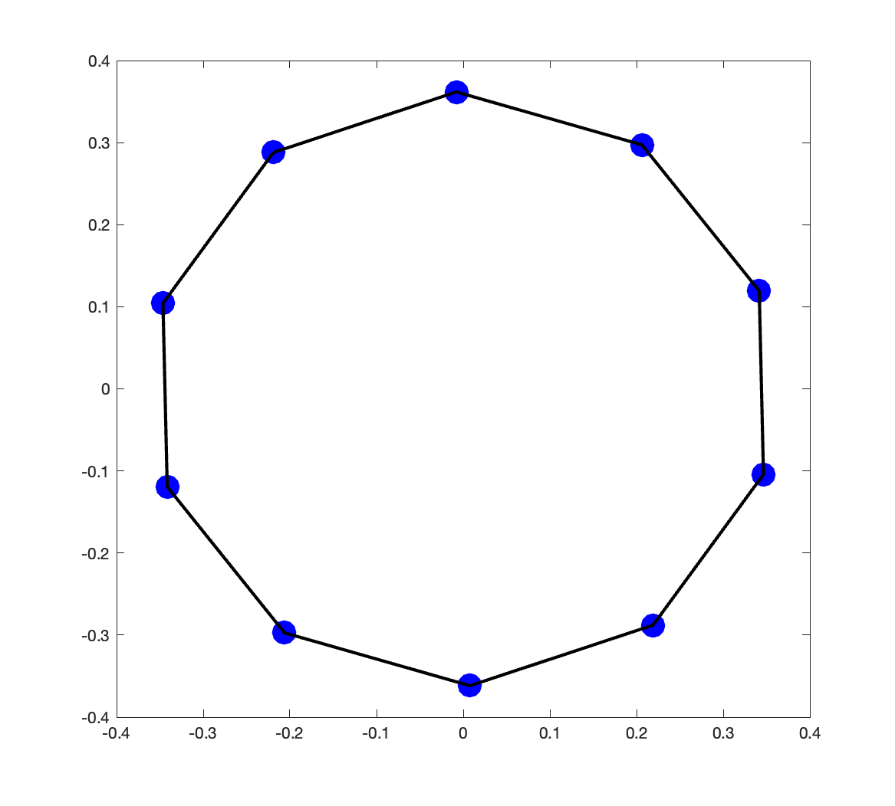{#fig-dm-ring width=40% fig-align="center"}

### 点云的扩散映射

实际问题中，我们往往要把点云 $x_1,\ldots,x_n\in\mathbb R^p$ 嵌入 $\mathbb R^d$，而手头并没有现成的图。PCA 是一种选择，但它只能发现线性结构，数据的低维性却可能来自非线性流形。例如，一组同一张脸在不同角度和光照下的照片，其内在维数受头颈肌肉运动和光照自由度限制；然而这种低维结构未必在线性的像素空间中直接显现。

考虑从嵌入 $\mathbb R^3$ 的二维瑞士卷上采样得到的点云（@fig-dm-swiss-roll）。要学习它的二维结构，必须区分两种“近”：点可能沿流形本身相近，也可能只是因为流形弯曲而在环境欧氏空间中靠得很近，实际沿流形却相距甚远。我们通过从数据构图来作这种区分。

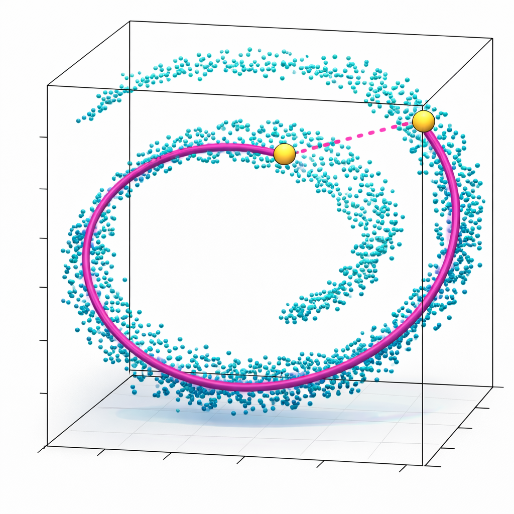{#fig-dm-swiss-roll width=40% fig-align="center"}

我们希望图只连接沿流形真正接近的点。为此选定一个小尺度，只连接距离小于该尺度的点；通常用核函数 $K_\epsilon$ 作平滑处理[^kernel-preview]，令

$$
w_{ij}=K_\epsilon(\|x_i-x_j\|_2).
$$

常见选择是
$K_\epsilon(u)=\exp(-u^2/(2\epsilon))$；当
$\|x_i-x_j\|_2\gg\sqrt\epsilon$ 时，它给出的边权几乎为零。随后对所得图计算扩散映射即可。

[^kernel-preview]: 本章后面会详细讨论核方法；此处暂把核理解成一个函数即可。

### 一个直观例子与噪声数据

考虑一组图像：同一个亮色块出现在暗色背景的不同位置。每张图只由色块的二维位置决定，所以数据的内在维数显然是二；但这种结构不会直接体现为像素向量落在某个二维仿射子空间中[^blob-pca]。

[^blob-pca]: 在高度理想化的情形里，色块之间要么不相交，要么只按固定面积相交，数据关系可能只涉及三个数值，此时 PCA 仍有可能捕获其低维结构。

先看一维版本：色块是一条左右移动的竖条，并采用电子游戏式的周期边界，向右移出屏幕后会从左侧出现。数据不仅应是一维的，还应具有圆周结构。二维扩散映射确实清楚地恢复了这个圆，见 @fig-dm-blob-1d。

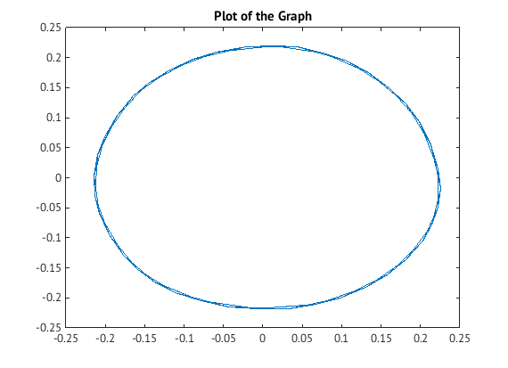{#fig-dm-blob-1d width=40% fig-align="center"}

二维版本允许色块同时水平、竖直移动，并在两个方向上采用周期边界；其内在流形应是二维环面。@fig-dm-blob-2d 表明，三维扩散映射准确捕捉到了这一环面结构。

::: {#fig-dm-blob-2d layout-ncol=2}
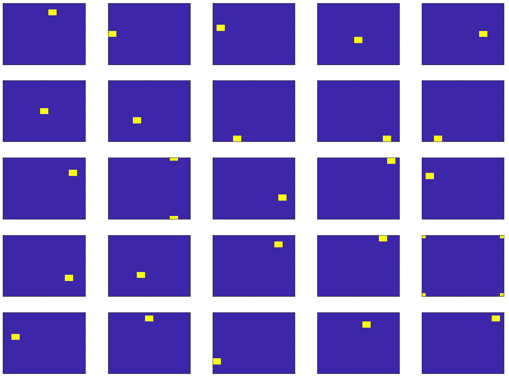

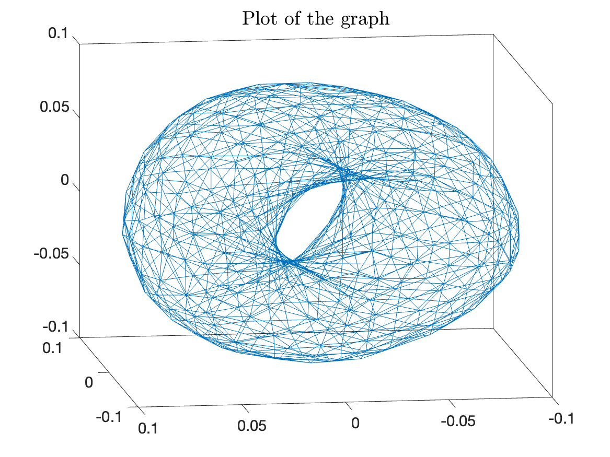

数据集的一个子集及其三维扩散映射；嵌入显著恢复了环面结构。
:::

真实数据往往含噪，测量噪声会扭曲欧氏距离 $\|x_i-x_j\|$。因此，应用扩散映射前通常先去噪。一种常用流程，是先用 PCA 去噪并降维，再在主成分空间中计算扩散映射。PCA 维数要足够大，以保留非线性结构与信号变化；又要足够小，才能有效抑制噪声。PCA 与扩散映射在生物医学成像中的组合应用见 @singer2013two 和 @gilles2025cryo；噪声下的流形拟合仍是活跃研究方向 [@aizenbud2025estimation; @fefferman2025fitting]。

### 扩散映射、图像与数据流形

为展示扩散映射从图像中恢复有物理意义的潜在结构的能力，下面考察 MNIST 与 Extended Yale B 两个标准数据集。两项实验都用 Gaussian 核定义图像 $x_i,x_j$ 的亲和度：

$$
W_{ij}=\exp\!\left(-\frac{\|x_i-x_j\|^2}{2\varepsilon}\right).
$$

带宽取为点对平方距离中位数的一半：

$$
\varepsilon=\frac12\operatorname{median}
\{\|x_i-x_j\|^2:i\ne j\}.
$$

中位数启发式（以及相近的均值启发式）会根据数据中典型的平方距离自动缩放 $\varepsilon$，省去手工调节带宽。

#### 例：MNIST 手写数字的扩散映射

从 MNIST 中取 600 张图像，每张展平为 $\mathbb R^{784}$ 中的向量，因此数据矩阵 $X\in\mathbb R^{784\times600}$ 的列是图像、行是像素强度。@fig-mnist-diffusion 用前两个非平凡扩散坐标展示全部图像，并在部分嵌入位置画出缩略图；边框颜色表示数字类别。

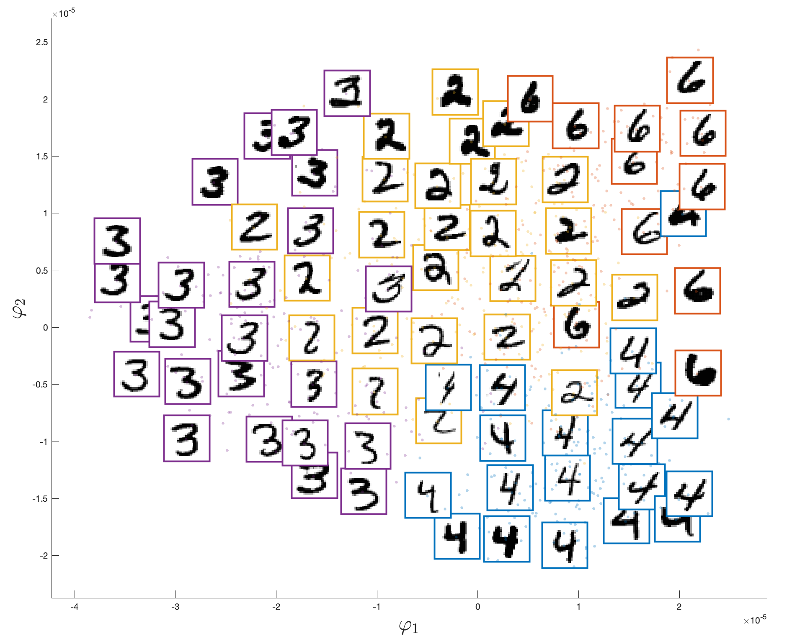{#fig-mnist-diffusion width=66% fig-align="center"}

训练过程没有使用任何类别标签，四类数字却在平面中分离得相当清楚：扩散映射仅凭几何便发现了类别结构。这支持如下观点：同一数字的图像位于 $\mathbb R^{784}$ 中的低维流形上，流形参数对应书写风格、笔画粗细和倾斜程度等自然变化。同一类内部也呈连续组织，相邻嵌入点对应外观相近的图像，沿簇移动时字形逐渐变化。

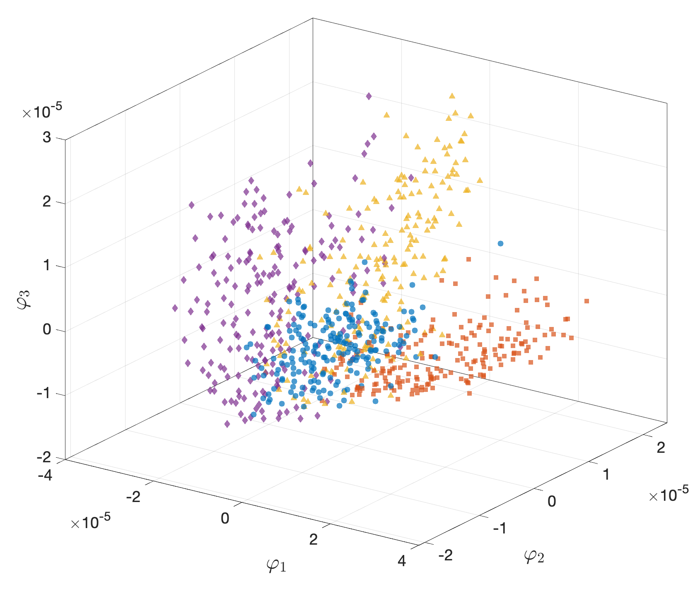{#fig-mnist-diffusion-3d width=66% fig-align="center"}

@fig-mnist-diffusion-3d 显示了前三个扩散坐标。按数字标签看，数据形成了良好但绝非完美的无监督聚类。这里选二维、三维只是为了可视化；面对不同任务，可能需要更多扩散维数。本章后面还会讨论把扩散映射用作 t-SNE 预处理。

#### 例：Extended Yale B 人脸数据库的扩散映射

Extended Yale B 数据库 [@georghiades2001few] 包含 38 位受试者在 64 种受控光照条件下的照片，图像裁剪并归一化为 $192\times168$。这里选一位受试者的全部 64 张正面图像，将其缩放为 $32\times28$ 后展平为 $\mathbb R^{896}$ 中的向量。

光照由光源相对相机轴的两个角度参数化：方位角
$\phi\in[-130^\circ,130^\circ]$ 与仰角
$\theta\in[-40^\circ,90^\circ]$。光源绕脸移动时，像素强度会剧烈改变：侧光会让大半张脸落入阴影，正面光则使照明接近均匀。尽管光度变化很大，64 张照片的几何主体完全相同，因而位于 $\mathbb R^{896}$ 中由 $(\phi,\theta)$ 参数化的光滑二维流形上。

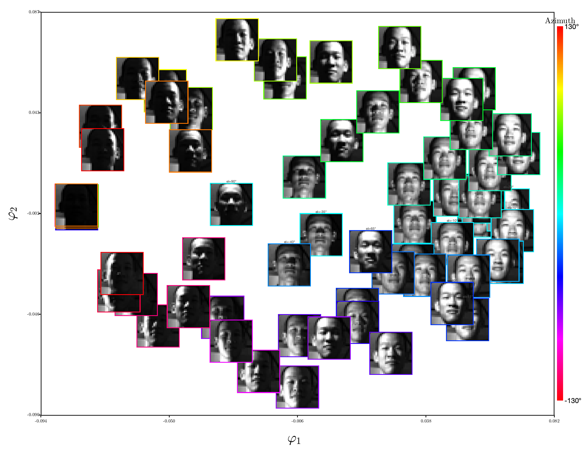{#fig-faces-diffusion width=90% fig-align="center"}

@fig-faces-diffusion 恢复了光照流形的内在二维结构。沿第一扩散坐标移动，相当于让光源从脸的一侧扫到另一侧，阴影随之横向移动；沿第二扩散坐标移动，则对应光源由下至上升降。

## 扩散映射与谱聚类的联系

扩散映射与上一章的谱聚类关系极为紧密。事实上，谱聚类可以理解为：把扩散映射截断到 $k-1$ 维，再对嵌入点运行 $k$-均值。

给定数据点，先用核 $K_\epsilon$ 构造加权图 $G=(V,E,W)$，例如
$K_\epsilon(u)=\exp(-u^2/(2\epsilon))$，并令

$$
w_{ij}=K_\epsilon(\|x_i-x_j\|).
$$

随机游走的转移矩阵为 $M=D^{-1}W$，即

$$
\mathbb P\{X(t+1)=j\mid X(t)=i\}
=\frac{w_{ij}}{\deg(i)}=M_{ij}.
$$

$d$ 维扩散映射为

$$
\mathcal D_t^{(d)}(i)=
\begin{bmatrix}
\lambda_2^t\varphi_2(i)\\
\vdots\\
\lambda_{d+1}^t\varphi_{d+1}(i)
\end{bmatrix},
$$

其中 $M=\Phi\Lambda\Psi^T$，$\Phi,\Psi$ 分别由 $M$ 的右、左特征向量组成，并满足 $\Phi^T\Psi=I$。

若要把顶点分成 $k$ 簇，自然应把扩散映射截断到 $k-1$ 维，因为 $k-1$ 维空间足以容纳 $k$ 个线性可分集合。若嵌入后的簇确实线性可分，便可用 $k$-均值找出它们；这正是谱聚类的动机。

::: {.algorithm #alg-dm-spectral-clustering}
**算法：用扩散映射表述的谱聚类。** 给定图 $G=(V,E,W)$、簇数 $k$ 与时间 $t$：

1. 计算 $(k-1)$ 维扩散映射
   $$
   \mathcal D_t^{(k-1)}(i)=
   \begin{bmatrix}
   \lambda_2^t\varphi_2(i)\\
   \vdots\\
   \lambda_k^t\varphi_k(i)
   \end{bmatrix}.
   $$
2. 对 $\mathcal D_t^{(k-1)}(1),\ldots,\mathcal D_t^{(k-1)}(n)\in\mathbb R^{k-1}$ 运行 $k$-均值或其他聚类算法。实践中通常忽略 $\lambda_m^t$ 的缩放，也就是取 $t=0$。
:::

要验证它与上一章的谱聚类算法相同，只需说明
$\varphi_m=D^{-1/2}v_m$，其中 $v_m$ 是归一化图拉普拉斯算子 $\mathcal L_G$ 的第 $m$ 小特征向量。这来自

$$
\mathcal L_G=I-S,
\qquad S=D^{-1/2}WD^{-1/2},
\qquad\Phi=D^{-1/2}V.
$$

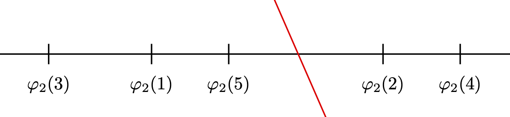{#fig-two-cluster-threshold width=70% fig-align="center"}

下面的命题把归一化割与上述随机游走联系起来。由 $M\mathbf1=\mathbf1$ 可知 $M\varphi_1=\varphi_1$，继而
$\psi_1^TM=\psi_1^T$，其中

$$
\psi_1=D^{1/2}v_1=D\varphi_1=[\deg(i)]_{i=1}^n.
$$

所以 $[\deg(i)/\vol(G)]_{i=1}^n$ 是该随机游走的平稳分布。事实上，若 $X(t)$ 的分布为 $p_t$，则 $X(t+1)$ 的分布满足 $p_{t+1}^T=p_t^TM$。

::: {.proposition #prop-ncut-random-walks}
**命题。** 给定图 $G=(V,E,W)$ 及顶点划分 $(S,S^c)$，若随机游走处于平稳分布
$\mathbb P\{X(t)=i\}=\deg(i)/\vol(G)$，则

$$
\Ncut(S)=
\mathbb P\{X(t+1)\in S^c\mid X(t)\in S\}
+\mathbb P\{X(t+1)\in S\mid X(t)\in S^c\}.
$$
:::

::: {.proof}
**证明。** 不妨取 $t=0$。两个条件概率相互对称，只需计算第一个：

$$
\begin{aligned}
\mathbb P\{X(1)\in S^c\mid X(0)\in S\}
&=\frac{\mathbb P\{X(1)\in S^c,\ X(0)\in S\}}
{\mathbb P\{X(0)\in S\}}\\
&=\frac{\sum_{i\in S}\sum_{j\in S^c}
\frac{\deg(i)}{\vol(G)}\frac{w_{ij}}{\deg(i)}}
{\sum_{i\in S}\frac{\deg(i)}{\vol(G)}}\\
&=\frac{\sum_{i\in S}\sum_{j\in S^c}w_{ij}}
{\sum_{i\in S}\deg(i)}
=\frac{\cut(S)}{\vol(S)}.
\end{aligned}
$$

同理，

$$
\mathbb P\{X(t+1)\in S\mid X(t)\in S^c\}
=\frac{\cut(S)}{\vol(S^c)}.
$$

相加即得 $\Ncut(S)$。证毕。
:::

## 通勤时间距离

扩散距离为图赋予了一种具有概率解释的度量。图上还有哪些自然度量？最先想到的往往是最短路径度量，即测地距离：为边赋代价 $c_{ij}$，例如 $c_{ij}=w_{ij}^{-1}$；路径代价是沿途边代价之和，$i,j$ 的测地距离则是连接二者的所有路径中的最小代价。它确实是度量，却未必是 $\ell^2$ 度量；并非每种度量都能嵌入 Euclidean 或 Hilbert 空间。例如 $\ell^1$（Manhattan）距离不满足平行四边形恒等式，无法等距嵌入 Euclidean 空间。测地距离还对噪声敏感。著名的非线性降维方法 Isomap 正是以它为基础 [@ISOMAP_paper_2000]。

随机游走还带来另一种度量：从 $i$ 首次走到 $j$ 的平均时间。这个量满足三角不等式，却不对称；将两个方向的平均时间相加便得到对称量，且顶点到自身为零，这就是**通勤时间距离**。一个颇为奇妙的事实是，它恰好是 Euclidean 距离，对应的嵌入也由图拉普拉斯算子的特征值与特征向量给出。下面从概率解释出发证明这一点；另见 @doyle1984random 与 @lovasz1993random。

考虑不可约随机游走 $\{X(t)\}_{t=0}^\infty$，其转移概率

$$
M_{ij}=\mathbb P\{X(t+1)=j\mid X(t)=i\}=\frac{w_{ij}}{\deg(i)},
$$

其中 $w_{ij}$ 是无向图的边权。此时不可约等价于图连通。定义**首次到达时间**与其均值：

$$
\tau_{ij}=
\begin{cases}
\inf\{t>0:X(t)=x_j,\ X(0)=x_i\},&i\ne j,\\
0,&i=j,
\end{cases}
\qquad
t_{ij}=\mathbb E[\tau_{ij}].
$$

$x_i,x_j$ 的期望通勤时间定义为 $t_{ij}+t_{ji}$。再令

$$
\tau'_{ij}=\inf\{t>0:X(t)=x_j,\ X(0)=x_i\},
\qquad t'_{ij}=\mathbb E[\tau'_{ij}],
$$

注意 $\tau_{ii}\ne\tau'_{ii}$，因为后者严格为正。记 $T=[t_{ij}]$、$T'=[t'_{ij}]$。游走者从 $x_i$ 出发，要么以概率 $M_{ij}$ 一步到达 $x_j$，要么先以概率 $M_{ik}$ 到达某个 $k\ne j$，随后还需平均 $t'_{kj}$ 步。因此[^commute-irreducible]

$$
\begin{aligned}
T'_{ij}
&=M_{ij}+\sum_{k\ne j}M_{ik}(1+T'_{kj})\\
&=1+\sum_kM_{ik}T'_{kj}-M_{ij}T'_{jj},
\end{aligned}
$$

即

$$
T'=\mathbf1\mathbf1^T+M(T'-\operatorname{ddiag}(T')).
$$ {#eq-cmt1}

这里 $\operatorname{ddiag}(T')$ 表示保留 $T'$ 对角元、把非对角元置零所得的矩阵。

[^commute-irreducible]: 这一步需要不可约性，否则某些期望可能为无穷，最后的消去未必成立。

先求 $\operatorname{ddiag}(T')$。令
$\psi_1^T=[\deg(i)]_{i=1}^n$，则 $\psi_1^TM=\psi_1^T$。在 @eq-cmt1 左乘 $\psi_1^T$，消去 $\psi_1^TT'$ 后得到

$$
\psi_1^T\operatorname{ddiag}(T')
=\psi_1^T\mathbf1\mathbf1^T
=\left(\sum_{k=1}^n\deg(k)\right)\mathbf1^T.
$$ {#eq-cmt2}

所以

$$
T'_{ii}=\frac{\vol(G)}{\deg(i)}.
$$

这是从 $i$ 出发再次返回 $i$ 的平均时间。它与 $\vol(G)$ 成正比：图越大，游走者平均要徘徊越久；与 $\deg(i)$ 成反比：顶点度越大，返回它的机会越多。值得注意的是，除总边权与该顶点的度之外，这个量几乎看不到图的其他结构。

@eq-cmt1 的解是唯一的。若 $T'_2$ 是另一个具有相同对角元的解，则

$$
T'-T'_2=M(T'-T'_2).
$$

$T'-T'_2$ 的每一列都是 $M$ 对应特征值 $1$ 的右特征向量。不可约性保证该特征空间只由 $\mathbf1$ 张成，故 $T'-T'_2=\mathbf1u^T$。二者对角元相同又迫使 $u=0$，所以 $T'_2=T'$。

由于 $T=T'-\operatorname{ddiag}(T')$，@eq-cmt1 等价于

$$
(I-M)T=\mathbf1\mathbf1^T-\operatorname{ddiag}(T').
$$ {#eq-cmt3}

$I-M$ 不可逆，不能直接求逆。利用图拉普拉斯算子

$$
L=D-W=D(I-M),
$$ {#eq-graph-laplacian-commute}

在 @eq-cmt3 左乘 $D$ 得

$$
LT=D\mathbf1\mathbf1^T-D\operatorname{ddiag}(T').
$$ {#eq-cmt4}

写出 $L$ 的谱分解

$$
L=\sum_{l=2}^n\mu_l\phi_l\phi_l^T,
\qquad
0=\mu_1<\mu_2\le\cdots\le\mu_n,
\qquad
\phi_1=\frac1{\sqrt n}\mathbf1,
$$

其中 $\mu_2>0$ 来自图连通。于是

$$
L^\dagger=\sum_{l=2}^n\frac1{\mu_l}\phi_l\phi_l^T,
$$

且

$$
L^\dagger L=I-\frac1n\mathbf1\mathbf1^T.
$$ {#eq-cmt5}

在 @eq-cmt4 左乘 $L^\dagger$，并利用
$D\operatorname{ddiag}(T')=\vol(G)I$，逐列可得

$$
T=L^\dagger D\mathbf1\mathbf1^T
-L^\dagger D\operatorname{ddiag}(T')+\mathbf1u^T,
$$

亦即

$$
t_{ij}=\sum_{k=1}^nL^\dagger_{ik}\deg(k)
-\vol(G)L^\dagger_{ij}+u_j.
$$ {#eq-cmt7}

由 $t_{ii}=0$，

$$
u_i=-\sum_{k=1}^nL^\dagger_{ik}\deg(k)
+\vol(G)L^\dagger_{ii}.
$$ {#eq-cmt8}

将两个方向相加，含度数的项相消，得到

$$
t_{ij}+t_{ji}
=\vol(G)(L^\dagger_{ii}+L^\dagger_{jj}-2L^\dagger_{ij}),
$$ {#eq-cmt9}

其中

$$
L^\dagger_{ij}=\sum_{l=2}^n\frac1{\mu_l}\phi_l(i)\phi_l(j).
$$ {#eq-cmt10}

定义**通勤时间映射** $\Psi:V\to\mathbb R^{n-1}$：

$$
\Psi(x_i)=
\begin{bmatrix}
\mu_2^{-1/2}\phi_2(i)\\
\mu_3^{-1/2}\phi_3(i)\\
\vdots\\
\mu_n^{-1/2}\phi_n(i)
\end{bmatrix}.
$$ {#eq-commute-time-embedding}

于是通勤时间就是该嵌入中 Euclidean 距离的平方乘以图的体积：

$$
t_{ij}+t_{ji}=\vol(G)\|\Psi(x_i)-\Psi(x_j)\|^2
=\vol(G)(e_i-e_j)^TL^\dagger(e_i-e_j).
$$

### 扩散距离与通勤时间距离的比较

若图是 $d$-正则的，则 $D=dI$，并有

$$
L=d(I-M).
$$

所以 $M,L$ 具有相同特征向量，且特征值满足

$$
\phi_l=\varphi_l,
\qquad
\mu_l=d(1-\lambda_l).
$$

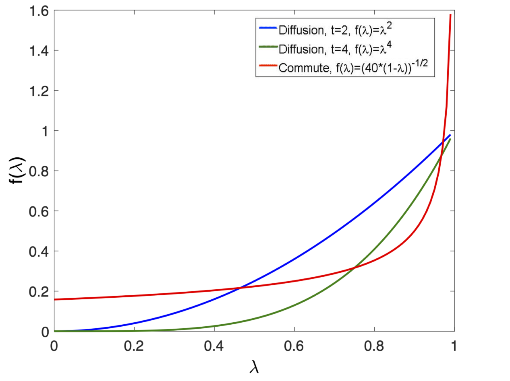{#fig-diffusion-commute-filter width=75% fig-align="center"}

对某些图族，通勤时间距离可能失去意义。它对应的滤波器会给所有小特征值分配相近的非零权重；若所有特征值的权重完全相同，那么顶点 $i,j$ 的距离只剩 $1/d_i+1/d_j$，与二者之间如何连接毫无关系。某些情形下通勤时间距离确实会退化成这种无趣行为 [@von2014hitting]。实践中还可以采用许多其他滤波或传递函数，选择取决于具体问题。

### 有效电阻

把图看成电阻网络，并令边 $(i,j)$ 的电阻为 $r_{ij}=w_{ij}^{-1}$，则通勤时间距离与两点间的**有效电阻**成正比；比例因子恰为 $\vol(G)$。这给出了另一种物理解释。

设 $v\in\mathbb R^n$ 是顶点电势。由 Ohm 定律 $V=RI$，有向边电流为

$$
i_{i\to j}=\frac{v_i-v_j}{r_{ij}}=w_{ij}(v_i-v_j).
$$

令 $U$ 是 $|E|\times n$ 的有符号边关联矩阵，边 $(i,j)$ 对应的行是 $e_i-e_j$；方向可任意选定，但必须固定。令
$\Delta=\operatorname{diag}([w_{ij}]_{(i,j)\in E})$，则

$$
i=\Delta Uv.
$$

Kirchhoff 定律说明电阻网络不能储存电流。若 $i_{\rm ext}(a)$ 表示从外界注入顶点 $a$ 的电流，则

$$
i_{\rm ext}=U^Ti=U^T\Delta Uv=Lv.
$$

内部顶点满足 $i_{\rm ext}(a)=0$，因而

$$
(Lv)_a=0
\quad\Longleftrightarrow\quad
v_a=\frac1{\deg(a)}\sum_{j:(a,j)\in E}w_{aj}v_j;
$$

也就是说，内部顶点的电势是邻居电势的加权平均。

计算 $i,j$ 间的有效电阻时，从 $i$ 注入电流 $I$，从 $j$ 抽出同样电流：

$$
i_{ij,\rm ext}=I(e_i-e_j).
$$

它与 $\mathbf1$ 正交。图连通时，取中心化电势解

$$
v=L^\dagger i_{ij,\rm ext}=IL^\dagger(e_i-e_j).
$$

两点电势差为

$$
v_i-v_j=I(e_i-e_j)^TL^\dagger(e_i-e_j),
$$

故

$$
R^{\rm eff}(i,j)=\frac{v_i-v_j}{I}
=(e_i-e_j)^TL^\dagger(e_i-e_j).
$$

与 @eq-cmt9 比较可知，通勤时间距离正是有效电阻的 $\vol(G)$ 倍。

### 图上的时间同步

图拉普拉斯伪逆与有效电阻还可用于多跳通信网络中的时间同步。$n$ 个传感节点各有本地时钟，任意两个时钟相差常数偏移。能够直接通信的节点可以交换带本地时间戳的消息，测量相对偏移。若节点 $i,j$ 相对参考时钟的偏移为 $t_i,t_j$，则观测为

$$
s_{ij}=t_i-t_j+\xi_{ij},\qquad(i,j)\in E,
$$ {#eq-clock-offsets}

其中 $\xi_{ij}$ 是噪声。目标是从点对观测中恢复 $t_1,\ldots,t_n$，允许相差一个全局常数。它也可解释成排名：$t_i$ 是选手实力，$s_{ij}$ 是 $i,j$ 对局的比分。

测量图必须连通。假设各噪声相互独立且

$$
\xi_{ij}\sim\mathcal N(0,\sigma_{ij}^2).
$$

固定全局平移自由度，令 $\mathbf1^Tt=0$。向量形式为

$$
s=Ut+\xi,
\qquad
\xi\sim\mathcal N(0,\operatorname{diag}(\sigma)^2).
$$

用 $\sigma_{ij}$ 除对应方程进行预白化：

$$
\operatorname{diag}(\sigma)^{-1}s
=\operatorname{diag}(\sigma)^{-1}Ut+z,
\qquad z\sim\mathcal N(0,I).
$$

最小二乘估计满足

$$
U^T\operatorname{diag}(\sigma)^{-2}U\hat t
=U^T\operatorname{diag}(\sigma)^{-2}s.
$$

取权重 $w_{ij}=\sigma_{ij}^{-2}$，则

$$
L\hat t=U^T\Delta s,
\qquad
\hat t=L^\dagger U^T\Delta s.
$$

估计无偏：

$$
\mathbb E[\hat t]
=L^\dagger U^T\Delta Ut=L^\dagger Lt=t.
$$

误差及其协方差为

$$
\hat t-t=L^\dagger U^T\Delta\xi,
$$

$$
\mathbb E[(\hat t-t)(\hat t-t)^T]
=L^\dagger U^T\Delta\Delta^{-1}\Delta UL^\dagger
=L^\dagger.
$$

所以第 $i$ 个时钟的均方误差和总体均方误差分别为

$$
\mathbb E[(\hat t_i-t_i)^2]=L^\dagger_{ii},
\qquad
\mathbb E\|\hat t-t\|^2=\operatorname{Tr}(L^\dagger).
$$

相对偏移 $t_i-t_j$ 由 $\hat t_i-\hat t_j$ 估计，其均方误差为

$$
\begin{aligned}
\mathbb E[((\hat t_i-\hat t_j)-(t_i-t_j))^2]
&=L^\dagger_{ii}+L^\dagger_{jj}-2L^\dagger_{ij}\\
&=(e_i-e_j)^TL^\dagger(e_i-e_j).
\end{aligned}
$$

这恰是有效电阻距离。因此，通勤时间越短，表示相对偏移估计越精确。

## 其他非线性降维方法

另一种广受欢迎的方法是 Isomap [@ISOMAP_paper_2000]。它寻找 $\mathbb R^d$ 中的嵌入，使嵌入后的 Euclidean 距离尽量接近图上的测地距离。先计算每对顶点 $v_i,v_j$ 的测地距离 $\delta_{ij}$，再用多维尺度分析寻找 $y_i\in\mathbb R^d$，例如最小化

$$
\min_{y_1,\ldots,y_n\in\mathbb R^d}
\sum_{i,j}(\|y_i-y_j\|^2-\delta_{ij}^2)^2.
$$

该问题可用谱方法求解；显式求出其最优解是一个很好的练习。

局部线性嵌入（LLE）[@roweis2000nonlinear] 与 Isomap 常被视为非线性降维的里程碑。其他代表方法还有扩散映射、拉普拉斯特征映射、Hessian LLE [@donoho2003hessian]、局部切空间排列 [@zhang2004principal] 和 UMAP [@mcinnes2018umap]。扩散映射本身也有多种变体，例如基于 Mahalanobis 距离的各向异性扩散映射 [@singer2008non]，以及学习多模态数据共同潜变量几何的交替扩散 [@lederman2018learning]。下面详细介绍 t-SNE [@maaten2008visualizing]；后续还会介绍向量扩散映射 [@ASinger_HTWu_2011_VDM]，它以图联络拉普拉斯算子为基础，把标量函数上的扩散映射推广到向量场。

### t 分布随机邻域嵌入

t-SNE 是主要面向高维数据可视化的非线性降维方法 [@maaten2008visualizing]。扩散映射等谱方法建立在特征值问题上，有清晰的算子解释；t-SNE 则是随机优化问题，目标是在概率意义下保持局部邻域关系。

核心思想是：高维空间中相近的点在嵌入后仍应相近，而对原本遥远的点只施加很弱的约束。给定 $\{x_1,\ldots,x_n\}\subset\mathbb R^d$，定义 $x_j$ 相对于 $x_i$ 的条件相似度及其对称化：

$$
p_{i\mid j}=
\frac{\exp(-\|x_i-x_j\|^2/(2\sigma_i^2))}
{\sum_{k\ne i}\exp(-\|x_i-x_k\|^2/(2\sigma_i^2))},
\qquad
p_{ij}=\frac{p_{j\mid i}+p_{i\mid j}}{2n}.
$$

不同于图拉普拉斯与扩散映射，带宽 $\sigma_i$ 不是全局常数，而是按局部数据密度自适应确定。

设嵌入点为 $\{y_1,\ldots,y_n\}\subset\mathbb R^m$，其中 $m\ll d$，通常 $m=2$ 或 $3$。低维空间使用自由度为一的重尾 Student t 分布，也就是 Cauchy 分布：

$$
q_{ij}=\frac{(1+\|y_i-y_j\|^2)^{-1}}
{\sum_{k\ne l}(1+\|y_k-y_l\|^2)^{-1}}.
$$

重尾分布缓解了**拥挤问题**：高维邻域投到低维后容易挤在中心，而重尾允许原空间中的远点在低维中被推得更远，从而改善标准 SNE 的拥挤现象 [@hinton2002stochastic]。

通过最小化高维联合分布 $P$ 与低维分布 $Q$ 之间的 Kullback--Leibler 散度确定嵌入：

$$
C=\operatorname{KL}(P\|Q)
=\sum_{i\ne j}p_{ij}\log\frac{p_{ij}}{q_{ij}}.
$$ {#eq-KL-tsne}

该目标非凸，通常用梯度下降优化。其梯度具有直观的“弹簧力”解释：

$$
\frac{\partial C}{\partial y_i}
=4\sum_j(p_{ij}-q_{ij})
\frac{y_i-y_j}{1+\|y_i-y_j\|^2}.
$$

- **吸引力：** 若 $x_i,x_j$ 在原空间相近，$p_{ij}$ 把 $y_i$ 拉向 $y_j$。
- **排斥力：** 若 $y_i,y_j$ 在嵌入中靠近、原空间中却不近，$q_{ij}$ 把二者推开。

t-SNE 嵌入对全局旋转和平移不变，对缩放却不具不变性；全局距离和大尺度几何通常会被扭曲。因此，与其把它当作通用降维技术，不如把它理解成保持局部邻域的可视化方法。

以 MNIST 手写数字库 [@lecun1998mnist] 为例，每个数据点是一张 $28\times28$ 黑白图像。采用 @linderman2019clustering 的实现计算二维嵌入。由于目标非凸，结果对初始化和超参数敏感；尽管如此，@fig-mnist-tsne 显示不同数字仍被清楚分开。

::: {#fig-mnist-tsne layout-ncol=2}
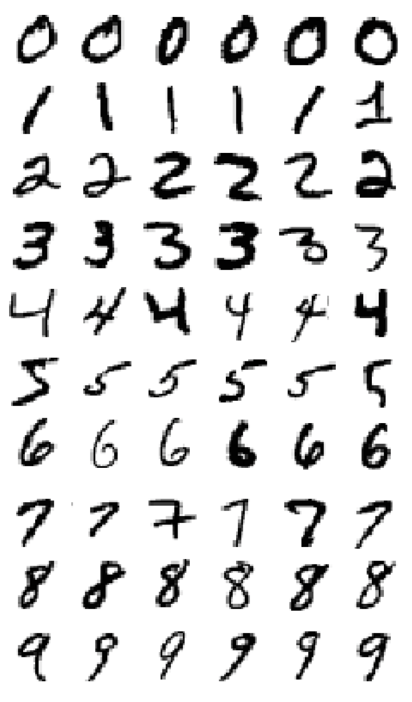

使用 @linderman2019clustering 的实现得到的 MNIST t-SNE 嵌入；颜色表示数字类别。图片由 Stefan Steinerberger 提供。
:::

t-SNE 与谱聚类之间还有一些有趣联系 [@linderman2019clustering; @cai2022theoretical]，为它何以擅长聚类提供了较早的严格数学解释。吸引项类似图拉普拉斯作用

$$
(L_Py)_i=\sum_jp_{ij}(y_i-y_j),
$$

其中 $P$ 是加权邻接矩阵。初始阶段的梯度下降流也类似图拉普拉斯上的幂迭代，早期迭代本质上执行某种谱聚类：簇由转移矩阵的主特征向量塑造，类似扩散过程的初始阶段。@linderman2019clustering 还证明，若数据含有以拉普拉斯谱隙定量刻画的良好分离簇，t-SNE 能保证这些簇在低维嵌入中仍保持分离。这并不意味着 t-SNE 属于谱降维，而只是揭示了其优化景观的局部动力学。

扩散映射有时也作为 t-SNE 的预处理 [@wolf2018scanpy; @moon2019visualizing; @haghverdi2015diffusion]。计算生物学中的常见流程 [@wolf2018scanpy]，是先把数据压缩到数量适中的扩散坐标，以去噪并保留内在几何，再对这个中间表示应用 t-SNE 或 UMAP，生成最终二维图。两阶段方案结合了两者的长处：扩散映射提供几何上有意义且抗噪的表示，t-SNE 则专门优化二维可读性。

## 核学习

线性方法高效、成熟，却无法表达变量间本质上非线性的关系。核方法把数据提升到一个高维、甚至无限维的特征空间，使线性边界也能捕获复杂结构，同时完全不必显式计算该空间中的坐标；这就是**核技巧**。

核方法的一项主要优势，是绕开困难的人工特征设计。以网络分析为例，我们可能很难为一个对象写出具体特征向量，却往往能直观定义任意两个对象之间的亲和度。只要这个亲和函数是半正定核，Bochner 定理便可用来验证某些重要情形；Mercer 定理则保证，它确实等于某个高维特征空间中的内积。因此，我们只需提供相似度，便能借核技巧完成非线性学习，而无需显式构造特征映射。

### 半正定核与再生核

实践中的核选择结合了理论启发与经验验证。线性核 $K(x,x')=x^Tx'$ 假设数据在原坐标中近似线性可分；多项式核
$K(x,x')=(\langle x,x'\rangle+r)^d$ 适合像素交互重要的图像问题；Gaussian 核
$K(x,x')=\exp(-\|x-x'\|^2/(2\epsilon^2))$ 又称径向基函数（RBF）核，在仔细调节带宽后是很强的通用默认选择；Laplacian 核
$K(x,x')=\exp(-\gamma\|x-x'\|)$（$\gamma>0$）更适合含尖锐变化或不连续行为的物理过程与信号，例如自然图像中的边缘，因为 Gaussian 核可能将它们过度平滑。

::: {.definition #def-psd-kernel}
**定义（半正定核）。** 设 $\mathcal X$ 非空。若对任意 $n\in\mathbb N$、任意 $x_1,\ldots,x_n\in\mathcal X$ 与任意 $\alpha_1,\ldots,\alpha_n\in\mathbb R$，函数 $K:\mathcal X\times\mathcal X\to\mathbb R$ 都满足

$$
\sum_{i=1}^n\sum_{j=1}^n\alpha_i\alpha_jK(x_i,x_j)\ge0,
$$ {#eq-psd-condition}

则称 $K$ 为**半正定核**。等价地，对所有上述选择，Gram 矩阵
$G_K=[K(x_i,x_j)]_{i,j=1}^n$ 都半正定。
:::

@eq-psd-condition 是纯代数条件，不要求 $\mathcal X$ 具有任何拓扑结构；它可以是离散集、流形、函数空间或任意抽象集合。

再生核 Hilbert 空间（RKHS）为核学习提供了严谨便利的泛函分析框架。

::: {.definition #def-rkhs}
**定义。** 设 $\mathcal H$ 是 $\mathcal X$ 上实值函数构成的 Hilbert 空间，内积为 $\langle\cdot,\cdot\rangle_{\mathcal H}$。若存在 $K:\mathcal X\times\mathcal X\to\mathbb R$，使得：

1. 对每个 $x\in\mathcal X$，函数 $K_x(\cdot)=K(x,\cdot)$ 属于 $\mathcal H$；
2. 对任意 $f\in\mathcal H$ 与 $x\in\mathcal X$，
   $$
   f(x)=\langle f,K_x\rangle_{\mathcal H}
   =\langle f,K(x,\cdot)\rangle_{\mathcal H},
   $$ {#eq-reproducing}

则称 $\mathcal H$ 为**再生核 Hilbert 空间**，$K$ 是它的**再生核**。
:::

::: {.proposition #prop-rk-properties}
**命题。** 若 $\mathcal H$ 是以 $K$ 为再生核的 RKHS，则：

1. $K$ 对称，即 $K(x,x')=K(x',x)$；
2. $K$ 是 @def-psd-kernel 意义下的半正定核；
3. $K(x,x')=\langle K_x,K_{x'}\rangle_{\mathcal H}$；
4. 再生核唯一。

证明留给读者。
:::

核常可由显式特征映射 $\phi:\mathcal X\to\mathcal F$ 理解，其中 $\mathcal F$ 可能维数极高：

$$
K(x,x')=\langle\phi(x),\phi(x')\rangle_{\mathcal F}.
$$ {#eq-kernel-trick}

因此，任何只依赖输入内积的算法，都能把 $\langle x,x'\rangle$ 换成 $K(x,x')$ 而“核化”，隐式地在 $\mathcal F$ 中工作。例如对 $x=(x_1,x_2)\in\mathbb R^2$，核
$K(x,x')=(x^Tx')^2$ 对应三维映射

$$
\phi(x)=(x_1^2,x_2^2,\sqrt2x_1x_2)^T.
$$

### Mercer 定理

核技巧无需知道特征空间坐标，Mercer 定理则显式构造这些坐标，回答“哪些 $K$ 确实对应某个特征空间内积”。

::: {.theorem #thm-mercer}
**定理（Mercer 定理）。** 设 $\mathcal X\subseteq\mathbb R^d$ 闭，$\mu$ 是 $\mathcal X$ 上严格正的 Borel 测度，$K:\mathcal X\times\mathcal X\to\mathbb R$ 连续、对称且半正定。则存在非负特征值 $\{\lambda_j\}_{j=1}^\infty$，以及 $L^2(\mathcal X)$ 中由连续特征函数组成的标准正交序列 $\{\psi_j\}_{j=1}^\infty$，使

$$
K(x,x')=\sum_{j=1}^\infty\lambda_j\psi_j(x)\psi_j(x').
$$

级数对每一对 $(x,x')$ 绝对收敛，并在 $\mathcal X\times\mathcal X$ 的每个紧子集上一致收敛。
:::

::: {.proof}
**证明。** 定义积分算子 $T_K:L^2(\mathcal X,\mu)\to L^2(\mathcal X,\mu)$：

$$
(T_Kf)(x)=\int_{\mathcal X}K(x,t)f(t)\,d\mu(t).
$$

$K$ 连续且对称，所以 $T_K$ 紧且自伴。紧自伴算子的谱定理给出标准正交特征函数 $\{\phi_j\}$ 与特征值 $\lambda_j$；半正定性保证 $\lambda_j\ge0$。按
$\lambda_1\ge\lambda_2\ge\cdots\to0$ 排列。对 $\lambda_j>0$，

$$
\phi_j(x)=\frac1{\lambda_j}\int_{\mathcal X}K(x,t)\phi_j(t)\,d\mu(t),
$$

故 $\phi_j$ 连续。

令
$K_n(x,t)=\sum_{j=1}^n\lambda_j\phi_j(x)\phi_j(t)$，余核 $R_n=K-K_n$ 仍连续、对称、半正定，所以

$$
R_n(x,x)=K(x,x)-\sum_{j=1}^n\lambda_j\phi_j(x)^2\ge0.
$$

因此非降部分和 $\sum_{j=1}^n\lambda_j\phi_j(x)^2$ 有界并逐点收敛。Cauchy--Schwarz 不等式给出

$$
\left|\sum_{j=m}^n\lambda_j\phi_j(x)\phi_j(t)\right|
\le
\sqrt{\sum_{j=m}^n\lambda_j\phi_j(x)^2}
\sqrt{\sum_{j=m}^n\lambda_j\phi_j(t)^2},
$$ {#eq-mercer-cauchy-schwarz}

故交叉项级数逐点绝对收敛。

在紧集 $S$ 上，连续函数
$g_n(x)=\sum_{j=1}^n\lambda_j\phi_j(x)^2$ 单调趋于连续函数 $K(x,x)$。Dini 定理说明收敛一致；再由 @eq-mercer-cauchy-schwarz，交叉项也一致收敛。

最后令
$R(x,t)=K(x,t)-\sum_{j=1}^\infty\lambda_j\phi_j(x)\phi_j(t)$。对应算子 $T_R$ 的所有特征值均为零；自伴紧算子因而满足 $T_R=0$。$R$ 连续且 $\mu$ 严格正，故 $R(x,t)=0$ 处处成立。证毕。
:::

更一般的 Moore--Aronszajn 定理 [@aronszajn1950theory] 说明每个正定核都唯一确定一个 RKHS。Mercer 定理在额外分析条件下给出特征函数展开及显式特征映射

$$
\phi(x)=(\sqrt{\lambda_1}\psi_1(x),\sqrt{\lambda_2}\psi_2(x),\ldots).
$$

理论上这一构造很有用，实践中仍通常通过核技巧避免显式计算。

### Bochner 定理

Mercer 定理连接半正定核与 $L^2$ 中的特征映射；Bochner 定理则刻画平移不变核
$K(x,x')=\kappa(x-x')$。

设 $\mu$ 是 $\mathbb R^p$ 上有限 Borel 测度。其 Fourier 变换为

$$
\widehat\mu(\xi)=\int_{\mathbb R^p}e^{-2\pi\mathrm i\langle\xi,x\rangle}\,d\mu(x).
$$

它连续且 $|\widehat\mu(\xi)|\le\mu(\mathbb R^p)<\infty$。此外，对任意复数 $\alpha_i$，

$$
\begin{aligned}
\sum_{i,j}\widehat\mu(\xi_i-\xi_j)\alpha_i\overline{\alpha_j}
&=\int_{\mathbb R^p}
\left|\sum_i\alpha_ie^{-2\pi\mathrm i\langle\xi_i,x\rangle}\right|^2d\mu(x)\\
&\ge0.
\end{aligned}
$$

故矩阵 $[\widehat\mu(\xi_i-\xi_j)]$ 总半正定。反之，任何有界连续函数，只要对所有有限点集都产生这样的半正定矩阵，就是某个有限 Borel 测度的 Fourier 变换。卷积定理与 Parseval 定理还给出

$$
\langle\widehat K\widehat\alpha,\widehat\alpha\rangle
=\int|\widehat\alpha(\xi)|^2\widehat K(\xi)\,d\xi\ge0;
$$

因为 $\widehat\alpha$ 可任取，必有 $\widehat K(\xi)\ge0$。

::: {.theorem #thm-bochner}
**定理（Bochner 定理）** [@bochner1932vorlesungen]。复值函数
$K\in L^\infty(\mathbb R^p)\cap C(\mathbb R^p)$ 在 $\mathbb R^p$ 上正定，当且仅当它是某个有限非负 Borel 测度 $\mu$ 的逆 Fourier 变换：

$$
K(x)=\int_{\mathbb R^p}e^{2\pi\mathrm i\langle\xi,x\rangle}\,d\mu(\xi).
$$
:::

若归一化为 $K(0)=1$，$\mu$ 就是频率上的概率分布。Gaussian 核

$$
K(x,x')=\exp\!\left(-\frac{\|x-x'\|^2}{2\epsilon^2}\right)
$$

的谱测度仍是 Gaussian，方差为 $1/\epsilon^2$；这立即证明 Gaussian 核半正定，参见 @Gro01。于是对任意 $x_1,\ldots,x_n\in\mathbb R^p$，矩阵
$W_{ij}=\exp(-\|x_i-x_j\|^2/(2\epsilon^2))$ 都半正定。更一般地，正核生成的 $W$ 没有负特征值，扩散时间因而可取任意正实数 $t>0$。

### 表示定理

表示定理保证：无论底层 Hilbert 空间多大，正则化泛函的最优解都落在有限维子空间中。

::: {.theorem #thm-representer}
**定理（表示定理）。** 设 $\mathbb H$ 是以 $K$ 为再生核的 RKHS，训练数据为
$\{(x_i,y_i)\}_{i=1}^n$。考虑

$$
J(f)=L(f(x_1),\ldots,f(x_n))+\Psi(\|f\|_{\mathbb H}^2),
$$

其中 $L:\mathbb R^n\to\mathbb R$ 是任意损失，$\Psi:[0,\infty)\to\mathbb R$ 严格单调递增。则 $J$ 的任意极小点 $f^*\in\mathbb H$ 都可写成

$$
f^*(x)=\sum_{i=1}^n\alpha_iK(x,x_i).
$$
:::

::: {.proof}
**证明。** 令
$\mathbb H_S=\operatorname{span}\{K(\cdot,x_1),\ldots,K(\cdot,x_n)\}$。任意 $f\in\mathbb H$ 可正交分解为

$$
f=f_S+f_\perp,
\qquad
f_S=\sum_i\alpha_iK(\cdot,x_i),
\qquad f_\perp\in\mathbb H_S^\perp.
$$

由再生性质，对每个训练点 $x_j$，

$$
f(x_j)=\langle f_S+f_\perp,K(\cdot,x_j)\rangle_{\mathbb H}
=f_S(x_j),
$$

所以损失只依赖 $f_S$。另一方面，Pythagoras 定理给出

$$
\|f\|_{\mathbb H}^2=\|f_S\|_{\mathbb H}^2+\|f_\perp\|_{\mathbb H}^2.
$$

若 $f_\perp\ne0$，严格递增的 $\Psi$ 使 $f_S$ 的目标值严格更小。因此极小点必须满足 $f_\perp=0$，即属于 $\mathbb H_S$。证毕。
:::

表示定理本身就是一种优化降维原则：学习虽发生在可能无限维的 RKHS 中，解却只位于训练点核函数张成的有限维空间；问题规模取决于样本数，而非特征空间维数。

### 核学习的应用

**核岭回归。** 在 RKHS $\mathbb H$ 中求解

$$
\min_{f\in\mathbb H}\frac1m\sum_{i=1}^m(f(x_i)-y_i)^2
+\lambda\|f\|_{\mathbb H}^2.
$$

由 @thm-representer，$f^*(x)=\sum_i\alpha_iK(x_i,x)$。代回目标得到

$$
\min_{\alpha\in\mathbb R^m}
\frac1m\|G_K\alpha-y\|^2+\lambda\alpha^TG_K\alpha,
$$

其中 $(G_K)_{ij}=K(x_i,x_j)$。一阶条件给出

$$
\alpha=(G_K+\lambda mI)^{-1}y.
$$

新点 $x$ 的预测为 $f^*(x)=k(x)^T\alpha$，其中
$k(x)=(K(x_1,x),\ldots,K(x_m,x))^T$。整个过程无需访问 $\phi(x)$。

**核回归。** 与优化式核岭回归不同，核回归是局部密度估计方法：以核相似度为权重，对邻近观测的响应作平均。Nadaraya--Watson 估计量 [@nadaraya1964estimating; @watson1964smooth] 为

$$
\widehat f(x)=\frac{\sum_{i=1}^nK(x,x_i)y_i}{\sum_{i=1}^nK(x,x_i)}.
$$

它在冷冻电子显微镜中的应用见 @gilles2025cryo。

**核 PCA。** 核 PCA [@scholkopf1998nonlinear] 隐式地在 $\mathcal F$ 中作 PCA。特征空间的中心化协方差算子为

$$
C=\frac1m\sum_{i=1}^m\phi(x_i)\otimes\phi(x_i).
$$

若 $Cv=\mu v$，则 $v=\sum_i\alpha_i\phi(x_i)$，问题化为

$$
\widetilde G\alpha=m\mu\alpha,
$$

其中

$$
\widetilde G=G_K-\mathbf1_mG_K-G_K\mathbf1_m+\mathbf1_mG_K\mathbf1_m,
\qquad
\mathbf1_m=\frac1m\mathbf1\mathbf1^T.
$$

新点在第 $r$ 个核主成分上的坐标为

$$
z_r(x)=\sum_{i=1}^m\alpha_i^{(r)}K(x_i,x).
$$

核 PCA 与扩散映射都从核矩阵的特征值问题得到低维嵌入，但前者中心化 $K$，寻找特征空间中方差最大的方向，对样本密度敏感；后者归一化 $K$，把它解释为 Markov 转移，更强调内在几何与连通性，并可通过重归一化降低密度影响。

**随机 Fourier 特征。** 若 $K(0)=1$，Bochner 定理中的 $\mu$ 是概率分布。对称 $\mu$ 满足

$$
K(x,x')=\mathbb E_{\xi\sim\mu}e^{2\pi\mathrm i\xi^T(x-x')}
=\mathbb E_{\xi\sim\mu}\cos(\xi^T(x-x')).
$$

抽取 $\xi_1,\ldots,\xi_r\sim\mu$（$r\ll n$）及
$b_i\sim\operatorname{Unif}[0,2\pi]$，构造 Rahimi--Recht 随机特征 [@rahimi2007random]

$$
\phi(x)=\sqrt{\frac2r}
[\cos(\xi_1^Tx+b_1),\ldots,\cos(\xi_r^Tx+b_r)]^T,
$$

便有 $K(x,x')\approx\langle\phi(x),\phi(x')\rangle$，把 $\mathcal O(n^2)$ 的核矩阵计算换成 $r$ 维内积。显式特征矩阵

$$
\Phi=
\begin{bmatrix}
\phi(x_1)^T\\\vdots\\\phi(x_n)^T
\end{bmatrix}\in\mathbb R^{n\times r}
$$ {#eq-feature-matrix}

以一定概率满足 $G_K\approx\Phi\Phi^T$，从而为核 PCA 提供可扩展的低秩近似；这也是矩阵草图的一种。

**核 SVM。** 核技巧的另一项自然应用是支持向量机；分类一章将同时介绍 SVM 及其核化版本。

## 半监督学习

监督学习用大量已标注样本推断新样本标签。为简单起见，只考虑 $\{-1,+1\}$ 两类。在 @fig-supervised-point 中，仅看少量标注点，问号点似乎应标为 $+1$；但加入大量未标注点后，@fig-semi-supervised-points 所揭示的数据几何会让 $-1$ 显得更合理。

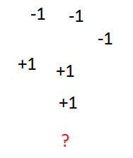{#fig-supervised-point width=22% fig-align="center"}

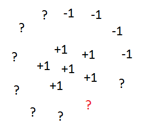{#fig-semi-supervised-points width=40% fig-align="center"}

这就是**半监督学习**：标签稀缺时，同时利用已标注与未标注数据，借助输入空间的内在结构改善分类。

用核 $K_\epsilon$ 从数据构造图 $G=(V,E,W)$。设前 $l$ 个顶点已标注，标签为 $f_1,\ldots,f_l$；其余 $u$ 个未标注，$n=l+u$。希望找 $f:V\to\{-1,1\}$，满足 $f(i)=f_i$（$i\le l$），并在图上尽可能平滑 [@zhu2003semi]：

$$
\min_{\substack{f:V\to\{-1,1\}\\f(i)=f_i,\ i\le l}}
\sum_{i<j}w_{ij}(f(i)-f(j))^2.
$$

放松为实值标签，最后再按符号舍入：

$$
\min_{\substack{f:V\to\mathbb R\\f(i)=f_i,\ i\le l}}
\sum_{i<j}w_{ij}(f(i)-f(j))^2
=\min f^TL_Gf.
$$

::: {.remark}
在实线上，对应的连续问题是最小化 $\int f'(x)^2dx$。分部积分给出

$$
\int f'(x)^2dx=\text{边界项}-\int f(x)f''(x)dx.
$$

在 $\mathbb R^d$ 中，

$$
\int\|\nabla f\|^2dx
=\text{边界项}-\int f\,\Delta f\,dx.
$$

这正解释了“图拉普拉斯算子”这一名称。
:::

按已标注与未标注顶点分块：

$$
D=\begin{bmatrix}D_L&0\\0&D_U\end{bmatrix},\quad
W=\begin{bmatrix}W_{LL}&W_{LU}\\W_{UL}&W_{UU}\end{bmatrix},\quad
L_G=\begin{bmatrix}D_L-W_{LL}&-W_{LU}\\-W_{UL}&D_U-W_{UU}\end{bmatrix},
$$

且 $f=[f_L^T,f_U^T]^T$。其中 $L,U$ 表示两类顶点索引，不要与 $L_G$ 混淆。于是需要最小化

$$
f_L^T(D_L-W_{LL})f_L-2f_U^TW_{UL}f_L
+f_U^T(D_U-W_{UU})f_U.
$$

一阶最优性条件给出[^ssl-optimality]

$$
(D_U-W_{UU})f_U=W_{UL}f_L.
$$

若 $D_U-W_{UU}$ 可逆[^ssl-invertible]，则

$$
f_U^*=(D_U-W_{UU})^{-1}W_{UL}f_L.
$$

[^ssl-optimality]: 一阶最优性条件将在优化一章系统复习。
[^ssl-invertible]: 除非问题退化，例如图的未标注部分与已标注部分完全断开，该矩阵通常可逆。

::: {.remark}
这个 $f$ 称为**调和延拓** [@zhu2003semi]，具有 Euclidean 调和函数的平均值性质和最大值原理。对任意未标注顶点 $v_i$，

$$
f(i)=\frac1{\deg(i)}\sum_{j=1}^nw_{ij}f(j).
$$

所以 $f$ 的最大值和最小值必在已标注点处取得。
:::

### 一个有趣实验与 Sobolev 嵌入定理

在 $[-1,1]^d$ 上取含 $m^d$ 个点的网格，把中心标为 $+1$，所有距中心至少为 $1$ 的顶点标为 $-1$，再用上述算法标记其余点。理想结果应在中心附近取大值，接近已标注边界时逐渐减小。

::: {#fig-ssl-1d layout-ncol=2}
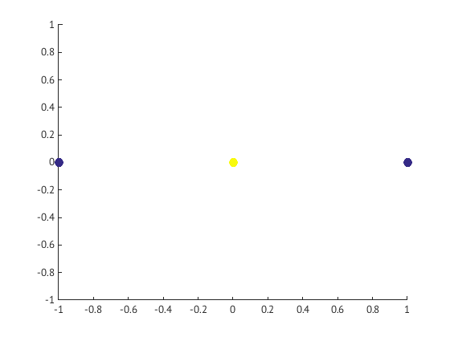
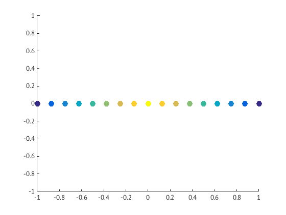
一维情形：颜色表示函数值，算法在标注点之间平滑插值。
:::

::: {#fig-ssl-2d layout-ncol=2}
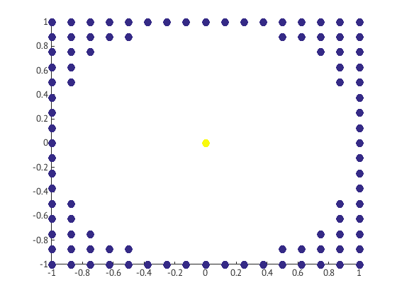
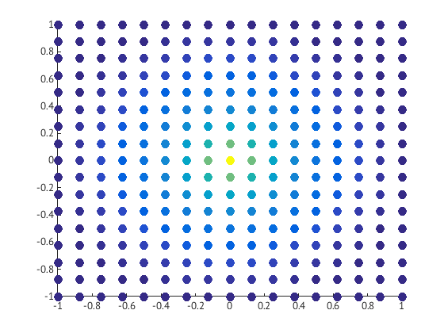
二维情形仍在标注点之间平滑插值。
:::

::: {#fig-ssl-3d layout-ncol=2}
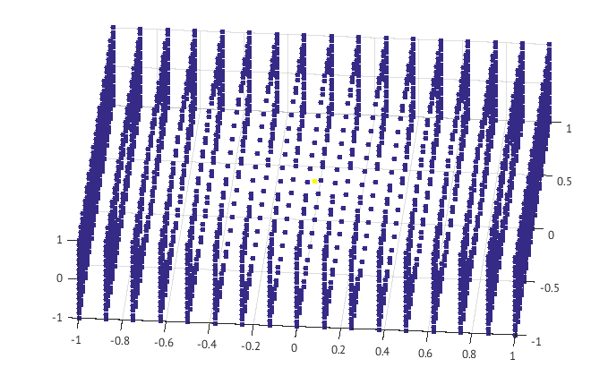
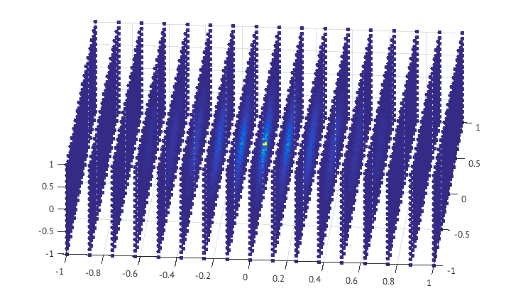
三维情形几乎只学到了标签 $-1$。
:::

$d\le2$ 时结果平滑；$d=3$ 时却几乎处处为 $-1$。在连续空间中考虑单位球上满足 $f(0)=1$、边界取 $-1$，并最小化 $\int\|\nabla f\|^2$ 的问题。令

$$
f_\epsilon(x)=
\begin{cases}
1-2|x|/\epsilon,&|x|\le\epsilon,\\
-1,&\text{其他情形}.
\end{cases}
$$

则

$$
\int_{B_0(1)}\|\nabla f_\epsilon(x)\|^2dx
=\int_{B_0(\epsilon)}\frac1{\epsilon^2}dx
\asymp\epsilon^{d-2}.
$$

当 $d>2$ 时，$\epsilon\to0$ 反而使能量趋于零，这就解释了三维实验。

Sobolev 嵌入定理提供了更系统的理解。$H^m(\mathbb R^d)$ 由直到 $m$ 阶导数都平方可积的函数组成；若 $m>d/2$，则 $f\in H^m(\mathbb R^d)$ 必连续且有界，即 $f\in C_0(\mathbb R^d)$，从而排除 @fig-ssl-3d 中的尖锐行为。这也提示我们控制二阶导数：三维中 $2>3/2$。图上可把 $f^TLf$ 换成 $f^TL^2f$；@fig-ssl-3d-l2 显示额外正则化确实消除了不连续问题，详见 @Nadler_SSL_sobolev_09。

::: {#fig-ssl-3d-l2 layout-ncol=2}

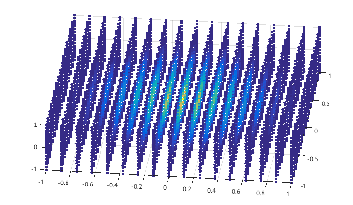
三维实验加入 $f^TL^2f$ 正则化后，颜色表示的函数值恢复平滑。
:::

## 可逆 Markov 链简介

本章已有工具足以简洁介绍可逆 Markov 链；完整论述见 @levinperesmarkovchains2017。这里专注于有限状态空间[^infinite-chain-preview]。

[^infinite-chain-preview]: 理论可较容易推广到无限状态空间上的离散时间链；推广到连续时间 Markov 过程则需要更多工作，见本节后面的评注。

$N$ 状态 Markov 链是在 $[N]$ 上的随机游走，其转移只依赖当前状态而与过去无关，即具有 Markov 性。转移矩阵为

$$
M_{ij}=\mathbb P\{X(t+1)=j\mid X(t)=i\}.
$$ {#eq-markov-transition}

若概率向量 $\pi$ 满足 $\pi^T\mathbf1=1$ 与 $\pi^TM=\pi^T$，则称其为平稳分布[^stationary-existence]。若对任意 $i,j$，存在 $t>0$ 使
$\mathbb P\{X(t)=j\mid X(0)=i\}>0$，则链**不可约**；等价地，不存在能把全部概率质量永久困住的真状态子集。不可约链的平稳分布唯一且严格为正[^irreducible-stationary]。

[^stationary-existence]: 与上一章列随机矩阵命题相似的论证，再结合 Perron--Frobenius 定理，可证明平稳分布存在。
[^irreducible-stationary]: 这也可由 Perron--Frobenius 定理推出。仅有不可约性并不保证收敛到平稳分布，还需要非周期性。

下文假设 $\pi>0$ 唯一。平稳性表示每个状态的总概率流入等于总流出；更强的条件要求每条边上也分别平衡：

$$
\pi_jM_{ji}=\pi_iM_{ij},\qquad i,j\in[N].
$$ {#eq-detailed-balance}

这称为**细致平衡**，满足它的链称为**可逆 Markov 链**。在平衡态观察时，可逆链正向与反向播放具有相同动力学。

令 $\langle x,y\rangle_\pi=\sum_i\pi_ix_iy_i$，则细致平衡意味着 $M$ 在该加权内积下自伴：

$$
\langle x,My\rangle_\pi
=\sum_{i,j}\pi_ix_iM_{ij}y_j
=\sum_{i,j}\pi_jx_iM_{ji}y_j
=\langle Mx,y\rangle_\pi.
$$

定义

$$
W=\operatorname{diag}(\pi)M.
$$ {#eq-W-diag-pi-M}

可逆性等价于 $W$ 对称。又因 $W\ge0$，它可视为 $N$ 顶点加权图的权重矩阵。因此，每个具有严格正平稳分布的可逆链，都可解释成某张加权图上的扩散过程；本章关于扩散映射、谱聚类与 Cheeger 不等式的理论都可直接应用。

Markov 链研究中的核心概念是**混合时间**：从初始分布 $\mu_0$ 出发，需要多少步才能使分布在全变差距离下距 $\pi$ 至多 $\epsilon$。有限空间中

$$
\|\mu-\nu\|_{\rm TV}
=\frac12\sum_{i=1}^N|\mu_i-\nu_i|
=\frac12\|\mu-\nu\|_1.
$$

::: {.definition #def-mixing-time}
**定义（混合时间）。** 对转移矩阵 $M$、唯一平稳分布 $\pi$、初始分布 $\mu_0$ 与 $\epsilon>0$，定义

$$
T_{\rm mix}(M,\mu_0,\epsilon)
=\inf\{t\ge0:\|\mu_0^TM^t-\pi\|_{\rm TV}\le\epsilon\}.
$$

最坏情形混合时间为

$$
T_{\rm mix}(M,\epsilon)
=\sup_{i\in[N]}T_{\rm mix}(M,\delta_i,\epsilon),
$$

其中 $\delta_i=e_i$ 是集中在状态 $i$ 的点质量。
:::

谱泛函不等式可用来控制混合时间。对 $f:[N]\to\mathbb R$，定义 Dirichlet 型

$$
\mathcal E_M(f)=\frac12 f^T\operatorname{diag}(\pi)(I-M)f.
$$

若对所有 $f$ 都有

$$
\operatorname{Var}_\pi(f)\le C_M\mathcal E_M(f),
$$ {#eq-poincare-MC}

则称链满足 Poincare 不等式。这里
$\operatorname{Var}_\pi(f)=\sum_i\pi_i(f_i-\pi^Tf)^2$。最佳常数的倒数称为**谱隙**：

$$
\operatorname{gap}_M
=\inf_{\operatorname{Var}_\pi(f)\ne0}
\frac{\mathcal E_M(f)}{\operatorname{Var}_\pi(f)}.
$$ {#eq-gap-MC}

由 @eq-W-diag-pi-M，图的度矩阵为 $D_W=\operatorname{diag}(\pi)$，且

$$
\mathcal E_M(f)=\frac12f^T(D_W-W)f=\frac12f^TL_Wf,
$$ {#eq-dirichlet-laplacian}

$$
\operatorname{Var}_\pi(f)
=f^TD_Wf-(\mathbf1^TD_Wf)^2.
$$ {#eq-var-DW}

给 $f$ 加上 $\mathbf1$ 的倍数不改变这两个量。因此，利用归一化图拉普拉斯算子
$\mathcal L_W=I-D_W^{-1/2}WD_W^{-1/2}$ 的变分刻画，

$$
\operatorname{gap}_M
=\inf_{\substack{f\ne0\\\mathbf1^TD_Wf=0}}
\frac{f^TL_Wf}{f^TD_Wf}
=\lambda_2(\mathcal L_W)
=1-\lambda_2(M).
$$

与扩散映射类似，处理懒惰链更方便。若 $M_{ii}\ge1/2$ 对所有 $i$ 成立，则称 $M$ **懒惰**；它的全部特征值非负。任意链都可替换为
$M_{\rm lazy}=\frac12M+\frac12I$，可逆性不变，谱隙减半。

::: {.theorem #thm-spectrum-mixing}
**定理（谱与混合）** [@levinperesmarkovchains2017]。设 $M$ 可逆，具有唯一严格正平稳分布 $\pi$，谱隙为 $\operatorname{gap}_M$。则

$$
T_{\rm mix}(M_{\rm lazy},\epsilon)
\le\frac2{\operatorname{gap}_M}
\left[\log\frac1{\pi_{\min}}+\log\frac1\epsilon\right].
$$

若 $M$ 本身懒惰，则

$$
T_{\rm mix}(M,\epsilon)
\le\frac1{\operatorname{gap}_M}
\left[\log\frac1{\pi_{\min}}+\log\frac1\epsilon\right].
$$
:::

::: {.proof}
**证明。** 取 $M$ 的右特征向量 $\varphi_1,\ldots,\varphi_N$，对应
$1=\lambda_1>\lambda_2\ge\cdots\ge\lambda_N$。有
$\varphi_1=\mathbf1$ 且
$\varphi_k^TD_W\varphi_l=\delta_{kl}$。谱分解给出

$$
M^t=\sum_{k=1}^N\lambda_k^t\varphi_k(D_W\varphi_k)^T.
$$

从状态 $i$ 出发，

$$
\delta_i^TM^t
=\pi^T+\sum_{k=2}^N\lambda_k^t\varphi_k(i)\varphi_k^TD_W.
$$

令 $\lambda_*=\max\{\lambda_2,|\lambda_N|\}$。对任意 $j$，由 Cauchy--Schwarz 不等式，

$$
\left|\frac{(\delta_i^TM^t)_j}{\pi_j}-1\right|
\le\lambda_*^t
\left(\sum_{k=2}^N\varphi_k(i)^2\right)^{1/2}
\left(\sum_{k=2}^N\varphi_k(j)^2\right)^{1/2}.
$$ {#eq-MC2}

$D_W^{1/2}\Phi$ 正交，所以

$$
1=\pi_i\sum_{k=1}^N\varphi_k(i)^2
=\pi_i\left(1+\sum_{k=2}^N\varphi_k(i)^2\right).
$$

代入 @eq-MC2 得

$$
\left|\frac{(\delta_i^TM^t)_j}{\pi_j}-1\right|
\le\lambda_*^t\sqrt{\pi_i^{-1}-1}\sqrt{\pi_j^{-1}-1}
\le\frac{\lambda_*^t}{\pi_{\min}}.
$$

因此

$$
\|\delta_i^TM^t-\pi\|_{\rm TV}
\le\frac12\frac{\lambda_*^t}{\pi_{\min}}.
$$

若 $M$ 懒惰，则 $\lambda_N\ge0$，且
$\lambda_*=1-\operatorname{gap}_M$，于是

$$
\|\delta_i^TM^t-\pi\|_{\rm TV}
\le\frac{e^{-\operatorname{gap}_Mt}}{2\pi_{\min}}.
$$

令右端不超过 $\epsilon$，得到

$$
T_{\rm mix}(M,\epsilon)
\le\frac1{\operatorname{gap}_M}
\log\frac1{2\epsilon\pi_{\min}}
\le\frac1{\operatorname{gap}_M}
\left[\log\frac1{\pi_{\min}}+\log\frac1\epsilon\right].
$$

最后，$M_{\rm lazy}$ 总是懒惰，且
$\operatorname{gap}_{M_{\rm lazy}}=\operatorname{gap}_M/2$，得到第一式。证毕。
:::

该定理说明，混合时间由底层加权图的 Fiedler 特征值控制；Cheeger 不等式又把这一特征值与图中的瓶颈，即小割，直接联系起来。合在一起可理解为：若图中没有瓶颈，相应 Markov 链必然快速混合。

利用 Log--Sobolev 不等式通常还能改善对 $\pi_{\min}$ 的依赖。它以测试函数的熵代替方差，往往能把 $\log(\pi_{\min}^{-1})$ 改进为
$\log\log(\pi_{\min}^{-1})$；参见 @Diaconisetal-LogSobolev96。

::: {.remark #rem-infinite-markov}
上述理论可通过 Markov 转移核的谱推广到无限状态空间，也可发展成连续时间 Markov 过程理论，见 @FukushimaOshimaTakeda2011。Gaussian Poincare 不等式对某个连续 Markov 过程扮演与 @eq-poincare-MC 相同的角色；另见 @vanHandel_LectureNotesProb_14。
:::

许多重要链的状态空间为指数规模，例如 $\{\pm1\}^n$ 有 $N=2^n$ 个状态；目标却是得到关于 $n$ 的多项式混合时间。

### 关于 Markov 链 Monte Carlo 方法

Markov 链 Monte Carlo（MCMC）用于从只知道未归一化密度的高维分布采样 [@hastings1970monte; @robert1999monte]，是统计物理 [@krauth2006statistical] 与高维 Bayesian 统计 [@gelman1995bayesian] 的核心工具。

考虑超立方体 $\{\pm1\}^n$ 上的分布；每个 $\pm1$ 分量称为一个**自旋**。给定对称矩阵 $J$ 与 $\beta\ge0$，定义 Gibbs 测度[^inverse-temperature]

$$
\pi_x=\frac1{Z_n}\exp(\beta x^TJx),
\qquad
Z_n=\sum_{x\in\{\pm1\}^n}\exp(\beta x^TJx).
$$ {#eq-gibbs-measure}

[^inverse-temperature]: 在统计物理中，$\beta=1/T$ 是逆温度，控制能量与熵的权衡。

不同的 $J$ 给出 Curie--Weiss、Ising、Sherrington--Kirkpatrick 与 Edwards--Anderson 等模型。两社群随机块模型中，在给定图边后节点归属的后验分布也自然具有此形式，见 @Abbe_SBM_survey。计算配分函数 $Z_n$ 需要指数项求和，十分困难；但相对概率 $\pi_x/\pi_y$ 易于计算。

为了从正分布 $\pi$ 采样，先在 $[N]$ 上取简单无权 $d$-正则图。链在状态 $x$ 均匀选择邻居 $y$，随后以概率
$\pi_y/(\pi_x+\pi_y)$ 移到 $y$，以概率
$\pi_x/(\pi_x+\pi_y)$ 留在 $x$。读者可验证它关于 $\pi$ 可逆，因而以 $\pi$ 为平稳分布；这就是 Metropolis 算法的一种形式 [@Newman-Barkema-MCMC99][^metropolis-proposal]。

[^metropolis-proposal]: 邻居建议不必均匀，但此时接受率必须把建议概率纳入，才能保持关于 $\pi$ 的可逆性。

回到 @eq-gibbs-measure，在 $\{\pm1\}^n$ 上连接恰好相差一个自旋的状态，就得到 $N=2^n,d=n$ 的 Glauber 动力学 [@levinperesmarkovchains2017][^heat-bath]。许多情形下，它能在关于 $n$ 的多项式时间，也就是关于 $N$ 的对数级时间内采样 Gibbs 分布。相关链混合时间的近期进展见 @AnariLiuOveisGharanFOCS2020 与 @ChenEldan2025LocalizationSchemes。

[^heat-bath]: 在物理中，这可看作“热浴”：固定其余自旋后，对一个自旋重新采样。

## 习题 {.unnumbered}

::: {.exercise #exr-random-walk-eigenvalues}
**随机游走：特征值。** 设 $G=(V,E,W)$ 是无向加权图。

1. 若 $B=P^{-1}AP$，证明 $A,B$ 特征值相同，且几何重数相同。
2. 证明 $M=D^{-1}W$ 与 $S=D^{-1/2}WD^{-1/2}$ 相似。
3. 推出 $M$ 的所有特征值均为实数。
4. 证明 $M$ 的特征值都属于 $[-1,1]$，且 $1$ 是特征值。
:::

::: {.exercise #exr-random-walk-connectivity}
**随机游走：连通性。** 证明 $M=D^{-1}W$ 的最大特征值为单特征值，当且仅当 $G$ 连通。这里连通路径上的边都须具有正权重。
:::

::: {.exercise #exr-equilibrium-distribution}
**平衡分布。** 设 $X$ 是图上的随机游走，转移概率为 $w_{ij}/\deg(i)$。假设存在平衡分布 $\pi$，使从任意 $i$ 出发都有

$$
\mathbb P\{X(t)=j\mid X(0)=i\}\to\pi_j.
$$

证明 $\lambda_2(M)<1$。

**提示。** 对任意 $i_1,i_2,j$，两个不同起点在时刻 $t$ 到达 $j$ 的概率之差趋于零。
:::

::: {.exercise #exr-cycle-diffusion}
**环图的截断扩散映射。** 设 $n\ge2$，$\omega=e^{-2\pi\mathrm i/n}$。本题矩阵行列从 $0$ 编号至 $n-1$。

1. DFT 矩阵 $F_{jk}=n^{-1/2}\omega^{jk}$。证明 $F$ 酉，即 $F^*F=FF^*=I$。
2. 循环矩阵满足 $C_{jk}=c_{j-k\bmod n}$，即
   $$
   C=\begin{pmatrix}
   c_0&c_{n-1}&\cdots&c_1\\
   c_1&c_0&\cdots&c_2\\
   \vdots&\vdots&\ddots&\vdots\\
   c_{n-1}&c_{n-2}&\cdots&c_0
   \end{pmatrix}.
   $$
   证明 $FCF^*$ 为对角矩阵。
3. 推出 $C$ 的特征值为
   $$
   \lambda_j=\sum_{k=0}^{n-1}c_k\omega^{kj},\qquad j=0,\ldots,n-1,
   $$
   这里不保证按大小排序。
4. 对长度 $n\ge3$ 的环图 $C_n$，求二维截断扩散映射。
:::

::: {.exercise}
**完全图的扩散映射。** 对 $n\ge3$ 的完全图 $K_n$ 求扩散映射；实特征基不唯一，任选一组即可。
:::

::: {.exercise}
**懒惰游走的扩散映射。** 设 $\varphi_t$ 是由 $M$ 构造的扩散映射，$M'=(M+I)/2$，$\varphi'_t$ 是对应懒惰游走的扩散映射。证明对 $t\ge1$，

$$
\varphi'_t=2^{-t}\sum_{u=0}^t{t\choose u}\varphi_u.
$$
:::

::: {.exercise}
**懒惰游走的非周期性。**

1. 证明 $M'=(M+I)/2$ 未必对称，但有 $n$ 个非负特征值。
2. 证明懒惰随机游走非周期：不存在整数 $k>1$，使所有满足 $((M')^t)_{ii}>0$ 的 $t$ 都被 $k$ 整除。
3. 若 $W$ 不可约，证明存在 $T$，使任意 $t\ge T$ 时 $(M')^t$ 的所有元素都为正，即链正则。
:::

::: {.exercise}
证明平均首次到达时间 $t_{ij}=\mathbb E[\tau_{ij}]$ 满足三角不等式。
:::

::: {.exercise}
设 $L=D-W$ 是连通无向加权图的拉普拉斯矩阵。证明

$$
L^\dagger=\left(L+\frac1n\mathbf1\mathbf1^T\right)^{-1}
-\frac1n\mathbf1\mathbf1^T.
$$
:::

::: {.exercise}
$L^\dagger$ 的所有元素是否必非负？即是否总有 $L^\dagger_{ij}\ge0$？
:::

::: {.exercise #exr-hitting-ssl}
**到达时间与半监督学习。** 设连通无向图的顶点分为 $V_+,V_-,V^*$，前两者标签分别为 $1,0$，后者未标注；每个未标注点至少与一个已标注点相连。令

$$
f^*=\arg\min_{\substack{f:V\to\mathbb R\\f|_{V_+}=1,\ f|_{V_-}=0}}
\sum_{i<j}w_{ij}(f(i)-f(j))^2.
$$ {#eq-ssl-opt-exercise}

考虑转移概率 $w_{ij}/\deg(i)$ 的随机游走。令 $g(i)$ 为从 $i$ 出发先到 $V_+$ 而非 $V_-$ 的概率。

1. 验证转移概率对 $j$ 求和为 $1$。
2. 证明 $g|_{V_+}=1$、$g|_{V_-}=0$。
3. 对未标注 $i$，证明
   $$
   g(i)=\frac1{\deg(i)}\sum_{j\in V_+}w_{ij}
   +\frac1{\deg(i)}\sum_{j\in V^*}w_{ij}g(j).
   $$ {#eq-g-hitting}
4. 由 @eq-ssl-opt-exercise 的一阶最优性条件证明 $f^*$ 也满足 @eq-g-hitting，并推出 $f^*=g$。
:::

::: {.exercise}
考虑连续去噪问题

$$
\min_g\|f-g\|_{L^2(\Omega)}^2
+\mu\int_\Omega g(x)\Delta^kg(x)\,dx,
$$

其中 $\Delta^k$ 是 $k$ 次迭代 Laplace 算子。求 $g$ 并判断它属于哪个 Sobolev 空间。再研究图上的对应问题

$$
\min_{g:V\to\mathbb R}(f-g)^TD(f-g)+\mu g^TL^kg.
$$

**提示。** 用适当算子的特征函数或特征向量展开 $g$。
:::

::: {.exercise}
构造 $H^1(\mathbb R^2)$ 中函数序列 $\{f_n\}$，使
$\|f_n\|_{H^1}\to0$，但其极限不属于 $C_0(\mathbb R^2)$，从而说明
$f\in H^1(\mathbb R^2)$ 并不蕴含 $f\in C_0(\mathbb R^2)$。

**提示。** 考虑对数函数。
:::

::: {.exercise}
用离散 Sobolev 范数 $H^m(V)$（$m\ge1$）作代价，推导 $l$ 个已标注点、$u=n-l$ 个未标注点的延拓解：

$$
\min_{f:V\to\mathbb R}f^T(D+L^m)f,
\qquad f(i)=f_i, i=1,\ldots,l.
$$
:::

::: {.exercise}
若 $l$ 个标签含测量误差，推导“有噪延拓”问题的解：

$$
\min_{g:V\to\mathbb R}
\sum_{i=1}^ld_i(f(i)-g(i))^2+\mu g^T(D+L^m)g.
$$
:::

::: {.exercise}
用 Matlab 或 Python 从二维 Gaussian 混合模型独立采样 $n$ 个未标注点：

$$
X_1\sim\mathcal N((-1,-1),\sigma^2I),\qquad
X_2\sim\mathcal N((1,1),\sigma^2I),
$$

并以独立 Bernoulli$(1/2)$ 变量 $Z$ 定义 $X=ZX_1+(1-Z)X_2$。把两个中心加入数据并分别标为红、蓝。

1. 使用相似度 $w_{ij}=\exp(-\|x_i-x_j\|^2/\varepsilon)$ 和调和延拓标记未标注点。尝试不同的 $n,\sigma,\varepsilon$，尤其观察大 $n$ 时的行为。
2. 把 $f^TLf$ 换成对应 $H^2(\mathbb R^2)$ Sobolev 范数的 $f^T(D+L^2)f$。比较两种方法的分类误差，并结合 Sobolev 嵌入定理解释结果。
:::
