优化位于现代数据科学的中心。无论是拟合线性回归、聚类、求欠定方程组的稀疏解，还是训练深度神经网络，底层任务几乎总是相同的：**寻找使某个明确目标函数最小或最大的参数**。

本章从数据科学视角给出简明、严谨且实用的优化入门。我们先形式化优化问题：要最小化的函数、可供选择的变量，以及限制解的约束；继而讨论凸性，以及分析最优性所需的梯度、Hessian、Karush--Kuhn--Tucker（KKT）条件、对偶性和收敛速度；最后研究梯度下降及其常见变体，它们是大规模机器学习的核心工具。系统论述可参见 @LVanderberghe_SBoyd_book、@calafiore2014optimization、@nesterov2013introductory 与 @nocedal2006numerical。

一般的数学优化问题可写成[^max-as-min]

$$
\begin{array}{ll}
\underset{x\in\mathcal D}{\operatorname{minimize}}&f(x)\\
\text{满足}&g_i(x)\le b_i,\quad i=1,\ldots,m,\\
&h_j(x)=c_j,\quad j=1,\ldots,r.
\end{array}
$$ {#eq-optimization-problem}

[^max-as-min]: 最大化 $f(x)$ 等价于最小化 $-f(x)$，因此也包含在这个框架中。

$x\in\mathcal D$ 是**优化变量**，$\mathcal D$ 是搜索空间或定义域，常取 $\mathbb R^n$。函数 $f:\mathcal D\to\mathbb R$ 是**目标函数**；在数据科学与机器学习中，最小化时常称成本函数或损失函数，最大化时常称效用函数。$g_i,h_j$ 分别是不等式与等式约束函数，$b_i,c_j$ 是约束界限[^canonical-domain]。没有约束时称为**无约束优化**，否则称为**约束优化**。

[^canonical-domain]: 也可以把约束直接并入 $\mathcal D$，但把 $\mathcal D$ 保持为 $\mathbb R^n$ 或 $\{\pm1\}^n$ 一类标准集合，并把实例特有约束单列出来，通常更方便；讨论约束优化时会看到这一点。

若 $x^*$ 满足全部约束，并且对任何其他可行 $z$ 都有 $f(z)\ge f(x^*)$，则称 $x^*$ 为**最优点**或问题的一个**解**。所有满足约束的点组成**可行域**，记为 $\mathcal F$。

许多基础数据科学模型都符合这一结构。线性回归通常无约束地最小化均方误差；logistic 回归最小化交叉熵，除非显式加入正则化或参数界限，也属于无约束问题；聚类与社群检测则可写成带离散约束的 @eq-optimization-problem。这个统一语言将贯穿后续方法。

问题结构决定求解难度与可用算法。PCA 目标只含连续变量；$k$-均值同时含簇指派这一离散变量与簇中心这一连续变量；最小二分割只含离散变量。本章主要讨论连续优化。本书遇到组合问题时，也常像谱聚类那样把它松弛为合适的连续问题。组合优化可参见 @wolsey1999integer 与 @schrijver2003combinatorial。

离散问题并不必然比连续问题困难。虽然组合可行域常有指数规模，例如 $\{\pm1\}^n$，但
$\min_{x\in\{\pm1\}^n}\mathbf1^Tx$ 显然容易。反过来，$NP$-困难的 Max-Cut 也能等价写成连续问题：把 $x\in\{\pm1\}^n$ 换成 $-1\le x_i\le1$，参见章末习题。因此，真正关键的是目标与可行域的几何和计算结构，而不是变量表面上离散还是连续。

## 优化中的凸性

凸性是连续优化中最重要的数学概念之一，它往往直接决定问题的复杂度与可解性。

::: {.definition #def-convex-function}
**定义。** 若对所有 $x,y\in\mathbb R^d$ 与 $\lambda\in[0,1]$，函数
$f:\mathbb R^d\to\mathbb R$ 都满足

$$
f(\lambda x+(1-\lambda)y)
\le\lambda f(x)+(1-\lambda)f(y),
$$ {#eq-convex-function}

则称 $f$ **凸**。若 $x\ne y$ 且 $\lambda\in(0,1)$ 时不等式严格，则称 $f$ **严格凸**。
:::

几何上，函数图像上任意两点的连线都位于图像之上[^convex-intuition]。若 $f$ 连续可微，凸性等价于一阶条件（证明留作习题）

$$
f(y)\ge f(x)+\langle\nabla f(x),y-x\rangle,
\qquad x,y\in\mathbb R^d.
$$ {#eq-first-order-convexity}

即函数图像处处位于切平面之上，见 @fig-convex-tangent。

[^convex-intuition]: 一个直观理解是：若算法位于 $y$，而某点 $x$ 的目标值更低，那么从 $y$ 朝 $x$ 移动时目标立即下降，不会遇到局部算法无法越过的障碍。后面会把这一点严格化。

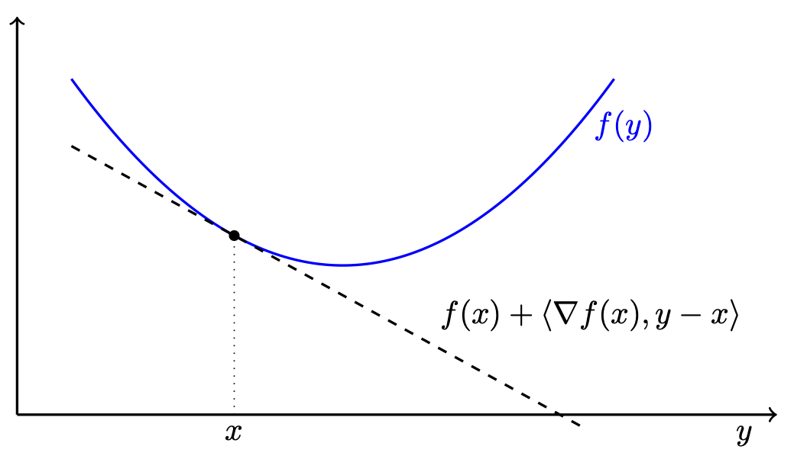{#fig-convex-tangent width=70% fig-align="center"}

在 @eq-first-order-convexity 右侧再加入正的二次项，便得到强凸性。

::: {.definition #def-strong-convexity}
**定义。** 若可微函数 $f:\mathbb R^d\to\mathbb R$ 对所有 $x,y$ 满足

$$
f(y)\ge f(x)+\langle\nabla f(x),y-x\rangle
+\frac\mu2\|y-x\|^2,
$$ {#eq-strong-convexity}

则称 $f$ 为 **$\mu$-强凸函数**，其中 $\mu>0$。
:::

强凸性稍后会带来指数收敛速度。

::: {.lemma #lem-convex-minimizers}
**引理。**

1. 凸函数 $f:\mathbb R^d\to\mathbb R$ 的极小点集合是凸集，其基数只能是 $0$、$1$ 或无穷。
2. 若 $f$ 还可微且 $\mu$-强凸，则它恰有一个极小点。
:::

::: {.proof}
**证明。** 若 $x^*,x^{**}$ 都是极小点，由 @eq-convex-function，二者的每个凸组合也达到同一最小值，所以极小点集合凸；若不止一个点，就含整条线段，因而无限。

若 $f$ 为 $\mu$-强凸，@eq-strong-convexity 说明它有严格凸的二次下界，故在 $\mathbb R^d$ 上强制趋于无穷并达到最小值。设极小点为 $x^*$，则 $\nabla f(x^*)=0$。再由 @eq-strong-convexity，对任意 $x\ne x^*$，

$$
f(x)\ge f(x^*)+\frac\mu2\|x-x^*\|^2>f(x^*),
$$

所以极小点唯一。证毕。
:::

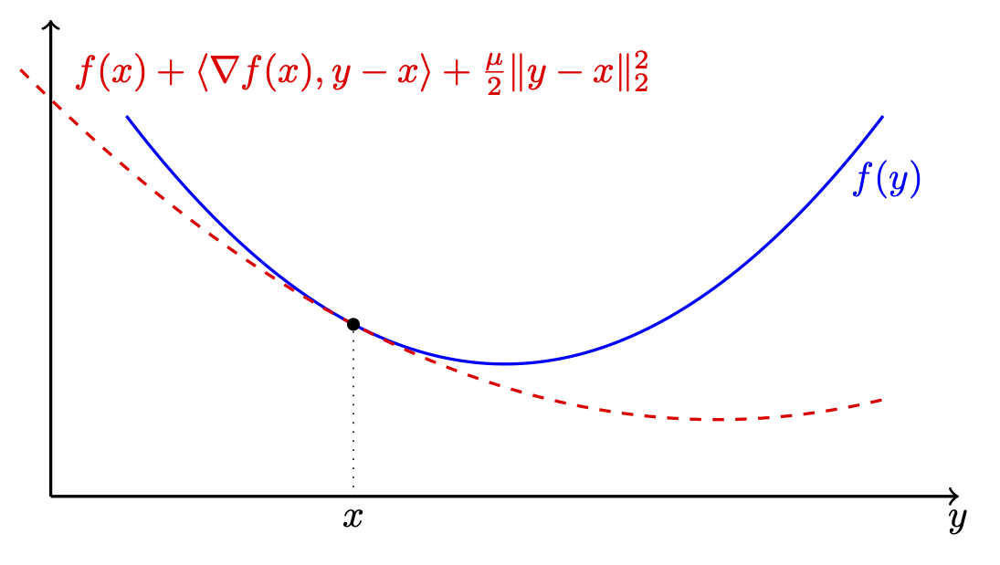{#fig-strongly-convex width=70% fig-align="center"}

### 凸优化问题

若对任意 $x,y\in\mathcal F$ 与 $\lambda\in[0,1]$，都有
$\lambda x+(1-\lambda)y\in\mathcal F$，则称集合 $\mathcal F$ 凸。

::: {.definition}
**定义（凸优化问题）。** 若：

1. 可行域 $\mathcal F$ 是凸集；
2. 目标函数 $f$ 是凸函数，

则称最小化问题为**凸优化问题**[^convex-maximization]。
:::

[^convex-maximization]: 本章默认最小化。若是最大化问题，则目标须为凹函数，问题才是凸优化。

::: {.theorem #thm-fundamental-convex-optimization}
**定理（凸优化基本定理）。** 设 $f:\mathbb R^n\to\mathbb R$ 在凸集
$C\subseteq\mathbb R^n$ 上凸。若 $x^*\in C$ 是 $f$ 在 $C$ 上的局部极小点，则它也是全局极小点。若 $f$ 进一步严格凸，则全局极小点唯一。
:::

::: {.proof}
**证明。** 反设 $x^*$ 不是全局极小点，则存在 $y\in C$ 使
$f(y)<f(x^*)$。对 $\lambda\in[0,1]$，令

$$
x_\lambda=(1-\lambda)x^*+\lambda y\in C.
$$

由凸性，任意 $\lambda>0$ 都有

$$
f(x_\lambda)
\le(1-\lambda)f(x^*)+\lambda f(y)
<f(x^*).
$$

但 $\lambda\to0^+$ 时 $x_\lambda\to x^*$，所以任意小邻域中都有目标值更低的点，与局部极小矛盾。故 $x^*$ 全局最优。严格凸时，若有两个不同全局极小点，其中点会由严格凸性取得更小值，矛盾；故解唯一。证毕。
:::

该定理保证：只要算法在凸问题中收敛到局部极小点，就已经找到全局最优解[^stationary-versus-local]。凸问题没有伪局部极小，而且通常存在具有强保证的高效算法[^convex-not-always-easy]。线性回归、压缩感知、logistic 回归和支持向量机等经典模型都可构成凸优化问题。

[^stationary-versus-local]: 对可微无约束凸问题，驻点，即梯度为零的点，就是全局极小点；约束问题还需相应最优性条件。
[^convex-not-always-easy]: “凸”本身不自动意味着高效可解。例如，若凸可行集由指数多约束隐式定义，判断候选点是否可行就可能很难。

### 重要的凸优化类别

凸问题常写成

$$
\begin{array}{ll}
\underset{x\in\mathbb R^n}{\operatorname{minimize}}&f(x)\\
\text{满足}&g_i(x)\le0,quad i=1,\ldots,m,\\
&Ax=b,
\end{array}
$$ {#eq-general-convex-problem}

其中 $f,g_i$ 都凸。

若目标与约束均为线性或仿射函数，就是**线性规划**（LP），标准写法为

$$
\begin{array}{ll}
\underset{x\in\mathbb R^n}{\operatorname{minimize}}&\langle c,x\rangle\\
\text{满足}&\langle g_i,x\rangle\le c_i,quad i=1,\ldots,m,\\
&Ax=b,
\end{array}
$$ {#eq-linear-program}

其中 $A\in\mathbb R^{r\times n}$、$g_i,c\in\mathbb R^n$、$b\in\mathbb R^r$。若目标及不等式约束是至多二次的多项式，就是**二次规划**（QP）。并非所有二次函数都凸，所以二次规划也可能非凸；线性规划与二次规划会在压缩感知一章再次出现。

**半正定规划**（SDP）在线性目标下，约束对称矩阵的仿射组合半正定。半正定约束虽非线性，却是凸的，且 SDP 有高效算法 [@LVanderberghe_SBoyd_1996]。令 $\mathbb S^n$ 为 $n\times n$ 实对称矩阵空间，配备 Hilbert--Schmidt 内积
$\langle A,B\rangle=\operatorname{tr}(A^TB)$。标准 SDP 为

$$
\begin{array}{ll}
\underset{X\in\mathbb S^n}{\operatorname{minimize}}&\langle C,X\rangle\\
\text{满足}&\langle A_i,X\rangle=b_i,quad i=1,\ldots,m,\\
&X\succeq0,
\end{array}
$$ {#eq-semidefinite-program}

其中 $C,A_i\in\mathbb S^n$。SDP 将在社群检测一章发挥重要作用。

@eq-semidefinite-program 更自然地看成在凸锥 $K$ 上优化；锥是对非负缩放封闭的集合。后面的对偶推导虽主要采用 @eq-general-convex-problem 的形式，也可推广到凸锥。锥的对偶为

$$
K^*=\{y:\langle y,x\rangle\ge0,\ \forall x\in K\}.
$$

半正定锥与 $\mathbb R^n$ 中非负向量锥都是自对偶锥。社群检测一章将显式推导一个 SDP 的对偶。

### 非凸优化

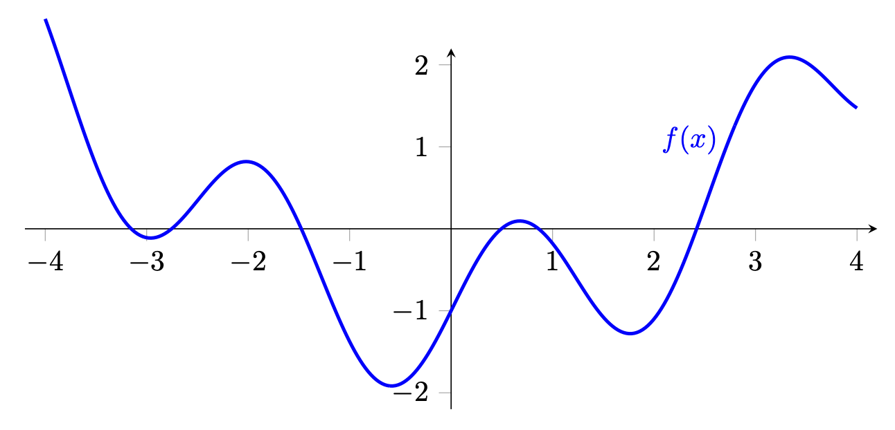{#fig-nonconvex width=70% fig-align="center"}

若目标 $f$ 非凸、可行域 $\mathcal F$ 非凸，或二者同时非凸，问题就是**非凸优化**。数据科学与深度学习中的非凸问题常含许多局部极小点和鞍点，见 @fig-nonconvex；它们通常依赖启发式或迭代方法，很少能保证全局最优。后面会讨论梯度下降在非凸问题中的收敛结果。

::: {.remark}
**光滑优化与非光滑优化。** 光滑问题的目标与约束可微，后面介绍的梯度算法通常很有效。非光滑问题的目标或约束并非处处可微，例如压缩感知中的 $\ell_1$ 惩罚，以及支持向量机中的 hinge 损失；这类问题需要次梯度法、近端方法等专门技术。
:::

## 无约束优化的最优性条件

最优性条件为判断候选解是局部还是全局最优提供数学判据。它们描述最优解必须具备、以及有时足以保证最优的性质，因而构成大多数优化算法的理论基础。先从无约束问题开始。

### 一阶必要条件

一阶条件依赖目标函数 $f$ 的梯度。$f$ 关于 $x$ 的梯度是偏导数组成的向量：

$$
\nabla_x f(x)=
\left(
\frac{\partial f(x)}{\partial x_1},
\frac{\partial f(x)}{\partial x_2},\ldots,
\frac{\partial f(x)}{\partial x_d}
\right).
$$ {#eq-gradient-definition}

上下文明确时简写为 $\nabla f(x)$。

::: {.theorem #thm-first-order-unconstrained}
**定理。** 设 $f:\mathbb R^n\to\mathbb R$ 连续可微。若 $x^*$ 是 $f$ 的局部极小点，则

$$
\nabla f(x^*)=0.
$$
:::

::: {.proof}
**证明。** 任取方向 $d\in\mathbb R^n$，定义单变量函数

$$
\varphi(t)=f(x^*+td).
$$

因为 $x^*$ 局部极小，$t=0$ 是 $\varphi$ 的局部极小点，故
$\varphi'(0)=0$。链式法则给出

$$
\varphi'(0)=\nabla f(x^*)^Td.
$$

该式对所有方向 $d$ 都为零，唯一可能是
$\nabla f(x^*)=0$。证毕。
:::

这个条件必要却不充分：$\nabla f(x)=0$ 时，$x$ 未必是局部极值。所有满足梯度为零的点统称为**临界点**。

### 二阶条件

要判断临界点是否真是局部极值，需要利用二阶信息。

::: {.definition #def-saddle-point}
**定义。** 设 $f\in C^2$。若 $\nabla f(x^*)=0$，但 Hessian
$\nabla^2f(x^*)$ 不定，则称 $x^*$ 为 $f$ 的**鞍点**。
:::

鞍点是临界点，却不是局部极值，见 @fig-saddle-point。

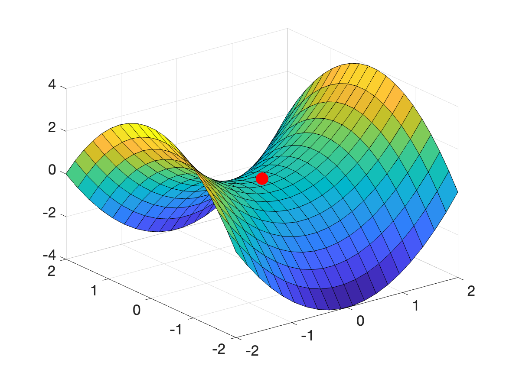{#fig-saddle-point width=50% fig-align="center"}

::: {.theorem #thm-second-order-necessary}
**定理（二阶必要条件）。** 若 $f\in C^2$，且 $x^*$ 是局部极小点，则

$$
\nabla^2f(x^*)\succeq0.
$$
:::

::: {.proof}
**证明。** 在 $x^*$ 附近作 Taylor 展开：

$$
f(x^*+d)=f(x^*)+\nabla f(x^*)^Td
+\frac12d^T\nabla^2f(x^*)d+o(\|d\|^2).
$$

局部极小性说明足够小的 $d$ 满足
$f(x^*+d)-f(x^*)\ge0$；一阶必要条件又给出
$\nabla f(x^*)=0$，所以

$$
\frac12d^T\nabla^2f(x^*)d+o(\|d\|^2)\ge0.
$$

固定任意方向 $u$，令 $d=tu$，除以 $t^2$ 后令 $t\to0$，得到
$u^T\nabla^2f(x^*)u\ge0$。因此 Hessian 半正定。证毕。
:::

同理，若 $x^*$ 是局部极大点，则
$\nabla^2f(x^*)\preceq0$。

::: {.theorem #thm-second-order-sufficient}
**定理（二阶充分条件）。** 设 $f\in C^2$。若

$$
\nabla f(x^*)=0,
\qquad
\nabla^2f(x^*)\succ0,
$$

则 $x^*$ 是严格局部极小点。
:::

::: {.proof}
**证明。** 正定性意味着存在 $c>0$，使所有 $d$ 都满足

$$
d^T\nabla^2f(x^*)d\ge c\|d\|^2.
$$

再次使用 Taylor 展开，

$$
f(x^*+d)-f(x^*)
=\frac12d^T\nabla^2f(x^*)d+o(\|d\|^2)
\ge\frac c2\|d\|^2+o(\|d\|^2).
$$

当非零 $d$ 足够小时，右端严格为正，故 $x^*$ 是严格局部极小点。证毕。
:::

若 $f\in C^2$ 且 Hessian 处处正定，则 $f$ 严格凸；反之未必。例如 $f(x)=x^4$ 严格凸，但 $f''(0)=0$，所以在原点 Hessian 并不正定。类似地，二阶必要条件中的“半正定”也不充分：$f(x)=x^3$ 在原点梯度和二阶导数都为零，却没有局部极值。

#### 例：最小二乘

线性回归一章从统计角度分析了最小二乘；这里从优化角度检验上述条件。考虑

$$
\min_x f(x)=\frac12\|Ax-b\|^2,
\qquad A\in\mathbb R^{m\times n},\quad m\ge n.
$$ {#eq-least-squares-optimization}

数值线性代数通常通过正交投影求解；这里按照 @thm-first-order-unconstrained 令梯度为零。展开目标：

$$
f(x)=\frac12(x^TA^TAx-x^TA^Tb-b^TAx+b^Tb).
$$

因此

$$
\nabla f(x)=A^TAx-A^Tb.
$$

一阶条件给出

$$
A^TAx=A^Tb,
$$ {#eq-normal-equations}

这就是**正规方程**。令残差 $r(x)=b-Ax$，则

$$
A^Tr(x)=0
\quad\Longleftrightarrow\quad
r(x)\perp\operatorname{col}(A).
$$

所以极小点 $x^*$ 使 $Ax^*$ 成为 $b$ 到
$\operatorname{col}(A)\subset\mathbb R^m$ 的正交投影，见 @fig-least-squares-projection。

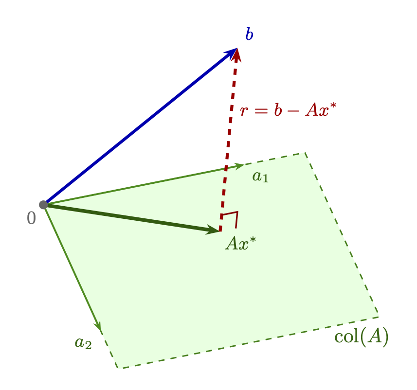{#fig-least-squares-projection width=65% fig-align="center"}

等价地，

$$
Ax^*=P_{\operatorname{col}(A)}b.
$$

若 $A$ 满列秩，则

$$
P_{\operatorname{col}(A)}=A(A^TA)^{-1}A^T,
$$

且 $A^TA$ 对称正定、可逆，于是

$$
x^*=(A^TA)^{-1}A^Tb.
$$ {#eq-least-squares-solution}

目标的 Hessian 为 $\nabla^2f=A^TA\succ0$，所以 $f$ 严格凸；由凸优化基本定理，$x^*$ 是唯一全局极小点。

#### 最小二乘的最小范数解

若 $A$ 不满列秩，即 $\operatorname{rank}(A)<n$，则 $A^TA$ 只半正定且奇异。正规方程仍总相容，但可能有许多解。若 $x_0$ 是任一特解，全部极小点恰为

$$
\{x_0+z:z\in\ker(A)\}.
$$ {#eq-normal-solution-set}

其中有一个规范选择：Euclidean 范数最小的唯一解。它由 Moore--Penrose 伪逆给出：

$$
x^\dagger=A^\dagger b.
$$

满列秩时 $A^\dagger=(A^TA)^{-1}A^T$，恢复 @eq-least-squares-solution。一般而言，$x^\dagger$ 解下面的约束问题：

$$
\begin{array}{ll}
\operatorname{minimize}&\|x\|\\
\text{满足}&A^TAx=A^Tb.
\end{array}
$$ {#eq-minimum-norm-least-squares}

若原方程 $Ax=b$ 相容，约束可直接写为 $Ax=b$。最小范数解满足

$$
x^\dagger\perp\ker(A),
$$

因而不含任何不会改变输出的额外零空间分量。在物理中，它对应最小能量解；若对解采用独立同分布 Gaussian 先验，则它也与相应的最大后验/正则化估计联系密切。

## 约束优化：对偶与 KKT 条件

把一般问题稍作改写为

$$
\begin{array}{ll}
\operatorname{minimize}&f(x)\\
\text{满足}&g_i(x)\le0,quad i=1,\ldots,m,\\
&h_j(x)=0,quad j=1,\ldots,r,
\end{array}
$$ {#eq-primal-standard}

其最优值记为 $p^*$。目前并不假设问题凸。

### Lagrangian 与 Lagrange 对偶

Lagrange 对偶的核心，是把约束函数的加权和并入目标。定义

$$
\mathcal L(x,\lambda,\nu)
=f(x)+\sum_{i=1}^m\lambda_i g_i(x)
+\sum_{j=1}^r\nu_jh_j(x),
$$

其中不等式约束的 Lagrange 乘子满足 $\lambda_i\ge0$，等式约束的乘子 $\nu_j$ 无符号限制；简写 $\lambda\ge0$ 表示逐分量非负。

**Lagrange 对偶函数**定义为

$$
\theta(\lambda,\nu)=\inf_{x\in\mathcal D}\mathcal L(x,\lambda,\nu).
$$

$\lambda,\nu$ 也称**对偶变量**。若 Lagrangian 关于 $x$ 无下界，则
$\theta=-\infty$。

::: {.lemma #lem-dual-lower-bound}
**引理。** $\theta(\lambda,\nu)$ 关于 $(\lambda,\nu)$ 联合凹。并且对任意 $\lambda\ge0$ 与任意 $\nu$，

$$
\theta(\lambda,\nu)\le p^*.
$$ {#eq-dual-lower-bound}
:::

::: {.proof}
**证明。** 固定 $x$ 时，$\mathcal L$ 关于 $(\lambda,\nu)$ 仿射；一族仿射函数的逐点下确界是凹函数。这一点不要求原问题凸。

若 $\bar x$ 可行，则 $g_i(\bar x)\le0$、$h_j(\bar x)=0$。当 $\lambda\ge0$ 时，

$$
\mathcal L(\bar x,\lambda,\nu)
=f(\bar x)+\sum_i\lambda_i g_i(\bar x)
+\sum_j\nu_jh_j(\bar x)
\le f(\bar x).
$$

而

$$
\theta(\lambda,\nu)
=\inf_{x\in\mathcal D}\mathcal L(x,\lambda,\nu)
\le\mathcal L(\bar x,\lambda,\nu).
$$

所以对每个可行 $\bar x$ 都有
$\theta(\lambda,\nu)\le f(\bar x)$；再对可行点取下确界即得
@eq-dual-lower-bound。证毕。
:::

#### 例：欠定线性方程

考虑相容方程组的最小范数平方问题：

$$
\begin{array}{ll}
\operatorname{minimize}&x^Tx\\
\text{满足}&Ax=b,
\end{array}
\qquad A\in\mathbb R^{r\times n}.
$$ {#eq-minnorm-dual-example}

Lagrangian 与对偶函数为

$$
\mathcal L(x,\nu)=x^Tx+\nu^T(Ax-b),
\qquad
\theta(\nu)=\inf_x\mathcal L(x,\nu).
$$

$\mathcal L$ 关于 $x$ 严格凸，一阶条件
$2x+A^T\nu=0$ 给出 $x=-A^T\nu/2$。代回得到

$$
\theta(\nu)
=-\frac14\nu^TAA^T\nu-\nu^Tb.
$$

因此对每个 $\nu\in\mathbb R^r$，

$$
-\frac14\nu^TAA^T\nu-\nu^Tb
\le\inf\{\|x\|^2:Ax=b\}.
$$

#### 例：线性规划的对偶

考虑标准形式 LP：

$$
\begin{array}{ll}
\operatorname{minimize}&c^Tx\\
\text{满足}&Ax=b,\\
&x\ge0,
\end{array}
$$ {#eq-LP-standard}

其中 $A\in\mathbb R^{m\times n}$。给等式引入 $\nu\in\mathbb R^m$，把 $x\ge0$ 改写成 $-x\le0$ 并引入 $\lambda\ge0$。于是

$$
\mathcal L(x,\nu,\lambda)
=c^Tx+\nu^T(Ax-b)-\lambda^Tx
=(c+A^T\nu-\lambda)^Tx-b^T\nu.
$$

关于 $x$ 取下确界：若 $c+A^T\nu-\lambda=0$，值为 $-b^T\nu$；否则仿射函数无下界。因此

$$
\theta(\lambda,\nu)=
\begin{cases}
-b^T\nu,&c+A^T\nu-\lambda=0,\\
-\infty,&\text{其他情形}.
\end{cases}
$$ {#eq-LP-dual-function}

只有当 $\lambda\ge0$ 且上述等式成立时，$-b^T\nu$ 才给出有意义的原问题下界。

### Lagrange 对偶问题

既然每个对偶可行 $(\lambda,\nu)$ 都给出下界，自然要寻找其中最好的：

$$
\begin{array}{ll}
\operatorname{maximize}_{\lambda,\nu}&\theta(\lambda,\nu)\\
\text{满足}&\lambda\ge0.
\end{array}
$$ {#eq-lagrange-dual-problem}

@eq-primal-standard 称**原问题**，最大化 @eq-lagrange-dual-problem 的
$(\lambda^*,\nu^*)$ 称对偶最优点或最优 Lagrange 乘子。因为最大化的是凹函数，约束集又凸，对偶问题总是凸优化问题，无论原问题是否凸。

对 @eq-LP-standard，利用 @eq-LP-dual-function，先写成

$$
\begin{array}{ll}
\operatorname{maximize}&-b^T\nu\\
\text{满足}&A^T\nu-\lambda+c=0,\\
&\lambda\ge0,
\end{array}
$$

消去 $\lambda$ 得等价 LP：

$$
\begin{array}{ll}
\operatorname{maximize}&-b^T\nu\\
\text{满足}&A^T\nu+c\ge0.
\end{array}
$$ {#eq-LP-dual}

::: {.remark}
**半正定规划中的对偶。** 线性规划的 $x\ge0$ 表示
$x$ 属于非负锥 $Q_+$，其对偶变量属于对偶锥 $Q_+^*=Q_+$。SDP 的矩阵变量属于对称半正定锥 $K$，该锥也自对偶，所以相应对偶变量同样是半正定矩阵。社群检测一章会完整推导一个 SDP 对偶。
:::

#### 弱对偶与强对偶

记对偶最优值为 $d^*$。由 @lem-dual-lower-bound，始终有

$$
d^*\le p^*.
$$ {#eq-weak-duality}

这称为**弱对偶**，即使原问题非凸也成立。扩展实数意义下仍成立：若原问题下无界，$p^*=-\infty$，则对偶必不可行并有 $d^*=-\infty$；若对偶上无界，$d^*=+\infty$，则原问题不可行并记 $p^*=+\infty$。

::: {.definition #def-duality-gap}
**定义。** 非负差值 $p^*-d^*$ 称为原问题的**最优对偶间隙**，常简称对偶间隙。
:::

若

$$
d^*=p^*,
$$ {#eq-strong-duality}

则称**强对偶**成立。它一般并不成立。例如

$$
\min_x x\qquad\text{满足 }x^2\ge1
$$

的可行域是 $(-\infty,-1]\cup[1,\infty)$，原最优值
$p^*=-1$。把约束写成 $1-x^2\le0$，

$$
\mathcal L(x,\lambda)=x+\lambda(1-x^2),qquad\lambda\ge0.
$$

若 $\lambda>0$，负二次项使 $\inf_x\mathcal L=-\infty$；若
$\lambda=0$，$\inf_xx=-\infty$。所以
$\theta(\lambda)=-\infty$ 对所有 $\lambda\ge0$ 成立，$d^*=-\infty<p^*=-1$，对偶间隙甚至为无穷。

对偶有时比原问题容易，而且可以由对偶解恢复原解。因此，我们希望知道哪些条件保证强对偶。最重要的条件包括 Slater 条件与 KKT 条件。

#### 弱、强对偶的 max--min 刻画

为简化记号，先省略等式约束：

$$
p^*=\min_{x\in\mathcal D}f(x)
\quad\text{满足 }g_i(x)\le0.
$$ {#eq-primal-no-equality}

对固定 $x$，

$$
\sup_{\lambda\ge0}\mathcal L(x,\lambda)=
\begin{cases}
f(x),&x\text{ 可行},\\
+\infty,&x\text{ 不可行}.
\end{cases}
$$

因为可行时取 $\lambda=0$ 达到上确界；若某个 $g_i(x)>0$，令
$\lambda_i\to\infty$ 即可。因此

$$
p^*=\inf_{x\in\mathcal D}\sup_{\lambda\ge0}\mathcal L(x,\lambda),
$$ {#eq-primal-minmax}

而对偶定义给出

$$
d^*=\sup_{\lambda\ge0}\inf_{x\in\mathcal D}\mathcal L(x,\lambda).
$$ {#eq-dual-maxmin}

于是弱对偶就是

$$
\sup_{\lambda\ge0}\inf_x\mathcal L(x,\lambda)
\le
\inf_x\sup_{\lambda\ge0}\mathcal L(x,\lambda),
$$

强对偶则是等号成立。

::: {.theorem #thm-max-min}
**定理（max--min 不等式）。** 对任意函数
$\phi:\mathcal X\times\mathcal Y\to\mathbb R$ 与任意集合
$\mathcal X,\mathcal Y$，

$$
\sup_{y\in\mathcal Y}\inf_{x\in\mathcal X}\phi(x,y)
\le
\inf_{x\in\mathcal X}\sup_{y\in\mathcal Y}\phi(x,y).
$$
:::

::: {.proof}
**证明。** 任取 $x_0\in\mathcal X,y_0\in\mathcal Y$，

$$
\inf_x\phi(x,y_0)\le\phi(x_0,y_0)\le\sup_y\phi(x_0,y).
$$

左侧对 $y_0$ 取上确界，右侧对 $x_0$ 取下确界，即得结论。证毕。
:::

强对偶等价于 Lagrangian 存在鞍点。

::: {.theorem #thm-lagrangian-saddle}
**定理。** 以下两项等价：

1. 强对偶成立，且原、对偶最优值都能取到；
2. $\mathcal L$ 存在鞍点 $(x^*,\lambda^*)$，即
   $$
   \mathcal L(x^*,\lambda)
   \le\mathcal L(x^*,\lambda^*)
   \le\mathcal L(x,\lambda^*)
   $$
   对所有 $x\in\mathcal D,\lambda\ge0$ 成立。

任意鞍点都满足
$\mathcal L(x^*,\lambda^*)=p^*=d^*$。
:::

证明留作习题。这个刻画表明，最优解是一个平衡点：约束的“作用力”（对偶变量）恰好抵消目标函数的“拉力”。

#### 强对偶与 Slater 条件

即使在凸优化中，强对偶也不是无条件成立；保证它的额外正则性假设称为**约束资格条件**。Slater 条件是其中最重要的一种 [@rockafellar2015convex; @LVanderberghe_SBoyd_book]。

::: {.theorem #thm-slater}
**定理（Slater 定理）。** 考虑凸问题

$$
\begin{array}{ll}
\underset{x\in\mathcal D}{\operatorname{minimize}}&f(x)\\
\text{满足}&g_i(x)\le0,quad i=1,\ldots,m,\\
&Ax=b,quad A\in\mathbb R^{p\times n}.
\end{array}
$$ {#eq-slater-problem}

若存在 $\widetilde x\in\operatorname{relint}(\mathcal D)$，使

$$
g_i(\widetilde x)<0\quad(i=1,\ldots,m),
\qquad A\widetilde x=b,
$$ {#eq-slater-condition}

则强对偶成立。若 $p^*>-\infty$，还存在达到对偶上确界的
$(\lambda^*,\nu^*)$。
:::

这里 $\operatorname{relint}(\mathcal D)$ 是 $\mathcal D$ 在其仿射包中的内部[^relative-interior]。@eq-slater-condition 称为 **Slater 条件**，即存在严格可行点。几何上，它保证可行集在其仿射包内有足够“厚度”，使边界处存在不退化的分离超平面。

[^relative-interior]: 例如，二维空间中的线段没有通常意义下的内点，但其相对内部是去掉两个端点后的线段。

::: {.proof}
**证明。** 先把等式 $Ax=b$ 限制进仿射子空间，并定义扰动--上图集合

$$
\mathcal C=
\left\{(u,t):\exists x\in\mathcal D, Ax=b,
\ g_i(x)\le u_i, f(x)\le t\right\}.
$$

$f,g_i$ 凸，所以 $\mathcal C$ 凸。又
$p^*=\inf\{t:(0,t)\in\mathcal C\}$。令

$$
\mathcal A=\{(0,t):t<p^*\}.
$$

$\mathcal A,\mathcal C$ 凸且不相交；Slater 点保证
$\mathcal C$ 的相对内部非空。分离超平面定理给出非零
$(\lambda,\mu)$ 与 $\alpha$，其中 $\lambda\ge0$，使

$$
\lambda^Tu+\mu t\ge\alpha
\quad((u,t)\in\mathcal C),
$$ {#eq-slater-separate-C}

$$
\mu t\le\alpha
\quad(t<p^*).
$$ {#eq-slater-separate-A}

若 $\mu<0$，令 $t\to-\infty$ 与 @eq-slater-separate-A 矛盾，故
$\mu\ge0$。若 $\mu=0$，则 $\alpha\ge0$，而严格可行点给出
$\widetilde u_i=g_i(\widetilde x)<0$。@eq-slater-separate-C 迫使
$\lambda^T\widetilde u\ge0$；结合 $\lambda\ge0$ 得
$\lambda=0$，与分离向量非零矛盾。因此 $\mu>0$。

由 @eq-slater-separate-A 得 $\alpha\ge\mu p^*$。另一方面，取
$t_k\downarrow p^*$ 且 $(0,t_k)\in\mathcal C$，再用
@eq-slater-separate-C 并取极限，得
$\mu p^*\ge\alpha$。所以 $\alpha=\mu p^*$。

令 $\lambda^*=\lambda/\mu\ge0$。分离式说明对所有满足
$Ax=b$ 的 $x$，

$$
f(x)+\sum_i\lambda_i^*g_i(x)\ge p^*.
$$

等式约束所在仿射子空间的法空间由 $A^T\nu$ 表示。把上式的支撑超平面延拓回整个 $\mathbb R^n$，可取某个 $\nu^*$，使

$$
f(x)+\sum_i\lambda_i^*g_i(x)
+(\nu^*)^T(Ax-b)\ge p^*,
\qquad\forall x\in\mathcal D.
$$

因此

$$
\theta(\lambda^*,\nu^*)
=\inf_x\mathcal L(x,\lambda^*,\nu^*)\ge p^*.
$$

弱对偶给出反向不等式，故
$\theta(\lambda^*,\nu^*)=p^*=d^*$，并且对偶最优值取到。证毕。
:::

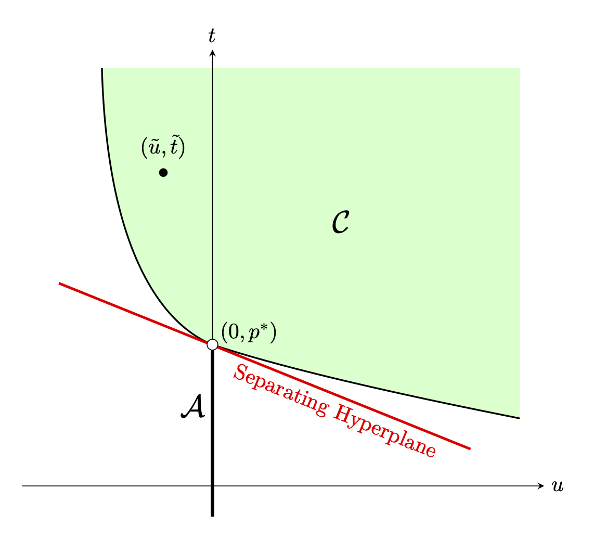{#fig-slater width=45% fig-align="center"}

Slater 条件在证明中有双重作用：结构上，它保证
$\operatorname{relint}(\mathcal C)\ne\varnothing$，从而可用分离定理；分析上，同一个严格可行点又排除 $\mu=0$，保证超平面在目标方向不退化。没有 Slater 条件，这两项保证都可能失去。

### Karush--Kuhn--Tucker（KKT）条件

无约束优化的一阶条件是 $\nabla f(x^*)=0$。对约束问题，KKT 条件扮演类似角色：它描述何时不存在可行下降方向，并刻画约束如何与目标相互作用[^kkt-intuition]。

[^kkt-intuition]: 一个直观情形是，最速下降方向垂直指向可行域外；若继续降低目标就必须违反约束。KKT 把这种直觉严格化。

**互补松弛。** 若某个不等式在最优点严格成立，称约束**松弛**或不活跃；若等号成立，称约束**紧致**或活跃。松弛约束不能对最优解施加“作用力”[^svm-support]。互补松弛要求

$$
\lambda_i^*g_i(x^*)=0.
$$ {#eq-complementary-slackness}

因 $\lambda_i^*\ge0$、$g_i(x^*)\le0$，每个 $i$ 恰有两种情形：若
$g_i(x^*)=0$，约束活跃，$\lambda_i^*$ 可以为正；若
$g_i(x^*)<0$，约束有余量，必有 $\lambda_i^*=0$。

[^svm-support]: 支持向量机中也会遇到同一现象：分类超平面只由支持向量决定，远离边界的点对其方向没有影响。

设强对偶成立，$x^*$ 原最优，$(\lambda^*,\nu^*)$ 对偶最优。则

$$
\begin{aligned}
f(x^*)
&=\theta(\lambda^*,\nu^*)\\
&=\inf_x\left[f(x)+\sum_i\lambda_i^*g_i(x)+\sum_j\nu_j^*h_j(x)\right]\\
&\le f(x^*)+\sum_i\lambda_i^*g_i(x^*)+\sum_j\nu_j^*h_j(x^*)\\
&\le f(x^*).
\end{aligned}
$$

首尾相同，所以两处不等式都必须取等。第一处取等说明 $x^*$ 最小化
$\mathcal L(x,\lambda^*,\nu^*)$；第二处取等说明
$\sum_i\lambda_i^*g_i(x^*)=0$，而每项都非正，故逐项满足 @eq-complementary-slackness。

若 $f,g_i,h_j$ 连续可微，Lagrangian 在 $x^*$ 的梯度还必须为零。于是得到完整 KKT 条件：

$$
\begin{aligned}
g_i(x^*)&\le0,&&i=1,\ldots,m,\\
h_j(x^*)&=0,&&j=1,\ldots,r,\\
\lambda_i^*&\ge0,&&i=1,\ldots,m,\\
\lambda_i^*g_i(x^*)&=0,&&i=1,\ldots,m,\\
\nabla f(x^*)+
\sum_i\lambda_i^*\nabla g_i(x^*)+
\sum_j\nu_j^*\nabla h_j(x^*)&=0.
\end{aligned}
$$ {#eq-kkt-conditions}

前两行是**原可行性**，第三行是**对偶可行性**，第四行是互补松弛，第五行是 **Lagrangian 驻点条件**。

::: {.proposition #prp-kkt-necessary}
**命题。** 对目标与约束连续可微、且强对偶成立并能取得原/对偶最优点的优化问题，任意原--对偶最优点对都满足 @eq-kkt-conditions。
:::

对凸问题，KKT 还是充分条件。

::: {.theorem #thm-kkt-convex}
**定理。** 设 $f,g_i$ 连续可微且凸，$h_j$ 连续可微且仿射。

- 任何满足 KKT 条件的 $(x^*,\lambda^*,\nu^*)$ 都是零对偶间隙的原--对偶最优点。
- 若进一步强对偶成立且对偶最优值取到，例如满足 Slater 条件，则 KKT 条件对最优性也是必要的。
:::

::: {.proof}
**证明。** 必要性由 @prp-kkt-necessary 得到。证明充分性：前三组条件说明 $x^*$ 原可行、$(\lambda^*,\nu^*)$ 对偶可行。固定对偶变量后，
$\mathcal L(x,\lambda^*,\nu^*)$ 关于 $x$ 凸；驻点条件说明 $x^*$ 是其全局极小点。因此

$$
\begin{aligned}
\theta(\lambda^*,\nu^*)
&=\inf_x\mathcal L(x,\lambda^*,\nu^*)\\
&=\mathcal L(x^*,\lambda^*,\nu^*)\\
&=f(x^*)+
\sum_i\lambda_i^*g_i(x^*)+
\sum_j\nu_j^*h_j(x^*)\\
&=f(x^*),
\end{aligned}
$$

最后一步使用原可行性与互补松弛。弱对偶下原、对偶可行点取得同一值，只可能二者都最优且间隙为零。证毕。
:::

::: {.callout-note title="原稿勘误"}
原定理未写任何约束资格条件，却声称凸问题中 KKT 无条件必要。充分性确实无需 Slater；必要性则需要强对偶与对偶最优值取到，Slater 条件是常用保证。译稿按原证明实际使用的假设补全陈述。
:::

### 对偶证书

在 Lagrange 对偶与 KKT 中，**对偶证书**是一组能证明候选点 $x^*$ 最优的对偶变量 $(\lambda^*,\nu^*)$[^certificate]。对满足约束资格条件的凸问题，它们存在当且仅当 $x^*$ 全局最优。证书最关键的是驻点条件

$$
\nabla f(x^*)+
\sum_i\lambda_i^*\nabla g_i(x^*)+
\sum_j\nu_j^*\nabla h_j(x^*)=0.
$$

也就是说，目标梯度必须由活跃约束的梯度线性组合抵消，其中不等式乘子非负。

[^certificate]: “证书”一词来自复杂性理论，强调一种计算不对称：找到解可能昂贵，而验证证书通常只需矩阵--向量乘法或检查特征值。对偶变量就是最优性的见证。

在可行点 $x^*$，可行集 $\mathcal F$ 的**法锥**定义为

$$
N_{\mathcal F}(x^*)=
\{d\in\mathbb R^n:d^T(x-x^*)\le0,
\ \forall x\in\mathcal F\}.
$$

驻点条件就是 $-\nabla f(x^*)\in N_{\mathcal F}(x^*)$：负梯度指向可行集的法向，没有可行下降方向。若可行集由光滑约束描述并满足适当约束资格条件，则

$$
N_{\mathcal F}(x^*)=
\left\{
\sum_{i\in\mathcal A}\lambda_i\nabla g_i(x^*)
+\sum_j\nu_j\nabla h_j(x^*):\lambda_i\ge0
\right\},
$$ {#eq-normal-cone-kkt}

其中 $\mathcal A$ 是活跃不等式集合。对偶乘子正是证明
$-\nabla f(x^*)$ 属于该锥的系数。

考虑二维 LP：

$$
\begin{array}{ll}
\operatorname{maximize}&3x_1+2x_2\\
\text{满足}&x_1\le4,\quad x_2\le4,\\
&x_1+x_2\le6,\\
&x_1\ge0,\quad x_2\ge0.
\end{array}
$$ {#eq-kkt-LP-example}

最优解为 $x^*=(4,2)$，活跃约束是 $x_1\le4$ 与
$x_1+x_2\le6$。把最大化改写为最小化
$f(x)=-(3x_1+2x_2)$ 后，$-\nabla f$ 位于两个活跃约束梯度张成的锥中，见 @fig-kkt-normal-cone。

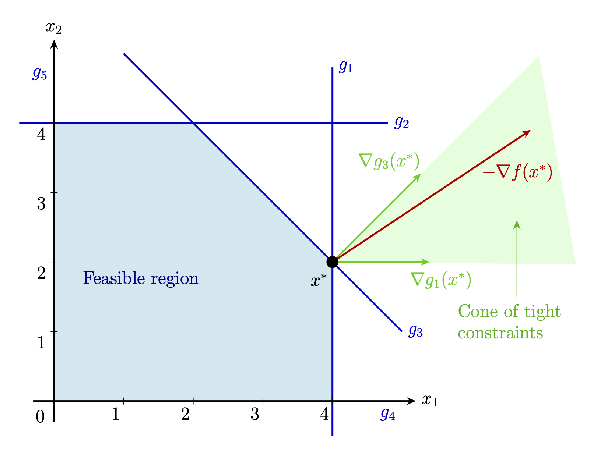{#fig-kkt-normal-cone width=60% fig-align="center"}

若已求得最优对偶变量，可由
$\nabla_x\mathcal L(x^*,\lambda^*,\nu^*)=0$ 解出原变量，再用原可行性筛选候选解。许多凸优化算法都可理解为数值求解 KKT 方程组。

#### 例：二次约束二次规划

考虑

$$
\min_x x^2+1
\qquad\text{满足 }(x-3)(x-4)\le0.
$$

可行域是 $[3,4]$。Lagrangian 与对偶函数为

$$
\mathcal L(x,\lambda)
=x^2+1+\lambda(x^2-7x+12),
$$

$$
\theta(\lambda)=\inf_x
[(1+\lambda)x^2-7\lambda x+12\lambda+1].
$$

对 $x$ 求导得

$$
x(\lambda)=\frac{7\lambda}{2(1+\lambda)}.
$$

代回可得

$$
\theta(\lambda)=12\lambda+1-
\frac{49\lambda^2}{4(1+\lambda)},
\qquad\lambda\ge0.
$$

它是凹函数，唯一最大点为 $\lambda^*=6$，此时
$d^*=\theta(6)=10$。驻点式给出 $x^*=3$，且
$f(3)=10=p^*$，所以强对偶成立。

凸 QCQP 可高效求解，非凸 QCQP 却极其困难；例如约束
$x^2=1$ 就等价于 $x\in\{\pm1\}$，说明它连接着连续与离散优化 [@calafiore2014optimization]。

对偶证书将在社群检测中证明凸松弛精确恢复网络社群，在压缩感知中分析稀疏性，在低秩矩阵恢复中验证核范数解。

#### 对偶的对偶

对满足 Slater 等约束资格条件的凸问题，强对偶成立，再取一次对偶会回到原问题。若原问题非凸，对偶的对偶通常不是原问题，而是其**凸双共轭松弛**：目标变成原目标的凸包络，即最大的凸下界；可行集变成原可行集的凸包。

在非凸问题中，加入代数上冗余的约束会引入额外对偶变量，可能加强对偶并使双对偶凸松弛更紧。因此，不改变原可行集的约束未必在计算上冗余。这也是 Lasserre 层级与对偶平方和方法的核心：系统加入一定次数内、由原约束加权形成的全部平方和关系，提升到更高维 SDP，得到一列在温和条件下收敛到全局最优值的凸松弛。

### 次微分与次梯度

凸目标可能在解处不可微，例如 $f(x)=\|x\|_1$。此时由次微分代替导数。

::: {.definition #def-subdifferential}
**定义。** 设凸函数
$f:\mathbb R^n\to\mathbb R\cup\{+\infty\}$。$f$ 在 $x$ 的**次微分**为

$$
\partial f(x)=\{g\in\mathbb R^n:
f(y)\ge f(x)+\langle g,y-x\rangle,
\ \forall y\in\mathbb R^n\}.
$$

其中每个 $g$ 称为 $f$ 在 $x$ 的**次梯度**。
:::

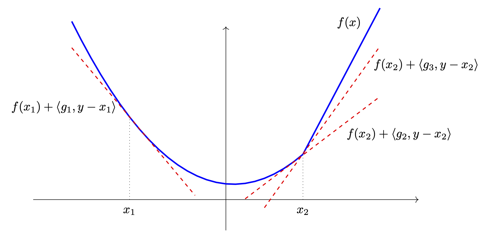{#fig-subgradient width=70% fig-align="center"}

若约束可微但目标不可微，KKT 驻点条件变成集合包含：存在
$s\in\partial f(x^*)$，使

$$
s+\sum_i\lambda_i^*\nabla g_i(x^*)
+\sum_j\nu_j^*\nabla h_j(x^*)=0.
$$

#### 例：$\ell_1$ 范数的次微分

先看 $|x|$。次梯度 $g$ 必须对所有 $y$ 满足
$|y|\ge|x|+g(y-x)$。因此

$$
\partial|x|=
\begin{cases}
\{1\},&x>0,\\
\{-1\},&x<0,\\
[-1,1],&x=0.
\end{cases}
$$

$\ell_1$ 范数可分离，所以

$$
\partial\|x\|_1=
\left\{g:
g_i=\begin{cases}
\operatorname{sign}(x_i),&x_i\ne0,\\
\text{任意 }[-1,1]\text{ 中的数},&x_i=0
\end{cases}
\right\}.
$$

#### 例：核范数的次微分

矩阵 $X\in\mathbb R^{n_1\times n_2}$ 的核范数是奇异值之和：

$$
\|X\|_*=\sum_i\sigma_i(X).
$$

它是秩最小化的重要凸替代。次梯度 $Z$ 满足

$$
\|Y\|_*\ge\|X\|_*+\langle Z,Y-X\rangle,
\qquad\forall Y.
$$

核范数与谱范数互为对偶：

$$
\|X\|_*=\sup_{\|Y\|\le1}\langle Y,X\rangle.
$$

因此 $Z\in\partial\|X\|_*$ 当且仅当
$\|Z\|\le1$ 且 $\langle Z,X\rangle=\|X\|_*$。

设秩 $r$ 矩阵的紧 SVD 为
$X=U\Sigma V^T$，其中
$U\in\mathbb R^{n_1\times r}$、
$V\in\mathbb R^{n_2\times r}$。秩 $r$ 流形在 $X$ 的切空间是

$$
\mathcal T=
\{UA^T+BV^T:
A\in\mathbb R^{n_2\times r},
B\in\mathbb R^{n_1\times r}\},
$$

其正交补为

$$
\mathcal T^\perp=
\{W:U^TW=0,\ WV=0\}.
$$

由 $\langle Z,X\rangle=\|X\|_*$ 与 $\|Z\|\le1$，切空间分量必须为
$P_{\mathcal T}(Z)=UV^T$。写
$W=P_{\mathcal T^\perp}(Z)$；由于二者行、列空间正交，

$$
\|UV^T+W\|=\max\{1,\|W\|\},
$$

故必须且只需 $\|W\|\le1$。最终

$$
\partial\|X\|_*
=\{UV^T+W:U^TW=0,\ WV=0,\ \|W\|\le1\}.
$$ {#eq-nuclear-subdifferential}

## 基于梯度的方法及其收敛性

**梯度下降**通过沿最速下降方向，也就是负梯度方向，反复移动来最小化可微函数[^steepest-descent]：

$$
x_{k+1}=x_k-\eta\nabla f(x_k),
\qquad k=0,1,\ldots,
$$ {#eq-gradient-descent}

其中 $x_0$ 是初值，$\eta$ 是**步长**或**学习率**。初值常取零向量或随机点；步长可固定、衰减或自适应。过大会越过极小点，过小则收敛缓慢。

[^steepest-descent]: 因此，数值分析中也称它为最速下降法。

本节先对 $L$-光滑函数保证梯度变小；加入凸性后证明函数值收敛到最优值；再利用比强凸性更弱的 Polyak--Łojasiewicz 条件，证明迭代点本身收敛。

### $L$-光滑函数上的梯度下降

下面的正则性条件控制函数变化，使梯度成为可靠的局部线性近似，并允许量化收敛速度。

::: {.definition #def-lipschitz-gradient}
**定义。** 若存在 $L>0$，使

$$
\|\nabla f(x)-\nabla f(y)\|
\le L\|x-y\|,
\qquad\forall x,y\in\mathbb R^d,
$$ {#eq-lipschitz-gradient}

则称 $f$ 的梯度 **$L$-Lipschitz 连续**。
:::

这个条件等价于梯度法文献中的 $L$-光滑性；证明留作习题。

::: {.definition #def-L-smooth}
**定义。** 若存在 $L>0$，使所有 $x,y\in\mathbb R^d$ 满足

$$
f(y)\le f(x)+\langle\nabla f(x),y-x\rangle
+\frac L2\|x-y\|^2,
$$

$$
f(y)\ge f(x)+\langle\nabla f(x),y-x\rangle
-\frac L2\|x-y\|^2,
$$ {#eq-L-smooth-quadratic-bounds}

则称 $f$ **$L$-光滑**。
:::

换言之，在每一点 $x$，函数都夹在与它相切的两个二次函数之间，见 @fig-smooth-convex。

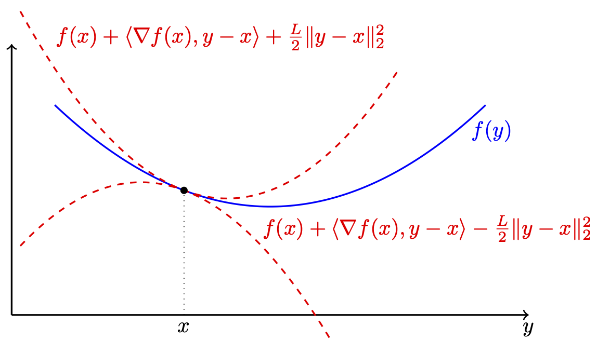{#fig-smooth-convex width=70% fig-align="center"}

::: {.lemma #lem-gradient-descent}
**引理（梯度下降引理）。** 设 $f:\mathbb R^d\to\mathbb R$ 为
$L$-光滑函数。若 $0<\eta\le1/L$，则 @eq-gradient-descent 的每一步满足

$$
f(x_{k+1})
\le f(x_k)-\frac\eta2\|\nabla f(x_k)\|^2.
$$ {#eq-descent-lemma}
:::

::: {.proof}
**证明。** 在光滑性上界中取 $x=x_k,y=x_{k+1}$：

$$
f(x_{k+1})\le f(x_k)
+\langle\nabla f(x_k),x_{k+1}-x_k\rangle
+\frac L2\|x_{k+1}-x_k\|^2.
$$

代入 $x_{k+1}-x_k=-\eta\nabla f(x_k)$，

$$
f(x_{k+1})
\le f(x_k)-\eta\left(1-\frac{L\eta}{2}\right)
\|\nabla f(x_k)\|^2.
$$

$\eta\le1/L$ 意味着括号内至少为 $1/2$，即得结论。证毕。
:::

所以自然步长是 $\eta=1/L$。若 $f$ 有下界，@eq-descent-lemma 还迫使迭代梯度最终变小；否则函数值会无限下降。但尚未假设凸性，小梯度未必表示函数值接近最优。例如
$f(x)=\epsilon\log(1+e^x)$ 处处满足 $|f'(x)|\le\epsilon$，点却可能距最优区域任意远。

### 凸 $L$-光滑函数上的梯度下降

凸性使我们能保证函数值收敛。先证明一个实用恒等式。

::: {.lemma #lem-euclidean-mirror-descent}
**引理（Euclidean 镜像下降引理）。** 设 $f$ 可微且凸。对任意步长 $\eta>0$、梯度下降相邻迭代点 $x_k,x_{k+1}$ 以及任意 $y\in\mathbb R^d$，

$$
f(x_k)\le f(y)+\frac1{2\eta}
\left(
\|y-x_k\|^2-\|y-x_{k+1}\|^2
+\|x_{k+1}-x_k\|^2
\right).
$$ {#eq-mirror-descent}
:::

::: {.proof}
**证明。** 展开平方可得

$$
\langle x_k-x_{k+1},y-x_k\rangle
=-\frac12\left(
\|y-x_k\|^2-\|y-x_{k+1}\|^2
+\|x_{k+1}-x_k\|^2
\right).
$$

凸性的一阶条件给出

$$
f(y)\ge f(x_k)+\langle\nabla f(x_k),y-x_k\rangle.
$$

利用
$\nabla f(x_k)=(x_k-x_{k+1})/\eta$，代入上一恒等式并整理，即得 @eq-mirror-descent。证毕。
:::

::: {.theorem #thm-gradient-convex-rate}
**定理。** 设 $f:\mathbb R^d\to\mathbb R$ 凸，梯度
$L$-Lipschitz，且 $x^*\in\arg\min f$。若梯度下降使用固定步长
$0<\eta\le1/L$，则对所有 $k\ge1$，

$$
f(x_k)-f(x^*)
\le\frac{\|x_0-x^*\|^2}{2k\eta}.
$$

因此函数值误差以 $\mathcal O(1/k)$ 速度下降。
:::

::: {.proof}
**证明。** 在 @eq-mirror-descent 中使用
$\|x_{k+1}-x_k\|^2=\eta^2\|\nabla f(x_k)\|^2$。由
@eq-descent-lemma，

$$
\frac\eta2\|\nabla f(x_k)\|^2
\le f(x_k)-f(x_{k+1}).
$$

代入并消去 $f(x_k)$，得到

$$
f(x_{k+1})
\le f(y)+\frac1{2\eta}
\left(\|y-x_k\|^2-\|y-x_{k+1}\|^2\right).
$$ {#eq-convex-gd-telescope}

令 $y=x^*$，对 $k=0,\ldots,K-1$ 求和；平方距离望远镜相消：

$$
\sum_{k=0}^{K-1}[f(x_{k+1})-f(x^*)]
\le\frac{\|x_0-x^*\|^2}{2\eta}.
$$

@eq-descent-lemma 说明 $f(x_k)$ 非增，所以左侧至少为
$K[f(x_K)-f(x^*)]$。除以 $K$ 即得结论。证毕。
:::

::: {.callout-note title="原稿勘误"}
原证明把“非增”序列的求和界写成
$\sum_{k=1}^K f(x_k)\le Kf(x_K)$；正确方向是
$\sum_{k=1}^K f(x_k)\ge Kf(x_K)$。译稿已校正，结论不变。
:::

### 强凸函数上的迭代点收敛

仅凭凸与光滑，不能保证 $\|x_k-x^*\|$ 具有统一的
$\mathcal O(1/k)$ 速度；甚至存在梯度下降到最优点任意缓慢的凸光滑函数，见 @nesterov2018lectures。强凸性可以给出迭代点收敛。这里采用更弱的 Polyak--Łojasiewicz（PL）条件，它由 Polyak [@Pol63] 与 Łojasiewicz [@Loj63] 独立提出。

::: {.definition #def-PL-condition}
**定义（PL 条件）。** 设 $f:\mathbb R^d\to\mathbb R$ 下有界，
$f_{\inf}=\inf_xf(x)$。若存在 $\mu>0$，使

$$
\frac12\|\nabla f(x)\|^2
\ge\mu(f(x)-f_{\inf}),
\qquad\forall x\in\mathbb R^d,
$$ {#eq-PL-condition}

则称 $f$ 满足 PL 条件。
:::

强凸蕴含 PL，证明留作习题；反之不成立。常函数满足 PL 却不强凸；PL 甚至不蕴含凸性。例如
$f(x)=x^2+3\sin^2x$ 非凸，却满足 $\mu=1/32$ 的 PL 条件，见 @karimi2016linear。

::: {.lemma #lem-PL-function-values}
**引理。** 设 $f$ 为下有界的 $L$-光滑函数，并满足参数
$\mu>0$ 的 PL 条件。若 $0<\eta\le1/L$，令
$q=1-\mu\eta$，则梯度下降满足

$$
f(x_k)-f_{\inf}
\le q^k(f(x_0)-f_{\inf}).
$$ {#eq-PL-linear-function-rate}
:::

::: {.proof}
**证明。** 由梯度下降引理与 PL 条件，

$$
\begin{aligned}
f(x_{k+1})
&\le f(x_k)-\frac\eta2\|\nabla f(x_k)\|^2\\
&\le f(x_k)-\mu\eta(f(x_k)-f_{\inf}).
\end{aligned}
$$

两侧减 $f_{\inf}$，得到

$$
f(x_{k+1})-f_{\inf}
\le q(f(x_k)-f_{\inf}).
$$

迭代该递推即得结论。证毕。
:::

::: {.theorem #thm-PL-iterate-convergence}
**定理。** 在 @lem-PL-function-values 的条件下，梯度下降迭代点收敛到某个
$x^*\in\mathbb R^d$，并满足

$$
\|x_k-x^*\|^2
\le\frac{8}{\mu^2\eta}
q^k(f(x_0)-f_{\inf}),
\qquad q=1-\mu\eta.
$$ {#eq-PL-iterate-rate}

此外，$f(x_k)\to f(x^*)=f_{\inf}$。
:::

::: {.proof}
**证明。** 对每个 $k$，

$$
\begin{aligned}
\|x_{k+1}-x_k\|^2
&=\eta^2\|\nabla f(x_k)\|^2\\
&\le2\eta[f(x_k)-f(x_{k+1})]\\
&\le2\eta q^k(f(x_0)-f_{\inf}),
\end{aligned}
$$

第二步来自 @eq-descent-lemma，最后一步来自
@eq-PL-linear-function-rate。故对 $m<n$，

$$
\begin{aligned}
\|x_m-x_n\|
&\le\sum_{k=m}^{n-1}\|x_k-x_{k+1}\|\\
&\le\sqrt{2\eta(f(x_0)-f_{\inf})}
\sum_{k=m}^{n-1}q^{k/2}\\
&\le\sqrt{2\eta(f(x_0)-f_{\inf})}
\frac{q^{m/2}}{1-\sqrt q}.
\end{aligned}
$$

因为 $0\le q<1$，$\{x_k\}$ 是 Cauchy 序列，故在完备的
$\mathbb R^d$ 中收敛到某个 $x^*$。令 $n\to\infty$ 并平方；又因

$$
1-\sqrt q=\frac{1-q}{1+\sqrt q}
\ge\frac{\mu\eta}{2},
$$

得到 @eq-PL-iterate-rate。$f$ 光滑因而连续，结合
@eq-PL-linear-function-rate 可知
$f(x^*)=f_{\inf}$。证毕。
:::

::: {.callout-note title="原稿勘误"}
原稿 PL 引理第二行少了一个系数 2，且定理声明允许
$0<\eta\le1/L$，证明却只使用了 $\eta=1/L$ 的递推因子
$1-\mu/L$。译稿统一为一般步长的正确形式；取
$\eta=1/L$ 即恢复原稿希望表达的结论。
:::

PL 条件不保证极小点唯一。若 $f$ 进一步为 $\mu$-强凸且
$L$-光滑，则 $x^*$ 唯一，并有更紧的经典界 [@nesterov2018lectures]

$$
\|x_k-x^*\|^2
\le\left(1-\frac\mu L\right)^k\|x_0-x^*\|^2
$$ {#eq-strong-convex-linear-rate}

（这里取 $\eta=1/L$）。

::: {.remark}
若存在常数 $C<1$，使

$$
\frac{\|x_{k+1}-x^*\|}{\|x_k-x^*\|}\le C,
$$

则称迭代点**线性收敛**，因为正确数字位数随迭代次数线性增加；也常称指数收敛，因为误差按迭代次数指数衰减[^linear-exponential]。@eq-strong-convex-linear-rate 对应
$C=\sqrt{1-\mu/L}$。

Newton 法等二阶方法常具有二次收敛：接近解后，每步误差近似为上一步误差的平方，正确数字位数大致翻倍；代价是每步需要构造并求解 Hessian 系统，计算昂贵得多。
:::

[^linear-exponential]: 两个名称强调的是同一现象的不同侧面。

### 非凸优化中的梯度下降

非凸函数可能有多个局部极值与鞍点，凸情形的全局保证不再成立，深度学习损失通常如此。PL 条件虽允许非凸，却仍很强。下面只假设：

- **(A1)** $f$ 为 $L$-光滑函数；
- **(A2)** $f$ 下有界：$f(x)\ge f_{\inf}>-\infty$。

对 $0<\eta\le1/L$，梯度下降引理仍给出

$$
f(x_{k+1})\le f(x_k)-\frac\eta2\|\nabla f(x_k)\|^2.
$$ {#eq-nonconvex-descent}

这与凸性无关，说明除非梯度为零，每步都降低目标。

::: {.theorem #thm-nonconvex-stationary}
**定理。** 在 (A1)--(A2) 下，固定步长 $0<\eta\le1/L$ 的梯度下降满足：

1. $\{f(x_k)\}$ 非增且收敛；
2. $\|\nabla f(x_k)\|\to0$；
3. $\{x_k\}$ 的每个聚点都是一阶驻点。
:::

::: {.proof}
**证明。** 对 @eq-nonconvex-descent 从 $k=0$ 到 $K-1$ 求和：

$$
\frac\eta2\sum_{k=0}^{K-1}\|\nabla f(x_k)\|^2
\le f(x_0)-f(x_K)
\le f(x_0)-f_{\inf}.
$$

因此平方梯度范数级数有限，必有
$\|\nabla f(x_k)\|\to0$。函数值非增且下有界，所以收敛。若子序列
$x_{k_j}\to x_\infty$，梯度连续性给出
$\nabla f(x_\infty)=0$。证毕。
:::

驻点未必是局部极小点。不过在若干高维问题中，严格鞍点的稳定吸引域在适当条件下测度为零 [@lee2016gradient; @panageas2017; @sun2018geometric]；随机扰动和参数调节也有助于避开鞍点。这是梯度法在深度学习中成功的部分原因。

步长在非凸地形中还承担“探索”作用：接近解时小步长有利于精调，而较大或动态步长可能提供越过浅局部极小与停滞鞍点所需的数值动量。即使凸问题，变步长也可能加速，见 @altschuler2024acceleration。

### 动量梯度下降与 Nesterov 加速

病态问题在某些方向曲率陡、另一些方向平，普通梯度下降会在狭长谷底来回振荡。动量法 [@polyak1964some] 用速度累积历史梯度：

$$
v_{k+1}=\mu v_k-\eta\nabla f(x_k),
\qquad
x_{k+1}=x_k+v_{k+1},
$$

其中 $\mu\in[0,1)$。方向一致的梯度相互加强，高曲率方向的振荡则被阻尼。这就是数学优化中的“重球法”。

Nesterov 加速梯度（NAG）[@nesterov1983method] 在预估位置
$x_k+\mu v_k$ 计算梯度：

$$
v_{k+1}=\mu v_k-\eta\nabla f(x_k+\mu v_k),
\qquad
x_{k+1}=x_k+v_{k+1}.
$$

这种“前瞻”在冲过谷底前就开始修正，通常减少过冲，以每步仅一次梯度评估的代价更快到达最优点，见 @fig-nesterov-momentum。

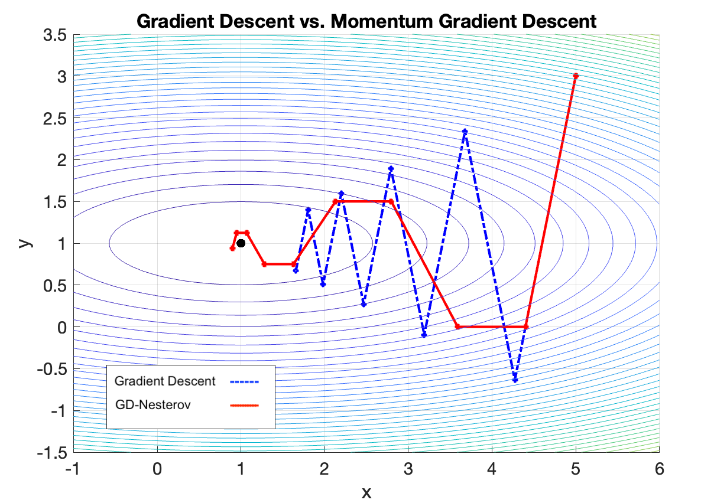{#fig-nesterov-momentum width=80% fig-align="center"}

对光滑凸函数，普通梯度下降函数值误差为 $\mathcal O(1/k)$，Nesterov 方法在适当条件下达到 $\mathcal O(1/k^2)$。实践中常取
$\mu\in[0.9,0.99]$，学习率仍需调节。动量思想也支撑 Adam [@kingma2014adam] 与 AdaGrad [@duchi2011adaptive] 等自适应算法。

### 次梯度下降

次梯度下降把 $\nabla f(x)$ 换成任意
$g\in\partial f(x)$，是梯度法对 $\ell_1$、核范数等非光滑凸函数最直接的推广。次梯度未必是下降方向，函数值可能振荡；一般凸函数的典型速度只有
$\mathcal O(1/\sqrt k)$，达到精度 $\epsilon$ 需
$\mathcal O(1/\epsilon^2)$ 步。

用于 $\ell_1$ 惩罚时，迭代点通常不会精确稀疏，只会渐近地产生接近零的系数。因此，近端法或流形优化通常更实用。

### 随机梯度下降

随机梯度下降（SGD）每步只用随机选取的一个样本或小批量，而非全部数据，计算更便宜，噪声也可能帮助逃离局部极小。代价是即使 $\eta$ 很小，损失也不保证每步下降。正如 @higham2019deep 指出，“随机梯度”比“随机梯度下降”更准确；这里仍沿用 SGD 这一惯称。

若

$$
\nabla f(x)=\frac1n\sum_{i=1}^n\nabla f_i(x),
$$

SGD 随机选 $i$，更新

$$
x^{(k+1)}=x^{(k)}-\eta\nabla f_i(x^{(k)}).
$$

随机梯度无偏，但噪声既可能促进探索，也可能妨碍收敛并产生次优解。

#### SGD 与随机 Kaczmarz 方法

线性系统中，SGD 本质上等价于随机 Kaczmarz [@SV06]。考虑相容系统

$$
Ax=b,
\qquad A\in\mathbb R^{m\times n},
$$ {#eq-kaczmarz-system}

其第 $i$ 行为 $a_i^T$。Kaczmarz 每步把当前点正交投影到超平面
$H_i=\{x:a_i^Tx=b_i\}$：

$$
x^{k+1}=x^k+
\frac{b_i-\langle a_i,x^k\rangle}{\|a_i\|^2}a_i.
$$

随机版本按

$$
\mathbb P\{i=j\}=\frac{\|a_j\|^2}{\|A\|_F^2}
$$ {#eq-kaczmarz-sampling}

选行。另一方面，最小二乘目标

$$
f(x)=\frac12\|Ax-b\|^2
=\sum_i\frac12(\langle a_i,x\rangle-b_i)^2
$$

的单样本梯度是
$\nabla f_i(x)=(\langle a_i,x\rangle-b_i)a_i$。SGD 更新

$$
x_{k+1}=x_k+eta_k(b_i-\langle a_i,x_k\rangle)a_i
$$

在取 $\eta_k=1/\|a_i\|^2$ 时恰为 Kaczmarz，另见 @needell2014stochastic。

::: {.theorem #thm-randomized-kaczmarz}
**定理。** 设 $Ax=b$ 相容，$x^*$ 是
$\operatorname{range}(A^T)$ 中的唯一解。随机 Kaczmarz 满足

$$
\mathbb E\|x^k-x^*\|^2
\le\left(1-\frac{\sigma_{\min}^2(A)}{\|A\|_F^2}\right)^k
\|x^0-x^*\|^2,
$$

其中 $\sigma_{\min}(A)$ 是最小非零奇异值。
:::

这给出期望意义下的线性收敛。量
$\widetilde\kappa(A)=\|A\|_F/\sigma_{\min}(A)$ 称缩放条件数，由 Demmel [@demmel1988probability] 引入。

::: {.proof}
**证明。** 对 $z\in\operatorname{range}(A^T)$，

$$
\sum_{j=1}^m|\langle z,a_j\rangle|^2
=\|Az\|^2\ge\sigma_{\min}^2(A)\|z\|^2.
$$

令随机单位法向量

$$
Z=\frac{a_j}{\|a_j\|}
\quad\text{以概率 }\frac{\|a_j\|^2}{\|A\|_F^2}\text{ 取到}.
$$

则

$$
\mathbb E|\langle z,Z\rangle|^2
\ge\widetilde\kappa(A)^{-2}\|z\|^2.
$$ {#eq-kaczmarz-normal-expectation}

第 $k$ 步是到随机方程超平面的投影。因为 $x^*$ 属于每个超平面，Pythagoras 恒等式给出

$$
\|x_k-x^*\|^2
=\|x_{k-1}-x^*\|^2-
|\langle x_{k-1}-x^*,Z_k\rangle|^2.
$$

在给定前 $k-1$ 步的条件下对 $Z_k$ 取期望，并用
@eq-kaczmarz-normal-expectation：

$$
\mathbb E[\|x_k-x^*\|^2\mid x_{k-1}]
\le(1-\widetilde\kappa(A)^{-2})
\|x_{k-1}-x^*\|^2.
$$

再取全期望并归纳，即得结论。证毕。
:::

随机 Kaczmarz 也可解释为迭代草图法，见 @gower2015randomized。

**重要性采样。** Kaczmarz 按 $\|a_i\|^2$ 采样，在 SGD 中就是降低随机梯度方差的**重要性采样** [@needell2014stochastic]。@fig-SGD-importance 比较了 $m=1000,n=100$、行范数跨两个数量级的相容线性模型：均匀采样每行概率 $1/m$；重要性采样按
$\|a_i\|^2/\|A\|_F^2$，优先使用梯度影响更大的样本，明显加速。不过完整成本比较还应计入计算全部行范数的代价。

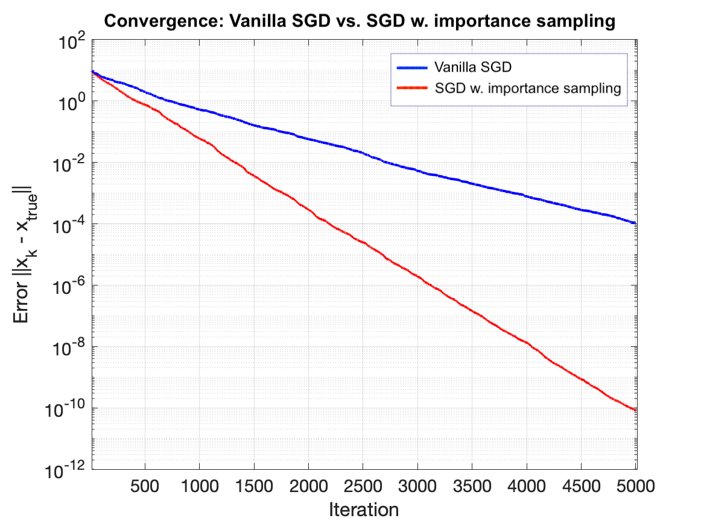{#fig-SGD-importance width=70% fig-align="center"}

## 习题 {.unnumbered}

::: {.exercise}
证明把最小二分割中的 $x\in\{\pm1\}^n$ 换成
$-1\le x_i\le1$ 不改变最优值。
:::

::: {.exercise}
证明对连续可微 $f$，凸性等价于
$f(y)\ge f(x)+\langle\nabla f(x),y-x\rangle$。
:::

::: {.exercise}
证明强凸性蕴含 PL 条件。
:::

::: {.exercise}
证明严格凸函数若达到全局最小值，则极小点唯一。
:::

::: {.exercise}
证明若 $f\in C^2$ 且 Hessian 处处正定，则 $f$ 严格凸。
:::

::: {.exercise}
证明梯度 $L$-Lipschitz 与 @def-L-smooth 的 $L$-光滑定义等价。
:::

::: {.exercise}
证明一般线性规划可化成标准形式

$$
\min_{z\ge0}\langle d,z\rangle
\quad\text{满足 }\widetilde Az=\widetilde b.
$$

**提示。** 写 $x=x^+-x^-$，其中 $x^\pm\ge0$，并引入松弛变量。
:::

::: {.exercise}
证明 @thm-lagrangian-saddle。
:::

::: {.exercise}
对 $\min_x x$、约束 $x^2\le0$，说明 Slater 条件不成立。
:::

::: {.exercise}
对
$\min_{x,y}-x$，约束
$y-(1-x)^3\le0$、$x\ge0$、$y\ge0$，说明 KKT 条件失效。
:::

::: {.exercise}
设 $A$ 对称但不正定。证明非凸信赖域问题

$$
\min_x x^TAx+2b^Tx
\quad\text{满足 }x^Tx\le1
$$

仍满足强对偶。
:::

::: {.exercise}
对 $f(x)=|x|$，从 $x^{(0)}=0.5\eta$ 出发用固定步长次梯度下降，证明迭代点会跨过原点振荡，而不会停在稀疏解 $0$。
:::

::: {.exercise}
求熵最大化等价问题的对偶：

$$
\min_{x\in\mathbb R_+^n}\sum_ix_i\log x_i
\quad\text{满足 }Ax\le b,\ \mathbf1^Tx=1.
$$
:::

::: {.exercise}
考虑 $y>0$ 上
$\min e^{-x}$，约束 $x^2/y\le0$。

1. 验证它是凸问题并求原最优值。
2. 写出对偶，求 $\lambda^*,d^*$ 与对偶间隙。
3. 判断 Slater 条件是否成立。
:::

::: {.exercise}
设 $f(x)=\frac12x^TAx-b^Tx$，$A\succ0$。

1. 证明当 $0<\eta<2/\lambda_{\max}(A)$ 时梯度下降线性收敛。
2. 用 $\kappa(A)=\lambda_{\max}/\lambda_{\min}$ 表示收敛速度。
:::

::: {.exercise}
**投影到概率单纯形。** 对

$$
\min_x\frac12\|x-z\|_2^2
\quad\text{满足 }\mathbf1^Tx=1,\ x\ge0,
$$

1. 用等式乘子 $\nu$ 与不等式乘子 $\lambda\ge0$ 写 KKT 条件。
2. 证明
$x_i^*=\max\{z_i-\nu,0\}$，且
$\lambda_i=\max\{\nu-z_i,0\}$。
:::

::: {.exercise}
对狭长谷函数 $f(x,y)=10x^2+y^2$：

1. 比较梯度下降在 $\eta=0.01,0.05,0.1$ 下达到
$\|\nabla f\|\le10^{-4}$ 的路径与迭代数。
2. 对相同步长应用 Nesterov 动量并比较。
:::

::: {.exercise}
**Farkas 引理。** 证明以下两项恰有一项成立：存在 $x$ 使
$Ax=b$；或存在 $y$ 使
$A^Ty=0$、$y\ge0$、$b^Ty<0$。

**提示。** 使用分离超平面。
:::

::: {.exercise}
**自对偶线性规划。** 考虑
$\max c^Tx$，约束 $Ax\le b,x\ge0$，其中
$A=-A^T,b=-c$。

1. 推导对偶并证明它等价于原问题。
2. 若问题可行，证明原、对偶最优值都存在且等于零。
3. 证明任意原可行 $x$ 与对偶可行 $y$ 满足
$c^Tx+c^Ty=0$。
4. 若 $x^*$ 原最优，利用互补松弛证明
$(x^*)^TAx^*=0$。
:::

::: {.exercise}
求 $f(x)=\|x\|_p$ 在 $p=2$ 与 $p=\infty$ 时的次微分。
:::

::: {.exercise}
**几何中位数。** 给定 $x_1,\ldots,x_n\in\mathbb R^d$，令
$f(x)=\sum_i\|x-x_i\|_2$。

1. 证明 $\|x-a\|_2$ 凸，从而 $f$ 凸。
2. 当所有点共线时讨论严格凸性。
3. 对 $x\notin\{x_i\}$ 计算 $\nabla f(x)$，令其为零，把
$x^*$ 写成 $x_i$ 的加权平均。
4. 解释为什么这不是像算术平均那样的闭式解。
:::

::: {.exercise}
**最优功率分配与注水算法。** 对总功率 $P=1$，求

$$
\min_{x_i\ge0}-\sum_{i=1}^n\log(\alpha_i+x_i)
\quad\text{满足 }\sum_ix_i=1.
$$

1. 用 $\nu$ 与 $\lambda_i$ 写 Lagrangian 和 KKT 条件。
2. 证明 $x_i^*=\max(0,\eta-\alpha_i)$，其中
$\eta=1/\nu$，并解释“注水”。
3. 对
$\alpha=[0.1,0.2,0.5,1,2,4]$ 用 CVX/CVXOPT 求解；用柱状图叠加噪声底座与分配功率，并画水位 $\eta$。
:::
