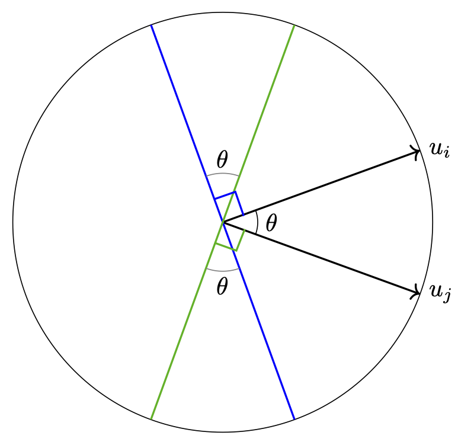
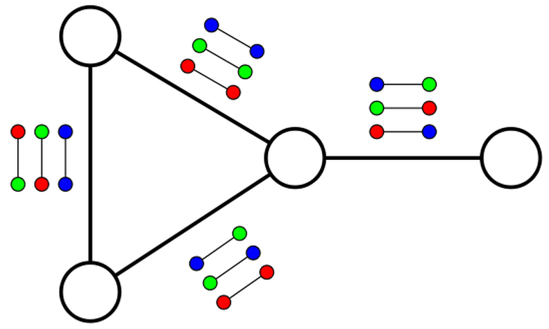
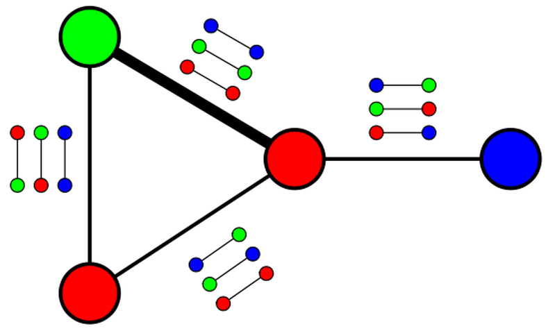

<!-- 原稿章节标签：c:community -->

本章以图上的问题为例，展示凸松弛的思想。我们先介绍 Goemans--Williamson 针对最大割的半正定松弛，再转向随机块模型中的社群检测。

## 最大割、提升与近似算法 {#c:maxcut}

[]{#maxcutapprox label="maxcutapprox"}

许多数据分析任务都要解决一个计算问题，例如寻找最能解释数据的隐藏参数或最佳拟合模型。不少此类问题在计算上不可解，通常表现为 $NP$-困难；除非 $P=NP$，不存在能解决其所有实例的多项式时间算法。面对这类问题，通常有三条路：用指数时间算法精确求解所有实例；设计只对部分重要实例有效的多项式算法；或设计对所有实例都给出有保证近似解的多项式算法。本节研究第三条路，谱聚类与 Cheeger 不等式也是先例；本章后面会讨论第二条路，而同一个算法往往能同时服务于两种目标。

给定非负加权图 $G=(V,E,W)$，**最大割**要求找到使 $\operatorname{cut}(S)$ 最大的 $S\subset V$。[^1] Goemans 与 Williamson [@MXGoemans_DPWilliamson_1995] 给出了含随机步骤的多项式时间算法，其输出割的期望值至少是最优值的 $\alpha_{GW}$ 倍；$\alpha_{GW}$ 称为近似比。

令 $V=\{1,\ldots,n\}$。用 $y_i\in\{\pm1\}$ 表示顶点属于割的哪一侧，最大割等价于 $$\begin{equation}
\label{MAXCUTproblem}
\begin{array}{l}
\max \quad  \frac12 \sum_{i<j}w_{ij}(1-y_iy_j) \\
s.t. \quad \quad  |y_i|=1
\end{array}
\end{equation}$$ 其中 $y_i=1$ 表示 $i\in S$，否则 $y_i=-1$。

把标量符号提升为单位向量，得到松弛： $$\begin{equation}
\label{MAXCUTproblem_Relaxed}
\begin{array}{l}
\max \quad  \frac12 \sum_{i<j}w_{ij}(1-u_i^Tu_j) \\
s.t. \quad \quad  u_i\in \mathbb{R}^n, \|u_i\|=1.
\end{array}
\end{equation}$$ 若限制 $u_i=y_ie_1$，就恢复原问题。因此这个松弛要有用，必须易于求解，而且松弛解要能转回质量可控的离散解。

1. 松弛问题可高效求解。

2. 松弛解与原问题的解之间存在可量化的联系。

::: definition
[]{#def_maxcut_rmaxcut label="def_maxcut_rmaxcut"} 给定图 $G$，记 $\mathrm{MaxCut}(G)$ 为原最大割问题的最优值，$\mathcal R\mathrm{MaxCut}(G)$ 为向量松弛的最优值。
:::

先说明可解性。令 $X$ 为 $u_1,\ldots,u_n$ 的 Gram 矩阵，即 $X=U^TU$，其中 $U$ 的第 $i$ 列为 $u_i$。目标函数变为
$$\frac12\sum_{i<j}w_{ij}(1-X_{ij}).$$
$X=Y^TY$ 等价于 $X\succeq0$；半正定矩阵构成凸集，而 $\|u_i\|=1$ 等价于 $X_{ii}=1$。故向量松弛等价于 SDP：

$$\begin{equation}
\label{MAXCUTproblem_SDP}
\begin{array}{l}
\max \quad  \frac12 \sum_{i<j}w_{ij}(1-X_{ij}) \\
\text{满足} \quad \quad X\succeq 0 \text{ 且 } X_{ii}=1,\; i=1,\ldots,n.
\end{array}
\end{equation}$$
该凸问题可在关于输入规模与 $\log(\epsilon^{-1})$ 的多项式时间内求到 $\epsilon$ 精度 [@LVanderberghe_SBoyd_1996]。

还可从提升角度理解这一松弛。取 $X=yy^T$，原最大割等价于

$$\begin{equation}
\label{MAXCUTproblem_lifted}
\begin{array}{l}
\max \quad  \frac12 \sum_{i<j}w_{ij}(1-X_{ij}) \\
\text{满足} \quad \quad X\succeq 0,\ X_{ii}=1,\; i=1,\ldots,n, \text{ 且 } \rank(X) = 1.
\end{array}
\end{equation}$$
删去非凸的秩一约束，便得到 SDP。后面构造最小二分割松弛时还会采用同样方法。

下面把松弛解舍入为离散割。从 SDP 解对应的单位向量 $u_i$ 出发，在单位球面均匀抽取 $r\in\mathbb R^n$，令
$$S'=\{i:r^Tu_i\ge0\}.$$
也就是用法向量为 $r$ 的随机超平面分开这些向量。下面证明所得割可与最优割相比。

{#fig-maxcut-angle width=40% fig-align="center"}

记所得割值为随机变量 $W$。边 $(i,j)$ 被切开的概率就是两向量夹角占半圆的比例，因此

$$\begin{eqnarray*}
\mathbb{E}[W] & = & \sum_{i<j}w_{ij} \Pr\left\{\text{sign}(r^Tu_i)\neq \text{sign}(r^Tu_j)\right\} \\
     & = & \sum_{i<j}w_{ij}\frac1\pi \arccos(u_i^Tu_j). \\
\end{eqnarray*}$$
定义
$$\alpha_{GW}=\min_{-1\le x\le1}\frac{\pi^{-1}\arccos x}{\frac12(1-x)}.$$
可以证明 $\alpha_{GW}>0.87$ [@MXGoemans_DPWilliamson_1995]。

由期望的线性性，$$\begin{equation}
\mathbb{E}[W] = \sum_{i<j}w_{ij}\frac1\pi \arccos(u_i^Tu_j) \geq \alpha_{GW} \frac12 \sum_{i<j}w_{ij}(1-u_i^Tu_j).
\end{equation}$$

松弛最优值至少为原最优值，而任何舍入割都不超过原最优值。因此 $$\begin{equation}
\mathrm{MaxCut}(G)\geq \mathbb{E}[W] \geq \alpha_{GW} \frac12 \sum_{i<j}w_{ij}(1-u_i^Tu_j) \geq \alpha_{GW} \mathrm{MaxCut}(G),
\end{equation}$$
故算法在期望意义下具有 $\alpha_{GW}$ 近似比。可重复舍入并选择最佳割。[^2] 总结为
$$\mathrm{MaxCut}(G)\ge\mathbb E[W]\ge
\alpha_{GW}\mathcal R\mathrm{MaxCut}(G)\ge
\alpha_{GW}\mathrm{MaxCut}(G).$$

### $\alpha_{GW}$ 还能改进吗？ {#can-alpha_gw-be-improved .unnumbered}

自然要问：是否存在近似比优于 $\alpha_{GW}$ 的多项式时间算法？

::: {#fig-unique-games layout-ncol=2}

Unique Games 问题示意。
:::

Unique Games 问题给定一张图、$k$ 种颜色，并为每条边指定两端颜色之间的一个匹配；目标是给顶点赋色，使尽可能高比例的边匹配得到满足。@fig-unique-games 中的赋色满足 $3/4$ 的边约束，而且不可能做得更好。

Khot 的 Unique Games 猜想 [@SKhot_2002] 深刻影响了近似困难性理论。

::: conjecture
对任意 $\epsilon>0$，区分以下两类 Unique Games 实例是 $NP$-困难的：一类能满足至少 $1-\epsilon$ 比例的约束；另一类连 $\epsilon$ 比例都无法满足。
:::

目前已有区分这类实例的次指数时间算法 [@Arora_Barak_Steurer_2010]，却没有多项式时间算法。下面介绍的平方和层级松弛，是反驳该猜想最有力的候选途径之一。

惊人的是，获得优于 $\alpha_{GW}$ 的最大割近似比，与反驳 Unique Games 猜想同样困难 [@Khot_Kindler_Mossel_ODonnel_2005]。若该猜想成立，上述 SDP 方法对一大类问题都给出了最优近似比 [@Raghavendra_2008_optimalitySDP_UG]。

即使不依赖 Unique Games 猜想，最大割也具有 $16/17$ 的 $NP$-近似困难性 [@Hastad_inapproximability]。

::: remark
一个简单贪心法逐个决定顶点所属一侧，并令与已处理顶点之间被切开的边尽量多，就能达到 $1/2$ 近似比；事实上，它保证切开全部边权的至少一半。
:::

### 平方和视角下的解释

下面从平方和角度重新解释上述近似保证。先稍微改写问题，并回忆 $w_{ii}=0$。

由图拉普拉斯二次型公式，最大割可改写为 $$\begin{equation}
\label{MAXCUTproblem_LG}
\begin{array}{cl}
\max &\frac14 y^T L_G y \\
 & y_{i}=\pm1,\; i=1,\ldots,n.
\end{array}
\end{equation}$$

同理，以半正定变量 $X$ 代替 $yy^T$，SDP 可写成

$$\begin{equation}
\label{MAXCUTproblem_SDP_LG}
\begin{array}{cl}
\max &\frac14 \tr\left( L_G X\right) \\
s.t. & X\succeq 0 \\
 & X_{ii}=1,\; i=1,\ldots,n.
\end{array}
\end{equation}$$

后面讨论随机块模型恢复时会推导其对偶；这里先直接写出，并验证后续所需的弱对偶：

$$\begin{equation}
\label{MAXCUTproblem_SDP_LG_Dual}
\begin{array}{cl}
\min & \tr\left( D \right)\\
s.t. & D \text{ 为对角矩阵}\\
 & D - \frac14 L_G \succeq 0.
\end{array}
\end{equation}$$

若 $X$ 原可行、$D$ 对偶可行，则 $X\succeq0$ 且 $D-\frac14L_G\succeq0$，所以
$$0\le\operatorname{tr}\!\left[X\left(D-\frac14L_G\right)\right]
=\operatorname{tr}(D)-\frac14\operatorname{tr}(L_GX),$$
其中使用了 $D$ 对角且 $X_{ii}=1$。这证明对偶值不小于原值，即弱对偶。[^3]

Slater 条件在此成立，因为单位矩阵是严格正定的原可行点，所以强对偶成立。于是存在对偶可行的 $D^\natural$，满足
$$\operatorname{tr}(D^\natural)=\mathcal R\mathrm{MaxCut}(G).$$

由于对任意 $y\in\RR^n$ 都有 $y^TD^\natural y=\sum_{i=1}^nD^\natural_{ii}y_i$，可写出对所有 $y\in\RR^n$ 成立的恒等式： $$\begin{equation}
\label{eq:8:SOScertificateMaxCut}
\frac14 y^TL_Gy =  \mathcal{R}\mathrm{MaxCut} - y^T\left( D^{\natural} - \frac14L_G\right)y + \sum_{i=1}^n D_{ii}^{\natural}\left( y_i^2 - 1 \right).
\end{equation}$$

由于 $D^\natural-\frac14L_G\succeq0$，存在矩阵 $V$ 使 $D^\natural-\frac14L_G=VV^T$。记 $V$ 的列为 $v_1,\dots,v_n$，则
$$y^T\left(D^\natural-\frac14L_G\right)^Ty=\|V^Ty\|^2=\sum_{k=1}^n(v_k^Ty)^2.$$
因此，对任意 $y\in\RR^n$， $$\begin{equation}
\label{eq:8.5:SOScertificateMaxCut}
\mathcal{R}\mathrm{MaxCut} - \frac14 y^TL_Gy   = \sum_{k=1}^n (v_k^Ty)^2+ \sum_{i=1}^n D_{ii}^{\natural}\left( y_i^2 - 1 \right).
\end{equation}$$

式 [\[eq:8.5:SOScertificateMaxCut\]](#eq:8.5:SOScertificateMaxCut){reference-type="eqref" reference="eq:8.5:SOScertificateMaxCut"} 有一个非常有用的解释：它证明 $G$ 的任何割都不可能大于 $\mathcal R\mathrm{MaxCut}$。确实，若 $y\in\{\pm1\}^n$，则 $y_i^2=1$，第二个求和项为零；第一个求和项是二次多项式的平方和，必定非负。更重要的是，这一证书虽然同时控制 $2^n$ 种符号赋值，却可以高效验证：由于恒等式要对所有 $y\in\RR^n$ 成立，只需检查左右两边二次多项式的系数逐项相同。

这称为*平方和证书* [@Barak_Steurer_surveyICM; @Barak_SOS_LectureNotes; @Parrilo_thesis_SOS; @Lassere_01_SOS; @Shor_87_SOS; @Nesterov_00_SOS]。把上述论证反向进行可知，$\mathcal R\mathrm{MaxCut}$ 恰是使式 [\[eq:8.5:SOScertificateMaxCut\]](#eq:8.5:SOScertificateMaxCut){reference-type="eqref" reference="eq:8.5:SOScertificateMaxCut"} 这类证书存在的最小实数；而 $\mathrm{MaxCut}$ 则是使 $\mathrm{MaxCut}-\frac14y^TL_Gy$ 在超立方体上非负的最小实数。允许更高次数的平方和证书后，两者差距会缩小[^4]。

一个重要事实是：次数不超过给定上限的平方和证书，可以通过半正定规划求出 [@Parrilo_thesis_SOS; @Lassere_01_SOS]。事实上，SDP [\[MAXCUTproblem_SDP_LG_Dual\]](#MAXCUTproblem_SDP_LG_Dual){reference-type="eqref" reference="MAXCUTproblem_SDP_LG_Dual"} 正是在寻找使二次证书 [\[eq:8.5:SOScertificateMaxCut\]](#eq:8.5:SOScertificateMaxCut){reference-type="eqref" reference="eq:8.5:SOScertificateMaxCut"} 存在的最小 $\Lambda$；相应的原问题则可理解为约束 $y$ 的二阶矩 $X_{ij}=y_iy_j$。高阶平方和证书所对应 SDP 的能力究竟有多强，仍有许多自然的开放问题。相关讲义、综述与课程可参见 [@Barak_SOS_LectureNotes; @Fleming-etal-proofsandalgorithms; @Steurer-etal-ICM2018][^5]。

::: remark
[]{#remark:9:SOS4MaxCut label="remark:9:SOS4MaxCut"} 一个自然的后续问题是：对最大割而言，四次松弛是否确实严格强于二次松弛，也就是能否强制施加额外约束？下面的三角不等式正是一组四次松弛能够保证、而二次松弛不能保证的不等式。这个例子清楚展示了不同次数平方和证书的区别。

由于 $y_i\in\{\pm1\}$，对任意 $i,j,k$ 自然有
$$y_iy_j+y_jy_k+y_ky_i\geq-1.$$
若 $X_{ij}=y_iy_j$，便应满足
$$X_{ij}+X_{jk}+X_{ik}\geq-1.$$
然而二次 SDP [\[MAXCUTproblem_SDP_LG\]](#MAXCUTproblem_SDP_LG){reference-type="eqref" reference="MAXCUTproblem_SDP_LG"} 只能推出较弱的
$$X_{ij}+X_{jk}+X_{ik}\geq-\frac32.$$
一种几何解释是，松弛中的三个向量 $u_i,u_j,u_k$ 可以两两成 $120^\circ$。代数上，$-3/2$ 的界有二次平方和证明
$$(y_i+y_j+y_k)^2\geq0\quad\Rightarrow\quad y_iy_j+y_jy_k+y_ky_i\geq-\frac32,$$
而更强的 $-1$ 界无法由二次证书推出。

另一方面，引入四次单项式后，记 $X_S=\prod_{s\in S}y_s$，并注意 $X_\emptyset=1$、$X_{ij}X_{ik}=X_{jk}$，则约束 $$\left[\begin{array}{c}
X_{\emptyset} \\
X_{ij} \\
X_{jk} \\
X_{ki}
\end{array}\right]
\left[\begin{array}{c}
X_{\emptyset} \\
X_{ij} \\
X_{jk} \\
X_{ki}
\end{array}\right]^T
=
\left[\begin{array}{cccc}
1       & X_{ij} & X_{jk} & X_{ki} \\
X_{ij} & 1      & X_{ik} & X_{jk} \\
X_{jk} & X_{ik}& 1       & X_{ij} \\
X_{ki} & X_{jk} & X_{ij} & 1
\end{array}\right]
\succeq 0$$ 只需在两侧取全一向量的二次型，就能推出 $X_{ij}+X_{jk}+X_{ik}\geq-1$： $$\1^T  \left[\begin{array}{cccc}
1       & X_{ij} & X_{jk} & X_{ki} \\
X_{ij} & 1      & X_{ik} & X_{jk} \\
X_{jk} & X_{ik}& 1       & X_{ij} \\
X_{ki} & X_{jk} & X_{ij} & 1
\end{array}\right]   \1 \geq 0.$$ 而且利用 $y_i^2=1$，该不等式确有四次平方和证明：
$$(1+y_iy_j+y_jy_k+y_ky_i)^2\geq0\quad\Rightarrow\quad y_iy_j+y_jy_k+y_ky_i\geq-1.$$
有趣的是，已知仅加入这些额外不等式，并不会改善 [\[MAXCUTproblem_SDP\]](#MAXCUTproblem_SDP){reference-type="eqref" reference="MAXCUTproblem_SDP"} 在最坏情形下的近似能力 [@Khot_Vishnoi_2013]。
:::

## 社群检测 {#s:community}

从网络数据中发现社群是数据科学的核心问题，应用包括社交网络、互联网、生物网络和生态网络。第 [\[c:graphs\]](#c:graphs){reference-type="ref" reference="c:graphs"} 章讨论了图聚类，并基于 Cheeger 不等式给出不依赖底层图假设的谱聚类保证。这些保证虽强，却是悲观的最坏情形结论。为理解算法在更现实数据模型上的表现，本章研究具有社群结构的图生成模型，即随机块模型。方法上将聚焦基于半正定规划的凸松弛（如第 [\[maxcutapprox\]](#maxcutapprox){reference-type="ref" reference="maxcutapprox"} 章），并证明它能对该模型生成的图精确恢复社群。证明技巧也与其他凸松弛精确恢复问题相呼应，例如第 [\[c:lowrank\]](#c:lowrank){reference-type="ref" reference="c:lowrank"} 章中的若干问题。

### 随机块模型

随机块模型是一种生成社群结构的随机图模型。它当然无法囊括真实网络的全部特征，例如枢纽节点、幂律度分布等；其价值在于提供一个简单而可分析的试验场，用来理解社群检测的根本极限和恢复算法的性能。

::: definition
设正整数 $n,k$ 分别表示节点数与社群数，$c\in[k]^n$ 为各节点的社群标签向量，$P\in[0,1]^{k\times k}$ 为对称连接概率矩阵。若每对节点 $(i,j)$ 的边彼此独立，且 $(i,j)\in E$ 的概率为 $P_{c_i,c_j}$，则称图 $G$ 服从 $n$ 节点随机块模型。
:::

重点考虑平衡对称的二社群特例：$k=2$、$n$ 为偶数、两社群大小相同，且
$$P=\begin{bmatrix}p&q\\q&p\end{bmatrix},$$
其中 $p,q\in[0,1]$，见图 [1.3](#fig:sbm){reference-type="ref" reference="fig:sbm"}。主要讨论同配情形 $p>q$；所有结论都容易改写到异配情形 $q>p$。

当 $p=q$ 时，模型退化为第 [\[c:graphs\]](#c:graphs){reference-type="ref" reference="c:graphs"} 章的经典 Erdős--Rényi 模型。由于只有两个社群，用 $+1$ 与 $-1$ 表示其标签。

<figure id="fig:sbm" data-latex-placement="h">

::: center
:::

<figcaption>
随机块模型生成的 600 节点、2 社群图。图 1.3(a) 打乱节点顺序，图 1.3(b) 按聚类结果重排并着色。社群内连接概率为 $p=6/600$，跨社群连接概率为 $q=0.1/600$。（图片由 Emmanuel Abbe 提供。）
</figcaption>
</figure>

围绕该模型可以提出许多问题，例如刻画三角形或更大团的数量等统计量。本章关注社群检测：何时能仅由观测到的图重构或估计社群标签？哪些高效算法能完成这一推断？

问题难度显然取决于 $p,q$。当 $p=1,q=0$ 时几乎显然；当 $p=q$ 时则无从恢复。即使在容易情形，标签也只能确定到两个社群整体互换。对 $p>q$，我们尝试通过求图的最小二等分恢复原划分。这与第 [1.1](#c:maxcut){reference-type="ref" reference="c:maxcut"} 节最大割相关，但这里目标是最小的平衡割。

### 尖峰模型的预测

一个自然思路是借鉴第 [\[c:graphs\]](#c:graphs){reference-type="ref" reference="c:graphs"} 章，用谱聚类划分图。

令 $A$ 为 $G$ 的邻接矩阵， $$\begin{align}
A_{ij} = \left\{ \begin{array}{cc} 1 & \text{ 若 } (i,j)\in E(G) \\ 0 & \text{ 否则。} \end{array}  \right.
\end{align}$$ 在该模型中 $A$ 是随机矩阵。希望求解 $$\begin{align}
\max\ & \sum_{i,j}A_{ij}x_ix_j \nonumber\\
\text{s.t.}\ &x_i=\pm1, \forall i \label{eq:10:MinBisection}\\
 & \sum_j x_j = 0, \nonumber
\end{align}$$ 式 [\[eq:10:MinBisection\]](#eq:10:MinBisection){reference-type="eqref" reference="eq:10:MinBisection"} 的最优解在划分一侧取 $+1$、另一侧取 $-1$；零和约束保证平衡，目标则使两簇之间的割最小。

把离散约束 $x_i=\pm1$ 松弛为 $\|x\|_2^2=n$，得到谱方法 $$\begin{align}
\max\ & \sum_{i,j}A_{ij}x_ix_j \nonumber\\
\text{s.t.}\ & \|x\|_2 = \sqrt{n} \label{MLE_A_spectralmethod}\\
 & \1^T x = 0 \nonumber
\end{align}$$ 其解是把 $A$ 投影到全一向量 $\1$ 的正交补后所得矩阵的最大特征向量。

随机矩阵 $A$ 的期望为[^6]
$$\EE[A_{ij}]=\begin{cases}p,&i,j\text{ 属于同一社群},\\q,&\text{否则}。\end{cases}$$
令 $g\in\{\pm1\}^n$ 为待恢复的真实社群标签向量[^7]，则
$$\EE[A]=\frac{p+q}{2}\1\1^T+\frac{p-q}{2}gg^T.$$
为去掉第一项，定义
$$\AAAA=A-\frac{p+q}{2}\1\1^T=\bigl(\AAAA-\EE\AAAA\bigr)+\frac{p-q}{2}gg^T.$$
因此 $\AAAA$ 是零均值随机矩阵与秩一尖峰之和，即 $\AAAA=W+\lambda vv^T$，其中 $v=g/\sqrt n$、$\lambda=(p-q)n/2$。第 [\[c:svd\]](#c:svd){reference-type="ref" reference="c:svd"} 章说明，当 Wigner 矩阵的秩一扰动足够强时，会有特征值跃出 Wigner Gaussian 谱的主体，并且最大特征向量与 $g$ 具有非平凡相关性。

由于 $\AAAA$ 只是从 $A$ 中减去 $\1\1^T$ 的倍数，问题 [\[MLE_A_spectralmethod\]](#MLE_A_spectralmethod){reference-type="eqref" reference="MLE_A_spectralmethod"} 等价于 $$\begin{align}
\max\ & \sum_{i,j}\AAAA_{ij}x_ix_j \nonumber\\
\text{s.t.}&\ \|x\|_2 = \sqrt{n} \label{MLE_A_spectralmethod_2}\\
 & \1^T x = 0 \nonumber
\end{align}$$

既然已经减去 $\1\1^T$ 的倍数，可删去约束 $\1^Tx=0$；偏离零和的方向会在新目标中受到惩罚，而新问题的成功也会验证所减系数足够。于是得到 $$\begin{align}
\max\ & \sum_{i,j}\AAAA_{ij}x_ix_j \nonumber\\
\text{s.t.}&\ \|x\|_2 = \sqrt{n} \label{MLE_A_spectralmethod_22},
\end{align}$$ 其解就是 $\AAAA$ 的最大特征向量。

回顾一下：若 $\AAAA-\EE[\AAAA]$ 是各元素独立同分布、均值为零且方差为 $\sigma^2$ 的 Wigner 矩阵，那么其经验谱密度服从半圆律，谱基本落在区间 $[-2\sigma\sqrt{n},2\sigma\sqrt{n}]$ 内。由此可预期，只要
$$\begin{equation}
\label{conditionspike}
 \frac{p-q}2n  > \frac{2\sigma\sqrt{n}}2.
\end{equation}$$
$\AAAA$ 的最大特征向量就会与 $g$ 相关。

遗憾的是，$\AAAA-\EE[\AAAA]$ 通常并非 Wigner 矩阵：其中一半元素的方差为 $p(1-p)$，另一半则为 $q(1-q)$。

暂且搁置严格性。若用平均方差 $\sigma^2 = \frac{p(1-p)+q(1-q)}2$ 代入，那么式 [\[conditionspike\]](#conditionspike){reference-type="eqref" reference="conditionspike"} 暗示：只要
$$\begin{equation}
\label{condition_notjustified}
 \frac{p-q}2  > \frac1{\sqrt{n}}\sqrt{\frac{p(1-p)+q(1-q)}2},
\end{equation}$$
$\AAAA$ 的最大特征向量便会与真实划分向量 $g$ 相关。当然，这一论证并不成立，因为所考察的矩阵不是 Wigner 矩阵。不过，$q=1-p$ 这一特例很容易补严：此时 $\AAAA-\EE[\AAAA]$ 的所有元素方差相同，再用 $\mathrm{diag}(g)$ 作共轭变换，就能使它们同分布。这个结论依然很有力：当 $p=1-q$ 时，只需 $p-q$ 达到约 $\frac1{\sqrt{n}}$ 的量级，就能得到一个与原始划分相关的估计！

另一个重要区域是每个节点的平均度保持为常数；社会科学中的友谊网络便提供了这类动机。取常数 $a,b$，令 $p = \frac{a}n$、$q = \frac{b}n$ 即可进入这一稀疏区域。尽管推导式 [\[condition_notjustified\]](#condition_notjustified){reference-type="eqref" reference="condition_notjustified"} 的论证在这里并不严格，它仍提示：要得到一个与原始划分相关的估计，也就是实现通常所说的**部分恢复**，$a,b$ 应满足
$$\begin{equation}
\label{condition_notjustified_ab}
 (a-b)^2  > 2(a+b).
\end{equation}$$

值得注意的是，这一条件最初由 Decelle 等人提出为猜想 [@Decelle_SBM]，后来由 Mossel 等人 [@Mossel_SBM1; @Mossel_SBM2] 与 Massoulié [@Massoulie_SBM] 的一系列工作证明。完整证明超出本书范围，但其思想脉络值得一提：猜想来自统计物理方法，通过研究置信传播（belief propagation）某种线性化形式的不动点而得到。下界方向通过证明相变阈值以下两个模型的邻接性（contiguity）建立；上界方向则分析一种由置信传播改造而来的算法，并研究所谓的非回溯算子（non-backtracking operator）。进一步内容可参阅 Abbe 的优秀综述 [@Abbe_SBM_survey] 及其中所列文献。

::: remark
据猜测，当社群数 $k>3$ 时，平衡对称随机块模型中存在一种引人注目的统计--计算鸿沟。在社群内连接概率 $p=\frac{a}{n}$、社群间连接概率 $q = \frac{b}{n}$ 的稀疏区域，人们相信：对 $k>3$，存在某些参数 $a,b$，使得部分恢复社群归属在统计意义或信息论意义上是可能的，却不存在完成该任务的多项式时间算法。这些猜想源自统计物理工具带来的洞见。进一步讨论参见 [@Decelle_SBM; @Zhang_Moore_2014; @Ghasemian_Moore_SBM_2015; @Abbe_Sandon_KSbound]。
:::

### 精确恢复

现在我们不再满足于得到与真实标签相关的估计，而要正确恢复每一个节点的社群归属。仍聚焦于平衡、对称的二社群模型，这一问题将展示两种重要现象：(i) 面对“典型实例”时，凸松弛常常能找到精确最优解，而不只是近似解；(ii) 对随机实例上的半正定规划等凸松弛，往往可用矩阵集中不等式直接分析，例如第 [\[c:probability-matrixconcentration\]](#c:probability-matrixconcentration){reference-type="ref" reference="c:probability-matrixconcentration"} 章的工具。若社群内连接概率 $p = \frac{a}n$，则不难证明每个社群都将以高概率出现孤立节点，因而不可能正确恢复所有节点。事实上，对某个 $\eps>0$，只要 $p \leq \frac{(2-\eps)\log n}n$ 就会如此。因此我们考察
$$\begin{equation}
p = \pp \text{ 且 } q = \qq,
\end{equation}$$
其中 $\alpha>\beta$ 为常数。

一种自然算法是计算最小二等分 [\[eq:10:MinBisection\]](#eq:10:MinBisection){reference-type="eqref" reference="eq:10:MinBisection"}。它对应最大似然估计；若社群归属从所有平衡划分中均匀抽取，它也对应最大后验估计。已有结果表明（证明见 [@Abbe_SBMExact]），若
$$\begin{equation}
\label{condition_MLE}
\sqrt{\alpha} - \sqrt{\beta}  > \sqrt{2},
\end{equation}$$
则式 [\[eq:10:MinBisection\]](#eq:10:MinBisection){reference-type="ref" reference="eq:10:MinBisection"} 以高概率恢复真实划分。反之，若 $$\sqrt{\alpha} - \sqrt{\beta}  < \sqrt{2},$$ 则任何算法都无法以高概率恢复真实划分。

本节分析一种与第 [1.1](#c:maxcut){reference-type="ref" reference="c:maxcut"} 节 Max-Cut 松弛相似的半正定规划松弛。利用凸对偶，我们将推导这一算法实现精确恢复的条件，并把问题归结为随机矩阵问题；随后使用第 [\[c:probability-matrixconcentration\]](#c:probability-matrixconcentration){reference-type="ref" reference="c:probability-matrixconcentration"} 章发展的矩阵集中工具求解。虽然所得保证并非已知最强结果，但这一方法适应性极强，可用于大量类似问题。[^8]

### 半正定松弛

用 $x\in\RR^n$、$x_i=\pm1$ 表示节点划分；注意 $x$ 与 $-x$ 表示同一划分。若从式 [\[eq:10:MinBisection\]](#eq:10:MinBisection){reference-type="ref" reference="eq:10:MinBisection"} 中删去约束 $\sum_jx_j=0$，最优解就会退化为 $x=\1$。定义 $B=2A-(\1\1^T-I)$，即

$$\begin{align}
B_{ij} = \left\{ \begin{array}{rl} 0 & \text{ 若 } i=j \\ 1 & \text{ 若 } (i,j)\in E(G) \\ -1 & \text{ 否则} \end{array}  \right.
\end{align}$$ 显然，问题

$$\begin{align}
\max\ & \sum_{i,j}B_{ij}x_ix_j \nonumber\\
\text{s.t.}\ &x_i=\pm1, \forall_i \label{MLE_B_old}\\
 & \sum_j x_j = 0 \nonumber
\end{align}$$ 与式 [\[eq:10:MinBisection\]](#eq:10:MinBisection){reference-type="ref" reference="eq:10:MinBisection"} 具有相同解。然而删去平衡约束后，

$$\begin{align}
\max\ & \sum_{i,j}B_{ij}x_ix_j \nonumber\\
\text{s.t.}\ &x_i=\pm1, \forall_i \label{MLE_B},
\end{align}$$ 此时 $x=\1$ 不再是最优解。与上面的式 [\[MLE_A_spectralmethod_22\]](#MLE_A_spectralmethod_22){reference-type="eqref" reference="MLE_A_spectralmethod_22"} 类似，减去足够大的 $\1\1^T$ 倍数会对不平衡划分施加惩罚；这里也可看出它与拉格朗日对偶的联系。我们接下来就求解式 [\[MLE_B\]](#MLE_B){reference-type="ref" reference="MLE_B"}。

遗憾的是，式 [\[MLE_B\]](#MLE_B){reference-type="ref" reference="MLE_B"} 通常是 NP-hard 的，例如选择适当的 $B$ 即可编码 Max-Cut。我们采用上一节近似 Max-Cut 的同一技术，将其松弛为更易求解的问题；这种技术通常称为**矩阵提升**。令 $X=xx^T$，则式 [\[MLE_B\]](#MLE_B){reference-type="ref" reference="MLE_B"} 的目标可写成 $$\sum_{i,j}B_{ij}x_ix_j = x^TBx = \tr(x^TBx) = \tr(Bxx^T) = \tr(BX)$$ 而 $x_i=\pm1$ 又蕴含 $X_{ii}=x_i^2=1$。因此式 [\[MLE_B\]](#MLE_B){reference-type="ref" reference="MLE_B"} 等价于

$$\begin{align}
\max\ \qquad & \tr(BX)\nonumber\\
\text{s.t.}\ \qquad &X_{ii}=1, \forall_i \label{eq:relaxation_SBM}\\
 & X=xx^T,\quad \text{其中某个 }x\in\RR^n.\nonumber
\end{align}$$

存在 $x\in\RR^n$ 使 $X=xx^T$，等价于 $\rank(X)=1$ 且 $X\succeq0$。所以式 [\[MLE_B\]](#MLE_B){reference-type="ref" reference="MLE_B"} 又等价于 $$\begin{align}
\max\ \qquad& \tr(BX)\nonumber\\
\text{s.t.}\ \qquad &X_{ii}=1, \forall_i \\
 & X \succeq 0 \nonumber\\
 & \rank(X) = 1.\nonumber
\end{align}$$ 现在删去非凸的秩约束，得到松弛问题 $$\begin{align}
\max\ \qquad & \tr(BX)\nonumber\\
\text{s.t.}\ \qquad & X_{ii}=1, \forall_i \label{MLE_SDP}\\
 & X \succeq 0 \nonumber.
\end{align}$$ 这是一个可在多项式时间内求解到任意精度的 SDP [@LVanderberghe_SBoyd_1996]。它与式 [\[MAXCUTproblem_SDP_LG\]](#MAXCUTproblem_SDP_LG){reference-type="eqref" reference="MAXCUTproblem_SDP_LG"} 是同一个 SDP，只是系数矩阵不同。

删去秩约束后，式 [\[MLE_SDP\]](#MLE_SDP){reference-type="ref" reference="MLE_SDP"} 的解自然不再保证秩为 1。这里的分析不同于第 [1.1](#c:maxcut){reference-type="ref" reference="c:maxcut"} 节对 Max-Cut 给出的最坏情形近似比。我们将证明，对某些 $\alpha,\beta$，式 [\[MLE_SDP\]](#MLE_SDP){reference-type="ref" reference="MLE_SDP"} 的解以高概率不仅满足秩约束，而且恰为 $X=gg^T$，其中 $g$ 表示真实划分。只需求 $X$ 的最大特征向量即可恢复 $g$。这说明，式 [\[MAXCUTproblem_SDP_LG\]](#MAXCUTproblem_SDP_LG){reference-type="eqref" reference="MAXCUTproblem_SDP_LG"} 一类 SDP 松弛不仅是良好的近似算法，在许多实例上还会直接给出最优解，尽管并非总是如此。

### 凸对偶

证明某个候选解是凸优化问题最优解的标准方法，是使用第 [\[ss:KKT\]](#ss:KKT){reference-type="ref" reference="ss:KKT"} 节讨论过的凸对偶。需要注意，与第 [\[c:optimization\]](#c:optimization){reference-type="ref" reference="c:optimization"} 章不同，这里的问题写成最大化形式。

下面借助博弈论直觉来说明对偶。我们的做法是不再显式约束 $X$，而把式 [\[MLE_SDP\]](#MLE_SDP){reference-type="eqref" reference="MLE_SDP"} 的约束隐含到目标中。考虑

$$\begin{equation}
\label{MLE_SDP_Lagrangian}
\max_{X} \min_{\substack{Z,\ Q \\ Z \text{ 为对角矩阵 } \\ Q\succeq 0}} \tr(BX) + \tr(QX) + \tr\left(Z\left(I_{n\times n}-X\right)\right).
\end{equation}$$

式 [\[MLE_SDP_Lagrangian\]](#MLE_SDP_Lagrangian){reference-type="eqref" reference="MLE_SDP_Lagrangian"} 可解释为一场博弈：选择 $X$ 的**原始玩家**试图最大化目标；看到 $X$ 后选择 $Z,Q$ 的**对偶玩家**则试图将目标压低。若原始玩家选择的 $X$ 不满足式 [\[MLE_SDP\]](#MLE_SDP){reference-type="eqref" reference="MLE_SDP"} 的约束，对偶玩家便可把目标推向 $-\infty$。确实，若某个 $X_{ii}\neq1$，只需取 $Z_{ii}=-c\frac1{1-X_{ii}}$，再令 $c$ 足够大即可；若 $X$ 不是半正定的，则存在 $v$ 使 $v^TXv<0$，此时可取 $Q=cvv^T$。反之，若 $X$ 满足约束，则
$$\tr(BX) \leq \min_{\substack{Z,\ Q \\ Z \text{ 为对角矩阵 } \\ Q\succeq 0}} \tr(BX) + \tr(QX) + \tr\left(Z\left(I_{n\times n}-X\right)\right).$$
例如对偶玩家取 $Q=0_{n\times n}$ 即可达到等号，因此式 [\[MLE_SDP\]](#MLE_SDP){reference-type="eqref" reference="MLE_SDP"} 与式 [\[MLE_SDP_Lagrangian\]](#MLE_SDP_Lagrangian){reference-type="eqref" reference="MLE_SDP_Lagrangian"} 的值相同：
$$\max_{\substack{X,\\ X_{ii}\ \forall_i \\ X\succeq 0}} \tr(BX) = \max_{X} \min_{\substack{Z,\ Q \\ Z \text{ 为对角矩阵 } \\ Q\succeq 0}} \tr(BX) + \tr(QX) + \tr\left(Z\left(I_{n\times n}-X\right)\right)$$
现在改变博弈顺序，让对偶玩家先选变量，原始玩家因而可在知道 $Z,Q$ 后再选 $X$，目标值只可能增大。于是
$$\max_{\substack{X,\\ X_{ii}\ \forall_i \\ X\succeq 0}} \tr(BX) \leq \min_{\substack{Z,\ Q \\ Z \text{ 为对角矩阵 } \\ Q\succeq 0}} \max_{X}  \tr(BX) + \tr(QX) + \tr\left(Z\left(I_{n\times n}-X\right)\right).$$
注意
$$\tr(BX) + \tr(QX) + \tr\left(Z\left(I_{n\times n}-X\right)\right) = \tr\left(\left( B + Q - Z \right)X\right) + \tr(Z).$$
在
$$\min_{\substack{Z,\ Q \\ Z \text{ 为对角矩阵 } \\ Q\succeq 0}} \max_{X}  \tr\left(\left( B + Q - Z \right)X\right) + \tr(Z)$$
中，若对偶玩家不令 $B+Q-Z=0_{n\times n}$，原始玩家便可把目标推向 $+\infty$。所以对偶玩家只能选择 $Q=Z-B$，从而
$$\min_{\substack{Z,\ Q \\ Z \text{ 为对角矩阵 } \\ Q\succeq 0}} \max_{X}  \tr\left(\left( B + Q - Z \right)X\right) + \tr(Z) = \min_{\substack{Z,\\ Z \text{ 为对角矩阵 } \\ Z-B\succeq 0}} \max_{X}  \tr(Z),$$
右侧显然已与原始玩家的选择无关。因此
$$\max_{\substack{X,\\ X_{ii}\ \forall_i \\ X\succeq 0}} \tr(BX) \leq \min_{\substack{Z,\\ Z \text{ 为对角矩阵 } \\ Z-B\succeq 0}}  \tr(Z).$$
这就是弱对偶。强对偶进一步指出，在一定条件下两边的最优值实际相等，参见 [@LVanderberghe_SBoyd_1996]。此前用平方和解释 Max-Cut 近似比时已经使用过强对偶；本问题也有类似解释，见 [@Bandeira_PCC]。

Also, the problem $$\begin{align}
\min\ \qquad & \tr(Z)\nonumber\\
\text{满足}\ \qquad & Z \text{ 为对角矩阵} \label{MLE_SDP_DUAL}\\
 & Z - B  \succeq 0 \nonumber
\end{align}$$ 称为式 [\[MLE_SDP\]](#MLE_SDP){reference-type="ref" reference="MLE_SDP"} 的对偶问题。

上述推导解释了为何在最大化问题中，对偶目标值总不小于原始目标值；最小化问题的方向相反。事实上，式 [\[MLE_SDP\]](#MLE_SDP){reference-type="eqref" reference="MLE_SDP"} 也是式 [\[MLE_SDP_DUAL\]](#MLE_SDP_DUAL){reference-type="eqref" reference="MLE_SDP_DUAL"} 的对偶。还有一个更简短、但直觉稍弱的证明：分别取式 [\[MLE_SDP\]](#MLE_SDP){reference-type="ref" reference="MLE_SDP"} 与式 [\[MLE_SDP_DUAL\]](#MLE_SDP_DUAL){reference-type="ref" reference="MLE_SDP_DUAL"} 的可行点 $X,Z$。由于 $Z$ 为对角矩阵且 $X_{ii}=1$，有 $\tr(ZX)=\tr(Z)$；又因 $Z-B\succeq0$ 且 $X\succeq0$，有 $\tr[(Z-B)X]\geq0$。合起来即
$$\tr(Z) - \tr(BX) = \tr[(Z-B)X] \geq 0,$$
正是所需结论。

我们的目标是证明 $gg^T$ 是式 [\[MLE_SDP\]](#MLE_SDP){reference-type="ref" reference="MLE_SDP"} 的最优解。若能找到对角矩阵 $Z$，使 $Z-B\succeq0$ 且
$$\tr[(Z-B)gg^T] = 0,  \quad \text{（这一条件称为互补松弛）}$$
那么 $X=gg^T$ 必为最优解。若还要保证唯一性，只需让 $Z-B$ 的零空间为一维，即仅由 $g$ 的倍数构成；这样任何其他候选解 $X$ 都无法满足互补松弛。

因此，只要找到满足下列性质的 $Z$：

1.  $Z$ 是对角矩阵；

2.  $\tr[(Z-B)gg^T] = 0$；

3.  $Z-B \succeq 0$；

4.  $\lambda_2(Z-B)>0$，

那么 $gg^T$ 就是式 [\[MLE_SDP\]](#MLE_SDP){reference-type="ref" reference="MLE_SDP"} 的唯一最优解，从而可以用高效算法恢复真实划分。这样的 $Z$ 称为**对偶证书**或**对偶见证**；本质上，这正是在验证第 [\[ss:KKT\]](#ss:KKT){reference-type="ref" reference="ss:KKT"} 节所述的 KKT 条件。

### 构造对偶证书

构造 $Z$ 的思路是先让它满足性质 (1)、(2)，再用集中性证明 (3)、(4)。由于 $Z$ 是对角矩阵，这个设计问题恰有 $n$ 个自由变量。若 $Z-B\succeq0$，条件 (2) 等价于 $(Z-B)g=0$，后者给出 $n$ 个方程。所得线性系统非奇异，因此由 (1)、(2) 确定的候选矩阵是唯一的。

写出候选 $Z$ 前先作两个约定。图 $G$ 的度矩阵 $D$ 是对角矩阵，其中 $D_{ii}$ 等于顶点 $i$ 的邻居数；$\lambda_2(M)$ 表示对称矩阵 $M$ 的第二小特征值。

::: definition
[]{#Def:L_SBM label="Def:L_SBM"} 令 $\Gp$（相应地，$\Gm$）为 $G$ 中仅保留同一社群内节点之间边（相应地，不同社群节点之间边）所得的子图，$A$ 为 $G$ 的邻接矩阵。记 $\Dp$（相应地，$\Dm$）为 $\Gp$（相应地，$\Gm$）的度矩阵，并定义**随机块模型拉普拉斯矩阵**
$$\begin{eqnarray*}
L_{SBM}= \Dp-\Dm-A.
\end{eqnarray*}$$
:::

注意，是否允许自环并不改变 $L_{SBM}$；同时，$L_{SBM}$ 通常并不是半正定矩阵。

现在构造候选矩阵 $Z$。条件 (2) 要求 $Z_{ii}=\frac1{g_i}B[i,:]g$。由 $B=2A-(\1\1^T-I)$，
$$Z_{ii} = \frac1{g_i}(2A - (\1\1^T -I))[i,:]g = 2\frac1{g_i}(Ag)_i + 1,$$
故
$$Z = 2(\Dp-\Dm) + I.$$
这就是候选对偶见证。因此
$$Z - B = 2(\Dp-\Dm) + I - \left[ 2A - (\1\1^T -I) \right] = 2 L_{SBM} +11^T.$$
由构造立即得到
$$(Z-B)g = 0.$$
于是有下列引理。

::: lemma
[]{#lemma:lemma1SDP label="lemma:lemma1SDP"} 令 $L_{\text{SBM}}$ 表示定义 [\[Def:L_SBM\]](#Def:L_SBM){reference-type="ref" reference="Def:L_SBM"} 中的随机块模型拉普拉斯矩阵。若
$$\begin{equation}
\lambda_2(2 L_{\text{SBM}} +11^T) >0 \label{SDP:condition},
\end{equation}$$
则松弛问题 [\[MLE_SDP\]](#MLE_SDP){reference-type="eqref" reference="MLE_SDP"} 能恢复真实划分。
:::

注意，$2L_{\text{SBM}}+11^T$ 是随机矩阵，因此问题归结为随机矩阵理论中的一道“习题”。

### 矩阵集中与矩阵 Bernstein 不等式 {#sc:matrixBernstein}

第 [\[c:probability-matrixconcentration\]](#c:probability-matrixconcentration){reference-type="ref" reference="c:probability-matrixconcentration"} 章将系统讨论随机矩阵理论与矩阵集中不等式，目标是控制随机矩阵的最大特征值或谱范数。本节先介绍一个适用于独立随机矩阵之和的通用集中不等式。与标量情形一样，许多看似并非如此的随机矩阵也能写成独立随机矩阵之和；稍后会看到，引理 [\[lemma:lemma1SDP\]](#lemma:lemma1SDP){reference-type="ref" reference="lemma:lemma1SDP"} 中的矩阵正是如此。

先回顾 Bernstein 不等式（定理 [\[thm:Bernstein\]](#thm:Bernstein){reference-type="ref" reference="thm:Bernstein"}）。这里稍改记号，并只写单侧尾界：若 $X_1,X_2,\ldots,X_n$ 是相互独立的中心化随机变量，满足 $|X_i|\leq r$ 且 $\mathbb{E}[X_i^2]=\frac1n\nu^2$，则
$$\begin{equation}
\label{prob:Bernstein:scalar}
\Prob \left\{ \sum_{i=1}^n X_i > t \right\} \leq \exp\left(-\frac{t^2}{2\nu^2 + \frac{2}{3}rt}\right).
\end{equation}$$

这一不等式有一个非常实用的矩阵推广，可用于控制独立随机矩阵之和的最大特征值。

::: theorem
[]{#thm:4:MatrixBernstein label="thm:4:MatrixBernstein"} 设 $\{X_k\}_{k=1}^n$ 是一列相互独立的 $d\times d$ 随机对称矩阵，并假设每个 $X_k$ 都满足
$$\mathbb{E} X_k = 0 \text{ 且 } \lambda_{\max}\left( X_k \right) \leq R \text{ 几乎必然成立。}$$
则对任意 $t\geq0$，
$$\Prob\left\{ \lambda_{\max}\left( \sum_{k=1}^n X_k \right) \geq t \right\} \leq d \cdot \exp\left( \frac{-t^2}{2\sigma^2 + \frac23Rt} \right) \text{，其中 } \sigma^2 = \left\| \sum_{k=1}^n\mathbb{E}\left(X_k^2\right) \right\|.$$
:::

回顾一下，$\|A\|$ 表示 $A$ 的谱范数。与式 [\[prob:Bernstein:scalar\]](#prob:Bernstein:scalar){reference-type="eqref" reference="prob:Bernstein:scalar"} 相比，矩阵版本多出维数因子 $d$。简单换元可知，这对应随机变量上一个多对数因子。本章稍后将讨论这一因子，并给出改进的不等式，即定理 [\[thm:improvedBernstein\]](#thm:improvedBernstein){reference-type="ref" reference="thm:improvedBernstein"}。定理 [\[thm:4:MatrixBernstein\]](#thm:4:MatrixBernstein){reference-type="ref" reference="thm:4:MatrixBernstein"} 也很容易推广到矩形矩阵，参见 [@Tropp:TailBoundsRM] 的定理 1.6。

第 [\[c:probability-matrixconcentration\]](#c:probability-matrixconcentration){reference-type="ref" reference="c:probability-matrixconcentration"} 章将详细讨论矩阵集中不等式，并证明与定理 [\[thm:4:MatrixBernstein\]](#thm:4:MatrixBernstein){reference-type="ref" reference="thm:4:MatrixBernstein"} 类似的结果。该定理所给精确界的证明采用另一套工具，参见 [@Tropp:TailBoundsRM]。眼下我们先用它证明：上述 SDP 方法可以在随机块模型中实现社群的精确恢复。

### 运用矩阵集中

本节说明，所得问题如何化为控制某个随机矩阵的最大特征值，并用上述矩阵集中工具解决。

首先注意
$$\EE\left[ 2 L_{\text{SBM}} +11^T \right] = 2\EE L_{\text{SBM}} +11^T = 2\EE \Dp- 2\EE \Dm- 2\EE A  +11^T,$$
且 $\EE\Dp=\frac n2\pp I$、$\EE\Dm=\frac n2\qq I$。此外，$\EE A$ 由四个 $\frac n2\times\frac n2$ 分块组成：对角分块的元素为 $\pp$，非对角分块的元素为 $\qq$。[^9] 换言之，
$$\EE A = \frac12\left( \pp + \qq \right)11^T +  \frac12\left( \pp - \qq \right)   gg^T.$$
因此
$$\EE\left[ 2 L_{\text{SBM}} +11^T \right] = \left( (\alpha-\beta) \log n\right)I  + \left( 1 - (\alpha+\beta)\frac{\log n}n \right)11^T - (\alpha-\beta)\frac{\log n}n gg^T.$$

由于 $L_{\text{SBM}}g=0$ 且 $11^Tg=0$，可以忽略 $g$ 所张成子空间上的作用。不难看出
$$\lambda_2 \left( \EE\left[ 2 L_{\text{SBM}} +11^T \right] \right) = (\alpha-\beta) \log n.$$

所以只需证明
$$\begin{equation}
\label{largedeviations_matrix}
\left\|  L_\text{SBM}  - \EE\left[ L_\text{SBM} \right] \right\| < \frac{\alpha-\beta}2 \log n,
\end{equation}$$
这是一个大偏差不等式；这里 $\|\cdot\|$ 表示算子范数。

思路是把 $L_\text{SBM}-\EE[L_\text{SBM}]$ 写成独立随机矩阵之和，再应用矩阵 Bernstein 不等式，即定理 [\[thm:4:MatrixBernstein\]](#thm:4:MatrixBernstein){reference-type="ref" reference="thm:4:MatrixBernstein"}。这很好地展示了矩阵集中工具的适用性，因为许多重要随机矩阵都能改写成独立矩阵之和。

对同属一个社群的 $i,j$，即 $g_i=g_j$，定义
$$\begin{align*}
\gamma^+_{ij}=\begin{cases} 1 & \text{ 若 } (i,j)\in E \\ 0 & \text{否则，}\end{cases}
\end{align*}$$ and $$\begin{align*}
\Delta^+_{ij}&= (e_i-e_j)(e_i-e_j)^T,
\end{align*}$$
其中 $e_i$（相应地，$e_j$）除第 $i$（相应地，第 $j$）个分量为 1 外，其余分量全为零。

对分属不同社群的 $i,j$，即 $g_i\neq g_j$，定义
$$\begin{align*}
\gamma^-_{ij}=\begin{cases} 1 & \text{ 若 } (i,j)\in E \\ 0 & \text{否则，} \end{cases}
\end{align*}$$ and $$\begin{align*}
\Delta^-_{ij}&= -(e_i+e_j)(e_i+e_j)^T.
\end{align*}$$
于是
$$L_\text{SBM} = \sum_{i<j: g_i=g_j} \gamma^+_{ij} \Delta^+_{ij}+\sum_{i<j: g_i\neq g_j} \gamma^-_{ij} \Delta^-_{ij}.$$
随机变量族 $(\gamma_{ij}^+)_{i,j}$ 与 $(\gamma_{ij}^-)_{i,j}$ 联合独立，且 $\EE(\gamma_{ij}^+)=\frac{\alpha\log n}{n}$、$\EE(\gamma_{ij}^-)=\frac{\beta\log n}{n}$；矩阵 $\Delta^+_{ij},\Delta^-_{ij}$ 则是确定的。因此
$$L_\text{SBM} - \EE L_\text{SBM} = \sum_{\substack{i<j:\\ g_i=g_j}} \left(\gamma^+_{ij} - \frac{\alpha\log n}{n}\right) \Delta^+_{ij}+\sum_{\substack{i<j:\ g_i\neq g_j}} \left(\gamma^-_{ij} - \frac{\beta\log n}{n} \right) \Delta^-_{ij}.$$

现在可以应用定理 [\[thm:4:MatrixBernstein\]](#thm:4:MatrixBernstein){reference-type="ref" reference="thm:4:MatrixBernstein"}，取
$$\begin{equation}
\label{eq:matrix_inside_sigma2}
\sigma^2 = \Big\|  \mathrm{Var}\left[\gamma^+\right]\sum_{i<j:\ g_i=g_j}\left(\Delta^+_{ij}\right)^2+ \mathrm{Var}\left[\gamma^-\right]\sum_{i<j:\ g_i\neq g_j}\left(\Delta^-_{ij}\right)^2  \Big\|,
\end{equation}$$
并令 $R=2$。这是因为 $\|\Delta^+_{ij}\|=\|\Delta^-_{ij}\|=2$，而 $(\gamma_{ij}^+)_{i,j}$ 与 $(\gamma_{ij}^-)_{i,j}$ 的中心化取值都落在 $[-1,1]$。这里控制的是各加数的谱范数，而不只是最大特征值，因为最终目标是控制整个随机矩阵的谱范数。为计算 $\sigma^2$，写出
$$\sum_{i<j:\ g_i=g_j}\left(\Delta^+_{ij}\right)^2 = nI - \left(\1\1^T + gg^T\right),$$
以及
$$\sum_{i<j:\ g_i\neq g_j}\left(\Delta^-_{ij}\right)^2 = nI + \left(\1\1^T - gg^T\right)$$。

由于 $\mathrm{Var}[\gamma^+]\leq\frac{\alpha\log n}{n}$、$\mathrm{Var}[\gamma^-]\leq\frac{\beta\log n}{n}$，且所有加数均为半正定矩阵，故
$$\sigma^2 \leq \left\| \frac{(\alpha+\beta)\log n}{n}\left(nI-gg^T\right) - \frac{(\alpha-\beta)\log n}{n}\1\1^T \right\| = (\alpha+\beta)\log n.$$

对最大与最小特征值分别应用定理 [\[thm:4:MatrixBernstein\]](#thm:4:MatrixBernstein){reference-type="ref" reference="thm:4:MatrixBernstein"}，并取 $t=\frac{\alpha-\beta}2\log n$，得到
$$\begin{align*}
& \Prob\left\{ \left\|  L_\text{SBM}  - \EE\left[ L_\text{SBM} \right] \right\| \geq \frac{\alpha-\beta}2  \log n \right\}    \leq{}  \\
 & \le 2n \cdot \exp\left(  \frac{-\left( \frac{\alpha-\beta}2 \log n \right)^2}{2\left(\alpha+\beta\right) \log n  + \frac43\left( \frac{\alpha-\beta}2 \log n \right)} \right) \\
 & = 2 \cdot \exp\left( -\frac{(\alpha-\beta)^2 \log n }{8\left(\alpha+\beta\right)  + \frac{8}3\left( \alpha-\beta  \right)} + \log n \right)\\
 & = 2 n^{-\left(\frac{(\alpha-\beta)^2 }{8\left(\alpha+\beta\right)  + \frac{8}3\left( \alpha-\beta  \right)} -1 \right)}.
\end{align*}$$

结合引理 [\[lemma:lemma1SDP\]](#lemma:lemma1SDP){reference-type="ref" reference="lemma:lemma1SDP"} 可知，只要
$$\begin{equation}
\label{SBM_exact_suboptimalcondition}
(\alpha-\beta)^2 > 8\left(\alpha+\beta\right) + \frac{8}3\left( \alpha-\beta  \right),
\end{equation}$$
半正定规划松弛 [\[MLE_SDP\]](#MLE_SDP){reference-type="eqref" reference="MLE_SDP"} 就能恢复真实划分，而且成功概率随 $n$ 增大趋于 1。

虽然还能为这一松弛得到更强保证，但上述推导已经用一个简洁而有力的实例展示了矩阵集中方法；[@Abbe_SBMExact] 的分析实际上也使用同一技术。要得到下面定理 [\[thm:10:SBM_extact_SDP\]](#thm:10:SBM_extact_SDP){reference-type="ref" reference="thm:10:SBM_extact_SDP"} 的尖锐保证，则需要更专门的工具。相关讨论与证明参见 [@Bandeira_Laplacian] 或 [@Hajek_et_al_SBM_SDP]。核心思路是把 $L_\text{SBM}-\EE[L_\text{SBM}]$ 的对角部分与非对角部分分开：前者用标量集中不等式处理，后者使用 [@Bandeira_NARandomMatrixBound] 一类专门的矩阵集中不等式。

::: theorem
[]{#thm:10:SBM_extact_SDP label="thm:10:SBM_extact_SDP"} 设 $G$ 是按二社群随机块模型生成的 $n$ 节点随机图，连接概率为 $p,q$。令 $p=\frac{\alpha\log n}n$、$q=\frac{\beta\log n}n$，其中 $\alpha>\beta$ 为常数。只要
$$\begin{equation}
\label{eq:conditionsalphabetaSBMcor_2}
 \sqrt{\alpha} - \sqrt{\beta} > \sqrt{2},
\end{equation}$$
上述半正定规划的解就以高概率与真实划分一致。
:::

注意，若
$$\begin{equation}
\label{eq:10:exactrecoveryfails}
 \sqrt{\alpha} - \sqrt{\beta} < \sqrt{2},
\end{equation}$$
则社群的精确恢复不可能实现，因此该 SDP 算法达到了信息论最优阈值。进一步地，在区域 [\[eq:10:exactrecoveryfails\]](#eq:10:exactrecoveryfails){reference-type="eqref" reference="eq:10:exactrecoveryfails"} 中，可以证明每个社群里都会出现某个节点，它与另一社群的连接反而多于与本社群的连接；交换这两个节点会得到似然更高的划分。SDP 恰在这一障碍消失附近开始奏效，这一点自然地体现在 [@Bandeira_Laplacian] 的分析中。后来又有结果证明，谱方法 [\[MLE_A_spectralmethod\]](#MLE_A_spectralmethod){reference-type="eqref" reference="MLE_A_spectralmethod"} 配合简单阈值化，同样能实现精确恢复 [@Abbe_et_al_spectralexact]。最近也有人以归一化或未归一化图拉普拉斯矩阵代替邻接矩阵，得到类似分析，见 [@denglingstrohmer]。不过图拉普拉斯矩阵不像邻接矩阵那样具有逐行、逐列独立性，因此证明技术不同，也更复杂一些。

::: remark
半正定松弛的一项重要优势，是它常能给出最优性证书。若松弛问题 [\[MLE_SDP\]](#MLE_SDP){reference-type="eqref" reference="MLE_SDP"} 的解秩为 1，便可确信它必然也是式 [\[MLE_B\]](#MLE_B){reference-type="eqref" reference="MLE_B"} 的解。关于这一优势，以及如何绕过实际求解半正定规划而直接构造此类证书，参见 [@Bandeira_PCC]。半正定松弛还被用于严格证明谱聚类确实可能优于 $k$-means 聚类 [@ling2020certifying; @boedihardjo2021performance; @deng2021strong]。
:::

事实上，含低秩约束优化问题的凸松弛在众多科学与工程领域都十分重要。此类问题常要求在线性或凸约束下最小化矩阵的秩。秩最小化本质上既非凸又具有组合性，通常难以计算。标准凸松弛用**核范数**（亦称 Schatten-1 范数）代替秩函数；核范数定义为矩阵全部奇异值之和。

这种松弛产生可处理的凸规划，通常是半正定规划，或可由一阶方法高效求解。它们在鼓励低秩解的同时保留强有力的理论保证。更令人惊讶的是，在适当条件下，核范数最小化可被证明是**精确的**，即能恢复原始的最小秩解。因此，在矩阵补全、系统辨识、稳健主成分分析等广泛应用中，凸核范数最小化为秩最小化提供了原理清楚且计算高效的替代方案。第 [\[c:lowrank\]](#c:lowrank){reference-type="ref" reference="c:lowrank"} 章将详细讨论这一思想及其若干应用。

## 习题 {#exercises .unnumbered}

:::: myexercise
[]{#prob:max-cut-bound label="prob:max-cut-bound"} 证明：任意含 $|E|$ 条边的无向图都存在一个割，至少能分开 $|E|/2$ 条边。

::: hint
考虑随机划分 $(S,S^c)$ 的期望割值，其中每个顶点以概率 $1/2$ 被放入 $S$。
:::
::::

::: myexercise
[]{#prob:random_max_cut label="prob:random_max_cut"} 考虑下面这个朴素却出奇有效的方法，在顶点数为偶数的图 $G$ 中寻找大割：从所有大小为 $n/2$ 的顶点子集中均匀随机选取 $S$。我们先证明，划分 $(S,S^c)$ 以某个虽小但为正的概率切断大量边，再通过重复抽样提高找到大割的概率。

(a) 证明：对任意固定的 $\eps\in(0,\frac12)$，
$$\Prob \left( \cut(S) > \left(\frac{1}{2} - \eps\right) |E|  \right) \ge \eps,$$
其中 $|E|$ 是图 $G$ 的边数。

    ::: hint
    对第 (a) 问，研究没有被割开的边可能更容易。
    :::

(b) 上一问的结果还不够理想：若想找到含 $0.49|E|$ 条边的割，成功概率可能低至 $0.01$。因此我们重复抽取 $S$，以提高成功率。

    假设独立运行该过程 $k$ 次，得到 $S_1,\dots,S_k$。请由这些输出构造 $S^*$，使任意 $\delta\in(0,1)$ 都有
    $$\Prob\left(\cut(S^*) > \left(\frac{1}{2} - \eps\right) |E|  \right) \ge 1 - \delta$$

    给出这样的割，并估计所需试验次数 $k(\delta,\epsilon)$ 如何依赖概率参数 $\delta$ 与近似参数 $\epsilon$。

*注：同一增幅技术也可用于其他随机算法。*
:::

:::: myexercise
[]{#prob:dual_sdp label="prob:dual_sdp"} 为求解随机块模型中的社群检测问题，本章先作凸松弛，再用凸对偶验证解的最优性。本题要求从拉格朗日函数出发推导对偶问题。

先回顾半正定规划（SDP）的定义。

::: definition
半正定规划（SDP）是如下形式的优化问题：
$$\begin{equation}
\label{eq:SDP_def}
        \max_{X\in \R^{n\times n}} \langle A, X \rangle \quad \text{满足 } X \succeq 0, \langle B_i, X \rangle = b_i,\quad i = 1, \dots, m,
\end{equation}$$

其中 $A,B_1,\dots,B_m\in\mathbb{R}^{n\times n}$ 与 $b_i\in\mathbb{R}$ 均为给定数据。
:::

SDP 的约束之一是矩阵半正定。可把这一约束纳入拉格朗日函数：
$$\mathcal L(X, \nu, Y) =  \langle A, X \rangle + \sum_{i=1}^m \nu_i ( b_i - \langle B_i, X \rangle) + \langle Y, X \rangle,$$
其中 $Y\in\R^{n\times n}$ 为半正定矩阵，$\nu\in\R^m$。由此容易验证
$$p^* = \max_X \min_{\substack{\nu, Y\\Y \succeq 0}}\mathcal L(X, \nu, Y)$$
与原 SDP [\[eq:SDP_def\]](#eq:SDP_def){reference-type="eqref" reference="eq:SDP_def"} 的最优值相同。

(a) 利用上述拉格朗日函数，求定义在半正定矩阵 $Y\in\R^{n\times n}$ 与 $\nu\in R^m$ 上的对偶函数
$$g(Y, \nu) =  \max_{X\in \R^{n\times n}} \mathcal L(X, \nu, Y)$$
（对某些 $Y$，对偶函数可能为无穷大）。然后写出 SDP [\[eq:SDP_def\]](#eq:SDP_def){reference-type="eqref" reference="eq:SDP_def"} 的对偶规划：它最小化对偶函数，并包含防止对偶函数变为无穷大的约束。

(b) 利用第 (a) 问，求下列半正定规划的对偶：
$$\begin{align*}
            \max\quad &\tr(BX) \\
            \text{s.t.}\quad &X_{ii} = 1 \quad\text{ 对每个 } i\\
            &X\succeq 0.
    \end{align*}$$
::::

::: myexercise
[]{#prob:erdos_renyi_connectedness label="prob:erdos_renyi_connectedness"}

Erdős--Rényi 图是含 $n$ 个顶点的随机图 $G\sim\mathcal{G}(n,p)$：每一条可能的边都以概率 $p$ 独立出现。它是研究图优化算法性能的经典模型。许多算法依赖图的连通性，本题将研究 Erdős--Rényi 图何时连通。

令 $p:=\frac{\lambda\log n}{n}$，其中 $\lambda>0$ 为常数。

(a) 证明：若 $\lambda\le1-c$，其中 $c>0$ 为绝对常数，则图 $G$ 以概率 $1-o(1)$ 含有孤立顶点。（采用标准渐近记号：若 $\lim_{n\to\infty}f(n)=0$，则记 $f(n)=o(1)$。）

    ::: hint
    对第 (a) 问，考虑统计孤立顶点数的随机变量。
    :::

    ::: hint
    使用习题 [\[prob:paley_zygmund\]](#prob:paley_zygmund){reference-type="ref" reference="prob:paley_zygmund"}。
    :::

(b) 注意：图不连通，当且仅当存在一个含 $k$ 个节点的集合，其中 $k\le\floor{\frac n2}$，且该集合与其余 $n-k$ 个节点之间没有边。利用这一事实证明：若 $\lambda\ge1+c$，其中 $c>0$ 为绝对常数，则图以概率 $1-o(1)$ 连通。
:::

:::: myexercise
[]{#prob:sos_proof label="prob:sos_proof"} 设 $x,y$ 为实数，证明
$$x^4 + y^4 + 4xy + 2 \geq 0.$$

::: hint
加上再减去一个适当的单项式。
:::
::::

::: myexercise
[]{#prob:smallest_eigenvalue label="prob:smallest_eigenvalue"}

设 $A\in\R^{d\times d}$ 为对称矩阵。证明下列优化问题的最优值等于 $A$ 的最小特征值：
$$\begin{align*}
        \min \quad &\Tr(AX) \\
        \text{s.t.}\quad &\Tr(X) = 1 \\
        &X\succeq 0.
\end{align*}$$
回顾一下，$X\succeq0$ 表示 $X$ 为半正定矩阵。
:::

::: myexercise
[]{#prob:discrepancy_relaxation label="prob:discrepancy_relaxation"}

设 $A\in\R^{d\times m}$。定义它的**偏差**为下列最小化问题的最优值：
$$\operatorname{disc}(A) = \min_{\eps \in \{-1,1\}^m} \norm{A \eps}_{\infty}.$$
$A$ 的**向量偏差**定义为
$$\operatorname{vecdisc}(A) = \min_{u_1, \ldots, u_m \in \mathbb{S}^{m-1}} \max_{1 \leq i \leq d} \norm{ \sum_{j=1}^m A_{i,j}u_j}_2,$$
其中 $\mathbb{S}^{m-1}\subset\R^m$ 表示欧几里得单位球面，故对所有 $1\leq i\leq m$ 都有 $\|u_i\|_2=1$。本题要证明向量偏差是偏差的一个凸松弛，并且可由半正定规划求解。

(a) 证明
$$\operatorname{vecdisc}(A)^2 \leq \operatorname{disc}(A)^2.$$

(b) 证明 $\operatorname{vecdisc}(A)^2$ 是下列半正定规划的最优值：
$$\begin{align*}
            \min \quad &D \in \R\\
            \text{s.t.}\quad &(AXA^\top)_{i,i} \leq D \quad \forall 1 \leq i \leq d  \\
            \text{且} \quad &X_{i,i} = 1 \quad \forall 1 \leq i \leq m \\
            &X\succeq 0 \in \R^{m \times m}.
    \end{align*}$$

    ::: hint
    利用矩阵 $X$ 的平方根构造所需单位向量。
    :::
:::

:::: myexercise
[]{#prob:min_bisection_community_detection label="prob:min_bisection_community_detection"}

本题旨在建立最小二等分与社群检测精确恢复之间的联系。设 $n$ 为偶数，考虑从平衡二社群随机块模型中生成的 $n$ 顶点图：每个社群均含 $n/2$ 个顶点，且两个社群的划分从所有平衡划分中均匀随机选取。设社群内出现边的概率为 $p$，跨社群出现边的概率为 $q$，其中 $p>q$。

我们的目标是仅根据随机图 $G$ 的一次观测，用估计量 $\hat\Omega(G)$ 估计社群诱导的划分 $\Omega$。证明：使错误概率最小的估计量，等价于求解观测图 $G$ 的最小二等分。所谓最小二等分，是把顶点分成两个等大子集，并使跨越该划分的边数最少。错误概率 $P_e$ 为
$$\begin{equation*}
P_e:=\mathbb{P}(\hat{\Omega}\neq \Omega) = \sum_{g}\mathbb{P}(\hat{\Omega}(G)\neq \Omega|G=g)\mathbb{P}(G=g).
\end{equation*}$$
其中求和遍历随机图 $G$ 的所有可能实现。

::: hint
使用 Bayes 公式化简，并注意可忽略所有与 $\hat\Omega$ 无关的项。
:::
::::

::: myexercise
[]{#prob:psd_convexity label="prob:psd_convexity"} 证明集合 $S_n^+=\{A\in\R^{n\times n}:A\succeq0\}$ 是凸集，并且在乘以正标量后保持不变。
:::

::: myexercise
[]{#prob:spectral_planted_clique label="prob:spectral_planted_clique"}

我们分析一种用于寻找 $n$ 顶点图 $G$ 中最大团的谱算法。该算法通常在植入团模型下研究：先生成 Erdős--Rényi 随机图 $G\sim\mathcal G(n,1/2)$，再从顶点中均匀随机选出 $k$ 个，并补充边直至它们两两相连成为团。记所得图为 $\tilde G$。所谓 AKS 谱算法试图找出这个植入团，其核心是计算
$M\coloneqq A-\frac12\mathbf1_n\mathbf1_n^\top$
的最大特征向量，其中 $A$ 是 $\tilde G$ 的邻接矩阵，$\mathbf1_n\in\R^n$ 是全一向量。算法背后的直觉是：$M$ 通常接近 $\frac12\mathbf1_S\mathbf1_S^T$，这里 $\mathbf1_S$ 是植入团 $S$ 的示性向量；若两个矩阵接近，它们的最大特征向量也应在某种意义下接近。本题将证明这一点。

(a) 设 $0<\eps<1$，并假设存在对称矩阵 $M\in\R^{n\times n}$ 与子集 $S\subset[n]$，满足
$\abs{S}>2(1+\eps^{-1})\norm{M-\frac12\mathbf1_S\mathbf1_S^\top}$，其中 $\mathbf1_S\in\R^n$ 是 $S$ 的示性向量：坐标属于 $S$ 时取 1，否则取 0。若 $v$ 是 $M$ 最大特征值对应的特征向量，且 $\|v\|_2^2=|S|$，证明
$$\min \{ \norm{v - \mathbf{1}_S}_2^2 , \norm{-v - \mathbf{1}_S}_2^2 \} \leq 2\abs{S} \eps^2.$$
你可以直接使用下列定理，无需证明。

    ::: theorem
    设 $M\in\R^{n\times n}$ 为对称矩阵，$v$ 为 $M$ 最大特征值对应的特征向量。对任意 $y\in\R^n$，记 $\theta$ 为 $y$ 与 $v$ 的夹角，则
    $$\abs{\sin(\theta)} \leq \frac{\norm{M-  yy^\top}}{|\norm{yy^\top} - \norm{M-  yy^\top}|}$$
    :::

    ::: hint
    利用 $\mathbf1_S$ 与 $v$ 的内积可由两向量夹角表示这一事实。
    :::
:::

::: myexercise
[]{#prob:baby_davis_kahan label="prob:baby_davis_kahan"} 本题证明习题 [\[prob:spectral_planted_clique\]](#prob:spectral_planted_clique){reference-type="ref" reference="prob:spectral_planted_clique"} 中给出的矩阵扰动定理。设 $M\in\R^{n\times n}$ 为对称矩阵，$v$ 是 $M$ 的单位特征向量，对应绝对值最大的特征值。对任意 $y\in\R^n$，记 $\theta$ 为 $y$ 与 $v$ 的夹角。证明
$$\abs{\sin(\theta)} \leq \frac{\norm{M-  yy^\top}}{|\norm{yy^\top} - \norm{M-  yy^\top}|}$$

(a) 令 $P_{y^\perp}$ 为把向量投影到 $y$ 的正交补上的 $n\times n$ 正交投影矩阵，$\lambda$ 为 $v$ 对应的 $M$ 的特征值。证明
$$|\lambda| \norm{P_{y^\perp}v } \leq \norm{M-yy^\top}.$$

(b) 证明 $|\lambda| \geq |\norm{yy^\top} - \norm{M-  yy^\top}|$。

(c) 证明 $\abs{\sin(\theta)}=\norm{P_{y^\perp}v}$，并完成定理的证明。
:::

::: myexercise
[]{#prob:sign_rounding label="prob:sign_rounding"} 谱算法常需要把计算得到的特征向量舍入为符号向量。一个非常朴素、但有时颇为有效的方法，是逐坐标取符号。对 $x\in\R^d$，定义 $\operatorname{sgn}(x)\in\R^d$：若 $x_i\geq0$，则 $\operatorname{sgn}(x)_i=1$；否则取 $-1$。你将证明，当特征向量本来就接近某个符号向量时，这种方法效果很好。

(a) 设 $x\in\R^d$，$y\in\{-1,+1\}^d$ 为符号向量。证明：若
$$\norm{x-\frac{1}{\sqrt{d}}y}_2 \leq \varepsilon,$$
则满足 $\operatorname{sgn}(x)_i\neq y_i$ 的指标 $i$ 至多有 $\eps^2d$ 个。

(b) 由此推出 $\frac{1}{\sqrt{d}}\norm{\operatorname{sgn}(x)-y}_2 \leq 2\varepsilon$。
:::

::: myexercise
[]{#prob:little_grothendieck label="prob:little_grothendieck"} 设 $C\succeq0$，即 $C\in\R^{n\times n}$ 为半正定矩阵。本题将为问题
$$\max_{x_i=\pm 1}\sum_{i,j=1}^n C_{ij}x_ix_j$$
给出 $\frac2\pi$ 的近似比。

与 Max-Cut 类似，考虑松弛问题
$$\max_{\substack{v_i\in \R^n \\ \|v_i\|^2 = 1}}\sum_{i,j=1}^n C_{ij}v_i^Tv_j.$$

目标是证明：对 $g\sim\mathcal N(0,I_{n\times n})$，采用随机舍入 $x_i=\operatorname{sign}(v_i^Tg)$ 时，
$$\begin{equation}
\label{eq:lilGrothendieck}
 \E \left[ \sum_{i,j=1}^n C_{ij}x_i x_j  \right] \geq \frac{2}{\pi} \sum_{i,j=1}^n C_{ij}v_i^Tv_j
\end{equation}$$
难点在于 $\E[x_ix_j]$ 不易直接计算，因此把证明分成两步。

(a) 计算 $\E[\operatorname{sign}(v_i^T g) \langle v_j, g \rangle]$。

    ::: hint
    该值应当只依赖于 $v_j$ 与 $v_i$ 的内积。
    :::

(b) 定义矩阵 $S\in\R^{n\times n}$，其元素为
$$S_{i,j} = (\langle v_i, g \rangle - \sqrt{\pi/2}\operatorname{sign}(v_i^T g))(\langle v_j, g \rangle - \sqrt{\pi/2}\operatorname{sign}(v_j^T g)).$$
证明 $\Tr(CS)\geq0$，并利用这一事实证明不等式 [\[eq:lilGrothendieck\]](#eq:lilGrothendieck){reference-type="eqref" reference="eq:lilGrothendieck"}。
:::

::: myexercise
[]{#prob:min_bisection_relaxation label="prob:min_bisection_relaxation"}

习题 [\[prob:min_bisection_community_detection\]](#prob:min_bisection_community_detection){reference-type="ref" reference="prob:min_bisection_community_detection"} 已说明，社群检测等价于求解图 $G$ 的最小二等分。遗憾的是，最小二等分是 NP-hard 的，因此考虑它的半正定松弛。对邻接矩阵为 $A$ 的 $n$ 顶点图，该松弛为
$$\begin{align*}
        \max \quad & \sum_{i,j=1}^n A_{i,j} \langle u_i, u_j \rangle  \in \R\\
        \text{s.t.}\quad &\langle u_i, u_i \rangle =1 \quad \forall 1 \leq i \leq n  \\
        \text{且} \quad &\sum_{i=1}^n u_{i} = 0 \\
        &u_i \in \R^n \quad \forall 1 \leq i \leq n.
\end{align*}$$
请对某个整数 $k$ 找出矩阵 $B_1,\ldots,B_k$ 与实数 $b_1,\ldots,b_k$，使该问题可写成
$$\begin{equation}
\label{eq:SDP_bisection}
        \max_{X\in \R^{n\times n}} \langle A, X \rangle \quad \text{满足 } X \succeq 0, \langle B_i, X \rangle = b_i,\quad i = 1, \dots, k.
\end{equation}$$
:::

[^1]: 若考虑补图，最大割与最小割彼此相关。第 [\[c:graphs\]](#c:graphs){reference-type="ref" reference="c:graphs"} 章已经看到，用最小割对图节点聚类时，必须另加机制来平衡各簇大小。最大割没有这一问题，因为使割最大的划分往往自然较为平衡。从概念上说，这反而使最大割比最小割更接近聚类与社群检测，也让它成为研究算法与分析方法的优秀理论试验场。此外，最大割本身还有许多直接应用。

[^2]: 严格来说，只能保证求得与式 [\[MAXCUTproblem_Relaxed\]](#MAXCUTproblem_Relaxed){reference-type="eqref" reference="MAXCUTproblem_Relaxed"} 最优值相差至多 $\eps$ 的解。不过 $\eps$ 可以任意小，因此近似比可以任意逼近 $\alpha_{GW}$。

[^3]: 注意，本章把优化问题写成最大化形式，而第 [\[c:optimization\]](#c:optimization){reference-type="ref" reference="c:optimization"} 章采用最小化形式。

[^4]: 这与 Hilbert 第 17 问题 [@Schmudgen_Hilbert17] 和 Stengle 的 Positivstellensatz（正性定理）[@Stengle_Positivstellensatz] 有关。

[^5]: 关于这一主题还有不少优秀课程与讲义，例如 Boaz Barak 与 David Steurer 的课程（<https://www.sumofsquares.org/public/index.html>）、Tselil Schramm 的课程（<https://tselilschramm.org/sos-paradigm/winter21.html>）、Sam Hopkins 的课程（<http://www.samuelbhopkins.com/teaching/sos-fall-24/sos-fall-24.html>），以及 Tim Kunisky（<http://www.kunisky.com/teaching/2022spring-sos/>）和 Aaron Potechin（<https://canvas.uchicago.edu/courses/17604>）的课程。

[^6]: 为简化记号，假设自环也以概率 $p$ 出现。这不影响任何结论，因为自环不提供社群归属信息。

[^7]: 我们希望恢复 $g$ 或 $-g$；二者只是对同一社群结构采用了相反标签。

[^8]: 只需调整论证中的随机矩阵理论部分，而保持凸几何部分不变，就能得到尖锐保证；下文将对此作简要讨论。

[^9]: 为简化叙述，我们允许自环。需要注意，所研究的矩阵本身并不依赖这一假设，受影响的只是它用度矩阵和 $A$ 表示的分解形式。
