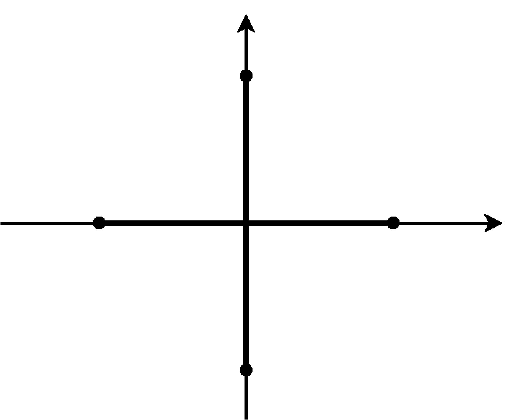
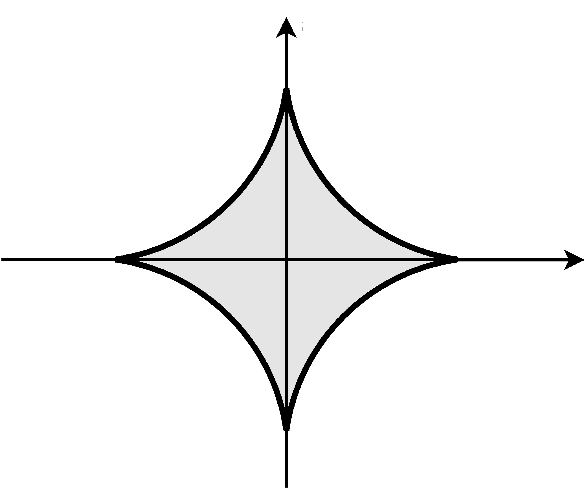
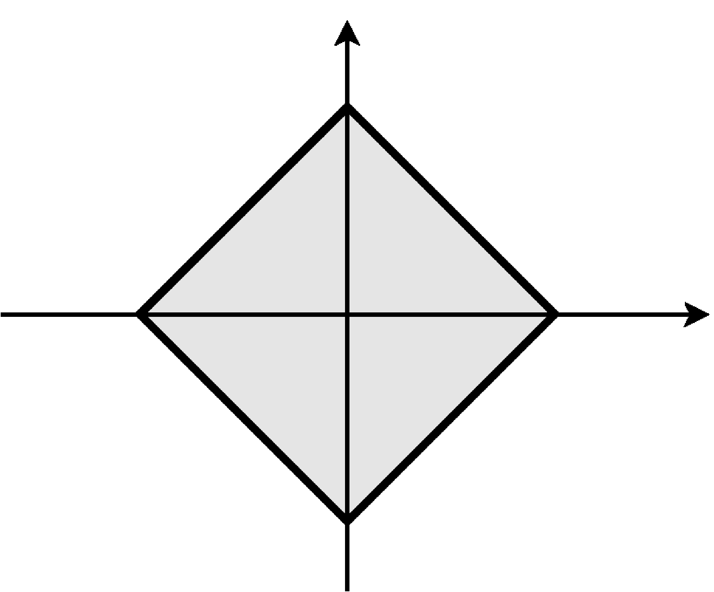
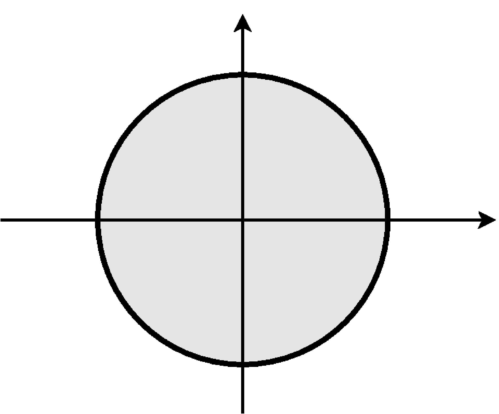
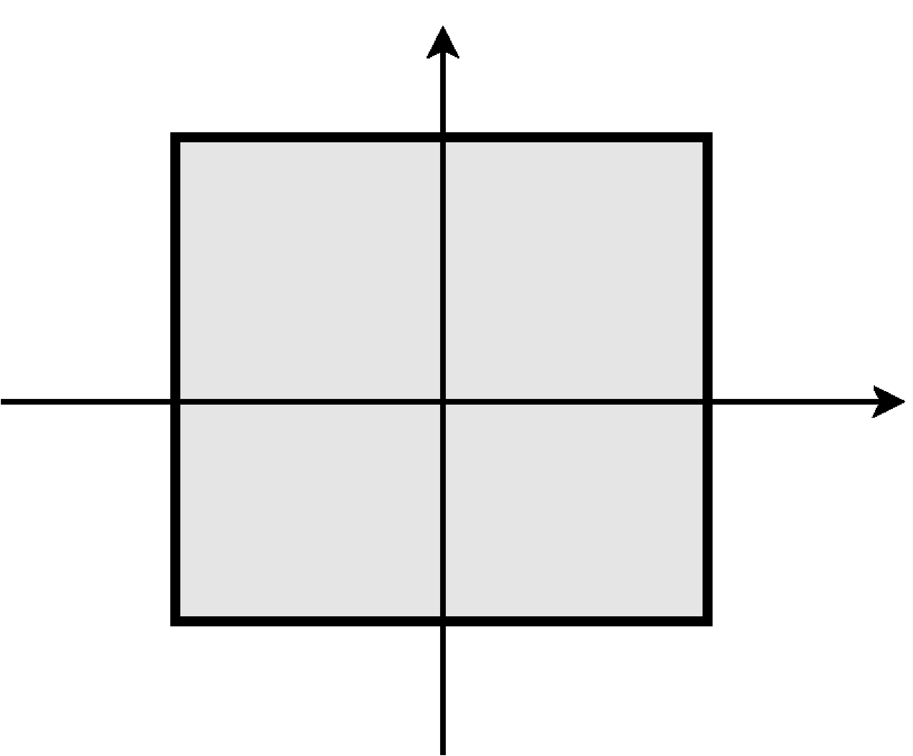
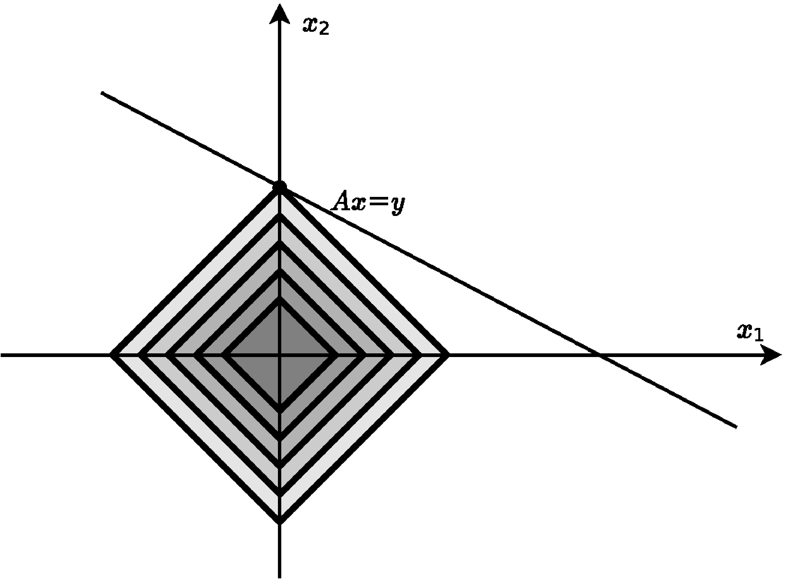
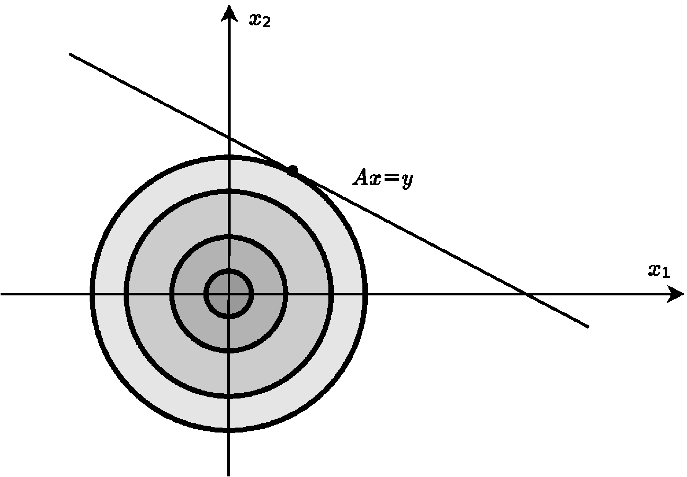
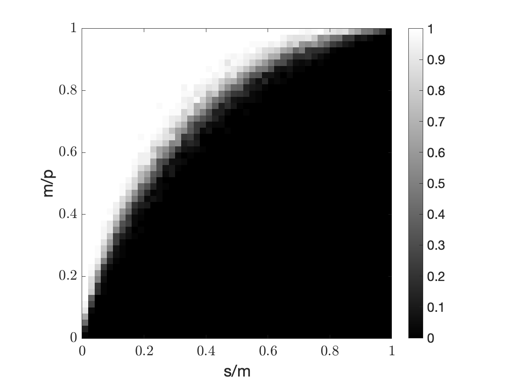
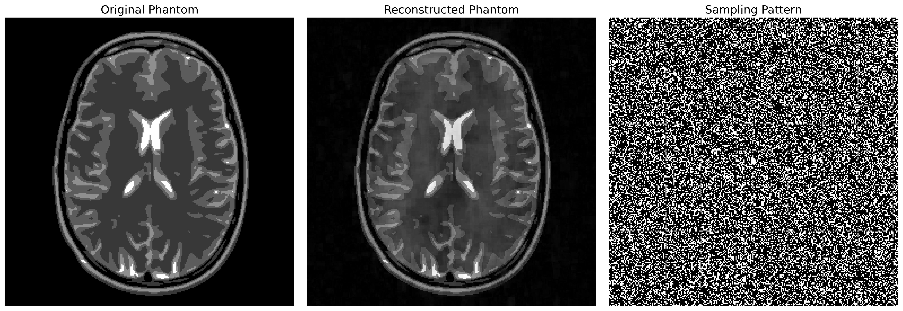

# 压缩感知与稀疏性 {#c:cs}

大家大概都注意过：同一幅图像保存为 JPEG 后，占用空间会显著缩小，而逐像素保存数值的格式则大得多。图像压缩的核心，是利用自然图像已知的结构。相机固然会为每个像素记录一个数值，RGB 图像甚至记录三个，但任意拼凑的一组像素值几乎都不会形成我们日常所见的图像。自然图像不是任意数值阵列，而具有特殊结构；选择合适的表示，就是为了把这种结构显露出来。事实上，自然图像在某些基（如小波基）下近似稀疏。这正是 JPEG2000 的核心思想；传统 JPEG 使用的是另一组基。

## 稀疏恢复 {#s:sparse}

把 $x\in\CC^p$ 看作图像信号，并假定它已经写在一个使其稀疏的基下。模型假设是 $x$ 为 $s$ 稀疏，即 $\|x\|_0\leq s$：它至多有 $s$ 个非零分量，通常 $s\ll p$。向量的“$\ell_0$ 范数”[^1] $\|x\|_0$ 指的正是非零元素个数。按传统流程，相机先进行 $p$ 次测量，每次对应一个像素；经过适当换基后，却只保留 $s\ll p$ 个非零系数，其余全部丢弃。这显然有些浪费，于是产生一个自然问题：既然压缩后只留下少数自由度，能否从一开始就用更高效的方式测量，使测量次数远少于 $p$？

能否把数据采集与压缩合并为同一步骤，正是*压缩感知*的核心问题 [@Candes_CS1; @Candes_CS2; @Candes_CS3; @Candes_CS4; @Donoho_CS; @FoucartRauhut_CSbook]。这一思想对 MRI 尤其重要 [@lustig2007sparse; @feng2017compressed]，因为测量越少，采集时间就可能越短。基于压缩感知的现代 MRI 技术在某些情形下可把采集时间缩短六倍甚至更多 [@lustig2007sparse]，据报道，这对儿童磁共振成像尤有显著益处 [@vasanawala2010improved]。深入学习压缩感知，可参阅专著 [@FoucartRauhut_CSbook]。

用数学语言说，测量值 $y\in\CC^m$ 与目标信号 $x\in\CC^p$（其中 $m\ll p$）满足
$$\begin{equation}
\label{cs}
\left[\begin{array}{c} \\ y \\ \  \end{array}\right] = \left[\begin{array}{cccccccccccccccccc} \\  & & & & & &  & A & & & & & & & & & & \\ \  \end{array}\right] \left[\begin{array}{c}  \\ \\ \\ x \\ \\ \\ \   \end{array}\right].
\end{equation}$$
矩阵 $A\in\CC^{m\times p}$ 描述线性测量或信息采集过程。经典线性代数告诉我们，当 $m<p$ 时，系统 [\[cs\]](#cs){reference-type="eqref" reference="cs"} 欠定；只要它有解，通常便有无穷多解。因此若没有额外信息，不可能在 $m<p$ 时仅由 $y$ 恢复 $x$。

本章假设 $x$ 是 $s$ 稀疏向量，且 $s<m\ll p$。目标是从这个欠定系统中以计算高效的方式恢复 $x$。必须强调，我们事先*不知道* $x$ 的非零系数位于何处；[^2] 否则问题就十分简单了。

### $s$ 稀疏向量的高斯宽度 {#ss:gausswidth}

讨论算法之前，先问这个问题何时适定。要从 $y$ 重建 $x$，最起码要求 $A$ 在稀疏向量集合上是单射。若还希望重建稳定，仅有单射性并不够；$A$ 应在 $s$ 稀疏向量上近似等距，即 $Ax_1$ 与 $Ax_2$ 的 $\ell_2$ 距离应与 $x_1,x_2$ 的距离可比。两个 $s$ 稀疏向量之差一般是 $2s$ 稀疏的，所以等价地，可要求 $A$ 近似保持所有 $2s$ 稀疏向量的范数。Gordon 定理 [\[GordonsTheorem\]](#GordonsTheorem){reference-type="ref" reference="GordonsTheorem"} 表明，可以令 $A\in\RR^{m\times p}$ 的元素独立同分布且服从高斯分布，并取 $m\approx\omega^2(\mathcal S_{2s})$。这里
$\mathcal S_{2s}=\{x:x\in\SSS^{p-1},\|x\|_0\leq2s\}$ 是单位球面上的 $2s$ 稀疏向量集合，$\omega(\mathcal S_{2s})$ 是其高斯宽度，参见定义 [\[def:gaussianwidth\]](#def:gaussianwidth){reference-type="ref" reference="def:gaussianwidth"}。

::: proposition
[]{#proposition:ssparse:gaussianwidth label="proposition:ssparse:gaussianwidth"} 若 $s\leq p$，则至多 $s$ 稀疏的单位向量集合 $\mathcal S_s$ 的高斯宽度满足
$$\omega\left(\mathcal{S}_{s}\right)^2 \lesssim s \log\left( \frac{p}s \right).$$
:::

这表明，大约 $2s\log(p/(2s))$ 次测量足以稳定识别一个 $2s$ 稀疏向量。后面还会看到，同一量级的测量次数实际上足以高效恢复 $s$ 稀疏向量。

### 稀疏恢复与 $\ell_1$ 优化

系统 [\[cs\]](#cs){reference-type="eqref" reference="cs"} 虽然欠定，但我们知道 $x$ 稀疏，因此最直接的恢复办法是求解
$$\begin{equation}
\label{eq:6:L0normmin}
\begin{array}{cl}
\min \,\,& \|z\|_0 \\
\text{s.t.} & Az = y,
\end{array}
\end{equation}$$
并希望最优解 $z$ 正是目标信号 $x$。但优化问题 [\[eq:6:L0normmin\]](#eq:6:L0normmin){reference-type="eqref" reference="eq:6:L0normmin"} 一般是 NP 困难的 [@natarajan1995sparse; @FoucartRauhut_CSbook]。稀疏恢复中通常以 $\ell_0$ 的凸替代量 $\ell_1$ 范数取而代之，其中 $\|z\|_1=\sum_{i=1}^p|z_i|$。图 [1.1](#fig:lp-norm){reference-type="ref" reference="fig:lp-norm"} 展示不同的 $\ell_p$ 球。$\ell_1$ 球沿坐标轴方向，也就是稀疏方向，具有尖角；正因如此，$\ell_1$ 范数可视为 $\ell_0$ 的凸替代。

::: {#fig:lp-norm layout-ncol=5}

不同 $p$ 值对应的 $\ell_p$ 单位球。
:::

$\ell_p$ 最小化可以理解为不断放大或缩小 $\ell_p$ 球，直到它首次接触目标仿射子空间。图 [1.2](#fig:l1l2){reference-type="ref" reference="fig:l1l2"} 表明，$\ell_1$ 最小化会促进稀疏性，而 $\ell_2$ 最小化并不偏好稀疏解。第 [\[ss:hypercube\]](#ss:hypercube){reference-type="ref" reference="ss:hypercube"} 章已经看到，维数越高，$\ell_1$ 球越“尖”。在压缩感知中，这一性质恰好对我们有利，是“维数之福”的又一体现。

::: {#fig:l1l2 layout-ncol=2}

$\ell_1$ 与 $\ell_2$ 最小化的二维示意图。不断放大 $\ell_p$ 球，直至接触目标仿射子空间。左图中 $\ell_1$ 球的尖角使最小化偏向稀疏解；右图的 $\ell_2$ 最小化则没有这种偏好。
:::

因此考虑问题 [\[eq:6:L0normmin\]](#eq:6:L0normmin){reference-type="eqref" reference="eq:6:L0normmin"} 的如下凸替代：
$$\begin{equation}
\label{eq:6:L1normmin}
\begin{array}{cl}
\min \,\, & \|z\|_1 \\
\text{s.t.} & Az = y,
\end{array}
\end{equation}$$

要让 [\[eq:6:L1normmin\]](#eq:6:L1normmin){reference-type="eqref" reference="eq:6:L1normmin"} 成为好的稀疏恢复方法，需要满足两点：它的解必须有意义，最好恰好等于 $x$；同时，这个优化问题必须能够高效求解。

::: remark
暂时考虑实数情形 $x\in\RR^p$、$A\in\RR^{m\times p}$。可把 [\[eq:6:L1normmin\]](#eq:6:L1normmin){reference-type="eqref" reference="eq:6:L1normmin"} 写成线性规划，[^3] 从而说明它可高效求解。令 $\omega^+$ 为 $z$ 的正部，$\omega^-$ 为负部的相反数，于是 $z=\omega^+-\omega^-$，且对每个 $i$，$\omega_i^+$、$\omega_i^-$ 至少一个为零。此时
$$\|z\|_1=\sum_{i=1}^p(\omega_i^++\omega_i^-)=\1^T(\omega^++\omega^-).$$
因此考虑线性规划

$$\begin{equation}
\label{eq:6:L1normmin_LP}
\begin{array}{cl}
\min \,\, &  \1^T \left(  \omega^{+} + \omega^{-} \right) \\
\text{s.t.} & A\left( \omega^{+} - \omega^{-} \right) = y \\
 & \omega^{+} \geq 0 \\
 & \omega^{-} \geq 0,
\end{array}
\end{equation}$$
不难看出，问题 [\[eq:6:L1normmin_LP\]](#eq:6:L1normmin_LP){reference-type="eqref" reference="eq:6:L1normmin_LP"} 的最优解必满足每个位置上 $\omega_i^+$、$\omega_i^-$ 至少一个为零，因而与 [\[eq:6:L1normmin\]](#eq:6:L1normmin){reference-type="eqref" reference="eq:6:L1normmin"} 等价。否则，若二者同时为正，就可同时减小它们，在保持约束不变的同时降低目标值。线性规划可高效求解 [@LVanderberghe_SBoyd_book]，所以 $\ell_1$ 优化问题也是高效的。复数域上的相应问题虽然不再是线性规划，而是二次规划，但同样可以高效求解。
:::

下面讨论什么条件能保证 [\[eq:6:L1normmin\]](#eq:6:L1normmin){reference-type="eqref" reference="eq:6:L1normmin"} 的解恰好是目标稀疏信号。我们会介绍几种不同证明策略，因为它们向其他问题推广的适用性各不相同；本章后面还会讨论感知矩阵的构造。

## 零空间性质与精确恢复 {#s:nsp}

给定 $s$ 稀疏向量 $x$，我们希望证明：在适当条件下，$x$ 是下列问题的唯一最优解：

$$\begin{equation}
%\label{eq:6:L1normmin}
\begin{array}{cl}
\min \,\, & \|z\|_1 \\
\text{s.t.} & Az = y,
\end{array}
\end{equation}$$

令 $S=\supp(x)$，且 $|S|=s$。[^4] 若 $x$ 不是 $\ell_1$ 最小化问题的唯一最优解，则存在另一最优解 $z\neq x$。令 $v=z-x$，则
$$\|v+x\|_1\leq\|x\|_1,qquad A(v+x)=Ax,$$
所以 $Av=0$。另一方面，由三角不等式，
$$\|x\|_S = \|x\|_1 \geq \|v+x\|_1 = \|\left(v+x\right)_S\|_1 + \|v_{S^c}\|_1 \geq \|x_S\|_1 - \|v_S\|_1 + \|v_{S^c}\|_1.$$
因此必有 $\|v_S\|_1\geq\|v_{S^c}\|_1$。但 $|S|\ll p$，若 $A$ 的零空间中存在质量如此集中在少数坐标上的向量，应当是很特殊的。由此得到下面的定义。

::: definition
[]{#def:nullspace label="def:nullspace"} 若对每个 $v\in\ker(A)$ 以及每个满足 $|S|=s$ 的集合 $S$，都有
$$\|v_S\|_1<\|v_{S^c}\|_1,$$
则称 $A$ 满足 $s$ 阶零空间性质，记作 $A\in\text{s-NSP}$。
:::

上述论证已经说明：若 $A$ 满足 $s$ 阶零空间性质，则 $x$ 确实是 [\[eq:6:L1normmin\]](#eq:6:L1normmin){reference-type="eqref" reference="eq:6:L1normmin"} 的唯一最优解。由于该性质要求对每个大小为 $s$ 的集合 $S$ 成立，它实际上保证了所有 $s$ 稀疏向量都能恢复。

::: theorem
[]{#thm:NSPimpliesRecovery label="thm:NSPimpliesRecovery"} 设 $x$ 是 $s$ 稀疏向量。若 $A\in\text{s-NSP}$，则当 $y=Ax$ 时，$x$ 是 $\ell_1$ 优化问题 $\eqref{eq:6:L1normmin}$ 的唯一解。
:::

零空间性质要求某一类向量不落入 $A$ 的零空间，因此可以再次借助 Gordon 定理 [\[GordonsTheorem\]](#GordonsTheorem){reference-type="ref" reference="GordonsTheorem"}，为高斯感知矩阵建立恢复保证。定义这类向量构成的锥与单位球面的交集
$$\begin{equation}
\label{eq:def:Cs}
C_s \defeq \left\{v\in\SSS^{p-1}: \exists_{S\subset [p],\, |S|=s} \left\|v_S\right\|_1\geq \left\|v_{S^c}\right\|_1 \right\}.
\end{equation}$$

### Gordon 定理与零空间性质 {#ss:gordonnullspace}

对 $m\times p$ 矩阵 $A$，条件 $A\in\text{s-NSP}$ 等价于 $\ker(A)\cap C_s=\emptyset$。因此 Gordon 定理，准确地说是 Gordon 逃逸网格定理 [\[thm:GordonEscapeMesh\]](#thm:GordonEscapeMesh){reference-type="ref" reference="thm:GordonEscapeMesh"}，蕴含如下事实：存在普适常数 $C>0$，若 $A$ 的元素独立同分布且服从高斯分布，并且
$m\geq C\omega^2(C_s)$，则 $A$ 以高概率满足 $s$-NSP。这里 $\omega(C_s)$ 是式 [\[eq:def:Cs\]](#eq:def:Cs){reference-type="eqref" reference="eq:def:Cs"} 所定义集合的高斯宽度。

::: proposition
设 $s\leq p$，并令 $C_s\subset\SSS^{p-1}$ 如式 [\[eq:def:Cs\]](#eq:def:Cs){reference-type="eqref" reference="eq:def:Cs"} 所定义。存在普适常数 $C$ 使
$$\omega\left( C_s \right) \leq C \sqrt{s \log\left( \frac{p}s \right)},$$
其中 $\omega(C_s)$ 是 $C_s$ 的高斯宽度。
:::

结合定理 [\[thm:NSPimpliesRecovery\]](#thm:NSPimpliesRecovery){reference-type="ref" reference="thm:NSPimpliesRecovery"}，得到下面的恢复保证；其测量次数量级与稀疏向量高斯宽度所预示的结果一致。

::: theorem
[]{#thm:GaussiansSatisfyNSP label="thm:GaussiansSatisfyNSP"} 存在普适常数 $C\geq0$。若 $A$ 是元素独立同分布且服从高斯分布的 $m\times p$ 矩阵，并且
$m\geq Cs\log(p/s)$，则以高概率同时有：对任意 $s$ 稀疏向量 $x$，当 $y=Ax$ 时，$x$ 是 $\ell_1$ 优化问题 [\[eq:6:L1normmin\]](#eq:6:L1normmin){reference-type="eqref" reference="eq:6:L1normmin"} 的唯一解。
:::

## 限制等距性质 {#s:rip}

证明 $\ell_1$ 最小化能够精确恢复，还有一种更经典的途径：限制等距性质（RIP）。它准确刻画了测量矩阵近似保持稀疏向量长度的能力。

::: definition
[]{#def:6:RIP_2 label="def:6:RIP_2"} 若实或复的 $m\times p$ 矩阵 $A$ 对所有 $s$ 稀疏向量 $x$ 都满足
$$(1-\delta)\|x\|^2 \leq \left\| Ax\right\|^2 \leq (1+\delta)\|x\|^2,$$
则称 $A$ 满足 $(s,\delta)$-限制等距性质（RIP）。
:::

若 $A$ 对稀疏度 $2s$ 满足 RIP，它就近似保持任意两个 $s$ 稀疏向量之间的距离，“限制等距”之名由此而来。这个性质还可用来证明 $A$ 满足零空间性质。

::: theorem
设 $y=Ax$，其中 $x$ 为 $s$ 稀疏向量。若 $A$ 的 RIP 常数满足 $\delta_{2s}<1/3$，则 $\ell_1$ 最小化问题
$$\begin{equation}
\label{l1min}
\min_z \|z\|_1, \qquad \text{subject to } Az = y = Ax
\end{equation}$$
的解 $x_*$ 精确等于 $x$，即 $x_*=x$。[]{#thm:maincs label="thm:maincs"}
:::

证明该定理需要下面的引理。

::: lemma
[]{#lemma:np label="lemma:np"} 若 $x,x'\in\R^p$ 的支撑集分别包含于互不相交的 $S,S'\subseteq[p]$，且 $|S|\leq s$、$|S'|\leq s'$，则
$$| \langle Ax, Ax^\prime \rangle | \leq \delta_{s+s^{\prime}} \|x\| \|x^\prime\|.$$
:::

要证明定理 [\[thm:maincs\]](#thm:maincs){reference-type="ref" reference="thm:maincs"}，只需验证上述条件蕴含零空间性质。

::: proof
*定理 [\[thm:maincs\]](#thm:maincs){reference-type="ref" reference="thm:maincs"} 的证明.* 任取 $h\in\ker(A)\setminus\mathbf 0$。令 $S_0$ 为 $h$ 中绝对值最大的 $s$ 个元素的指标集；$S_1,S_2,\dots$ 依次对应随后第 $s+1$ 至 $2s$、第 $2s+1$ 至 $3s$ 等元素的指标。

由 RIP，
$$\begin{align}
\|h_{S_0}\|^2 & \leq \frac{1}{1-\delta_s} \|Ah_{S_0}\|^2 \\
& = \frac{1}{1-\delta_s} \sum_{j \geq 1} \langle Ah_{S_0}, A(-h_{S_j}) \rangle 
& \text{(because $h_{S_0} = \sum_{j \geq 1} (-h_{S_j})$)} \\
& \le  \frac{1}{1-\delta_s} \sum_{j \geq 1} \delta_{2s} \|h_{S_0}\| \|h_{S_j}\|
& \text{(by Lemma~\ref{lemma:np})} \\
& \leq \frac{\delta_{2s}}{1 - \delta_s} \|h_{S_0}\| \sum_{j \geq 1} \|h_{S_j}\| \\
\|h_{S_0}\| & \leq \frac{\delta_{2s}}{1 - \delta_s} \sum_{j \geq 1} \|h_{S_j}\| .
\label{eq:pf1}
\end{align}$$
注意
$$\|h_{S_j}\| \leq s^{\frac{1}{2}} \|h_{S_j}\|_\infty \leq s^{-\frac{1}{2}} \|h_{S_{j-1}}\|_1.$$
因此式 [\[eq:pf1\]](#eq:pf1){reference-type="ref" reference="eq:pf1"} 可改写为
$$\begin{align}
\|h_{S_0}\| & \leq \frac{\delta_{2s}}{1 - \delta_s} s^{-\frac{1}{2}} \sum_{j \geq 1} \|h_{S_{j-1}}\|_1 \\
& = \frac{\delta_{2s}}{1 - \delta_s} s^{-\frac{1}{2}} \|h\|_1.
\label{eq:lastpf}
\end{align}$$
另一方面，由 Cauchy--Schwarz 不等式，
$$\begin{equation}
\|h_{S_0}\|_1 = \sum_{i \in S_0} 1 \times |h_i| \leq \sqrt{\sum_{i \in S_0} 1^2}\sqrt{\sum_{i \in S_0} h_i^2} 
= \sqrt{s} \|h_{S_0}\|.
\label{eq:hs0}
\end{equation}$$
又因为假设 $\delta_{2s}<1/3$，
$$\begin{equation}
\frac{\delta_{2s}}{1-\delta_s} < \frac{\delta_{2s}}{1-\delta_{2s}} < \frac{1}{2} \quad \text{for $\delta_{2s} < \frac{1}{3}$}.
\label{eq:delta}
\end{equation}$$
结合式 [\[eq:lastpf\]](#eq:lastpf){reference-type="ref" reference="eq:lastpf"}、[\[eq:hs0\]](#eq:hs0){reference-type="ref" reference="eq:hs0"} 与 [\[eq:delta\]](#eq:delta){reference-type="ref" reference="eq:delta"}，得到
$$\begin{equation}
% \|h_{S_0}\| \leq \frac{\delta_{2s}}{1 - \delta_s} s^{\frac{1}{2}} \|h\|_1
\|h_{S_0}\|_1 < \frac{1}{2} \|h\|_1.
\label{eq:pfhs0h1}
\end{equation}$$

下面说明式 [\[eq:pfhs0h1\]](#eq:pfhs0h1){reference-type="eqref" reference="eq:pfhs0h1"} 等价于 $\|h_S\|_1<\|h_{S^c}\|_1$：
$$\begin{align*}
& & \|h_S\|_1 & < \|h_{S^C}\|_1 \\
& \Leftrightarrow & 2\|h_S\|_1 & < \|h_{S^C}\|_1 + \|h_S\|_1 \\
& \Leftrightarrow & 2\|h_S\|_1 & < \|h\|_1 \\
& \Leftrightarrow & \|h_S\|_1 & < \frac{1}{2} \|h\|_1.
\end{align*}$$

因此已经证明零空间性质 $\|h_{S_0}\|_1<\|h_{S_0^c}\|_1$。再应用定理 [\[thm:NSPimpliesRecovery\]](#thm:NSPimpliesRecovery){reference-type="ref" reference="thm:NSPimpliesRecovery"}，证明完成。 ◻
:::

压缩感知中的许多结果，包括定理 [\[thm:maincs\]](#thm:maincs){reference-type="ref" reference="thm:maincs"}，稍加修改便能推广到 $x$ 不是严格 $s$ 稀疏、而只是近似 $s$ 稀疏的情形。这种性质有时称为*可压缩性*。详见 [@CP08; @FoucartRauhut_CSbook]。

### 随机矩阵与限制等距性质

定理 [\[thm:GaussiansSatisfyNSP\]](#thm:GaussiansSatisfyNSP){reference-type="ref" reference="thm:GaussiansSatisfyNSP"} 及其证明给出了随机高斯矩阵满足 NSP 的条件。利用现有工具，对 RIP 得到同类结果十分直接。结合命题 [\[proposition:ssparse:gaussianwidth\]](#proposition:ssparse:gaussianwidth){reference-type="ref" reference="proposition:ssparse:gaussianwidth"} 与定理 [\[thm:Gordon:afterGconcentration\]](#thm:Gordon:afterGconcentration){reference-type="ref" reference="thm:Gordon:afterGconcentration"}，容易证明[^5]：当 $m\approx s\log(p/s)$ 时，高斯矩阵满足 RIP。

::: theorem
[]{#thm:RIPmatricesGaussianEntries label="thm:RIPmatricesGaussianEntries"} 设 $A$ 是元素独立同分布且服从标准高斯分布的 $m\times p$ 矩阵。存在常数 $C$，使得若
$$\begin{equation}
\label{condgauss}
  m \geq Cs\log\left(\frac{p}s\right),
\end{equation}$$
则 $m^{-1/2}A$ 以高概率满足 $(s,1/4)$-RIP。
:::

这里有一点十分重要：定理 [\[thm:GaussiansSatisfyNSP\]](#thm:GaussiansSatisfyNSP){reference-type="ref" reference="thm:GaussiansSatisfyNSP"}、[\[thm:RIPmatricesGaussianEntries\]](#thm:RIPmatricesGaussianEntries){reference-type="ref" reference="thm:RIPmatricesGaussianEntries"} 与 [\[thm:maincs\]](#thm:maincs){reference-type="ref" reference="thm:maincs"} 合起来，给出高斯感知矩阵对稀疏向量的*一致恢复保证*。一旦某个高斯矩阵满足 RIP 或 NSP，$\ell_1$ 最小化就能同时精确恢复*所有*足够稀疏的向量。

图 [1.3](#fig:phaseplot){reference-type="ref" reference="fig:phaseplot"} 展示压缩感知中的相变：固定稀疏度 $s$ 后，当测量次数超过某个阈值，$\ell_1$ 最小化几乎总能找到最稀疏解；低于阈值时则几乎总是失败。图中失败与成功之间极为陡峭的过渡有严格理论支撑 [@donoho2009observed; @amelunxen2014living]。实验使用 $m\times p$ 高斯随机感知矩阵，固定环境维数 $p=100$，令测量次数 $m$ 从 1 变到 100，稀疏度 $s$ 从 1 变到 $m$。对每组 $(s,m)$，从 $1,\dots,100$ 中均匀选取 $s$ 个位置，填入随机非零系数以构造稀疏向量 $x$；计算 $y=Ax$，再通过 [\[l1min\]](#l1min){reference-type="eqref" reference="l1min"} 恢复 $x$。每组参数对独立重复 50 次。图中绘制经验成功率，重建相对误差小于 $10^{-5}$ 视为成功；黑色表示全部失败，白色表示全部成功。相变的详细分析见 [@donoho2009observed; @amelunxen2014living]。

{#fig:phaseplot width=60%}

Johnson--Lindenstrauss 投影与满足 RIP 的感知矩阵显然相似，但也有重要差别。[^6] 应用 JL 降维时，必须预先知道向量个数的上界，而且该集合是有限的；JL 投影在误差 $\epsilon$ 内保持这些向量的两两距离，却不要求它们稀疏。因此 JL 投影 $P$ 通常是单向的：一般无法由 $y=Px$ 恢复 $x$。相比之下，RIP 矩阵可同时作用于无穷多个向量，代价是这些向量必须稀疏；而且可以从 $y=Ax$ 数值高效地恢复这类 $x$。

由此，满足 RIP 的矩阵未必满足 Johnson--Lindenstrauss 引理。高斯随机矩阵同时满足二者，但其他矩阵未必如此。例如，取 $m\times p$ 的随机抽样 Fourier 矩阵 $A$。按快速 Johnson--Lindenstrauss 变换的记号，它对应 $A=SF$，但缺少随机化 $x$ 相位或符号的对角矩阵 $D$。因此它不具备定理 [\[JL_random_0\]](#JL_random_0){reference-type="ref" reference="JL_random_0"} 的 JL 性质；然而缺少 $D$ 并不妨碍 $A=SF$ 在适当维数条件下满足 RIP。

已知 [@Candes_CS4]，若 $m=\Omega_\delta(s\operatorname{polylog}p)$，部分 Fourier 矩阵以高概率满足 RIP。究竟需要多少个对数因子一直是研究重点；Haviv 与 Regev [@Haviv_Regev_2016] 给出的当前最佳上界为 $m=\Omega_\delta(s\log^2s\log p)$。在下界方面，已知高斯矩阵达到的 $m=\Theta_\delta(s\log(p/s))$ 一般无法实现 [@Bandeira_UncertaintyPrinciple]。

一般而言，判定给定矩阵是否满足 RIP 是 NP 困难的 [@Bandeira_etal_hardRIP; @Tillmann_hardRIP]。定理 [\[thm:RIPmatricesGaussianEntries\]](#thm:RIPmatricesGaussianEntries){reference-type="ref" reference="thm:RIPmatricesGaussianEntries"} 表明，当 $s\approx m/\log p$ 时 RIP 矩阵非常丰富；但确定性构造在 $s\gg\sqrt m$ 时满足 RIP 的矩阵却极其困难，这称为平方根瓶颈 [@Tao_blog_deterministicRIP; @Bandeira_RoadRIP; @Bandeira_DerandomizingRIP; @Bandeira_ConditionalPaley; @JBourgain_etal_2011_RIP; @Dustin_bookchapter_RIP]。目前唯一无条件突破该瓶颈的构造由 Bourgain 等人给出 [@JBourgain_etal_2011_RIP]，达到 $s\approx m^{1/2+\eps}$，其中 $\eps>0$ 很小。另有基于 Paley 等角紧框架的条件构造 [@Bandeira_RoadRIP; @Bandeira_ConditionalPaley]。

第 [1.5.1](#s:coherence){reference-type="ref" reference="s:coherence"} 节将讨论更实用的感知矩阵设计条件，它们以矩阵的*相干性*为基础，更适合应用。有趣的是，上述部分 Fourier 矩阵中缺失的 $x$ 的相位随机化，将在*非一致恢复保证*中重新出现。

::: remark
若关心的是某个特定稀疏向量被精确恢复的概率，而不是同时覆盖所有稀疏向量的一致保证，就可以细化上述论证，精确预测所需测量次数的渐近行为。基于高斯宽度的方法见 [@chandrasekaran2012convex]，基于积分几何的方法见 [@amelunxen2014living]。
:::

## 对偶性与精确恢复

本节介绍另一种证明 [\[eq:6:L1normmin\]](#eq:6:L1normmin){reference-type="eqref" reference="eq:6:L1normmin"} 精确恢复稀疏向量的方法：对偶性。这与第 [\[c:community\]](#c:community){reference-type="ref" reference="c:community"} 章证明随机块模型精确恢复时采用的策略相同。实数情形基本沿用 [@Fuchs_sparserepresentations]，复数情形参照 [@Tropp_shortcomplexlinearcombinations]。

第 [\[c:optimization\]](#c:optimization){reference-type="ref" reference="c:optimization"} 章曾用 Lagrangian 推导线性规划的对偶。读者也可尝试用第 [\[c:community\]](#c:community){reference-type="ref" reference="c:community"} 章的博弈论方法重新推导；那里用它推导了半正定规划的对偶。线性规划 [\[eq:6:L1normmin_LP\]](#eq:6:L1normmin_LP){reference-type="eqref" reference="eq:6:L1normmin_LP"} 的对偶为

$$\begin{equation}
\label{eq:6:L1normmin_LP_Dual}
\begin{array}{cl}
\max_u & u^Ty \\
s.t. & -\1 \leq A^Tu   \leq  \1.
\end{array}
\end{equation}$$

弱对偶性，即 $\eqref{eq:6:L1normmin_LP_Dual}\leq\eqref{eq:6:L1normmin_LP}$，很容易验证。若 $\omega^-,\omega^+$ 在原问题中可行，$u$ 在对偶问题中可行，则
$$\begin{eqnarray}
\label{eq:6:weakduality}
0 & \leq & \left( \1^T - u^TA \right) \omega^{+} +  \left( \1^T + u^TA \right) \omega^{-} \\  &= & 1^T\left( \omega^{+} + \omega^{-} \right) - u^T\left[ A\left( \omega^{+} - \omega^{-} \right)\right] = 1^T\left( \omega^{+} + \omega^{-} \right) - u^Ty, \nonumber
\end{eqnarray}$$
这就证明了弱对偶。第 [\[s:duality\]](#s:duality){reference-type="ref" reference="s:duality"} 章还告诉我们强对偶成立，因而两个规划的最优值实际相等。

### 寻找对偶证书

为证明 $\omega^+-\omega^-=x$ 是 [\[eq:6:L1normmin_LP\]](#eq:6:L1normmin_LP){reference-type="eqref" reference="eq:6:L1normmin_LP"} 的最优解，[^7] 我们寻找一个对偶可行点 $u$，使其对偶目标值等于原问题在 $x$ 处的值。这样的 $u$ 称为*对偶证书*，见第 [\[ss:KKT\]](#ss:KKT){reference-type="ref" reference="ss:KKT"} 章。

由式 [\[eq:6:weakduality\]](#eq:6:weakduality){reference-type="eqref" reference="eq:6:weakduality"}，$u$ 必须满足
$$\left( \1^T - u^TA \right) \omega^{+} =0,\qquad \left( \1^T + u^TA \right) \omega^{-} = 0,$$
这正是第 [\[ss:KKT\]](#ss:KKT){reference-type="ref" reference="ss:KKT"} 章的*互补松弛*条件。因此在 $x$ 非零的位置，$A^Tu$ 的元素必须等于 $+1$ 或 $-1$，并与 $x$ 的符号一致。换言之，若 $S=\supp(x)$，则
$$\left(A^Tu\right)_S=\sign(x_S),$$
同时为保证对偶可行，还需 $\|A^Tu\|_\infty\leq1$。

::: remark
[]{#remark:6:uniquenessofCSsol label="remark:6:uniquenessofCSsol"} 若进一步要求 $\|(A^Tu)_{S^c}\|_\infty<1$，则任何原问题最优解的支撑集都必须包含在 $x$ 的支撑集中。把定理 [\[th:kkt2\]](#th:kkt2){reference-type="ref" reference="th:kkt2"} 推广到目标函数不可微但存在次微分的情形，例如 $f(x)=\|x\|_1$，再使用第 [\[ss:subgradient\]](#ss:subgradient){reference-type="ref" reference="ss:subgradient"} 章算出的 $\ell_1$ 范数次微分性质，即得下面的引理。
:::

::: lemma
[]{#le:csdual label="le:csdual"} 在上述稀疏恢复问题中，令 $S=\supp(x)$。若 $A_S$ 是单射，且存在 $u\in\RR^M$ 满足
$$\left(A^Tu\right)_S=\sign(x_S),qquad
\left\|(A^Tu)_{S^c}\right\|_\infty<1,$$
则 $x$ 是 $\ell_1$ 最小化问题 [\[eq:6:L1normmin\]](#eq:6:L1normmin){reference-type="eqref" reference="eq:6:L1normmin"} 的唯一最优解。
:::

已知需要 $(A^Tu)_S=\sign(x_S)$，并假设 $A_S$ 单射。于是尝试通过最小二乘构造[^8] $u$，再验证 $\|(A^Tu)_{S^c}\|_\infty<1$。具体取
$$u=(A_S^T)^\dagger\sign(x_S),$$
其中 $(A_S^T)^\dagger=A_S(A_S^TA_S)^{-1}$ 是 $A_S^T$ 的 Moore--Penrose 伪逆。由此得到下面的推论。

::: corollary
[]{#cor:6:dualcertificate label="cor:6:dualcertificate"} 在稀疏恢复问题中，令 $S=\supp(x)$。若 $A_S$ 单射，且
$$\left\| A_{S^c}^T A_S \left( A_S^TA_S \right)^{-1} \sign\left(x_S\right) \right\|_\infty < 1,$$
则 $x$ 是 $\ell_1$ 最小化问题 [\[eq:6:L1normmin\]](#eq:6:L1normmin){reference-type="eqref" reference="eq:6:L1normmin"} 的唯一最优解。
:::

定理 [\[thm:RIPmatricesGaussianEntries\]](#thm:RIPmatricesGaussianEntries){reference-type="ref" reference="thm:RIPmatricesGaussianEntries"} 表明：存在普适常数 $C$，若 $m\geq Cs\log(p/s)$，且 $A\in\RR^{m\times p}$ 的元素独立同分布并服从 $\NNN(0,1/m)$，则它以高概率满足 $(s,1/3)$-RIP。[^9] 因此对任意 $|S|\leq s$，
$\|A_S\|\leq\sqrt{1+1/3}$，并且
$\|(A_S^TA_S)^{-1}\|\leq(1-1/3)^{-1}=3/2$。这里 $\|\cdot\|$ 是算子范数，$\|B\|=\max_{\|x\|=1}\|Bx\|$。

于是对任意 $|S|\leq s$，
$$\| A_S \left( A_S^TA_S \right)^{-1} \sign\left(x_S\right) \| \leq \sqrt{1+\frac13} \frac32\sqrt{s} = \sqrt{3}\sqrt{s}.$$
由于 $A$ 的元素独立，$A_{S^c}$ 与上式中的向量独立。因此对每个 $j\in S^c$，
$$\Prob \left(  \left| A_{j}^T A_S \left( A_S^TA_S \right)^{-1} \sign\left(x_S\right) \right| \geq \frac1{\sqrt{M}}\sqrt{3}\sqrt{s} t \right)  \leq 2\exp\left(-\frac{t^2}2\right),$$
其中 $A_j$ 是 $A$ 的第 $j$ 列。

应用并合界，得到
$$\Prob \left(  \left\| A_{S^c}^T A_S \left( A_S^TA_S \right)^{-1} \sign\left(x_S\right) \right\|_\infty \geq \frac1{\sqrt{M}}\sqrt{3}\sqrt{s} t  \right)  \leq 2N\exp\left(-\frac{t^2}2\right),$$
进而
$$\begin{eqnarray*}
\Prob \left(  \left\| A_{S^c}^T A_S \left( A_S^TA_S \right)^{-1} \sign\left(x_S\right) \right\|_\infty \geq 1  \right) & \leq & 2p\exp\left(-\frac{\left( \frac{\sqrt{m}}{\sqrt{3s}} \right)^2}2\right) \\ &=& \exp\left(- \frac12\left[ \frac{m}{3s} - 2\log(2p) \right] \right),
\end{eqnarray*}$$
因此当 $m\gg s\log p$ 时，可以预期 $\ell_1$ 最小化精确恢复 $x$。这个界可能比 $m\gtrsim s\log(p/s)$ 渐近更差，而且它并不同时保证所有稀疏向量都能恢复；但构造对偶证书的技术可推广到许多其他情形，充分展示了对偶方法的灵活性。下一节将更详细地讨论非一致恢复保证。

## 从理论走向实践 {#s:cs-practice}

### 感知矩阵与非相干性 {#s:coherence}

在应用中，感知矩阵通常不能随意选择。因此高斯随机矩阵虽是重要的理论基准，实际作用却较有限。随机性显然有利于压缩感知，但许多系统只能使用受结构约束的测量装置。我们或许仍可随机选择多天线雷达的天线位置 [@strohmer2014analysis; @strohmer2013accurate]、MRI 的传感器位置 [@lustig2007sparse; @Adcock-Hansen-book; @block2007undersampled; @ni2024auto]，或数字信号采集的采样位置 [@mishali2010theory]；也可在声呐和雷达中发射随机波形 [@herman2009high; @potter2010sparsity]。但在这些例子里，$A$ 的整体结构仍由波传播的物理规律决定。其他应用也会有各自的物理约束与设计限制，决定感知矩阵中究竟能引入多少随机性。

证明高斯或 Bernoulli 随机矩阵以高概率满足 RIP 并不太难；对部分 Fourier 矩阵 [@Candes_CS4; @rudelson2008sparse; @Haviv_Regev_2016] 和时频矩阵 [@dorsch2017refined] 已显著更困难，对更专门的感知矩阵则难上加难。

绕开 RIP 实践限制的一个有效概念，是矩阵的相干性或非相干性。尽管希望避免直接验证 RIP，我们仍从它出发。定义 [\[def:6:RIP_2\]](#def:6:RIP_2){reference-type="ref" reference="def:6:RIP_2"} 要求任意 $S\subset[p]$、$|S|\leq s$ 及 $x\in\RR^{|S|}$ 满足
$$(1-\delta)\|x\|^2\leq\|A_Sx\|^2\leq(1+\delta)\|x\|^2.$$
这等价于
$$\max_x\frac{x^T(A_S^TA_S-I)x}{x^Tx}\leq\delta,$$
也即 $\|A_S^TA_S-I\|\leq\delta$。

若 $A$ 的列都是 $\RR^m$ 中的单位向量，则 $A_S^TA_S$ 的对角元全为 1，故 $A_S^TA_S-I$ 只含非对角项。若任意两列 $a_i,a_j$ 还满足 $|a_i^Ta_j|\leq\mu$，Gershgorin 圆盘定理便给出 $\|A_S^TA_S-I\|\leq\mu(s-1)$。

具体地，Gershgorin 圆盘定理 [@HJ90] 断言，对称矩阵 $B$ 的所有特征值都落在各圆盘
$$\Big\{\lambda:|\lambda-B_{ii}|\leq\sum_{j\neq i}|B_{ij}|\Big\}$$
内。若 $B$ 的对角元全为零，就得到 $\|B\|\leq\max_i\sum_{j\neq i}|B_{ij}|$。

给定 $p$ 个单位向量 $a_1,\dots,a_p\in\RR^m$，定义其最坏情形相干性
$$\begin{equation}
\label{coherence}
\mu(a_1,\dots,a_p) = \max_{i\neq j} \left| \langle a_i, a_j \rangle  \right|.
\end{equation}$$

若这些向量的最坏情形相干性为 $\mu$，以它们为列组成的矩阵满足 $(s,\mu(s-1))$-RIP；特别地，当 $s\leq1/(3\mu)$ 时满足 $(s,1/3)$-RIP。

因此自然要设计最坏情形相干性尽可能小的向量组。这是框架理论的核心问题 [@SH03; @Chr03; @Casazza_Kutyniok_2012; @waldron2018introduction]。回顾：在有限维空间中，若存在框架界 $0<A\leq B<\infty$，使向量组 $a_1,\dots,a_p\in\Hsp^m$（$\Hsp=\R$ 或 $\C$）对每个 $x\in\Hsp^m$ 满足[^10]
$$\begin{equation}
\label{framedef}
    A \|x\|^2 \le \sum_{k=1}^p | \langle x,a_k \rangle |^2 \le B \|x\|^2
\end{equation}$$
则称其为 $\Hsp^m$ 的框架。相应的*框架算子*定义为
$$\begin{equation}
 \label{frameop}
Sx = \sum_{i=1}^p \langle x,a_i \rangle a_i.
\end{equation}$$
式 [\[framedef\]](#framedef){reference-type="eqref" reference="framedef"} 等价于 $AI\preccurlyeq S\preccurlyeq BI$，其中 $\preccurlyeq$ 表示半正定序。若 $A=B$，即 $S=AI$，称为*紧框架*；若所有 $\|a_i\|=1$，称为*单位范数框架*；若单位范数框架还满足
$$\begin{equation}
\label{defequi}
|\langle a_i,a_j \rangle| = c \quad 
\text{for all $i,j$ with $i \neq j,$}
\end{equation}$$
其中 $c\geq0$ 为常数，则称为*等角框架*。任何正交归一基显然都是等角的。

下面的框架理论定理给出相干性的清晰下界。

::: theorem
[]{#th:bound label="th:bound"} 设 $\{a_k\}_{k=1}^p$ 是 $\Hsp^m$ 上的单位范数框架，其中 $\Hsp=\R$ 或 $\C$。则
$$\begin{equation}
\mu(a_1,\dots,a_p) \ge \sqrt{\frac{p-m}{m(p-1)}}.
\label{bound1}
\end{equation}$$
式 [\[bound1\]](#bound1){reference-type="eqref" reference="bound1"} 取等号，当且仅当 $\{a_k\}_{k=1}^p$ 是等角紧框架。
:::

::: proof
*证明.* 直接计算得到
$$\begin{equation*}
\trace (S) = \|S^{\frac{1}{2}}\|_F^2 =\sum_{k=1}^{p} \| a_k\|^2 = p, \,\, \text{and}\,
\trace (S^2) = \|S\|_F^2 =  \sum_{k,l=1}^{p}  |\langle a_k, a_l \rangle|^2,
\label{trace}
\end{equation*}$$
令 $\lambda_1\geq\cdots\geq\lambda_m$ 为 $S$ 的特征值，${\textbf1}$ 为全一向量。由 Cauchy--Schwarz 不等式，
$$\begin{equation*}
\trace (S)^2 = \Big(\sum_{k=1}^{m} \lambda_k \Big)^2 =
\langle {\textbf 1} , \{\lambda_k\} \rangle
\le \| {\textbf 1}\|^2 \| \{\lambda_k\}\|^2 = 
m \sum_{k=1}^{m} \lambda_k^2 = m \trace S^2,
\label{trace1}
\end{equation*}$$
等价地，
$$\begin{equation}
  \label{frameforce}  
\sum_{k}^{p} \sum_{l=1}^{p} |\langle a_k, a_l \rangle|^2 \ge \frac{p^2}{m}.
\end{equation}$$
式 [\[frameforce\]](#frameforce){reference-type="eqref" reference="frameforce"} 取等号，当且仅当所有特征值都等于 $p/m$，也即 $\{a_k\}_{k=1}^p$ 为紧框架。

再考察
$$\begin{equation}
\label{framebound1}
\underset{k\neq l}\max  |\langle a_k, a_l \rangle|^2
\ge \frac{1}{p^2 - p}\sum_{k \neq l} |\langle a_k, a_l \rangle|^2 = 
\frac{1}{p^2 - p} \Big( \sum_{k =1}^p\sum_{l =1}^p |\langle a_k, a_l \rangle|^2 - p \Big),
\end{equation}$$
此处取等号，当且仅当框架等角。由式 [\[frameforce\]](#frameforce){reference-type="eqref" reference="frameforce"}，
$$\begin{equation}
\label{framebound2}
\frac{1}{p^2 - p} \Big( \sum_{k =1}^p\sum_{l =1}^p |\langle a_k, a_l \rangle|^2 - p \Big) \ge
\frac{1}{p^2 - p} \Big( \frac{p^2}{m} - p \Big)
= \frac{p-m}{m(p-1)},
\end{equation}$$
这里取等号，当且仅当框架为紧框架。合并式 [\[framebound1\]](#framebound1){reference-type="eqref" reference="framebound1"} 与 [\[framebound2\]](#framebound2){reference-type="eqref" reference="framebound2"} 即得 [\[bound1\]](#bound1){reference-type="eqref" reference="bound1"}，且同时刻画了取等条件。 ◻
:::

当 $\Hsp=\R$ 时，式 [\[bound1\]](#bound1){reference-type="eqref" reference="bound1"} 只有在 $p\leq m(m+1)/2$ 时才可能取等号；当 $\Hsp=\C$ 时则必须 $p\leq m^2$。可用张量化技巧证明：分析向量 $\{a_k\otimes\overline{a_k}\}_{k=1}^p$ 的 Gram 矩阵，上述界正来自这些向量所在子空间的维数。读者不妨尝试，亦可参阅 [@DGS75] 的表 II。

式 [\[bound1\]](#bound1){reference-type="eqref" reference="bound1"} 也称 Welch 界 [@welch2003lower]。由于定理 [\[th:bound\]](#th:bound){reference-type="ref" reference="th:bound"} 的限制，基于相干性的确定性构造无法得到对 $s\gg\sqrt m$ 满足 RIP 的矩阵，这正是平方根瓶颈 [@Bandeira_RoadRIP; @Tao_blog_deterministicRIP; @JBourgain_etal_2011_RIP; @Bandeira_ConditionalPaley]。

不过，正如第 [1.5.2](#s:cs-nonuniform){reference-type="ref" reference="s:cs-nonuniform"} 节将看到的，若愿意接受比 RIP 稍弱的恢复保证，低相干矩阵仍能给出既有吸引力的理论保证、又适合实践的感知矩阵。

定理 [\[th:bound\]](#th:bound){reference-type="ref" reference="th:bound"} 表明，最小相干感知向量应从等角紧框架（ETF）中寻找。ETF 的存在性与构造十分困难，横跨调和分析、代数组合、有限几何、群与表示论、编码理论等领域 [@SH03; @waldron2018introduction]，并应用于信号处理、无线通信、数值线性代数和量子物理。ETF 还通过量子信息中的 SIC-POVM 与 Zauner 猜想深刻相连 [@zauner1999quantendesigns; @Scott_Grassl_SICPOVM; @appleby2019tight]。

另一种重要的低相干感知向量构造是*互无偏基*（MUB）[@wootters1989optimal; @durt2010mutually; @bandyopadhyay2002new; @calderbank1997; @SH03]，广泛用于量子信息、雷达与信号处理。$\C^m$ 中两组正交归一基 $\{\phi_j\}_{j=0}^{m-1}$、$\{\psi_j\}_{j=0}^{m-1}$ 互无偏，当且仅当
$$\begin{equation}
\label{MUB}
\forall i,j \,\, | \langle \phi_i, \psi_j \rangle | = \frac{1}{\sqrt{m}}.
\end{equation}$$
最经典的例子是把单位矩阵与离散 Fourier 变换矩阵拼成 $m\times2m$ 矩阵。更令人惊讶的是，对某些 $m$，$\C^m$ 中存在由 $m+1$ 组正交归一基组成的 MUB，任意两组都满足式 [\[MUB\]](#MUB){reference-type="eqref" reference="MUB"} [@wootters1989optimal; @bandyopadhyay2002new; @calderbank1997; @SH03; @alltop1980complex]。它们产生相干性 $\mu=1/\sqrt m$ 的结构化感知矩阵，几乎达到 Welch 界。一个简单构造如下：令素数 $m\geq5$，并对 $j=0,\dots,m-1$ 定义
$g(j)=m^{-1/2}e^{2\pi ij^3/m}$，再令
$$\begin{equation}
g_{k,l}(j) = g(j-k) e^{2\pi i lj/m}, \quad k,l=0,\dots,m-1,
\label{fingabor}
\end{equation}$$
二次 Gauss 和的基本性质推出，对不同向量有
$|\langle g_{k,l},g_{k',l'}\rangle|\in\{0,1/\sqrt m\}$，参见 [@alltop1980complex] 定理 2。再加入 $m\times m$ 单位矩阵，便得到 $m^2+m$ 个向量，分成 $m+1$ 组正交归一基，构成最大规模 MUB。其他基于有限 Heisenberg 群平移与调制的非等价构造见 [@calderbank1997]。若 $m$ 不是素数幂，最多存在多少组 MUB 仍未知，甚至 $m=6$ 也是开放问题 [@RandomstrasseProblems2024]。实数空间限制更强：两组 MUB 的存在性已等价于 Hadamard 矩阵的存在性，而后者在所有 $4$ 的倍数维度上是否存在仍是著名开放问题。

### 非一致恢复保证与相干性 {#s:cs-nonuniform}

由定理 [\[th:bound\]](#th:bound){reference-type="ref" reference="th:bound"}，基于相干性的确定性构造无法在 $s\gg\sqrt M$ 时满足 RIP，这就是平方根瓶颈 [@Bandeira_RoadRIP; @Tao_blog_deterministicRIP]。要突破它，必须牺牲某些条件。一条有效路线是放弃 RIP 所保证的*一致恢复*：RIP 保证对*所有* $s$ 稀疏向量，$\ell_1$ 与 $\ell_0$ 优化具有相同解；我们改为只要求这一结论对*大多数* $s$ 稀疏向量成立，由此得到*非一致恢复*。这种牺牲往往值得，因为所得理论保证更贴近实践。

仍考虑 $Ax=y$，其中 $A\in\C^{m\times p}$、$x\in\C^p$、$m\leq p$。引入如下随机 $s$ 稀疏模型：

- $x$ 的 $s$ 个非零系数支撑集 $S\subset\{1,\dots,p\}$ 均匀随机选取。

- 非零元素的相位 $\sign(x_k)=x_k/|x_k|$ 构成 Steinhaus 序列：它们在单位圆上均匀分布，彼此独立，也与支撑集独立。

下面给出一个基于相干感知矩阵的非一致恢复定理，不作证明；证明见 [@FoucartRauhut_CSbook]。

::: theorem
[]{#th:coherence label="th:coherence"} 设 $A\in\C^{m\times p}$、$m\leq p$，各列按 $\ell_2$ 归一化，相干性为 $\mu$。按均匀模型随机选取 $|S|=s$ 的支撑集，并令 $x\in\C^p$ 支撑在 $S$ 上，$\sign(x_S)$ 是与 $S$ 独立的 Steinhaus 序列。若对 $\eta,\eps\in(0,1)$ 有
$$\begin{align}
  \eta & \le  \frac{c}{\ln(p/\eps)} \label{nonuniform_cond1}  \\
  \frac{s}{p} \|A\|^2 & \le  \frac{c}{\ln(p/\eps)}  \label{nonuniform_cond2}
\end{align}$$
其中 $c>0$ 为适当常数，则以相应高概率，$x$ 是约束 $Az=Ax$ 下 $\|z\|_1$ 的唯一极小点。
:::

简单计算表明，对单位范数紧框架，若
$$m\geq Cs\ln(p/\eps),$$
则条件 [\[nonuniform_cond1\]](#nonuniform_cond1){reference-type="ref" reference="nonuniform_cond1"} 成立；这与高斯感知矩阵的条件 [\[condgauss\]](#condgauss){reference-type="eqref" reference="condgauss"} 已十分接近。定理 [\[th:coherence\]](#th:coherence){reference-type="ref" reference="th:coherence"} 表明，接受非一致保证后，可在远弱于平方根瓶颈的相干性条件下恢复稀疏信号。但现实信号的支撑集能否建模为均匀随机，通常很难严格论证。例如自然图像的小波系数往往沿边缘集中，显著系数呈结构化树状模式；MRI 等系统会利用这一事实 [@lustig2007sparse; @Adcock-Hansen-book]。许多自然信号不符合均匀支撑模型，凸显第 [1.1](#s:sparse){reference-type="ref" reference="s:sparse"} 至 [1.3](#s:rip){reference-type="ref" reference="s:rip"} 节一致恢复结果的重要性。此外，[@FoucartRauhut_CSbook] 指出，随机支撑模型现有的稳定性保证明显弱于 RIP 所导出的保证。

其他非一致恢复结果见 [@Tropp_Dictionaries; @CP08; @FoucartRauhut_CSbook]；面向应用的理论结果可参阅 [@strohmer2014analysis; @hugel2014remote; @Adcock-Hansen-book]。

### 进一步的实践考量 {#s:cs_practice}

把压缩感知从理论推向实践会遇到三类挑战：(i) 感知矩阵受工程与物理约束，通常无法采用高斯矩阵；(ii) 信号往往只在某种变换下近似稀疏，而不在测量域中稀疏；(iii) 出于速度等原因，可能需要普通 $\ell_1$ 最小化之外的稀疏求解器。前文已讨论 (i)，下面简述 (ii)、(iii)。理论与实践之间的系统衔接见 [@Adcock-Hansen-book]。

信号在标准基下常不稀疏，却可在合适变换后近似稀疏。音频信号在 Gabor 等局部 Fourier 变换 [@daudet2006sparse] 或其他局部三角变换 [@malvar1992signal; @mallat_book] 下稀疏；JPEG 利用图像在离散余弦基或小波基下的稀疏性 [@mallat_book]；curvelet 适合稀疏表示天文图像 [@starck2003astronomical]；雷达信号在时频域中稀疏 [@herman2009high]。有些信号甚至需要由小波、curvelet 与 Fourier 基组合而成的冗余字典，参见 [@mallat_book] 第 12 章。那么，变换稀疏信号如何纳入现有框架？

仍设目标信号 $x\in\C^p$，观测为 $y=Ax$，其中 $A\in\C^{m\times p}$ 且 $m<p$。假设 $x$ 关于某个基或框架 $U\in\C^{p\times n}$ 稀疏，其中 $n\geq p$；若 $U$ 是基，则 $n=p$。记稀疏表示为 $w\in\C^n$，即 $x=Uw$。令 $B:=AU$，通过
$$\begin{equation}
 \label{transformsparse}
\min \,\, \|z\|_1 \,\,\, \text{s.t.} \,\,  Bz = y.
\end{equation}$$
求得 $w$ 后，只需计算 $x=Uw$ 即可恢复信号。

于是可把前几节对 $A$ 的理论应用到 $B=AU$。简言之，感知矩阵 $A$ 必须与使信号稀疏的变换*非相干*。MRI 是重要例子：通常以小波变换作稀疏化，以二维离散 Fourier 变换或 Radon 变换的随机子采样作感知 [@lustig2007sparse; @Adcock-Hansen-book]。实践发现，随机采样 Fourier 系数的同时确定性保留低频系数效果更好；这一策略早在压缩感知奠基论文 [@Donoho_CS] 中已提出。更多细节见 [@lustig2007sparse; @Adcock-Hansen-book]。

图 [1.4](#fig:CSMRI){reference-type="ref" reference="fig:CSMRI"} 展示压缩感知在 MRI 中的应用。测试图像是 Guerquin-Kern、Lejeune、Pruessmann 与 Unser 在 [@guerquin2011realistic] 中引入的 GLPU 模体：它是连续、分片常数的 MRI 型图像，其 Fourier 变换有解析表达式。实验仅使用随机选取的 30% 离散 Fourier 测量，以 Haar 小波变换作为稀疏化变换 $U$。先通过 [\[transformsparse\]](#transformsparse){reference-type="eqref" reference="transformsparse"} 求 $w$，再计算 $x=Uw$ 完成重建。

{#fig:CSMRI width=100%}

除 $\ell_1$ 最小化与 lasso 外，还有多种高效且有严格理论支撑的欠定系统稀疏恢复方法，如同伦法、贪心算法和近似消息传递。全面讨论见 [@FoucartRauhut_CSbook; @Adcock-Hansen-book]；后者还详细分析了实践中需警惕的细微数值稳定性问题。

## 习题 {#exercises .unnumbered}

::: myexercise
[]{#prob:sparse_vector_approx label="prob:sparse_vector_approx"} 设整数 $N\geq s\geq1$ 且 $x\in\C^N$。证明存在 $s$ 稀疏向量 $y\in\C^N$ 使
$$\begin{equation*}
        \norm{x - y}_2 \leq \frac{1}{2\sqrt{s}}\norm{x}_1.
\end{equation*}$$
:::

::: myexercise
[]{#prob:l0_minimization label="prob:l0_minimization"}

设 $A\in\mathbb C^{m\times p}$。假设每个 $s$ 稀疏向量 $x$ 都能由 $A$ 通过 $\|\cdot\|_0$ 最小化唯一恢复：即在约束 $Ax=Az$ 下最小化 $\|z\|_0$ 时，$x$ 是唯一极小点。

1.  证明 $A$ 的任意 $2s$ 列线性无关。

2.  证明 $m\geq2s$。

3.  反之，证明若 $B\in\mathbb C^{m\times p}$ 的任意 $2s$ 列线性无关，则每个 $s$ 稀疏向量都能由 $B$ 通过 $\|\cdot\|_0$ 最小化唯一恢复。
:::

::: myexercise
[]{#prob:stable_nullspace_property label="prob:stable_nullspace_property"} 用 $\ell_1$ 最小化恢复 $s$ 稀疏向量需要测量矩阵满足零空间性质。本题研究 $x$ 仅近似稀疏时的恢复。

若对每个非零 $v\in\ker(\Phi)$ 和每个 $|S|\leq s$ 都有
$$\begin{equation*}
        \|v_{S}\|_1 \le \rho \|v_{S^c}\|_1.
\end{equation*}$$
则称 $\Phi$ 满足 $(s,\rho)$-稳定零空间性质。

证明以下结论。

(a) 对 $S\subset\{1,\ldots,N\}$ 及 $x,z\in\mathbb R^N$，证明
$$\begin{equation*}
                \|(x-z)_{S^c}\|_1 \le \|z\|_1 - \|x\|_1  + 2\|x_{S^c}\|_1 + \|(x-z)_{S}\|_1.
    \end{equation*}$$

(b) 若 $\Phi$ 满足 $\rho\in(0,1)$ 的 $(s,\rho)$-稳定零空间性质，证明优化问题
$$\begin{equation*}
                \hat{x}:= \mathrm{argmin}\, \|z\|_1 \quad \text{subject to} \quad \Phi z=\Phi x
\end{equation*}$$
的解满足
$$\begin{equation*}
                \|\hat{x}-x\|_1 \le 2\sigma_s(x)\frac{1+\rho}{1-\rho},
\end{equation*}$$
其中 $\sigma_s(x):=\inf_{z:\|z\|_0\leq s}\|x-z\|_1$ 是 $x$ 的最佳 $s$ 项逼近误差。

(c) 证明当 $x$ 为 $s$ 稀疏向量时，$\rho<1$ 的稳定零空间性质足以保证精确恢复。
:::

::: myexercise
令 $i=\sqrt{-1}$，并设
$$A=
\begin{bmatrix}
i & 0 & -i \\
0 & i & -i
\end{bmatrix}.$$
利用零空间性质证明：给定 $Ax=y$，$\ell_1$ 最小化可恢复任意 1 稀疏向量 $x$。
:::

::: myexercise
证明相干参数 $\mu$ 与限制等距常数 $\delta_s$ 的关系：$\delta_1=0$、$\delta_2=\mu$ 且 $\delta_s\leq(s-1)\mu$。
:::

::: myexercise
设 $A\in\R^{k\times d}$ 为高斯随机矩阵，估计其相干性 $\mu$。
:::

::: myexercise
$\ell_1$ 范数的近端算子定义为
$$\text{prox}_{\lambda \|\cdot\|_1}(y) = \arg\min_{x} \left( \lambda \|x\|_1 + \frac{1}{2}\|x-y\|^2 \right).$$
推导 $\text{prox}_{\lambda\|\cdot\|_1}(y)$ 的闭式解，即软阈值算子。
:::

::: myexercise
设 $y=Ax$，其中 $A$ 是 $100\times400$ 高斯随机矩阵，$x$ 是长度 400 的 $s$ 稀疏向量；非零位置均匀随机选取，非零系数服从正态分布。对 $s=1,2,\dots$ 求解
$$\min_z\|z\|_1\quad\text{使得}\quad Az=y.$$
可使用 Matlab 的 `cvx`、Python 的 `cvxopt` 或 R 的 `cvxr`。每个 $s$ 重复 10 次，绘制 $s$ 与平均相对重建误差的关系。约从哪个 $s$ 开始，$\ell_1$ 最小化无法恢复 $x$？
:::

::: myexercise
沿用上一题，但令 $x$ 的非零元素均非负，并求解
$$\min_z\|z\|_1\quad\text{使得}\quad Az=y, z\geq0,$$
其中不等式逐元素成立。重复模拟，与上一题比较，并量化加入非负先验后可恢复的稀疏度范围扩大了多少。
:::

::: myexercise
设 $m\geq5$ 为素数，并对 $j=0,\dots,m-1$ 定义
$$g(j)=\frac1{\sqrt m}e^{2\pi ij^3/m}.$$
再定义向量 $\{g_{k,l}\}_{k,l=0}^{m-1}$：
$$\begin{equation*}
g_{k,l}(j) := g(j-k) e^{2\pi i lj/m}, \quad k,l=0,\dots,m-1.
\end{equation*}$$
证明这 $m^2$ 个向量与 $m$ 个单位向量 $\{e_k\}_{k=0}^{m-1}$ 合在一起，构成 $\C^m$ 中含 $m(m+1)$ 个向量的互无偏基族。
:::

::: myexercise
这道题更具挑战：请证明贯穿量子信息、调和分析与框架理论、有限群与表示论、代数数论、代数几何、离散与组合几何、算子代数和矩阵分析的 *Zauner 猜想*。（若你真的证明成功，T.S. 会寄上一份著名的 *Zaunerstollen* 作为奖励；你也很可能成为重要数学奖项的有力竞争者。）\
**Zauner 猜想：** [@zauner1999quantendesigns; @renes2004symmetric] 对每个整数 $d\geq2$，存在单位向量 $\psi\in\mathbb C^d$，称为*基准向量*，使其 Weyl--Heisenberg 群轨道
$$\mathcal F=\{T_xM_\omega\psi:(x,\omega)\in\Z_d\times\Z_d\}$$
构成 $\mathbb C^d$ 中含 $d^2$ 个向量的等角紧框架。这里 $T_xf(t)=f(t-x)$ 是循环平移，指标模 $d$ 计算；$M_\omega f(t)=f(t)e^{2\pi i\omega t/d}$ 是调制算子。
:::

[^1]: 严格地说，$\ell_0$“范数”并不是范数，因为缩放 $x$ 时它不按比例线性缩放。

[^2]: 难点也正在这里：$s$ 稀疏信号并不构成 $\RR^p$ 的线性子空间；两个 $s$ 稀疏信号之和一般不再是 $s$ 稀疏，而只是 $2s$ 稀疏。

[^3]: 在复数情形中，对应的是二次规划。

[^4]: 若 $x$ 的支撑集大小严格小于 $s$，后续只需取一个包含它、大小恰为 $s$ 的超集。

[^5]: RIP 中的 $1\pm\delta$ 对应 Gordon 定理中的 $(1\pm\eps)^2$。由于 $\delta$ 越小 RIP 越强，可直接取 $\eps=\delta/3$。

[^6]: 有趣的是，这两类对象之间确实存在已知联系 [@krahmer2011new]。

[^7]: 此处先只证明它是最优解。如何加强论证以得到唯一性，见备注 [\[remark:6:uniquenessofCSsol\]](#remark:6:uniquenessofCSsol){reference-type="ref" reference="remark:6:uniquenessofCSsol"}。

[^8]: 这与第 [\[c:community\]](#c:community){reference-type="ref" reference="c:community"} 章不同；在那里，线性不等式已经足以唯一确定对偶证书候选。

[^9]: 这里的归一化略有不同：元素按 $1/\sqrt m$ 而非 $1/a_m$ 归一化，但这一区别对当前目的可以忽略。

[^10]: 这里是有限维 Hilbert 空间，上框架界总会自动满足；下框架界则等价于这些向量张成整个空间。
