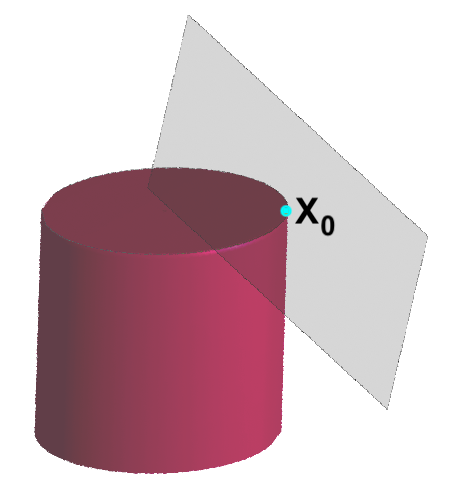
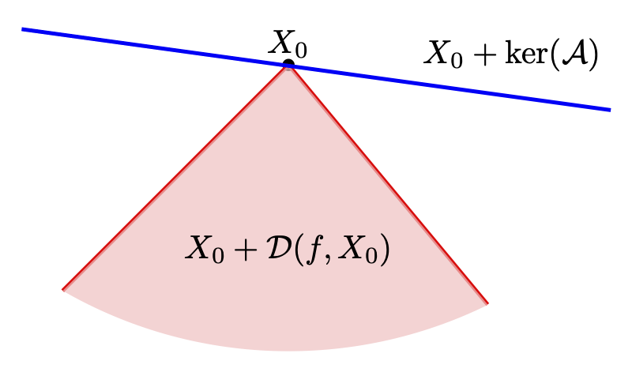
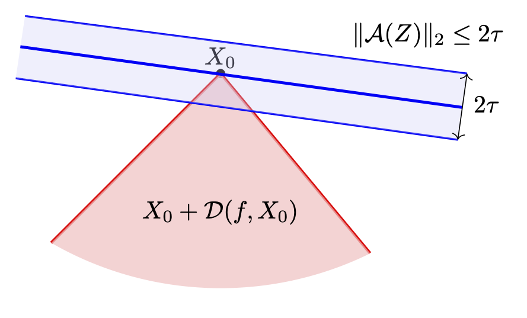
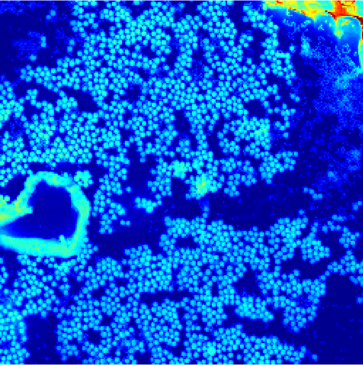
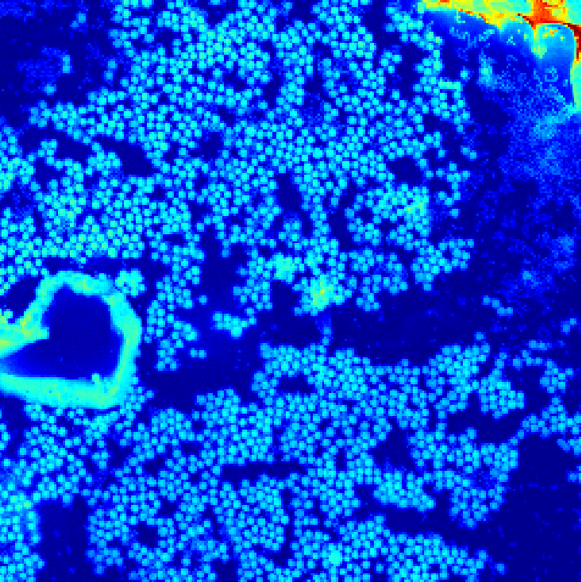
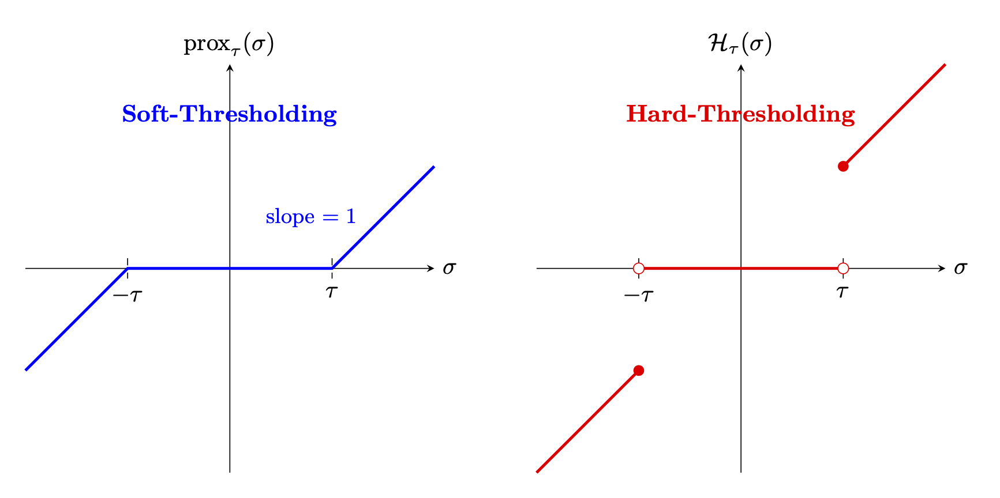

# 低秩矩阵恢复 {#c:lowrank}

低秩矩阵遍布科学研究，因为许多高维数据实际上只由少数潜在因子驱动，变量之间因而具有强相关性 [@udell2019big]。低秩矩阵恢复是数学与计算机科学中的基础问题：如何从*不完整测量*中恢复矩阵 [@WrightMa]？例如 $X\in\R^{n_1\times n_2}$ 一般由 $n_1n_2$ 个参数决定。若只获得 $k\ll n_1n_2$ 次测量且没有额外假设，恢复问题是不适定的，会有无穷多个解。但若 $X$ 低秩呢？能否用更少测量恢复它？能否做到数值稳定且计算高效？测量还需满足什么条件？本章将回答这些问题。

矩阵补全与低秩建模的代表性应用是推荐系统中的协同过滤 [@koren2009matrix; @agarwal2016statistical; @udell2016generalized]。设 $X$ 是用户--商品评分矩阵，$X_{ij}$ 表示用户 $i$ 对商品 $j$ 的评分。用户通常只评价极少数商品，所以矩阵大部分元素缺失。协同过滤要预测这些缺失评分，从而作个性化推荐。若评分矩阵近似低秩，潜在因子可解释为用户偏好与商品特征，就能用矩阵补全推断缺失项。2006 至 2009 年的 Netflix Prize 是著名实例，详见 [@netflix]。

另一重要应用是量子态层析 [@gross2010quantum]，此时 $X$ 表示量子系统的密度矩阵。测量设备的限制使我们通常只能获得不完整信息。密度矩阵半正定、迹为 1，并常常低秩。利用这一物理结构，可从不完整测量高效而稳健地重建完整密度矩阵，这对刻画量子态和执行量子信息处理任务至关重要。

其他应用包括社交网络链接预测 [@chiang2014prediction; @menon2011link]、Euclidean 距离矩阵嵌入 [@javanmard2013localization; @dokmanic2015euclidean]、稳健光度立体 [@WrightMa]、相位恢复 [@CESV2013]、盲反卷积 [@ahmed2013blind] 与自校准 [@LS15]。后文会详细讨论其中一些问题。

压缩感知与低秩矩阵恢复联系紧密：二者都依赖简约结构假设，前者是稀疏性，后者是低秩性，并都可用凸松弛处理。核心思想都是利用结构，在观测数远小于环境维数时仍高效恢复数据。因此本章会反复出现与压缩感知平行的论证，不过矩阵恢复也带来若干额外挑战。

## 秩最小化与核范数

若 $X\in\R^{n_1\times n_2}$ 的秩 $r$ 远小于 $\min\{n_1,n_2\}$，就称它为*低秩矩阵*。这里取实矩阵只是为了方便，所有结果都可直接推广到复数情形。简单计算可知，秩 $r$ 矩阵有 $r(n_1+n_2-r)$ 个自由度，这正是秩 $r$ 矩阵流形切空间的维数。

记 ${\mathcal H}_n$ 为所有 $n\times n$ Hermitian 矩阵构成的 Hilbert 空间，配备 Hilbert--Schmidt 内积 $\langle X,Y\rangle:=\operatorname{Tr}(Y^\ast X)$。作用在 $\R^{n_1\times n_2}$ 上的线性算子用花体字母表示，如 ${\mathcal A}(X)$。

设 $X_0\in\R^{n_1\times n_2}$ 的秩 $r\ll\min(n_1,n_2)$，并给定测量
$$\begin{equation}
\label{tracemeasures}
\langle A_j,X_0 \rangle  = y_j, \qquad j=1,\dots,m,
\end{equation}$$
其中 $A_j\in\R^{n_1\times n_2}$。定义测量算子
$$\begin{equation}
\label{tracemeasureop}
{\mathcal A}(X_0): \R^{n_1 \times n_2} \to \R^m, \quad
{\mathcal A}(X_0)_j = \langle A_j,X_0 \rangle, \qquad j=1,\dots,m.
\end{equation}$$
于是可能含噪的测量过程可简写为
$$y={\mathcal A}(X_0)+\eps,$$
其中 $y=\{y_j\}_{j=1}^m$ 汇集所有测量结果，$\eps\in\R^m$ 是加性噪声。

相应的伴随算子 ${\mathcal A}^*$ 把实向量映射为 Hermitian 矩阵：
$$\begin{array}{lll}
  \R^{m} & \to & \mathcal{H}^{n \times n}\\
  z & \mapsto & \sum_i a_i \, a_k a_k^*.
\end{array}$$

先考虑无噪情形。恢复 $X_0$ 的自然方法是求解秩最小化问题
$$\begin{align}
\label{eq:rankmin}
\begin{split}
\min_{X \in \mathbb{R}^{n_1 \times n_2}} \quad & \operatorname{rank}(X) \\
\text{满足} \quad & \mathcal{A}(X) = y.
\end{split}
\end{align}$$

这个模型直接表达了结构假设：在所有与测量一致的矩阵中，解应具有最小秩。

少数秩最小化问题可以显式而高效地求解。例如
$$\begin{align}
\label{eq:ranksvd}
\begin{split}
\text{最小化} \quad & \operatorname{rank}(X) \\
\text{满足} \quad & \|X - A\| \le \eps,
\end{split}
\end{align}$$
其中 $A\in\R^{n_1\times n_2}$ 已知。设
$A=\sum_{i=1}^{\min(n_1,n_2)}\sigma_iu_iv_i^T$ 为其 SVD。由第 [\[ss:lowranksvd\]](#ss:lowranksvd){reference-type="ref" reference="ss:lowranksvd"} 章可知，解是适当截断的 SVD：
$X=\sum_{i=1}^r\sigma_iu_iv_i^T$，其中 $r$ 是满足 $\sigma_{r+1}\leq\eps$ 的最小整数。

然而秩函数非凸、不连续，并具有组合性质；所以秩最小化一般是 NP 困难的，即便看似简单的情形也不例外 [@LVanderberghe_SBoyd_1996; @fazel2002matrix]。若限制 $X$ 为对角矩阵，则 $\rank X=\|X\|_0$，问题退化为
$$\begin{align*}
\min \quad & \|X\|_0 \\
\text{满足} \quad & \mathcal{A}(X) = y,
\end{align*}$$
这正是第 [\[c:cs\]](#c:cs){reference-type="ref" reference="c:cs"} 章的核心问题，已知为 NP 困难 [@natarajan1995sparse; @FoucartRauhut_CSbook]。

这种计算困难促使我们寻找既可解、又保留原问题关键结构的松弛。

秩函数的标准凸替代是*核范数*
$$\|X\|_*:=\sum_i\sigma_i(X),$$
其中 $\sigma_i(X)$ 是奇异值。核范数是凸函数，可视为向量 $\ell_1$ 范数的矩阵版本，因而会促进低秩性。事实上，在谱范数单位球上，核范数是秩函数最紧的凸下界，见 [@fazel2001rank] 定理 1。也可比较图 [1.1](#fig:nucball){reference-type="ref" reference="fig:nucball"} 与图 [\[fig:l1l2\]](#fig:l1l2){reference-type="ref" reference="fig:l1l2"}(a)。

<figure id="fig:nucball" data-latex-placement="h">

<figcaption>“核范数球”与仿射可行集。核范数球表示核范数不超过 <em>X</em>0 的 2 × 2 对称矩阵；灰色仿射子空间是方程 𝒜(<em>X</em>)=𝒜(<em>X</em>0) 的解集。当可行集在 <em>X</em>0 处与球相切时，问题 <a href="#eq:nuclearnormrelaxation" data-reference-type="eqref" data-reference="eq:nuclearnormrelaxation">[eq:nuclearnormrelaxation]</a> 精确恢复。</figcaption>
</figure>

把 [\[eq:rankmin\]](#eq:rankmin){reference-type="eqref" reference="eq:rankmin"} 的秩目标换成核范数，得到凸优化问题 [@fazel2002matrix; @CR08; @recht2010guaranteed]
$$\begin{align}
\label{eq:nuclearnormrelaxation}
\begin{split}
\min_{X \in \mathbb{R}^{n_1 \times n_2}} \quad & \|X\|_* \\
\text{满足} \quad & \mathcal{A}(X) = y.
\end{split}
\end{align}$$

该问题可写成半正定规划，见习题 [\[ex:nuclear_SDP\]](#ex:nuclear_SDP){reference-type="ref" reference="ex:nuclear_SDP"}。中等规模时可用内点法高效求解，大规模时可用一阶方法。[^1]

若测量含噪，即 $y={\mathcal A}(X_0)+w$，通常考虑松弛形式
$$\begin{align}
\label{eq:nuclearnormrelaxationnoise}
\begin{split}
\text{最小化} \quad &  \|X\|_*  \\
\text{满足} \quad & \|\mathcal{A}(X) - y\| \leq \tau,
\end{split}
\end{align}$$
其中 $\tau$ 是噪声上界，即 $\|w\|\leq\tau$。

核范数最小化虽只是秩最小化的松弛，但当测量算子 $\mathcal A$ 满足适当条件时，它能精确恢复真实低秩解。这些条件可表述为限制等距性质、非相干假设，或基于下降锥与高斯宽度的几何准则。

因此凸松弛的成功并非偶然：核范数捕捉了低秩矩阵的核心几何，同时兼顾可计算性与可证明的恢复保证，正如第 [\[c:cs\]](#c:cs){reference-type="ref" reference="c:cs"} 章中 $\ell_1$ 范数对稀疏性的作用。核范数最小化由此成为现代低秩恢复理论的基石。

## 基于下降锥分析的恢复保证 {#s:descentcone}

低秩恢复的核心挑战，是判断核范数最小化等凸优化何时能从线性测量中精确恢复低秩矩阵。下降锥[^2]分析与锥几何提供了强大而通用的框架，由 [@chandrasekaran2012convex; @amelunxen2014living; @tropp2015convex] 建立，并在 [@kueng2017low; @abbasi2019universality; @fuchs2022proof] 等工作中不断发展。下面部分采用 [@tropp2015convex; @fuchs2022proof] 的清晰讲法。

::: definition
[]{#def:descentcone label="def:descentcone"} 正常凸函数[^3] $f:\mathbb C^{n_1\times n_2}\to\R$ 在 $X_0$ 处的下降锥 $\mathcal D(f,X_0)$，是所有使 $f$ 在 $X_0$ 附近不增方向的锥包：
$$\begin{align*}
    \mathcal{D}(f,X_0) :=\{Z\in \mathbb{C}^{n_1 \times n_2}: \text{存在 }\epsilon > 0\text{ 使 }f(X_0 + \epsilon Z) \le f(X_0)\}.
\end{align*}$$
:::

凸函数的下降锥总是凸锥，但未必闭。

下降锥分析适用范围很广；在低秩恢复中，我们关心 $f(X)=\|X\|_*$。

考虑以下无噪与含噪两个凸优化问题：

::: multicols
2 $$\begin{align}
\label{fmin_nonoise}
\begin{split}
\text{最小化} \quad  & f \left(X\right) \\
\text{满足} \quad & \mathcal{A} \left(X\right) = y.
\end{split}
\end{align}$$ $$\begin{align}
\label{fmin_noise}
\begin{split}
\text{最小化} \quad  & f \left(X\right) \\
\text{满足} \quad & \|\mathcal{A} \left(X\right) - y\|_2\le \tau.
\end{split}
\end{align}$$
:::

<figure id="fig:descentcone" data-latex-placement="htbp">

<figcaption>无噪与含噪情形的下降锥分析。通过研究优化可行集相对于以 <em>X</em>0 为锚点的目标函数下降锥（红色阴影）的几何方位，可建立低秩恢复保证。此处取 <em>f</em>(<em>X</em>)=∥<em>X</em>∥*。</figcaption>
</figure>

先看无噪情形。若 $X_0$ 是 $\mathcal A(X)=y$ 的真实解，则 [\[fmin_nonoise\]](#fmin_nonoise){reference-type="eqref" reference="fmin_nonoise"} 的任意极小点 $\hat X$ 满足 $f(\hat X)\leq f(X_0)$ 且 $\mathcal A(\hat X)=y$。因此可写成 $\hat X=X_0+Z$，其中
$Z\in\mathcal D(f,X_0)\cap\ker(\mathcal A)$。若零空间与下降锥只在原点相交，则 $X_0$ 必是唯一最优解，如图 [1.2](#fig:descentcone){reference-type="ref" reference="fig:descentcone"}(a) 所示。

含噪时无法要求精确恢复，只希望 [\[fmin_noise\]](#fmin_noise){reference-type="eqref" reference="fmin_noise"} 的解 $\hat X$ 与 $X_0$ 的误差和 $\tau$ 同阶。令可行解 $\hat X=X_0+Z$；约束意味着 $\|\mathcal A(Z)\|_2\leq\tau$。因此，为控制 $\|\hat X-X_0\|_F=\|Z\|_F$，需研究
$\mathcal D(f,X_0)\cap\{Z:\|\mathcal A(Z)\|_2\leq\tau\}$。交集越小，误差越小，参见图 [1.2](#fig:descentcone){reference-type="ref" reference="fig:descentcone"}(b)。

该交集的大小可由*最小锥奇异值*[^4] 控制 [@tropp2015convex; @chandrasekaran2012convex; @fuchs2022proof]，定义为
$$\begin{equation}
\label{conesv}
\sigma_{\min}\big({\mathcal A},\mathcal{D}(f,X_0)\big) :=
\inf_{Z \in \mathcal{D}(f,X_0) \setminus \{0\}} \frac{\|{\mathcal A}(Z)\|}{\|Z\|_F}.
\end{equation}$$
下面的命题表明，该值越大，交集越小，恢复误差也越小 [@tropp2015convex; @chandrasekaran2012convex; @fuchs2022proof]。

::: proposition
[]{#prop:cone label="prop:cone"} 设 ${\mathcal A}:\R^{n_1\times n_2}\to\R^m$ 为线性算子，$y={\mathcal A}(X_0)+w$ 且 $\|w\|\leq\tau$。则问题 [\[fmin_noise\]](#fmin_noise){reference-type="eqref" reference="fmin_noise"} 的任意极小点 $\hat X$ 满足
$$\begin{equation}
\label{cone_error1}
 \|\hat{X} - X_0\|_F \le \frac{2\tau}{\sigma_{\min}\big({\mathcal A},\mathcal{D}(f,X_0)\big)}.
\end{equation}$$
:::

::: proof
*证明.* 对任意可行误差方向 $Z$，
$$\begin{equation}
\label{cone_error2}
\sigma_{\min}\big({\mathcal A},\mathcal{D}(f,X_0)\big) \le \frac{\|{\mathcal A}(Z)\|}{\|Z\|_F} \le
\frac{\|{\mathcal A}(Z)-w\|+\|w\|}{\|Z\|_F} \le
\frac{2\tau}{\|Z\|_F},
\end{equation}$$
第一个不等式来自最小锥奇异值的定义，第二个来自三角不等式，最后一个利用可行性 $\|\mathcal A(Z)-w\|\leq\tau$ 与 $\|w\|\leq\tau$。整理式 [\[cone_error2\]](#cone_error2){reference-type="eqref" reference="cone_error2"} 即得结论。 ◻
:::

因此，只要证明最小锥奇异值为正，就能推出无噪情形的精确恢复。但命题 [\[prop:cone\]](#prop:cone){reference-type="ref" reference="prop:cone"} 看似简单，实际计算或估计最小锥奇异值通常相当困难。给测量过程乃至 ${\mathcal A}$ 引入随机性后，情形会更有希望。

### 从高斯测量恢复低秩矩阵 {#ss:matrixrecoverygaussian}

考虑高斯测量下的低秩恢复：
$${\mathcal A}(X_0)_i=y_i=\langle A_i,X_0\rangle,qquad i=1,\dots,m,$$
其中 $A_i$ 为 $n_1\times n_2$ 高斯矩阵。

估计该高斯算子的最小锥奇异值，核心是 Gordon 定理。Rudelson 与 Vershynin 最早在稀疏恢复中采用这一策略，见 [@rudelson2008sparse] 第 4 节。论证围绕定义 [\[def:gaussianwidth\]](#def:gaussianwidth){reference-type="ref" reference="def:gaussianwidth"} 的高斯宽度展开。

令
$S:=\{Z\in\mathcal D(\|\cdot\|_*,X_0):\|Z\|_F=1\}$，目标变为下界 $\inf_{Z\in S}\|\mathcal A(Z)\|$。重访 Gordon 定理 [\[GordonsTheorem\]](#GordonsTheorem){reference-type="ref" reference="GordonsTheorem"} 的证明，尤其式 [\[eq:5:usingGaussianconcentration_2\]](#eq:5:usingGaussianconcentration_2){reference-type="eqref" reference="eq:5:usingGaussianconcentration_2"}，得到尾界[^5]
$$\begin{equation}
\label{gordontail}
\inf_{x\in S} \| {\mathcal A}(Z) \| \geq \sqrt{m-1} - \omega(S) - t, \qquad \text{其中 $t > 0$，}
\end{equation}$$
其概率至少为 $1-e^{-t^2/2}$。这里使用了式 [\[eq:gordon2\]](#eq:gordon2){reference-type="eqref" reference="eq:gordon2"} 中 $a_d\geq\sqrt{d-1}$，并令 $d=m$ 以适配本章“$m$ 表示测量数”的记号。若 $w(S)\leq\sqrt{m-1}$，命题 [\[prop:cone\]](#prop:cone){reference-type="ref" reference="prop:cone"} 就给出概率恢复保证。

正如 [@fuchs2022proof] 指出的，Gordon 定理及尾界 [\[gordontail\]](#gordontail){reference-type="eqref" reference="gordontail"} 只要求 $S$ 是 Frobenius 单位球面[^6] ${\mathcal S}_F(\R^{n_1\times n_2})$ 的子集。因此不必局限于某个固定下降锥；为得到一致恢复保证，可取所有秩 $r$ 矩阵下降锥的并：
$$\begin{align*}
S_r = {\mathcal S}_F(\R^{n_1\times n_2}) \cap K_r \quad \text{其中} \quad K_r = \bigcup_{{\small
\begin{matrix}
    X \in \R^{n_1\times n_2} \\ \rank(X)=r
\end{matrix} }}
 \mathcal{D} \left( \| \cdot \|_*, X \right).
\end{align*}$$

::: proposition
[]{#prop:matrixconebound label="prop:matrixconebound"} $S_r$ 是所有以秩 $r$ 矩阵为锚点的下降锥之并与单位球面的交。其高斯宽度满足
$$\begin{align*}
        w(S_r)
        \lesssim \sqrt{r} \left( \sqrt{n_1} + \sqrt{n_2}\right).
\end{align*}$$
进一步，若 $\mathcal A:\R^{n_1\times n_2}\to\R^m$ 是高斯测量算子，且
$$\begin{align*}
        m \gtrsim  r (n_1 + n_2).
\end{align*}$$
则以高概率，对任意秩 $r$ 矩阵 $X$，$\lambda_{\min}(\mathcal A,\mathcal D(f,X))$ 都与零保持正距离。
:::

命题 [\[prop:matrixconebound\]](#prop:matrixconebound){reference-type="ref" reference="prop:matrixconebound"} 的证明使用下面这个不加证明的结果。

::: lemma
[]{#le:conerank label="le:conerank"} 若 $Z\in\R^{n_1\times n_2}$ 位于某个秩 $r$ 矩阵 $X$ 的核范数下降锥中，则
$$\begin{align*}
\|Z\|_* \leq  \left(1+\sqrt{2}\right) \sqrt{r}  \|Z\|_F.
\end{align*}$$
:::

::: proof
*命题 [\[prop:matrixconebound\]](#prop:matrixconebound){reference-type="ref" reference="prop:matrixconebound"} 的证明.* 由 Hölder 不等式与引理 [\[le:conerank\]](#le:conerank){reference-type="ref" reference="le:conerank"}，可用标准高斯矩阵算子范数的期望控制 $w(S_r)$：
$$\begin{align*}
    w(S_r) = \mathbb{E}\sup_{Z\in S_r} \langle A, Z\rangle & \leq \sup_{Z \in S_r} \|Z \|_* \,\mathbb{E} \|A  \| \\ & \leq\left(1+\sqrt{2}\right)
    \sqrt{r} \mathbb{E}\|A\| \\
    & \lesssim
    \sqrt{r}(\sqrt{n_1}+\sqrt{n_2}),
    %\le \left(1+\sqrt{2}\right) \sqrt{r} (\sqrt{n_1}+\sqrt{n_2})
\end{align*}$$
最后一步使用了 $\mathbb E\|A\|\lesssim\sqrt{n_1}+\sqrt{n_2}$，参见 [@vershynin2010introduction] 备注 4.4.4。再应用 Gordon 定理导出的尾界 [\[gordontail\]](#gordontail){reference-type="eqref" reference="gordontail"}，得到
$$\begin{align*}
    \inf_{X\in S_r}\|\mathcal{A}(Z)\|_2 = \inf_
    {{\small \begin{matrix}
    X \in \R^{n_1\times n_2} \\ \rank(X)=r
\end{matrix}} }
 \lambda_{\min} \left( \mathcal{A},  \mathcal{D}(\Vert \cdot \Vert_{\ast},X_0)  \right) \ge \sqrt{m-1} - w(S) - t
\end{align*}$$
其概率至少为 $1-e^{-t^2/2}$。因此若
$$m\gtrsim r(n_1+n_2),$$
便可选取 $t>0$，使 $\inf_{X\in S_r}\|\mathcal A(Z)\|_2$ 以高概率为正。 ◻
:::

## 低秩矩阵恢复与对偶证书 {#s:matrixdual}

下降锥方法几何上很优美，但若问题必须利用未知信号的非相干性等额外结构，才能排除注定恢复失败的异常实例，它就会面临严峻困难。[^7] 相关问题详见 [@fuchs2022proof]。因此在量子态层析、相位恢复与矩阵补全中，第 [\[s:duality\]](#s:duality){reference-type="ref" reference="s:duality"} 章介绍的对偶证书方法往往更合适。

下面的引理给出一组可验证条件：只要构造出对偶证书，有时也称*对偶见证*，就能保证核范数松弛 [\[eq:nuclearnormrelaxation\]](#eq:nuclearnormrelaxation){reference-type="eqref" reference="eq:nuclearnormrelaxation"} 在指定点取得最优值。

回顾第 [\[ss:subgradient\]](#ss:subgradient){reference-type="ref" reference="ss:subgradient"} 章核范数次微分的计算。对秩 $r$ 的 $n_1\times n_2$ 矩阵 $X=U\Sigma V^T$，秩 $r$ 矩阵流形在 $X$ 处的切空间为
$$\Tn_X=\{UA^T+BV^T:A\in\mathbb R^{n_1\times r},\ B\in\mathbb R^{n_2\times r}\}.$$

::: lemma
[]{#le:candesrechtlowrank label="le:candesrechtlowrank"} 设 $X_0\in\R^{n_1\times n_2}$ 满足 $\mathcal A(X_0)=y\in\R^m$，并假设 [@candes2009exact]：

1.  存在 $\lambda\in\R^m$，使 $Y=\mathcal A^*\lambda$ 满足
    $$\begin{equation}
    \label{eq:nucleardualcond}
     \mathcal{P}_{\Tn_{X_0}}  Y = UV^* \quad \text{且} \quad \Vert \mathcal{P}_{\Tn^{\perp}_{X_0}} Y  \Vert < 1.
    \end{equation}$$

2.  线性算子 $\mathcal A$ 限制在切空间 $\Tn_{X_0}$ 上时为单射。

则 $X_0$ 是问题 [\[eq:nuclearnormrelaxation\]](#eq:nuclearnormrelaxation){reference-type="eqref" reference="eq:nuclearnormrelaxation"} 的唯一极小点。
:::

::: proof
*证明.* 设可行矩阵 $X_0=U\Sigma V^T$，且 $\rank(X_0)=r$。分别以 $P_{\mathcal T_{X_0}}$、$P_{\mathcal T_{X_0}^\perp}$ 表示到切空间及其正交补的投影。

Lagrangian 为
$$\mathcal L(X,\lambda)
= \|X\|_* + \langle \lambda,, \mathcal A(X)-b\rangle.$$

由于没有不等式约束，$X_0$ 的 KKT 条件是：(i) 原可行性 $\mathcal A(X_0)=b$；(ii) 对偶可行性 $\mathcal A^*(\lambda)\in\partial\|X_0\|_*$；(iii) 互补松弛自动满足。因此只需构造 $\lambda$ 使
$$Y:=\mathcal A^*(\lambda)\in\partial\|X_0\|_*.$$
式 [\[eq:nuclearsubdifferential\]](#eq:nuclearsubdifferential){reference-type="eqref" reference="eq:nuclearsubdifferential"} 已给出
$$\partial \|X_0\|_* =
\left\{UV^T + W : \mathcal P_{\mathcal T}(W)=0, \|W\|\le 1
\right\}.$$
所以任何形如
$$Y=UV^T+W,\qquad W\in\mathcal T_{X_0}^\perp,\ \|W\|\leq1$$
的矩阵都是合法次梯度。

现在假设存在 $Y=\mathcal A^*(\lambda)$，满足 $\mathcal P_{\mathcal T_{X_0}}(Y)=UV^T$ 且 $\|\mathcal P_{\mathcal T_{X_0}^\perp}(Y)\|<1$。下面验证 $Y\in\partial\|X_0\|_*$。

写成
$$Y=\mathcal P_{\mathcal T_{X_0}}(Y)+\mathcal P_{\mathcal T_{X_0}^\perp}(Y)=UV^T+W,$$
其中 $W:=\mathcal P_{\mathcal T_{X_0}^\perp}(Y)$。由假设，$W\in\mathcal T_{X_0}^\perp$ 且 $\|W\|<1$，所以式 [\[eq:nuclearsubdifferential\]](#eq:nuclearsubdifferential){reference-type="eqref" reference="eq:nuclearsubdifferential"} 的条件全部满足，$Y\in\partial\|X_0\|_*$。结合 $X_0$ 的原可行性，KKT 条件成立，故 $X_0$ 最优。

若进一步有
$$\|\mathcal P_{\mathcal T_{X_0}^\perp}(Y)\|<1,
\qquad\mathcal A\text{ 在 }\mathcal T_{X_0}\text{ 上单射},$$
则任意其他可行 $X\neq X_0$ 都满足 $\|X\|_*>\|X_0\|_*$。这是因为次梯度不等式
$$\|X\|_*\geq\|X_0\|_*+\langle Y,X-X_0\rangle$$
只有在 $X-X_0\in\mathcal T_{X_0}$ 时才能取等号，而单射性排除了非零可行扰动。故 $X_0$ 是唯一极小点。 ◻
:::

真正困难的是验证给定测量算子 $\mathcal A$ 满足引理 [\[le:candesrechtlowrank\]](#le:candesrechtlowrank){reference-type="ref" reference="le:candesrechtlowrank"}，尤其条件 [\[eq:nucleardualcond\]](#eq:nucleardualcond){reference-type="eqref" reference="eq:nucleardualcond"}。最成功且适用广泛的方法之一，是 David Gross [@gross2011recovering] 引入的*高尔夫方案*。Gross 证明，引理条件可以放宽：只需存在*近似*对偶证书便能保证唯一性，而该证书可由高尔夫方案迭代构造。[^8]

近似对偶证书允许切空间 $\mathcal T$ 上存在小误差，同时要求在正交补 $\mathcal T^\perp$ 上保留安全裕量。

::: definition
[]{#de:approxdual label="de:approxdual"} 若 $Y\in\range(\mathcal A^*)$ 对 $X_0=U\Sigma V^\top$ 满足以下两条，就称它为 $(\alpha,\beta)$-近似对偶证书：

1.  $$\begin{equation}
    \label{eq:dualalpha}
    \text{$\Tn$ 上对齐：$\|P_{\mathcal{T}}(Y) - UV^\top\|_F \le \alpha$,}
    \end{equation}$$

2.  $$\begin{equation}
    \label{eq:dualbeta}
    \text{$\Tn^\perp$ 上约束：$\|P_{\mathcal{T}^\perp}(Y)\| \le \beta < 1$.}
    \end{equation}$$
:::

算子 $\mathcal P_\mathcal T\mathcal A^*\mathcal A\mathcal P_{\mathcal T^\perp}$ 将起关键作用：它衡量零空间中的信号相对于其切空间投影，能隐藏多少能量。下一引理量化从谱范数到 Frobenius 范数的“泄漏”：测量算子零空间中的矩阵若在“信号空间”$\mathcal T$ 中聚集能量，就必须在“噪声空间”$\mathcal T^\perp$ 中具有更显著的能量。

::: lemma
[]{#le:leakage label="le:leakage"} 设 $\mathcal A:\mathbb C^{d\times d}\to\mathbb R^m$ 为测量算子。对任意 $H\in\ker(\mathcal A)$，
$$\|P_\mathcal T(H)\|_F\leq\Cleak\|P_{\mathcal T^\perp}(H)\|,$$
其中*泄漏常数*定义为
$$\Cleak:=\frac{\|\mathcal P_\mathcal T\mathcal A^*\mathcal A\mathcal P_{\mathcal T^\perp}\|_{\mathrm{op}\to F}}{\lambda_{\min}(\mathcal P_\mathcal T\mathcal A^*\mathcal A\mathcal P_\mathcal T)},$$
分母表示 $\mathcal P_\mathcal T\mathcal A^*\mathcal A\mathcal P_\mathcal T$ 的最小特征值。
:::

::: proof
*证明.* 因 $H\in\ker(\mathcal A)$，有 $\mathcal A(H)=0$，故
$\mathcal A(P_\mathcal T H)=-\mathcal A(P_{\mathcal T^\perp}H)$。令
$\mathcal R_\mathcal T=\mathcal P_\mathcal T\mathcal A^*\mathcal A\mathcal P_\mathcal T$。对任意 $Z\in\mathcal T$，
$$\|\mathcal A(Z)\|^2=\langle Z,\mathcal R_\mathcal TZ\rangle
\geq\lambda_{\min}(\mathcal R_\mathcal T)\|Z\|_F^2.$$
取 $Z=P_\mathcal T(H)$，并利用零空间关系，得到
$$\lambda_{\min}(\mathcal R_\mathcal T)\|P_\mathcal T(H)\|_F^2
\leq\|\mathcal A(P_\mathcal T(H))\|^2,$$
且
$$\begin{align*}
\|\mathcal{A}(P_{\mathcal{T}}(H))\|^2 & = \langle \mathcal{A}(P_{\mathcal{T}}(H)), \mathcal{A}(P_{\mathcal{T}}(H)) \rangle = \langle \mathcal{A}(P_{\mathcal{T}}(H)), -\mathcal{A}(P_{\mathcal{T}^\perp}(H)) \rangle\\
& = -\langle P_{\mathcal{T}}(H), \mathcal{P}_{\mathcal{T}} \mathcal{A}^* \mathcal{A} \mathcal{P}_{\mathcal{T}^\perp} (P_{\mathcal{T}^\perp}(H)) \rangle.
\end{align*}$$
应用 Cauchy--Schwarz 不等式与诱导范数，
$$\lambda_{\min}(\mathcal{P}_{\mathcal{T}} \mathcal{A}^* \mathcal{A} \mathcal{P}_{\mathcal{T}}) \|P_{\mathcal{T}}(H)\|_F^2 \le \|P_{\mathcal{T}}(H)\|_F \cdot \|\mathcal{P}_{\mathcal{T}} \mathcal{A}^* \mathcal{A} \mathcal{P}_{\mathcal{T}^\perp}\|_{\text{op} \to \text{F}} \cdot \|P_{\mathcal{T}^\perp}(H)\|.$$
两边除以 $\lambda_{\min}(\mathcal R_\mathcal T)\|P_\mathcal T(H)\|_F$，即得所需界。 ◻
:::

::: theorem
[]{#th:dualnuclear label="th:dualnuclear"} 设 $X_0$ 为秩 $r$ 矩阵，切空间为 $\mathcal T$。若存在 $(\alpha,\beta)$-近似对偶证书 $Y=\mathcal A^*(y)$，且泄漏常数 $\Cleak$ 满足
$\alpha<(1-\beta)/\Cleak$，则 $X_0$ 是核范数最小化问题 [\[eq:nuclearnormrelaxation\]](#eq:nuclearnormrelaxation){reference-type="eqref" reference="eq:nuclearnormrelaxation"} 的唯一极小点。
:::

::: proof
*证明.* 只需证明对任意非零 $H\in\ker(\mathcal A)$，都有 $\|X_0+H\|_*>\|X_0\|_*$。

由 $X_0$ 处核范数次梯度的结构，
$$\|X_0 + H\|_* \ge \|X_0\|_* + \langle UV^\top, H \rangle + \|P_{\mathcal{T}^\perp}(H)\|_*.$$
又因 $H\in\ker(\mathcal A)$、$Y\in\range(\mathcal A^*)$，有 $\langle Y,H\rangle=0$，从而
$$\langle UV^\top,P_\mathcal T(H)\rangle
=\langle UV^\top-P_\mathcal T(Y),P_\mathcal T(H)\rangle
-\langle P_{\mathcal T^\perp}(Y),P_{\mathcal T^\perp}(H)\rangle.$$
代回次梯度不等式，再分别使用 Hölder 与 Cauchy--Schwarz 不等式，得到
$$\|X_0+H\|_* - \|X_0\|_*
\geq(1-\beta)\|P_{\mathcal T^\perp}(H)\|_*
-\alpha\|P_\mathcal T(H)\|_F.$$
由泄漏引理，$\|P_\mathcal T(H)\|_F\leq\Cleak\|P_{\mathcal T^\perp}(H)\|$；又因核范数不小于谱范数，
$$\|X_0+H\|_* - \|X_0\|_*
\geq(1-\beta-\alpha\Cleak)\|P_{\mathcal T^\perp}(H)\|.$$
当 $\alpha<(1-\beta)/\Cleak$ 时，括号内严格为正，所以 $\|X_0+H\|_*>\|X_0\|_*$。 ◻
:::

::: remark
近似对偶证书与泄漏引理，本质上是第 [1.2](#s:descentcone){reference-type="ref" reference="s:descentcone"} 节原空间下降锥几何的对偶空间版本。下降锥方法问：$\mathcal A$ 会把试图降低核范数的方向压缩多少？最小锥奇异值若大，这些方向就会被测量捕捉，无法落入零空间。近似对偶证书方法则用 $\Cleak$ 衡量零空间元素 $H$ 能在切空间中“隐藏”多少能量。大的 $\sigma_{\min}(\mathcal A,\mathcal D)$ 对应小的 $\Cleak$，但二者之间并没有容易直接换算的公式。
:::

读者或许会怀疑，我们只是把困难不断后移：从原问题移到对偶证书，再移到近似证书和泄漏常数。毕竟定理 [\[th:dualnuclear\]](#th:dualnuclear){reference-type="ref" reference="th:dualnuclear"} 虽说明证书 $Y$ 足以恢复，却尚未告诉我们怎样找到它。

幸运的是，[^9] 目前已有多种技术解决这一关键问题，其中之一正是高尔夫方案。它把切空间中的“残余误差”逐次投影回测量算子的值域，从而巧妙地构造 $Y\in\range(\mathcal A^*)$。定理 [\[th:dualnuclear\]](#th:dualnuclear){reference-type="ref" reference="th:dualnuclear"} 与高尔夫方案的具体用法取决于低秩问题的测量结构。下面考察三个重要应用：矩阵补全、量子态层析与相位恢复。

三个应用共享“近似对偶证书 + 高尔夫方案”的总体证明架构，但测量的具体数学性质会显著改变关键步骤。每个证明的难点，都在于特定测量算子 $\mathcal A$ 如何与切空间 $\Tn$ 相互作用。

## 矩阵补全 {#s:matrixcompletion}

矩阵补全是在矩阵低秩的假设下，由部分元素恢复整个未知矩阵 [@CR08; @candes2010power]。按式 [\[tracemeasures\]](#tracemeasures){reference-type="eqref" reference="tracemeasures"}，测量矩阵为 $e_ie_j^\ast$，故 $\langle e_ie_j^\ast,X\rangle=X_{ij}$，每次测量揭示一个元素。定义采样算子
$\mathcal P_\Omega=\sum_{(i,j)\in\Omega}\mathcal P_{ij}$，其中
$\mathcal P_{ij}(X)=\langle e_ie_j^\top,X\rangle e_ie_j^\top$，而 $\Omega\subset[n_1]\times[n_2]$ 是被观测的指标集。因此 ${\mathcal A}=P_\Omega$，且 $({\mathcal A}(X))_{ij}=X_{ij}$。

若无额外信息，由 $\mathcal P_\Omega(X)$ 恢复 $X$ 是不适定的：缺失元素可任意填写，因而有无穷多解。若 $X$ 低秩，能否唯一且数值高效地补全？这一问题出现在推荐系统、协同过滤、众包与调查数据中 [@koren2009matrix; @WrightMa; @agarwal2016statistical; @udell2016generalized]。

自由度计数表明，秩 $r$ 矩阵至少需要 $r(n_1+n_2-r)$ 次测量，但这一般不够。例如某个秩一矩阵除一个未知位置为 1 外全为零。因事先不知道非零项位置，最坏情形仍需检查全部 $n_1n_2$ 个元素。

这与压缩感知类似：为了得到有意义的稀疏恢复理论，必须以 RIP 或相干性排除过度集中的信号。矩阵补全也需要类似条件。第 [\[s:coherence\]](#s:coherence){reference-type="ref" reference="s:coherence"} 节的式 [\[coherence\]](#coherence){reference-type="eqref" reference="coherence"} 定义了向量组相干性；矩阵情形采用 [@CR08] 的定义。

::: definition
[]{#de:matrixcoherence label="de:matrixcoherence"} 设秩 $r$ 矩阵 $X\in\mathbb R^{n_1\times n_2}$ 的 SVD 为 $X=U\Sigma V^T$，其中 $U\in\mathbb R^{n_1\times r}$、$V\in\mathbb R^{n_2\times r}$。若
$$\max_i \|U^\top e_i\|^2 \le \frac{\mu r}{n_1}, \quad \max_j \|V^\top e_j\|^2 \le \frac{\mu r}{n_2}, \,\text{且}\,\,\,
\|UV^\top\|_\infty \le \sqrt{\frac{\mu r}{n_1 n_2}},$$
则称 $X$ 满足参数为 $\mu$ 的非相干条件。
:::

非相干性要求奇异向量的能量分散在各坐标上，排除使少量元素恢复不可能的“尖峰”向量。最小相干性为 1，此时张成 $U,V$ 的向量各元素模分别为 $1/\sqrt{n_1}$、$1/\sqrt{n_2}$。最大可能值为 $\max(n_1,n_2)/r$，对应 $U$ 或 $V$ 包含标准基向量。

下面应用定理 [\[th:dualnuclear\]](#th:dualnuclear){reference-type="ref" reference="th:dualnuclear"} 与高尔夫方案解决矩阵补全，亦见 [@CR08; @gross2011recovering]。

::: theorem
[]{#th:matrixcompletion label="th:matrixcompletion"} 设 $X_0\in\mathbb R^{n_1\times n_2}$ 是秩 $r$、$\mu$-非相干矩阵，并从其元素位置中均匀有放回抽取 $m$ 次观测。存在常数 $C$，使得当
$$m\geq C\mu nr\log^2n,qquad n=\max(n_1,n_2),$$
以至少 $1-n^{-3}$ 的概率，$X_0$ 是核范数问题
$$\min\|X\|_*\quad\text{使得}\quad\mathcal P_\Omega(X)=\mathcal P_\Omega(M)$$
的唯一极小点。
:::

证明中记归一化采样算子 $\mathcal R:=p^{-1}\mathcal P_\Omega$，其中 $p=m/(n_1n_2)$；并记
$\mathcal R_\mathcal T:=\mathcal P_\mathcal T\mathcal R\mathcal P_\mathcal T$、
$\mathcal R_{\mathcal T,\mathcal T^\perp}:=\mathcal P_\mathcal T\mathcal R\mathcal P_{\mathcal T^\perp}$。注意 $\mathcal P_\mathcal T$ 在 $\Tn$ 上是恒等算子。

下面使用两个引理：第一个证明采样算子在 $\Tn$ 上单射，第二个估计泄漏常数。

::: lemma
[]{#le:matrixinjectivity label="le:matrixinjectivity"} 在定理 [\[th:matrixcompletion\]](#th:matrixcompletion){reference-type="ref" reference="th:matrixcompletion"} 的假设下，若 $m\geq C\mu nr\log n$，则以至少 $1-2n^{-3}$ 的概率，
$$\|\mathcal R_\mathcal T-\mathcal P_\mathcal T\|\leq\delta<1.$$
:::

::: proof
*证明.* 定义中心化随机算子
$\mathcal S=\mathcal R_\mathcal T-\mathcal P_\mathcal T$，可写成 $m$ 个独立零均值算子之和：
$$\mathcal S=\sum_{k=1}^m\mathcal Z_k,qquad
\mathcal Z_k=\frac1m\left(\frac1p\mathcal P_\mathcal T\mathcal P_{ij}\mathcal P_\mathcal T-\mathcal P_\mathcal T\right).$$
由非相干假设，
$$\begin{align*}
\|\mathcal{Z}_k\|  &\le \|\mathcal{P}_{\mathcal{T}} \mathcal{P}_{ij} \mathcal{P}_{\mathcal{T}}\| + \|\mathcal{P}_{\mathcal{T}}\|
=
\Big\| \sqrt{\frac{n^2}{m}} \mathcal{P}_{\mathcal{T}}(e_i e_j^\top) \Big\|_F^2 + \frac{1}{m} \\ &
= \frac{n^2}{m} \|\mathcal{P}_{\mathcal{T}}(e_i e_j^\top)\|_F^2 + \frac{1}{m} \le \frac{n^2}{m}\frac{2\mu r}{n} + \frac{1}{m}\le \frac{3\mu r n}{m},
\end{align*}$$
而方差满足
$\sigma^2=\|\sum\mathbb E[\mathcal Z_k^*\mathcal Z_k]\|\leq2\mu nr/m$。

矩阵 Bernstein 不等式 [\[thm:4:MatrixBernstein\]](#thm:4:MatrixBernstein){reference-type="ref" reference="thm:4:MatrixBernstein"} 在这里给出
$$\begin{equation}
\label{eq:Bernstein4}
\mathbb{P}(\|\mathcal{S}\| \ge \delta) \le 2nr \exp \left( \frac{-\delta^2}{2\sigma^2 + 2R\delta/3} \right).
\end{equation}$$
代入 $R=\|\mathcal Z_k\|$ 与方差界，指数化为
$$\frac{-\delta^2}{\frac{4\mu nr}{m}+\frac{6\mu nr}{m}\frac\delta3}
=\frac{-\delta^2m}{2\mu nr(2+\delta)}.$$
为使失败概率不超过 $\eta=n^{-3}$，只需
$$2nr\exp\left(\frac{-\delta^2m}{2\mu nr(2+\delta)}\right)\leq\eta,$$
即
$$m\geq\frac{2\mu nr(2+\delta)}{\delta^2}\log\frac{2nr}{\eta}.$$
把 $\delta$ 固定为常数，例如 $1/2$，并吸收常数，得到
$$\begin{equation}
\label{eq:m_bound}
m \ge C \mu n r \log n.
\end{equation}$$ ◻
:::

$\delta\in(0,1)$ 的具体选择只影响式 [\[eq:m_bound\]](#eq:m_bound){reference-type="eqref" reference="eq:m_bound"} 中的常数 $C$。

::: lemma
[]{#le:leakagecompletion label="le:leakagecompletion"} 在定理 [\[th:matrixcompletion\]](#th:matrixcompletion){reference-type="ref" reference="th:matrixcompletion"} 的假设下，若 $m\geq C\mu nr\log n$，则以至少 $1-2n^{-3}$ 的概率，对每个 $H\in\ker(\mathcal P_\Omega)$ 都有
$$\|P_\mathcal T(H)\|_F\leq\Cleak\|P_{\mathcal T^\perp}(H)\|,$$
其中 $\Cleak\leq4\sqrt{nr\log n/m}$。
:::

::: proof
*证明.* 任取 $H\in\ker(\mathcal P_\Omega)$，分解为 $H_\mathcal T+H_{\mathcal T^\perp}$。由
$$\mathcal R(H_\mathcal T+H_{\mathcal T^\perp})=0$$
并投影到 $\mathcal T$，得到
$$\mathcal R_\mathcal T(H_\mathcal T)
=-\mathcal R_{\mathcal T,\mathcal T^\perp}(H_{\mathcal T^\perp}),$$
即
$$H_\mathcal T=-(\mathcal R_\mathcal T)^{-1}
\mathcal R_{\mathcal T,\mathcal T^\perp}(H_{\mathcal T^\perp}).$$
取 Frobenius 范数：
$$\begin{equation}
\label{eq:Hbound1}
\|H_{\mathcal{T}}\|_F \le \|(\mathcal{R}_{\mathcal{T}})^{-1}\| \cdot \|\mathcal{R}_{\mathcal{T}, \mathcal{T}^\perp}\|_{\text{op} \to \text{F}} \cdot \|H_{\mathcal{T}^\perp}\|.
\end{equation}$$

定义事件 $\mathcal E_1=\{\|\mathcal R_\mathcal T-\mathcal P_\mathcal T\|\leq1/2\}$。对上一引理中的算子和应用矩阵 Bernstein；由
$R\leq2\mu nr/m$、$\sigma^2\leq2\mu nr/m$，当 $m\geq C\mu nr\log n$ 时，$\mathbb P(\mathcal E_1^c)\leq n^{-3}$。在 $\mathcal E_1$ 上，
$\lambda_{\min}(\mathcal R_\mathcal T)\geq1/2$，故
$$\|(\mathcal R_\mathcal T)^{-1}\|\leq2.$$

再定义 $\mathcal E_2=\{\|\mathcal R_{\mathcal T,\mathcal T^\perp}\|_{\mathrm{op}\to F}\leq\epsilon\}$。算子
$X\mapsto\mathcal P_\mathcal T\mathcal R\mathcal P_{\mathcal T^\perp}(X)$
是 $m$ 个独立算子
$\mathcal Y_k(X):=\frac{n^2}{m}\langle e_ie_j^\top,X\rangle\mathcal P_\mathcal T(e_ie_j^\top)$
之和。秩一映射 $\langle A,\cdot\rangle B$ 的诱导范数为 $\|A\|_*\|B\|_F$，故
$$\|\mathcal Y_k\|_{\mathrm{op}\to F}
\leq\frac{n\sqrt{2\mu nr}}m=:R.$$
其方差为
$$\sigma^2=\frac{n^2}{m}\sum_{i,j}\frac1{n^2}
\|\mathcal P_\mathcal T(e_ie_j^\top)\|_F^2.$$
又因
$\sum_{i,j}\|\mathcal P_\mathcal T(e_ie_j^\top)\|_F^2
=\dim(\mathcal T)=r(n_1+n_2-r)\leq2nr$，有 $\sigma^2\leq2nr/m$。取 $\delta=\sqrt{4nr\log n/m}$，矩阵 Bernstein 给出
$\mathbb P(\mathcal E_2^c)\leq n^{-3}$。

在 $\mathcal E_1\cap\mathcal E_2$ 上，把上述两界代入式 [\[eq:Hbound1\]](#eq:Hbound1){reference-type="eqref" reference="eq:Hbound1"}，得到
$$\|H_\mathcal T\|_F\leq4\sqrt{\frac{nr\log n}{m}}\|H_{\mathcal T^\perp}\|.$$
并合界给出 $\mathbb P(\mathcal E_1\cap\mathcal E_2)\geq1-2n^{-3}$。 ◻
:::

有了两个引理，现在证明矩阵补全定理。

::: proof
*定理 [\[th:matrixcompletion\]](#th:matrixcompletion){reference-type="ref" reference="th:matrixcompletion"} 的证明.* 下文 $C$ 表示可随步骤变化的常数。由定理 [\[th:dualnuclear\]](#th:dualnuclear){reference-type="ref" reference="th:dualnuclear"}，若 $\alpha<(1-\beta)/\Cleak$，则 $X_0$ 唯一；引理 [\[le:leakagecompletion\]](#le:leakagecompletion){reference-type="ref" reference="le:leakagecompletion"} 给出 $\Cleak\leq4\sqrt{nr\log n/m}$。

用高尔夫方案迭代构造 $(\alpha,\beta)$-近似证书。把 $\Omega$ 分成 $k$ 个相互独立、大小约 $m/k$ 的批次 $\Omega_1,\dots,\Omega_k$。批次必须足够大，才能应用独立矩阵集中界；但也不能过大，因为收敛速度关于 $k$ 指数下降。稍后选择 $k$。

令 $\mathcal R_j$ 为第 $j$ 批的归一化采样算子。$Y=UV^T$ 不在采样算子值域中，不能直接作对偶证书，却是良好初值。高尔夫方案逐步修正它，直到满足 [\[eq:dualalpha\]](#eq:dualalpha){reference-type="eqref" reference="eq:dualalpha"}：

1.  初始化：$Q_0:=UV^\top$。

2.  迭代：对 $j=1,\dots,k$，令 $Y_j:=\mathcal R_jQ_{j-1}$，$Q_j:=Q_{j-1}-\mathcal P_\mathcal TY_j$。

3.  最终近似证书：$Y=\sum_{j=1}^kY_j$。

展开递推可见
$$\mathcal P_\mathcal T Y=UV^\top-Q_k.$$
因此只需让 $Q_k$ 足够小。由引理 [\[le:matrixinjectivity\]](#le:matrixinjectivity){reference-type="ref" reference="le:matrixinjectivity"}，每个批次以高概率满足
$\|\mathcal P_\mathcal T-\mathcal R_j\mathcal P_\mathcal T\|\leq\delta$，故
$$\|Q_j\|_F\leq\delta\|Q_{j-1}\|_F,qquad
\|Q_k\|_F\leq\delta^k\sqrt r.$$
为使 $\alpha=\|Q_k\|_F\leq n^{-2}$，取 $\delta=1/2$、$k\approx\log(n^2\sqrt r)\approx\log n$。

还需控制证书向 $\mathcal T^\perp$ 的泄漏，即要求 $\beta=\|P_{\mathcal T^\perp}Y\|<1/2$。展开
$$P_{\mathcal T^\perp}Y=\sum_{j=1}^k\mathcal P_{\mathcal T^\perp}\mathcal R_jQ_{j-1}.$$
每项 $W_j=\mathcal P_{\mathcal T^\perp}\mathcal R_jQ_{j-1}$ 都是随机矩阵，且
$$\|W_j\|\leq\|\mathcal P_{\mathcal T^\perp}\mathcal R_j\mathcal P_\mathcal T\|_{F\to\mathrm{op}}\|Q_{j-1}\|_F.$$

把该算子展开为独立随机秩一算子之和，再应用矩形矩阵 Bernstein，不难得到
$$\mathbb P\left(\|\mathcal P_{\mathcal T^\perp}\mathcal R_j\mathcal P_\mathcal T\|_{F\to\mathrm{op}}\geq\gamma\right)
\leq2n\exp\left(\frac{-\gamma^2/2}{\sigma^2+R\gamma/3}\right),$$
其中 $R\leq n^2/m_j$、$\sigma^2\leq C\mu nr/m_j$。当 $m_j\geq C\mu nr\log n$ 时，可取
$$\gamma\leq C\sqrt{\frac{\mu nr\log n}{m_j}}.$$
求和几何级数，得到
$$\|\mathcal P_{\mathcal T^\perp}Y\|
\leq\gamma\sum_{j=1}^k\|Q_{j-1}\|_F
\leq\gamma\frac{\sqrt r}{1-\delta},$$
从而在 $\delta=1/2$ 时
$$\beta\leq C\sqrt{\frac{\mu nr^2\log n}{m_j}}.$$
选择 $m\geq C\mu nr\log^2n$ 并利用非相干假设，可保证 $\beta\leq1/2$ 且 $1-\beta>\alpha\Cleak$。于是定理 [\[th:dualnuclear\]](#th:dualnuclear){reference-type="ref" reference="th:dualnuclear"} 的条件以高概率全部成立，核范数极小点唯一且等于 $X_0$。 ◻
:::

测量数中额外的 $\log n$ 因子，来自高尔夫方案为使误差 $\alpha$ 足够小而需要的 $k\asymp\log n$ 次迭代。

文献中有大量变体与改进，例如 [@candes2010matrix; @candes2010power; @keshavan2010matrix; @candes2011robust; @fuchs2022proof; @WrightMa; @gandy2011tensor; @liu2012tensor]。近期工作 [@chen2015incoherence] 表明，联合相干条件
$\|UV^\top\|_\infty\leq\sqrt{\mu r/(n_1n_2)}$ 并非必要；只需标准的行列非相干条件。定理 [\[th:matrixcompletion\]](#th:matrixcompletion){reference-type="ref" reference="th:matrixcompletion"} 也不难推广到含噪测量，相关扩展可见上述文献。

## 量子态层析 {#s:quantum}

在量子力学中，系统状态由密度矩阵 $\rho\in\mathbb C^{d\times d}$ 描述，参见 [@nielsen2010quantum]。标准量子态层析（QST）试图通过一系列测量重建这一矩阵。然而，量子比特数 $q$ 增加时，Hilbert 空间维数 $d=2^q$ 呈指数增长，使传统重建方法无论在计算上还是物理实现上都难以承受 [@paris2004quantum]。

当底层量子态为纯态或近似纯态时，低秩矩阵恢复为这一“维数灾难”提供了有力解法 [@gross2010quantum]。

纯量子态由单位向量 $|\psi\rangle$ 表示，其对应密度矩阵为[^10]
$$\rho = \psi \psi^{\ast}.$$
密度矩阵是 Hermitian 半正定矩阵，且迹为 1；纯态恰对应秩一密度矩阵。在量子光学、囚禁离子和超导量子比特等许多实际系统中，制备出的量子态往往是纯态或近似纯态。即使存在环境噪声或退相干，许多物理系统所处的“混合态”也通常由少数主成分支配，因此 $\rho$ 在有效意义下仍是低秩的。正是这一观察把量子态层析纳入了低秩矩阵恢复的范畴。

借助这一结构，可以应用压缩感知原理：重建 $\rho$ 所需的测量数远少于经典线性反演要求的 $d^2$ 次 [@gross2010quantum]。

QST 通常通过可观测量 $A$ 实施测量。Born 规则给出测量期望值
$$y = \text{Tr}(A\rho).$$
为恢复状态，我们对不同可观测量 $\{A_i\}_{i=1}^m$ 收集测量结果 $y_1,y_2,\dots,y_m$，并将其建模为线性算子 $\mathcal A(\rho)=y$。于是 QST 重建可写为凸优化问题
$$\begin{align}
\label{eq:quantumtomo}
\begin{split}
\text{最小化} & \quad  \|\rho\|_*  \\
\text{满足} & \quad \mathcal{A}(\rho) = y \\
& \quad \rho \succeq 0.
\end{split}
\end{align}$$
由于 $\rho\succeq0$，其核范数 $\|\rho\|_*$ 就是迹 $\text{Tr}(\rho)$。而任何合法密度矩阵的迹都固定为 1，因此核范数最小化问题 [\[eq:quantumtomo\]](#eq:quantumtomo){reference-type="eqref" reference="eq:quantumtomo"} 实际退化为一个可行性问题：寻找满足测量约束的半正定矩阵。出人意料的是，从理论角度看，这一可行性问题并不比核范数最小化更容易分析。

QST 的标准选择之一是 **Pauli 测量**。它不仅在理论上自然，也与量子硬件的物理构造和控制方式高度契合，因此能切实有效地从量子处理器中提取信息 [@altepeter2005photonic]。

**Pauli 测量：** 对单个量子比特，定义 Pauli 矩阵 [@nielsen2010quantum; @gross2011recovering]
$$\sigma_0 = I =
\begin{bmatrix}
1 & 0\\
0 & 1
\end{bmatrix},\quad
\sigma_x =
\begin{bmatrix}
0 & 1\\
1 & 0
\end{bmatrix},\quad
\sigma_y =
\begin{bmatrix}
0 & -i\\
i & 0
\end{bmatrix},\quad
\sigma_z =
\begin{bmatrix}
1 & 0\\
0 & -1
\end{bmatrix}.$$
对 $q$ 量子比特系统（$d=2^q$），Pauli 群
$$\mathcal{P}_n = \big\{ \sigma_{a_1} \otimes \cdots \otimes \sigma_{a_q} : a_k \in \{0,x,y,z\} \big\}$$
构成 $\mathbb C^{d\times d}$ 的一组基，共含 $d^2$ 个元素，见习题 [\[ex:pauli\]](#ex:pauli){reference-type="ref" reference="ex:pauli"}。定义归一化 Pauli 算子
$$P_i := \frac{1}{\sqrt{d}} \sigma_{i_1} \otimes \cdots \otimes \sigma_{i_q}.$$
这些算子满足
$$\operatorname{tr}(P_i^\ast P_j) = \delta_{ij},$$
所以 $\{P_i\}_{i=1}^{d^2}$ 是 Hilbert--Schmidt 内积下的一组标准正交基，见习题 [\[ex:pauli\]](#ex:pauli){reference-type="ref" reference="ex:pauli"}。因此任意密度矩阵均可展开为
$$\rho = \sum_{i=1}^{d^2} \langle P_i, \rho \rangle P_i,
\quad
\langle P_i, \rho \rangle = \operatorname{tr}(P_i \rho).$$

在无噪声情形下，我们测量 Pauli 可观测量的期望值
$$y_i = \operatorname{tr}(P_{i} \rho),
\quad i=1,\dots,m,$$
其中 $P_i$ 从 Pauli 群中均匀随机抽取后再归一化。定义采样算子
$$\mathcal{A}(\rho)_i := \operatorname{tr}(P_{i} \rho).$$
这就得到一个随机线性测量系综。

::: theorem
[]{#th:QST label="th:QST"} 设 $\rho\in\mathbb C^{d\times d}$ 是秩为 $r$ 的密度算子，其中 $d=2^q$。令 $\mathcal A:\mathbb C^{d\times d}\to\mathbb R^m$ 为测量算子，它从完整 Pauli 基（不含恒等算子）中均匀随机抽取 $m$ 个 Pauli 可观测量 $\{P_i\}_{i=1}^m$。若
$$m \ge C rd \log^2 d,$$
则以高概率，$\rho$ 是核范数最小化问题
$$\min \|X\|_* \quad \text{满足} \quad \mathcal{A}(X) = \mathcal{A}(\rho)$$
的唯一极小点。
:::

***证明纲要。*** 整体证明架构与定理 [\[th:matrixcompletion\]](#th:matrixcompletion){reference-type="ref" reference="th:matrixcompletion"} 相同。与其重复该定理证明中的大量推导，不如给出突出关键差异的证明纲要。

先作一个简单但有用的观察。对秩为 $r$ 的状态 $\rho$，设其奇异值分解为 $U\Sigma V^*$。由于 $\rho$ 是 Hermitian 矩阵，故 $V=U$。因此切空间 $\mathcal T$ 由形如 $\{Uz^*,wU^*\}$ 的矩阵张成。

Pauli 矩阵是酉矩阵，并且在 Hilbert--Schmidt 意义下完全“铺开”，所以非相干参数 $\mu$ 实际为常数（$\mu=1$）。具体地，对任意 Pauli 矩阵 $P$，
$$\|\mathcal{P}_{\mathcal{T}}(P)\|_F^2 \le \frac{2rd}{d^2}  \|P\|_F^2 = 2r.$$
因此，矩阵补全中的 $\frac{\mu nr}{m}$ 标度在这里被更有利的相对标度 $r/d$ 取代。

定义采样算子 $\mathcal R:\mathbb C^{d\times d}\to\mathbb C^{d\times d}$ 为
$$\mathcal{R}(X) = \frac{d}{m} \sum_{k=1}^m \langle P_k, X \rangle P_k.$$
归一化因子 $d/m$ 来自
$$\mathbb{E}[\langle P, X \rangle P] = \frac{1}{d^2-1} \sum \langle P, X \rangle P \approx \frac{1}{d} X.$$

与前面一样应用矩阵 Bernstein 不等式，并用非相干性控制方差 $\sigma^2$。由于 $\|P\|=1$，当 $m\ge Crd\log^2d$ 时，以高概率有
$$\|\mathcal{P}_{\mathcal{T}} \mathcal{R} \mathcal{P}_{\mathcal{T}} - \mathcal{P}_{\mathcal{T}}\| \le \delta.$$

最关键的技术变化出现在泄漏常数 $\Cleak$ 的推导中。矩阵补全里，$\Cleak$ 随 $\sqrt n$ 增长；而 QST 中的 Pauli 基元素 $P_i$ 都是酉矩阵。计算 $\|\mathcal P_{\mathcal T}\mathcal R\mathcal P_{\mathcal T^\perp}\|_{\text{op}\to F}$ 时，需要考察方差
$$\sigma^2 = \left\| \sum \mathbb{E} [ \mathcal{L}_k^* \mathcal{L}_k ] \right\| \approx \frac{d^2}{m^2} \sum_{P \in \Omega} |\langle P, H \rangle|^2  \|\mathcal{P}_{\mathcal{T}}(P)\|_F^2.$$
由 $\|\mathcal P_{\mathcal T}(P)\|_F^2\le2r$ 以及 $\sum|\langle P,H\rangle|^2\le d\|H\|_F^2\le d^2\|H\|^2$，可得
$$\sigma^2 \le \frac{dr}{m}  \|H\|^2.$$
因此 $\Cleak\approx\sqrt{\frac{dr\log d}{m}}$。代入 $m=Cdr\log^2d$，得到
$$\Cleak \approx \sqrt{\frac{dr \log d}{C dr \log^2 d}} \approx C.$$

关键区别在于：不同于矩阵补全中的逐元素测量，Pauli 测量的泄漏常数与维数 $d$ 无关；这里忽略了被吸收到常数中的对数因子。

为用高尔夫方案构造 $Y$，初始化 $Q_0=UU^\ast$，并迭代
$Q_j=Q_{j-1}-\mathcal P_{\mathcal T}\mathcal R_jQ_{j-1}$。所需近似对偶证书必须满足两个关键性质：

- 在 $\Tn$ 上对齐（控制 $\alpha$）：经过 $k=\log d$ 步后，$\|Q_k\|_F\le d^{-2}$。

- 在 $\Tn^\perp$ 上受控（控制 $\beta$）：需要 $\|\mathcal P_{\mathcal T^\perp}\sum\mathcal R_jQ_{j-1}\|<1/2$。其中 $\|\mathcal P_{\mathcal T^\perp}\mathcal R_j\mathcal P_{\mathcal T}\|_{F\to\text{op}}$ 的标度为 $\sqrt{\frac{dr\log d}{m/k}}$。当 $m\sim dr\log^2d$ 时，每一批给出 $\gamma\approx\frac1{\sqrt r}$，所以 $\beta\le\sum\gamma\delta^j\sqrt r\approx1$。

沿用矩阵补全证明中的同一论证，得到
$$\|\rho+H\|_* - \|\rho\|_* \ge (1 - \beta) \|\mathcal{P}_{\mathcal{T}^\perp}H\|_* - \alpha \Cleak \|\mathcal{P}_{\mathcal{T}^\perp}H\|.$$
由于 $\Cleak$ 为常数且 $\alpha\le d^{-2}$，对任意 $H\in\ker(\mathcal R)$，正项 $(1-\beta)$ 都占主导，从而完成证明纲要。 $\square$

::: remark
定理 [\[th:QST\]](#th:QST){reference-type="ref" reference="th:QST"} 中的半正定规划与式 [\[eq:quantumtomo\]](#eq:quantumtomo){reference-type="eqref" reference="eq:quantumtomo"} 的区别在于，它没有加入半正定与迹约束。为何定理 [\[th:QST\]](#th:QST){reference-type="ref" reference="th:QST"} 不利用这些条件？加入它们或许能让数值求解更容易，却不会改变无噪声情形下唯一恢复所需的样本复杂度 $m$。简言之，恢复的瓶颈不在可行集合的“形状”，即半正定矩阵还是一般矩阵，而在采样算子 $\mathcal R$ 的零空间。
:::

## 相位恢复

相位恢复是由 Fourier 变换的模平方恢复原函数的问题，广泛出现于 X 射线晶体学 [@Mil90; @Har93]、衍射成像 [@GS72]、光学 [@Walther_phaseretrievaloptics]、光纤通信 [@chou2022phase]、量子力学 [@Cor06]、天文学 [@DF87] 和生物医学成像 [@dierolf2010ptychographic]。一个多世纪以来，它始终困扰着工程师、物理学家和数学家。近年来，新型成像技术 [@neutze2000potential; @chapman2007femtosecond] 与新数学思想 [@CESV2013; @FS2020] 使这一领域再度活跃。

相位恢复可按连续或离散信号等不同模型表述。为简洁起见，也因为数值算法最终处理数字数据，这里考虑有限长度的一维或多维信号。设一维信号 $x=(x_0,\dots,x_{n-1})\in\C^n$，其 Fourier 变换为
$$\begin{equation}
  \label{eq:fourier}
  {\hat x}(\omega) =
  \frac{1}{\sqrt{n}} \sum_{t=0}^{n-1} x_t e^{-2\pi i\omega t/n},
\quad \omega \in \Omega.
\end{equation}$$
其中 $\Omega$ 是采样频率网格。重要特例 $\Omega=\{0,1,\dots,n-1\}$ 对应经典酉离散 Fourier 变换（DFT）。相位恢复要从强度测量 $|\hat x(\omega)|^2$ 恢复 $x$。

没有额外信息时问题并不适定，因为许多不同信号具有相同 Fourier 模。若 $x$ 是解，则：(1) 任意 $|c|=1$ 的 $cx$ 也是解；(2) 镜像或时间反演信号 $\bar x(-t\bmod n)$ 也是解；(3) 循环平移 $x(t-a\bmod n)$ 也是解。从物理上说，这些“平凡伴随解”通常可接受；但一般还存在无穷多个非平凡解，使问题极具挑战。

数学上更方便采用一般表述：给定 $x\in\C^n$ 与测量向量 $a_k\in\C^n$ 内积的模平方
$$\begin{equation}
\label{eq:data}
y_k = |\langle x,a_k\rangle |^2, \quad k = 1, \ldots, m,
\end{equation}$$
希望从 $\{y_k\}_{k=1}^m$ 恢复 $x$。所谓成功，是所得 $x^\ast$ 与 $x$ 只差一个全局相位：$x^\ast=cx$，其中 $|c|=1$。

关键观察是，二次测量可“提升”为秩一矩阵 $X=xx^\ast$ 的线性测量 [@balan2009painless; @CESV2013]：
$$\begin{equation}
\label{tracemeasurements}
|\langle a_k, x\rangle |^2 = \trace(x^* a_k a_k^* x) = \trace(a_k a_k^* x x^*) = \trace(A_k X),
\end{equation}$$
其中 $A_k:=a_ka_k^\ast$。沿用式 [\[tracemeasures\]](#tracemeasures){reference-type="eqref" reference="tracemeasures"} 与 [\[tracemeasureop\]](#tracemeasureop){reference-type="eqref" reference="tracemeasureop"} 的记号，数据可写成
$$\begin{equation}
y = \mathcal{A}(x x^*).
\end{equation}$$

因此相位恢复可写成低秩矩阵恢复 [@CSV2013; @CESV2013]：
$$\begin{equation}
\label{eq:phaserank}
  \begin{array}{ll}
    \text{最小化}   & \quad \rank(X)\\
    \text{满足} & \quad  {\mathcal A}(X) = y \\
& \quad X \succeq 0.
\end{array}
\end{equation}$$
已知存在秩一可行解，所以最优 $X$ 秩为一；将其分解为 $xx^\ast$，即可在全局相位不确定性下恢复 $x$。

与前文相同，以凸松弛求解 [\[eq:phaserank\]](#eq:phaserank){reference-type="eqref" reference="eq:phaserank"}：
$$\begin{equation}
\label{eq:tracemin}
 \begin{array}{ll}
    \text{最小化}   & \quad \trace(X)\\
    \text{满足} & \quad  {\mathcal A}(X) = y\\
& \quad X \succeq 0.
\end{array}
\end{equation}$$
这是标准形式的半正定规划。若解秩一，分解即可恢复 $x$，只差全局相位。把二次约束下的向量恢复提升为仿射约束下的秩一矩阵恢复，这一方法称为 *PhaseLift* [@CSV2013; @CESV2013]。

提升为秩一矩阵恢复后，相位恢复与纯态量子层析[^11] 很相似，但有关键差异，不能直接套用定理 [\[th:QST\]](#th:QST){reference-type="ref" reference="th:QST"}。Pauli 测量是酉的，而 $a_ja_j^\ast$ 在谱域中非常“尖峰”，唯一非零特征值约为 $\|a_j\|\approx n$，这会使理论分析更复杂。

适当选择 $a_k$ 时，用 $n^2$ 次测量恢复 $x$ 并不难，但 $x$ 只有 $n$ 个未知量，这既无趣也不实用。一般而言，恢复复向量至少约需 $4n$ 次测量 [@balan2006signal; @bandeira2014saving]，但信息上可恢复不等于数值上可行。下一定理说明，在温和条件下，PhaseLift 用约 $n\log n$ 次测量即可高概率精确恢复，至多差全局相位。

::: theorem
[@CSV2013] []{#th:phaselift label="th:phaselift"} 设 $x\in\RR^d$ 或 $\C^d$ 任意，测量向量 $a_k$ 独立且在单位球面上均匀采样。若 $m\geq Cd\log^2d$，其中 $C$ 足够大，则以高概率，迹最小化问题 [\[eq:tracemin\]](#eq:tracemin){reference-type="eqref" reference="eq:tracemin"} 有唯一解
$$\begin{equation}
  \hat X = x x^\ast.
\end{equation}$$
:::

高斯测量的相位恢复看似与第 [1.2.1](#ss:matrixrecoverygaussian){reference-type="ref" reference="ss:matrixrecoverygaussian"} 节的通用低秩高斯恢复相同，但关键差别是每个 $A_k=a_ka_k^\ast$ 都秩一，远非通用随机矩阵。适当条件下仍可用下降锥证明 [@fuchs2022proof]，但比对偶证书方法复杂得多。

[@CSV2013] 的原始证明不用高尔夫方案，而巧妙构造近似对偶证书；技术细节超出本书范围。这里改用熟悉的高尔夫方案。[@candes2014solving] 后来把 $m\geq Cd\log^2d$ 改进到常数意义下的信息论最优 $m\geq Cd$。

证明前先给出测量算子 $\mathcal A$ 的近似 $\ell_1$ 等距界。

::: lemma
[]{#le:A1 label="le:A1"} 固定 $\delta\in(0,1/2)$，并假设 $m\geq20\delta^{-2}d$。则对所有单位向量 $u$，
$$\begin{equation}
\label{eq:A1}
(1-\delta) \le \frac{1}{m} \|{\mathcal A}(uu^*)\|_* \le (1+\delta)
\end{equation}$$
在事件 $E_\delta$ 上成立，其概率至少为 $1-2e^{-m\epsilon^2/2}$，其中 $\delta/4=\epsilon^2+\epsilon$。同一事件上，对所有半正定矩阵，
$$(1-\delta)\|X\|_*\leq\frac1m\|\mathcal A(X)\|_*\leq(1+\delta)\|X\|_*.$$
右侧不等式对所有 Hermitian 矩阵成立。
:::

::: proof
*证明.* 令 $Z^\ast$ 为以测量向量 $a_i$ 作列的 $n\times m$ 矩阵。则
$$\|\mathcal A(uu^\ast)\|_*=\sum_i|\langle a_i,u\rangle|^2=\|Zu\|^2,$$
故
$$\sigma_{\min}^2(Z)\leq\|\mathcal A(uu^\ast)\|_*\leq\sigma_{\max}^2(Z).$$
第 [\[c:probability-matrixconcentration\]](#c:probability-matrixconcentration){reference-type="ref" reference="c:probability-matrixconcentration"} 章的高斯矩阵奇异值偏差界给出
$$\begin{align*}
\P\left(\sigma_{\text{max}} (Z) > \sqrt{m} + \sqrt{d} + t\right)  & \le e^{- t^2/2}\\
\P\left(\sigma_{\text{min}}(Z) < \sqrt{m} - \sqrt{d} - t\right)  & \le e^{- t^2/2}.
\end{align*}$$
取 $m\geq\epsilon^{-2}n$、$t=\sqrt m\epsilon$，并用 $\epsilon^2\geq\delta^2/20$ 即得第一部分。对半正定矩阵写
$X=\sum_j\lambda_ju_ju_j^\ast$，其中 $\lambda_j\geq0$，则
$$\|\mathcal A(X)\|_*=\sum_j\lambda_j\|\mathcal A(u_ju_j^\ast)\|_*.$$
应用 [\[eq:A1\]](#eq:A1){reference-type="eqref" reference="eq:A1"} 得第二部分。最后对一般 Hermitian 矩阵用绝对值并结合 $\sum_j|\lambda_j|=\|X\|_*$ 即得右侧界。 ◻
:::

还需要以下泄漏常数界。

::: lemma
[]{#le:phaseleakage label="le:phaseleakage"} 设 $\mathcal{A}$ 如定理 [\[th:phaselift\]](#th:phaselift){reference-type="ref" reference="th:phaselift"} 所定义，$\mathcal{T}$ 是秩一矩阵 $X=xx^*$ 处的切空间。当 $m \ge C d \log^2 d$ 时，泄漏常数以高概率满足
$$\Cleak := \frac{\|\mathcal{P}_{\mathcal{T}} \mathcal{A}^* \mathcal{A} \mathcal{P}_{\mathcal{T}^\perp} \|_{op \to F}}{\lambda_{\min}(\mathcal{P}_{\mathcal{T}} \mathcal{A}^* \mathcal{A} \mathcal{P}_{\mathcal{T}})} \lesssim \sqrt{d}.$$
:::

::: proof
*证明。* 为估计最小特征值，使用 Jensen 不等式 [\[Jensen\]](#Jensen){reference-type="eqref" reference="Jensen"}：
$$\langle M, \mathcal{A}^* \mathcal{A} M \rangle = \frac{1}{m} \sum_{k=1}^m (a_k^* M a_k)^2 \ge \Big( \frac{1}{m} \sum_{k=1}^m |a_k^* M a_k| \Big)^2.$$
由引理 [\[le:A1\]](#le:A1){reference-type="ref" reference="le:A1"}，右侧不小于 $(c_0\|M\|_*)^2$。又因 $\|M\|_*\ge\|M\|_F$，对 $M\in\mathcal T$ 且 $\|M\|_F=1$ 有
$$\lambda_{\min}(\mathcal{P}_{\mathcal{T}} \mathcal{A}^* \mathcal{A} \mathcal{P}_{\mathcal{T}}) \ge c_0^2 > 0.$$
因此，分母有一个与维数 $d$ 无关的常数下界。

估计分子时，需要对 $W\in\mathcal T^\perp$、$\|W\|=1$ 控制 $Z=\mathcal P_\mathcal T\mathcal A^*\mathcal A W$ 的 Frobenius 范数。令 $\{B_i\}_{i=1}^{2d-1}$ 为 $\mathcal T$ 的标准正交基，则
$$\|Z\|_F^2 = \sum_{i=1}^{2d} |\langle B_i, \mathcal{A}^* \mathcal{A} W \rangle|^2.$$
每一项对应 $Y_i=m^{-1}\sum_k(a_k^*B_ia_k)(a_k^*Wa_k)$。由于 $B_i\perp W$，有 $\mathbb E[Y_i]=0$；其方差由高斯向量的四阶矩决定。对秩一测量，
$$\begin{equation}
\label{eq:Yvar}
\Var(Y_i) \approx \frac{1}{m} \|B_i\|_F^2 \|W\|_F^2.
\end{equation}$$
而 $\|W\|_F$ 最大可达 $\sqrt{d-1}\approx\sqrt d$。

把 $\|B_i\|_F=1$ 与 $\|W\|_F\approx\sqrt d$ 代入 [\[eq:Yvar\]](#eq:Yvar){reference-type="eqref" reference="eq:Yvar"}，得到
$$\|Z\|_F^2 \approx \sum_{i=1}^{2d} \frac{d}{m} = \frac{2d^2}{m}.$$
开平方并使用 $\epsilon$-网论证，分子的尺度为
$$\|\mathcal{P}_{\mathcal{T}} \mathcal{A}^* \mathcal{A} W\|_{\text{op}\to F} \approx \frac{d}{\sqrt{m}}.$$

结合分母的常数下界，$\Cleak\lesssim d/\sqrt m$。当 $m=Cd\log^2d$ 时，
$$\Cleak \lesssim \frac{d}{\sqrt{d \log^2 d}} = \frac{\sqrt{d}}{\log d} \le C' \sqrt{d}.$$ ◻
:::

::: proof
*定理 [\[th:phaselift\]](#th:phaselift){reference-type="ref" reference="th:phaselift"} 的证明。* 应用定理 [\[th:dualnuclear\]](#th:dualnuclear){reference-type="ref" reference="th:dualnuclear"} 需要验证 $(1-\beta)>\alpha\Cleak$。既然 $\Cleak$ 的尺度为 $\sqrt d$，在高尔夫方案中就必须把 $\alpha$ 控制得足够小。

把 $m$ 次测量划分为 $k$ 个相互独立、大小均为 $n=m/k$ 的批次。对第 $j$ 批，定义归一化采样算子
$$\mathcal{R}_j(X) = \frac{1}{n} \sum_{i \in \text{第 }j\text{ 批}} \langle a_i a_i^*, X \rangle a_i a_i^*.$$

用高尔夫方案从 $y_j=\text{tr}(a_ja_j^*X)$ 恢复 $X=xx^*$ 时，需要处理高斯测量的非零均值。定义中心化算子
$$\tilde{\mathcal{R}}_j(X) = \mathcal{R}_j(X) - \mathbb{E}[\mathcal{R}_j(X)].$$
由 $\mathbb E[|a^*z|^2aa^*]=2zz^*+\|z\|^2I$ 可知
$$\mathbb{E}[\mathcal{R}_j(X)] = 2X + \text{tr}(X)I.$$
单次测量对应的中心化算子为[^12]
$$\begin{equation}
\label{eq:centeredoperator1}
X_a(\cdot) = \langle aa^*, \cdot \rangle aa^* - (2{\mathcal I}  + \text{tr}(\cdot)I).
\end{equation}$$
应用矩阵 Bernstein 不等式，需要估计 $n$ 个独立中心化算子之和的方差
$\sigma^2=\|\sum_{i=1}^n\mathbb E[X_{a,i}^2]\|$。各次测量独立同分布，故 $\sigma^2=n\|\mathbb E[X_a^2]\|$。

计算方差需要求 $\mathbb E[X_a^*X_a]$，其中会出现 $a$ 的八阶矩。因为 $\langle aa^*,X\rangle$ 是二次型，而 $\langle aa^*,X\rangle aa^*$ 的每个矩阵元素都是 $a$ 的四次式；两个这样的四次式相乘，期望自然涉及高斯分量的八次幂[^13]。

由于 $(\mathbb E[X_a])^2$ 半正定，减去它只会降低特征值，故
$$\|\mathbb{E}[X_a^2] - (\mathbb{E}[X_a])^2\| \le \|\mathbb{E}[X_a^2]\|.$$
因此只需控制未中心化算子的二阶矩 $\mathbb E[|a^*Xa|^2\|a\|^2aa^*]$。

利用高斯分布的旋转不变性，不妨设 $X=e_1e_1^*$（于是 $\|X\|_F=1$），并令 $v=e_1$。以 $a(1),\dots,a(d)$ 表示 $a$ 的分量，待估计式化为
$$\mathbb{E} \left[ |a(1)|^4 \left( \sum_{k=1}^d |a(k)|^2 \right) |a(1)|^2 \right] = \mathbb{E} \left[ |a(1)|^6 \sum_{k=1}^d |a(k)|^2 \right].$$
把 $k=1$ 与 $k>1$ 的项分开，得到
$$\mathbb{E} \left[ |a(1)|^8 \right] + \sum_{k=2}^d \mathbb{E} \left[ |a(1)|^6 |a(k)|^2 \right].$$

利用复高斯变量的 $\mathbb E|a|^2=1$、引理 [\[lemma:gaussianmoments\]](#lemma:gaussianmoments){reference-type="ref" reference="lemma:gaussianmoments"} 的矩公式 $(2p-1)!!$，再应用 Wick 公式（引理 [\[lemma:Wicksformula\]](#lemma:Wicksformula){reference-type="ref" reference="lemma:Wicksformula"}），可得：

1.  第一项（$k=1$）是单个高斯变量的八阶矩：
    $$\mathbb{E}[|a(1)|^8] = 7!! = 105.$$
    这样的项只有一个，且其值与 $d$ 无关。

2.  第二项（$k\neq1$）中，$a(1)$ 与 $a(k)$ 相互独立，故
    $$\mathbb{E}[|a(1)|^6 |a(k)|^2] = \mathbb{E}[|a(1)|^6] \cdot \mathbb{E}[|a(k)|^2] = 3!! 1!! = 3.$$
    和式中共有 $d-1$ 个这样的项。

将各项相加，并计入 $\mathcal R_j$ 定义中的归一化因子 $1/n^2$，得到
$$\sigma^2 = n  \frac{1}{n^2} (3(d-1) + 105) \approx \frac{3d}{n},$$
即 $\sigma^2=\OOO(d/n)$。

现在用高尔夫方案迭代构造 $Y$。初始化 $Q_0=xx^*/\|x\|^2$，随后对 $j=1,\dots,k$ 依次令 $Y_j=\mathcal R_j(Q_{j-1})$、$Q_j=Q_{j-1}-\mathcal P_\mathcal T Y_j$。最终的近似对偶证书为 $Y=\sum_{j=1}^kY_j$。其切空间投影形成望远镜和：
$\mathcal P_\mathcal T Y=\sum(Q_{j-1}-Q_j)=Q_0-Q_k$。因此，只要 $Q_k\to0$，就有 $\mathcal P_\mathcal T Y\to Q_0$。

高尔夫方案的收敛性以及所得对象能否充当证书，由三个关键参数控制：$\alpha$、$\beta$ 和 $\Cleak$。

参数 $\alpha\ge\|\mathcal P_\mathcal T(Y)-UV^*\|_F$ 衡量证书在切空间上与理想次梯度的距离。注意
$$Q_j = Q_{j-1} - \mathcal{P}_{\mathcal{T}} \mathcal{R}_j (Q_{j-1})  = (\mathcal{P}_{\mathcal{T}} - \mathcal{P}_{\mathcal{T}} \mathcal{R}_j \mathcal{P}_{\mathcal{T}}) Q_{j-1}.$$
下面说明 $\|\mathcal P_\mathcal T-\mathcal P_\mathcal T\mathcal R_j\mathcal P_\mathcal T\|\le\epsilon$。由引理 [\[le:A1\]](#le:A1){reference-type="ref" reference="le:A1"}，对 $M\in\mathcal T$ 且 $\|M\|_F=1$，
$$\lambda_{\min}(\mathcal{P}_{\mathcal{T}} \mathcal{R} \mathcal{P}_{\mathcal{T}}) = \inf_{\|M\|_F=1} \langle M, \mathcal{R} M \rangle = \frac{1}{m} \sum_{k=1}^m (a_k^* M a_k)^2.$$
Jensen 不等式给出
$$\frac{1}{m} \sum_{k=1}^m (a_k^* M a_k)^2 \ge \left( \frac{1}{m} \sum_{k=1}^m |a_k^* M a_k| \right)^2 \ge c_0^2.$$
所以这些特征值有常数下界 $1-\delta_{\text{lower}}$，不会趋近于零。

上界来自标准的次指数集中性。$a_k^*Ma_k$ 是次指数变量，其平方和集中在均值 $\langle M,(2\mathcal I+\text{Tr}(\cdot)I)M\rangle$ 附近。当 $m\ge Cd\log d$ 时，
$$\lambda_{\max}(\mathcal{P}_{\mathcal{T}} \mathcal{R} \mathcal{P}_{\mathcal{T}}) \le 1 + \delta_{\text{upper}}.$$
因此该算子在 $\mathcal T$ 上的特征值满足
$$(1-\delta) \le \lambda_i \le (1+\delta),$$
其中 $\delta=\max(\delta_{\text{lower}},\delta_{\text{upper}})$。只要每批大小 $m_j$ 是 $d$ 的足够大常数倍，就能令 $\delta\le\epsilon$；这里取 $\epsilon=1/2$。

于是得到递归收缩关系
$$\begin{equation}
\label{eq:Qbound1}
\|Q_j\|_F \le \frac{1}{2} \|Q_{j-1}\|_F \implies \|Q_k\|_F \le \left(\frac{1}{2}\right)^k \|Q_0\|_F.
\end{equation}$$
秩一时 $\|Q_0\|_F=\|UV^*\|_F=\sqrt r=1$。要使 $\alpha\le1/(4\sqrt d)$，只需令 $(1/2)^k\le1/(4\sqrt d)$，即取
$$k \gtrsim \log d.$$

参数 $\beta\ge\|\mathcal P_{\mathcal T^\perp}(Y)\|$ 衡量证书在正交补空间中的分量：
$$\mathcal{P}_{\mathcal{T}^\perp}(Y) = \sum_{j=1}^k \mathcal{P}_{\mathcal{T}^\perp} \mathcal{R}_j(Q_{j-1}).$$
由于 $Q_{j-1}\in\mathcal T$，投影后期望为零：
$$\mathbb{E}[\mathcal{P}_{\mathcal{T}^\perp} \mathcal{R}_j(Q_{j-1})] = \mathcal{P}_{\mathcal{T}^\perp} \mathbb{E}[\mathcal{R}_j](Q_{j-1}) = \mathcal{P}_{\mathcal{T}^\perp} (Q_{j-1}) = 0.$$
再次使用矩阵 Bernstein 不等式。对秩一测量，每批取 $m_j\ge Cd\log d$，即可保证
$$\|\mathcal{P}_{\mathcal{T}^\perp} \mathcal{R}_j(Q_{j-1})\| \le \delta_j \|Q_{j-1}\|_F.$$
累加各批偏差，
$$\beta \le \sum_{j=1}^k \delta_j \|Q_{j-1}\|_F \approx \delta \sum_{j=1}^k  \|Q_{j-1}\|_F .$$
由 [\[eq:Qbound1\]](#eq:Qbound1){reference-type="eqref" reference="eq:Qbound1"}，$\|Q_j\|_F$ 几何衰减，和式主要由首项决定。把 $m_j$ 取得足够大，使 $\delta$ 足够小（例如 $1/4$），便能保证 $\beta\le1/2$。

最后，代入 $\Cleak$、$\alpha$ 与 $\beta$ 的上述界，可验证 $1-\beta>\alpha\Cleak$，从而满足定理 [\[th:dualnuclear\]](#th:dualnuclear){reference-type="ref" reference="th:dualnuclear"} 的条件。证毕。 ◻
:::

::: remark
矩阵补全采样的是离散矩阵元素，因此会遇到*优惠券收集问题*[^14]。若要保证每一行、每一列至少被采到一次，需要 $\OOO(n\log n)$ 次测量。这说明矩阵补全中的 $\log n$ 因子，与相位恢复中由“联合界”产生的 $\log n$ 因子在结构上不同：高斯向量天然是非局域化的；矩阵补全则必须借助非相干性，让信息充分分散，随机采样才会奏效。
:::

定理 [\[th:phaselift\]](#th:phaselift){reference-type="ref" reference="th:phaselift"} 中的高斯采样向量难以直接用于现实实验，但结论可以推广到更实用的测量机制。例如，[@candes2015phase] 研究了一种物理上可实现的装置：先调制待测信号，再记录其衍射图样的强度。按照 [@CESV2013] 的设想，每种调制都会产生一幅*编码衍射*图样，也可理解为施加了一个*随机掩模*。此时测量向量 $a_k$ 相当于先逐点相乘，再作 Fourier 变换。

具体地，以对角矩阵 $D_\ell$ 表示第 $\ell$ 个随机掩模（或编码），其对角元通常取随机相位，例如 $e^{2\pi i\phi}$，其中 $\phi$ 在 $[0,1]$ 上均匀抽取。在第 $\ell$ 个掩模下，频率索引 $\omega$ 处的一次测量为
$$y_{\ell, \omega} = | \langle a_{\ell, \omega}, x \rangle |^2 = \Big| \sum_{j=0}^{d-1} x_j \cdot [D_\ell]_{j,j}  e^{-2\pi i \omega  j / d} \Big|^2.$$
从高斯测量改为编码衍射后，引理 [\[le:A1\]](#le:A1){reference-type="ref" reference="le:A1"} 和引理 [\[le:phaseleakage\]](#le:phaseleakage){reference-type="ref" reference="le:phaseleakage"} 仍成立，只是常数有所改变。随机掩模把信号摊开到 Fourier 域中，由此引入一种非相干性。通常需要 $L\approx\log^2d$ 或 $\log^3d$ 个掩模，总测量数 $m=Ld$ 仍为 $\OOO(d\,\text{polylog }d)$；参见 [@candes2015phase; @gross2015partial; @huang2025recovery]。

下面用数值实验观察这一框架。我们把 PhaseLift 用在一个简化的 X 射线晶体学或衍射成像装置上。测试图像大小为 $256\times256$，图 [1.3](#fig:goldballs){reference-type="ref" reference="fig:goldballs"}(a) 展示其幅值。这是一幅复值图像[^15]，像素表示嵌在介质中的纳米金球的复透射系数（数据由劳伦斯伯克利国家实验室的 Stefano Marchesini 提供）。实验采用四次编码衍射照明，衍射矩阵元素以相同概率取 $+1$ 或 $-1$；计算使用 [@CESV2013] 中基于 TFOCS、带重加权的 PhaseLift 实现。

<figure id="fig:goldballs">

 (a) 原始图像 (b) PhaseLift 重建结果

<figcaption>纳米金球原始图像，以及使用三次编码衍射照明得到的 PhaseLift 重建结果。</figcaption>
</figure>

图 [1.3](#fig:goldballs){reference-type="ref" reference="fig:goldballs"} 的数值算法使用 Matlab 与 TFOCS [@becker2011templates] 实现，以求解 [\[eq:tracemin\]](#eq:tracemin){reference-type="eqref" reference="eq:tracemin"}。该实现不会显式构造矩阵 $X$，内存中只需保存一个 $n\times r$ 矩阵，其中 $r\ll n$。

## 低秩模型的一阶方法与非凸方法 {#s:nonconvexmodels}

凸松弛方法取得的显著成就，也推动了大量关于低秩矩阵恢复非凸算法的研究，并催生出严格的性能保证。基于 SDP 的方法虽有坚实理论支撑，但面对大规模数据时，一阶算法和非凸算法通常更节省内存、运行更快，因此实践中往往更受青睐。

大多数低秩恢复非凸方法的核心，是从完整矩阵空间 $X\in\mathbb R^{n_1\times n_2}$ 转到低秩因子空间。最常见的基础是 Burer--Monteiro 分解 [@burer2003nonlinear]：不直接优化大矩阵 $X$，而把它表示成两个小得多的瘦矩阵之积
$X=UV^T$，其中 $U\in\mathbb R^{n_1\times r}$、$V\in\mathbb R^{n_2\times r}$。当 $X$ 的秩 $r$ 很小时，只需存储 $(n_1+n_2)r$ 个参数，而不是 $n_1n_2$ 个。不过这种分解也付出了重要代价：原来关于 $X$ 的问题是凸的，乘积 $UV^T$ 却引入了非凸性。

**交替最小化**是这类问题的标准技术之一 [@jain2013low; @keshavan2010matrix]。目标函数关于 $(U,V)$ 联合非凸，但固定其中一个因子后，对另一个因子是凸的，因此算法交替执行：

1.  固定 $V$，求解 $U$，通常是标准最小二乘问题；

2.  固定 $U$，求解 $V$。

这种方法简单而有吸引力，尽管为它建立严格恢复保证绝非易事。Netflix 大奖推荐引擎的早期实现就采用了这一方法 [@zhou2008large]。

另一种常用技术是**固定秩流形上的 Riemannian 优化** [@vandereycken2013low; @absil2008optimization]。这里不把 $U,V$ 当作彼此独立的变量，而把所有秩 $r$ 矩阵组成的集合视为 Riemannian 流形。算法执行梯度下降，但每一步后都把结果“投影”回秩 $r$ 矩阵流形，通常通过截断 SVD 完成。更新方向限制在切空间 $\Tn_{X_0}$ 内，以确保迭代始终贴近低秩结构。

一个相关但不同的思路是**迭代硬阈值法**（IHT）[@recht2010guaranteed]。它仍在 $X$ 空间中求解，但每一步都强制施加秩约束。其核心步骤为：

1.  梯度步：$\tilde{X}^{(k)} = X^{(k-1)} - \eta \nabla f(X^{(k-1)})$；

2.  硬阈值步：$X^{(k)} = P_r(\tilde{X}^{(k)})$。

其中投影算子 $P_r$ 只保留最大的 $r$ 个奇异值，并把其余奇异值置零。

迭代硬阈值法与基于 Riemannian 流形的算法都要维持低秩结构，但二者处理问题几何的方式根本不同。迭代硬阈值法先在“环境空间”中迈出一步，也就是在不考虑秩的全体矩阵空间中更新，再把结果拉回低秩集合；它把秩 $r$ 约束视为要投影到的集合。Riemannian 算法则始终不离开流形：先把梯度本身投影到切空间 $\Tn_{X_k}$，再沿顺应秩 $r$ 曲面曲率的“测地线”更新。

**近端方法**，例如迭代软阈值算法（ISTA）[@cai2010singular]，对核范数最小化同样十分有效；更一般地，它适用于目标能分解为光滑部分 $g(X)$ 与非光滑部分 $h(X)$ 的非光滑优化。对核范数最小化，近端方法作用于目标
$f(X)=\frac12\|\mathcal A(X)-y\|^2+\lambda\|X\|_*$。
算法不对整个函数作次梯度步，而是先对光滑部分 $g(X)=\frac12\|\mathcal A(X)-y\|^2$ 作梯度步，再用**近端算子**处理非光滑部分 $h(X)=\lambda\|X\|_*$。具体而言，对矩阵 $Y$ 与参数 $\tau>0$，核范数函数 $h(X)=\tau\|X\|_*$ 的近端算子定义为
$$\text{prox}_{\tau \|\cdot\|_*}(Y) = \arg\min_X \left( \tau \|X\|_* + \frac{1}{2}\|X - Y\|_F^2 \right).$$
它有闭式解：先对 $Y$ 作 SVD，再对奇异值施加软阈值。若 $Y=U\Sigma V^T$，则
$$\text{prox}_{\tau \|\cdot\|_*}(Y) = U \Sigma_\tau V^T,$$
其中 $\Sigma_\tau$ 是对角矩阵，对角元为 $(\sigma_i-\tau)_+=\max(\sigma_i-\tau,0)$。

硬阈值算子会骤然截断奇异值，近端算子则连续收缩奇异值，也就是执行软阈值；参见图 [1.4](#fig:thresholding){reference-type="ref" reference="fig:thresholding"}。

<figure id="fig:thresholding" data-latex-placement="h">

<figcaption>软阈值与硬阈值的比较。</figcaption>
</figure>

对 ISTA 和 IHT 而言，计算代价最高的步骤都是完整 SVD，因为需要求出奇异值与奇异向量。矩阵维数增大后，完整 SVD 会成为严重瓶颈。面对超大规模矩阵，第 [\[s:RSVD\]](#s:RSVD){reference-type="ref" reference="s:RSVD"} 章的随机 SVD 或基于 Krylov 子空间的方法 [@Golub_MatrixComputations] 能有效缓解这一问题，尤其适合目标秩远小于矩阵维数的情形。

**谱初始化** [@candes2015wirtinger; @Jain:matrixcompletion_altmin_13] 已成为许多非凸迭代方法的重要组成部分。为构造良好初值，可令
$$X^{(0)}= P_{r}({\mathcal A}^{*}y).$$
在适当条件下，例如随机测量数足够多时，可以证明这一初始化以高概率保证
$$\|X^{(0)} - X_0\| \le c \|X_0\|,$$
其中 $c>0$ 为适当常数。一旦近似解进入这个半径为 $c$ 的邻域，目标函数在局部就表现得像强凸函数，使梯度下降等方法能以线性速率收敛到全局最优解。

过去十年的一项重要进展 [@bhojanapalli2016global; @ge2017no; @WrightMa] 是发现，矩阵补全、相位恢复等许多低秩问题具有“良性”的非凸地形：在 RIP 等条件下不存在伪局部极小点，也就是说每个局部极小点都是全局极小点；其余临界点全是“严格鞍点”，总能找到一个下降方向逃离。

关于凸方法与非凸方法的深入分析，以及低秩矩阵恢复更多有趣应用的详细讨论，参见 [@WrightMa]。

## 习题 {#exercises .unnumbered}

::: myexercise
设矩阵 $A$ 的正奇异值为 $\sigma_1,\sigma_2,\dots,\sigma_r>0$。证明：在集合 $\{A:\|A\|\leq1\}$ 上，核范数 $\|A\|_*$ 是 $\text{rank}(A)$ 的凸包络。
:::

::: myexercise
若对所有秩至多为 $r$ 的矩阵 $X$ 都有
$$(1-\delta_r)\|X\|_F^2 \leq \|\mathcal{A}(X)\|^2 \leq (1+\delta_r)\|X\|_F^2,$$
则称线性映射 $\mathcal A:\mathbb R^{m\times n}\to\mathbb R^p$ 以常数 $\delta_r$ 满足矩阵 RIP。证明：若 $\delta_{2r}<1$，则满足 $\mathcal A(X)=b$ 的秩 $r$ 矩阵至多有一个。
:::

::: myexercise
设 $C\subset\mathbb R^n$ 为**闭凸锥**。定义 $C$ 的**统计维数** $\delta(C)$ 为
$$\delta(C) := \mathbb{E}\big[ |\Pi_C(g)|_2^2 \big],$$
其中 $g\sim\mathcal N(0,I_n)$ 是 $\mathbb R^n$ 中的标准 Gaussian 向量，$\Pi_C(g)$ 表示 $g$ 到 $C$ 的 Euclidean 投影。直观上，$\delta(C)$ 以概率方式度量 $C$ 在 $\mathbb R^n$ 中的“有效维数”，作用类似于子空间的维数。\
(a) 设 $L\subset\mathbb R^n$ 是维数为 $d$ 的子空间，证明 $\delta(L)=d$。\
(b) 令 $w$ 表示定义 [\[def:gaussianwidth\]](#def:gaussianwidth){reference-type="ref" reference="def:gaussianwidth"} 中的 Gaussian 宽度。证明对任意凸锥 $C$，
$$w^2(C \cap S^{n-1}) \le \delta(C) \le w^2(C \cap S^{n-1}) + 1.$$
因此，统计维数本质上就是锥与单位球面之交的 Gaussian 宽度平方。
:::

::: myexercise
设 $M_1,M_2\in\R^{n_1\times n_2}$，并令 $M=[M_1,M_2]$ 为二者的横向拼接。证明：\
(a) $\|M\|_* \le \|M_1\|_* + \|M_2\|_*$；\
(b) 若 $M_1^TM_2=0$，则 $\|M\|_*=\|M_1\|_*+\|M_2\|_*$。
:::

::: myexercise
设 $A,B$ 为同型矩阵。证明：若 $AB^T=0$ 且 $A^TB=0$，则 $\|A+B\|_*=\|A\|_*+\|B\|_*$。
:::

::: myexercise
[]{#ex:nuclear_SDP label="ex:nuclear_SDP"} 证明核范数最小化问题
$$\min_X \|X\|_* \quad \text{满足} \quad \mathcal{A}(X) = b$$
可改写为
$$\min_{X, W_1, W_2} \frac{1}{2}\left(\operatorname{tr}(W_1) + \operatorname{tr}(W_2)\right)$$
$$\text{满足} \quad \begin{pmatrix} W_1 & X \\ X^\top & W_2 \end{pmatrix} \succeq 0, \quad \mathcal{A}(X) = b,$$
这是关于变量 $(X,W_1,W_2)$ 的标准 SDP。\
（注：乍看之下，目标 $\frac12(\operatorname{tr}(W_1)+\operatorname{tr}(W_2))$ 似乎不含 $X$；但矩阵 $\begin{pmatrix}W_1&X\\X^\top&W_2\end{pmatrix}$ 的 Schur 补表明，$X$ 实际以隐式方式进入目标。）
:::

::: myexercise
（Schoenberg 定理）给定 $n$ 个点 $x_1,\dots,x_n\in\R^d$，定义 **Euclidean 距离矩阵** $D=[d_{ij}]\in\mathbb R^{n\times n}$：
$$d_{ij} := \|x_i - x_j\|^2
\qquad i,j=1,\dots,n.$$
注意，$D$ 中记录的是距离的平方。\
(a) 证明：$D\in\mathbb R^{n\times n}$ 是 Euclidean 距离矩阵，当且仅当 $D=D^T$ 且 $HDH^\ast\preceq0$，其中 $H=I_n-\frac1n\mathbf1\mathbf1^T$ 为**中心化矩阵**，$\mathbf1$ 为全一向量。\
(b) 证明 $\rank(HDH^\ast)\le d$。（该条件说明，当 $d\ll n$ 时，$D$ 是低秩矩阵。）
:::

::: myexercise
令 $X=[x_1,x_2,\dots,x_n]^T\in\mathbb R^{n\times d}$，其中每一行 $x_i\sim\mathcal N(0,I_d)$ 都是 $d=3$ 维独立 Gaussian 随机向量，并取 $n=200$ 个点。完整的 Euclidean 距离平方矩阵 $D$ 定义为
$$D_{ij}=\|x_i-x_j\|^2.$$
它可写成
$$D=\mathbf1z^T+z\mathbf1^T-2XX^T,$$
其中向量 $z$ 的各分量是 $X$ 各行的范数平方。

1.  根据这一分解，当 $d=3,n=200$ 时，$D$ 的精确秩是多少？

2.  随机删除 $D$ 的 3000 个元素。注意应对称删除：若不知道 $x_i$ 到 $x_j$ 的距离，也就不知道 $x_j$ 到 $x_i$ 的距离。任选一种凸优化求解器，重建 $D$ 的缺失元素。

3.  补全 Euclidean 距离矩阵 $D$ 后，可用**多维尺度分析**恢复各点。方法如下：先构造 Gram 矩阵 $G=-\frac12JDJ$，其中 $J=I-\frac1n{\textbf1}{\textbf1}^T$ 为中心化矩阵，再对 $G$ 作特征值分解。推导并实现这一过程的具体步骤。

4.  这次对称删除 $D$ 中最大的 3000 个元素，以模拟传感器只能测量局部距离的情形。再次使用第 2 问的求解器重建缺失元素。

5.  在两种情形下，平均最多可删除多少次测量，算法才会无法以足够精度重建缺失元素，例如相对误差不超过 $10^{-2}$？比较求解器在第 2 问与第 4 问两种设置下的表现。
:::

::: myexercise
[]{#ex:pauli label="ex:pauli"} (a) 证明 Pauli 群
$$\mathcal{P}_{n} = \big\{
\sigma_{a_1} \otimes \cdots \otimes \sigma_{a_n} : a_k \in \{0,x,y,z\} \big\}$$
构成 $\mathbb C^{d\times d}$ 的一组基，且含 $d^2$ 个元素。\
(b) 证明归一化 Pauli 算子满足
$$\operatorname{tr}(P_\alpha^\ast P_\beta) = \delta_{\alpha\beta},$$
从而 $\{P_\alpha\}_{\alpha=1}^{d^2}$ 是 Hilbert--Schmidt 内积下的一组标准正交基。
:::

::: myexercise
**低秩量子态层析。** 考虑 5 量子比特系统（$n=5$），假设系统制备于纯态 $\rho$。密度矩阵 $\rho$ 是 $32\times32$ 复矩阵。现给定 $m$ 个随机采样 Pauli 可观测量 $\{A_k\}_{k=1}^m$ 的期望值。无噪声时，每次测量为
$$y_k=\text{Tr}(A_k\rho).$$
可观测量 $A_k$ 取自 5 量子比特 Pauli 串集合 $\{I,X,Y,Z\}^{\otimes5}$。已知 $\rho$ 半正定且迹为 1，使用下列凸优化问题从测量 $y$ 中恢复 $\rho$：
$$\begin{align*}
\min_{\hat{\rho}} & \quad \sum_{k=1}^m |\text{Tr}(A_k \hat{\rho}) - y_k|^2 + \lambda \|\hat{\rho}\|_* \\ \text{s.t.} & \quad \hat{\rho} \succeq 0 \quad \text{且} \quad \text{Tr}(\hat{\rho}) = 1.
\end{align*}$$
注意，由于 $\rho$ 半正定，其核范数就是迹：$\|\rho\|_*=\text{Tr}(\rho)$。又因已约束 $\text{Tr}(\rho)=1$，核范数是常数；真正促进低秩的，是半正定约束与目标函数的共同作用。

1.  仅采样 $m=250$ 个随机 Pauli 测量；注意完整基需要 $4^5=1024$ 次测量。使用 CVX、SCS 等半正定规划求解器恢复 $\hat\rho$。

2.  计算**量子保真度** $F(\rho,\hat\rho)=\left(\text{Tr}\sqrt{\sqrt\rho\hat\rho\sqrt\rho}\right)^2$。恢复结果与真实状态有多接近？

3.  逐步减少测量数 $m$ 并重复实验。在数值模拟中，$m$ 最小可降到多少而仍能恢复 $\rho$？
:::

::: myexercise
考虑相位恢复问题：由强度测量 $\{|\langle x,a_k\rangle|^2\}_{k=1}^m$ 重建信号 $x\in\C^n$。

1.  假设测量向量 $\{a_k\}_{k=1}^m$ 构成 $\C^n$ 中的等角紧框架，且 $m=n^2$。令 $X=xx^\top$。证明此时解具有简洁形式
$$\begin{equation}
    \label{eq:phaseequiframe}
    X = \frac{n+1}{n} \sum_{k=1}^{n^2} |\langle x,a_k \rangle|^2 a_k a_k^\top - \|x\|^2 I_n.
    \end{equation}$$

2.  在该重建公式中，如何处理 $\|x\|$ 未知的问题？

3.  若不用等角紧框架 $\{a_k\}_{k=1}^{n^2}$，而改用共含 $n^2+n$ 个元素的互无偏基，重建公式 [\[eq:phaseequiframe\]](#eq:phaseequiframe){reference-type="eqref" reference="eq:phaseequiframe"} 应如何变化？
:::

[^1]: 一般而言，一阶方法对问题规模的时间复杂度依赖更好，但对所需最优性精度的依赖更差。

[^2]: 下降锥有时被等同于凸几何中的切锥，但严格来说二者通常并不重合。

[^3]: 正常凸函数是定义域非空的扩展实值凸函数；它从不取 $-\infty$，也不恒等于 $+\infty$。

[^4]: 这一名称源于：$\sigma_{\min}(\mathcal A,\R^{n_1\times n_2})$ 恰好等于 $\mathcal A$ 通常意义下的最小奇异值。

[^5]: 细心的读者会发现，式 [\[gordontail\]](#gordontail){reference-type="eqref" reference="gordontail"} 把式 [\[eq:gordon2\]](#eq:gordon2){reference-type="eqref" reference="eq:gordon2"} 的“最小值”换成了“下确界”。原因是下降锥与球面的交 $S$ 未必闭；验证留给读者。

[^6]: Frobenius 单位球面定义为 ${\mathcal S}_F(\R^{n_1\times n_2}):=\{Z\in\R^{n_1\times n_2}:\|Z\|_F=1\}$。

[^7]: Mendelson 小球法可以处理其中一部分但非全部困难，见 [@mendelson2015learning; @koltchinskii2015bounding; @tropp2015convex; @fuchs2022proof]。

[^8]: [@fuchs2022proof] 证明，稍微修改高尔夫方案即可显式随机构造精确对偶证书，且不比原论证使用更多测量。

[^9]: 这并非幸运的巧合，而是机会偏爱有准备的数学家。

[^10]: 用物理学中标准的 Bra-ket 记号，密度矩阵可写为 $\rho=|\psi\rangle\langle\psi|$。本书仍采用线性代数记号。

[^11]: 当然，这种相似性存在重要且根本的边界。相位恢复是带有代数歧义的信号重建问题，量子态层析则是受量子力学约束的物理推断问题。后者必须满足物理可实现性，测量受结构与硬件限制，允许高秩状态，并具有根本不同的噪声模型。因此，尽管二者共享凸分析框架，仍需采用不同的算法与理论处理。

[^12]: 注意，在 [\[eq:centeredoperator1\]](#eq:centeredoperator1){reference-type="eqref" reference="eq:centeredoperator1"} 中，$\mathcal I$ 是算子意义下的恒等映射，即 $\mathcal I(X)=X$。

[^13]: 若八阶矩为无穷大（某些重尾分布正是如此），该算子便无法集中，高尔夫方案要么失效，要么必须使用多得多的测量。

[^14]: 优惠券收集问题问的是：共有 $n$ 种优惠券，每次独立、均匀地抽到一种，集齐全部种类需要抽取多少次？答案是 $\OOO(n\log n)$。绝大部分时间耗在最后几种尚未出现的优惠券上，越接近集齐，进展越慢。

[^15]: 原始图像与重建图像均为复值，因此这里只显示各自的绝对值。
